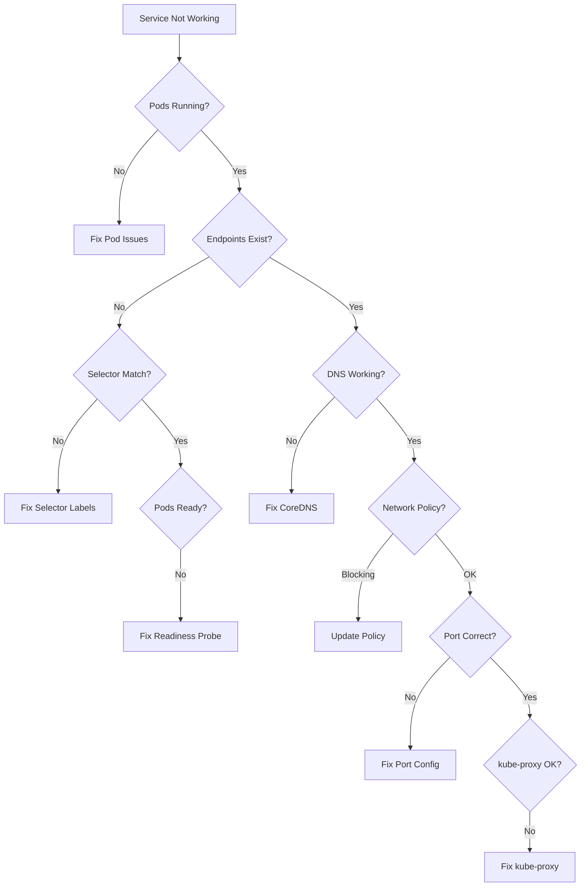

# How to Debug Kubernetes Service Not Reaching Pods

Author: [nawazdhandala](https://www.github.com/nawazdhandala)

Tags: Kubernetes, Troubleshooting, Services, Networking, DNS, Debugging, DevOps

Description: Learn systematic debugging techniques when Kubernetes services fail to route traffic to pods, including DNS issues, selector mismatches, endpoint problems, and network policies.

---

When a Kubernetes Service fails to reach its pods, the issue typically lies in one of several areas: selector mismatches, missing endpoints, DNS problems, or network policies. This guide provides a systematic approach to diagnose and fix these issues.

## Troubleshooting Flow



## Step 1: Verify Pods are Running

```bash
# List pods with labels
kubectl get pods -l app=myapp -o wide

# Check pod status
kubectl describe pod <pod-name>

# Check pod logs
kubectl logs <pod-name> --tail=100

# Check if app is listening on expected port
kubectl exec -it <pod-name> -- netstat -tlnp
# or
kubectl exec -it <pod-name> -- ss -tlnp

# Test app directly from within the pod
kubectl exec -it <pod-name> -- curl localhost:8080/health
```

## Step 2: Check Service Configuration

```bash
# Get service details
kubectl get svc myapp-service -o yaml

# Verify service exists
kubectl describe svc myapp-service

# Example output to check:
# Name:              myapp-service
# Namespace:         default
# Labels:            app=myapp
# Selector:          app=myapp
# Type:              ClusterIP
# IP:                10.96.100.50
# Port:              http  80/TCP
# TargetPort:        8080/TCP
# Endpoints:         10.244.1.5:8080,10.244.2.3:8080
```

### Common Service Issues

```yaml
# service.yaml - CORRECT configuration
apiVersion: v1
kind: Service
metadata:
  name: myapp-service
spec:
  selector:
    app: myapp  # Must match pod labels exactly!
  ports:
    - name: http
      port: 80        # Service port (what clients connect to)
      targetPort: 8080 # Container port (where app listens)
      protocol: TCP
```

## Step 3: Verify Endpoints

```bash
# Check endpoints - this is crucial!
kubectl get endpoints myapp-service

# Output should show pod IPs:
# NAME            ENDPOINTS                           AGE
# myapp-service   10.244.1.5:8080,10.244.2.3:8080     1h

# If empty, there's a selector/readiness issue
# NAME            ENDPOINTS   AGE
# myapp-service   <none>      1h

# Detailed endpoint info
kubectl describe endpoints myapp-service

# Check EndpointSlices (Kubernetes 1.21+)
kubectl get endpointslices -l kubernetes.io/service-name=myapp-service
```

### Why Endpoints Might Be Empty

```bash
# 1. Selector doesn't match pod labels
kubectl get pods --show-labels
kubectl get svc myapp-service -o jsonpath='{.spec.selector}'

# Compare these - they must match exactly
# Pod labels: app=myapp,version=v1
# Selector:   app=myapp

# 2. Pods not ready (readiness probe failing)
kubectl get pods -l app=myapp
# NAME          READY   STATUS    RESTARTS   AGE
# myapp-xxx     0/1     Running   0          5m   <- Not ready!

# 3. No pods matching selector exist
kubectl get pods -l app=myapp
# No resources found in default namespace.
```

## Step 4: Fix Selector Mismatch

```bash
# Check pod labels
kubectl get pods -l app=myapp --show-labels

# If labels don't match, fix deployment
kubectl patch deployment myapp --type='json' \
  -p='[{"op": "replace", "path": "/spec/template/metadata/labels/app", "value": "myapp"}]'

# Or fix service selector
kubectl patch svc myapp-service --type='json' \
  -p='[{"op": "replace", "path": "/spec/selector/app", "value": "myapp"}]'
```

## Step 5: Debug DNS Resolution

```bash
# Run a debug pod
kubectl run debug --rm -it --image=busybox:1.36 -- /bin/sh

# Inside the debug pod:
# Test DNS resolution
nslookup myapp-service
nslookup myapp-service.default.svc.cluster.local

# Check /etc/resolv.conf
cat /etc/resolv.conf
# Should show:
# nameserver 10.96.0.10
# search default.svc.cluster.local svc.cluster.local cluster.local

# Test connectivity
wget -O- http://myapp-service:80/health
curl myapp-service:80/health
```

### CoreDNS Issues

```bash
# Check CoreDNS pods
kubectl get pods -n kube-system -l k8s-app=kube-dns

# Check CoreDNS logs
kubectl logs -n kube-system -l k8s-app=kube-dns --tail=100

# Check CoreDNS ConfigMap
kubectl get configmap coredns -n kube-system -o yaml

# Restart CoreDNS if needed
kubectl rollout restart deployment coredns -n kube-system
```

## Step 6: Check Network Policies

```bash
# List network policies
kubectl get networkpolicies -A

# Check if any policy affects your namespace
kubectl get networkpolicies -n default

# Describe network policy
kubectl describe networkpolicy <policy-name>

# Test without network policies temporarily
kubectl delete networkpolicy <policy-name>
# Remember to recreate it after testing!
```

### Network Policy Blocking Traffic

```yaml
# Check if this policy is blocking traffic
apiVersion: networking.k8s.io/v1
kind: NetworkPolicy
metadata:
  name: deny-all
spec:
  podSelector: {}
  policyTypes:
    - Ingress
    - Egress

# Fix: Add allow rule for service traffic
---
apiVersion: networking.k8s.io/v1
kind: NetworkPolicy
metadata:
  name: allow-same-namespace
spec:
  podSelector: {}
  policyTypes:
    - Ingress
  ingress:
    - from:
        - podSelector: {}  # Allow from same namespace
```

## Step 7: Verify kube-proxy

```bash
# Check kube-proxy pods
kubectl get pods -n kube-system -l k8s-app=kube-proxy

# Check kube-proxy logs
kubectl logs -n kube-system -l k8s-app=kube-proxy --tail=100

# Check kube-proxy mode (iptables or ipvs)
kubectl logs -n kube-system -l k8s-app=kube-proxy | grep "Using"

# Check iptables rules (on node)
sudo iptables -t nat -L KUBE-SERVICES | grep myapp

# For IPVS mode
sudo ipvsadm -L -n | grep <service-cluster-ip>

# Restart kube-proxy
kubectl rollout restart daemonset kube-proxy -n kube-system
```

## Step 8: Direct Pod Connectivity Test

```bash
# Get pod IP
POD_IP=$(kubectl get pod <pod-name> -o jsonpath='{.status.podIP}')

# From debug pod, test direct connection
kubectl run debug --rm -it --image=busybox:1.36 -- /bin/sh
wget -O- http://$POD_IP:8080/health

# From another pod in the cluster
kubectl exec -it <other-pod> -- curl http://$POD_IP:8080/health
```

## Step 9: Check Container Port

```bash
# Verify container is listening on correct port
kubectl exec -it <pod-name> -- netstat -tlnp
# or
kubectl exec -it <pod-name> -- ss -tlnp

# Check if app started correctly
kubectl logs <pod-name> | grep -i "listen\|started\|port"

# Port forward to test locally
kubectl port-forward <pod-name> 8080:8080
curl http://localhost:8080/health
```

## Common Issues and Solutions

### Issue 1: Readiness Probe Failing

```yaml
# Check probe configuration
spec:
  containers:
    - name: app
      readinessProbe:
        httpGet:
          path: /health  # Is this endpoint correct?
          port: 8080     # Is this the right port?
        initialDelaySeconds: 5
        periodSeconds: 10
        failureThreshold: 3

# Debug: Check probe endpoint manually
kubectl exec -it <pod-name> -- curl localhost:8080/health
```

### Issue 2: Wrong Port Configuration

```yaml
# Service targetPort must match container port
apiVersion: v1
kind: Service
spec:
  ports:
    - port: 80
      targetPort: 8080  # Must match containerPort!
---
apiVersion: apps/v1
kind: Deployment
spec:
  template:
    spec:
      containers:
        - ports:
            - containerPort: 8080  # Must match targetPort!
```

### Issue 3: Service Type Mismatch

```yaml
# ClusterIP only accessible within cluster
apiVersion: v1
kind: Service
spec:
  type: ClusterIP  # Change to NodePort or LoadBalancer for external access

# For external access:
spec:
  type: LoadBalancer
  # or
  type: NodePort
```

### Issue 4: Namespace Issues

```bash
# Service and pods must be in same namespace (unless using ExternalName)
kubectl get svc -n production
kubectl get pods -n production

# Cross-namespace access requires full DNS name
# From namespace-a to service in namespace-b:
curl http://myapp-service.namespace-b.svc.cluster.local
```

## Quick Diagnosis Script

```bash
#!/bin/bash
# diagnose-service.sh

SERVICE=$1
NAMESPACE=${2:-default}

echo "=== Service Details ==="
kubectl get svc $SERVICE -n $NAMESPACE -o yaml

echo -e "\n=== Endpoints ==="
kubectl get endpoints $SERVICE -n $NAMESPACE

echo -e "\n=== Selector ==="
SELECTOR=$(kubectl get svc $SERVICE -n $NAMESPACE -o jsonpath='{.spec.selector}' | jq -r 'to_entries | map("\(.key)=\(.value)") | join(",")')
echo "Selector: $SELECTOR"

echo -e "\n=== Matching Pods ==="
kubectl get pods -n $NAMESPACE -l $SELECTOR -o wide

echo -e "\n=== Pod Readiness ==="
kubectl get pods -n $NAMESPACE -l $SELECTOR -o jsonpath='{range .items[*]}{.metadata.name}{"\t"}{.status.conditions[?(@.type=="Ready")].status}{"\n"}{end}'

echo -e "\n=== Network Policies ==="
kubectl get networkpolicies -n $NAMESPACE

echo -e "\n=== Recent Events ==="
kubectl get events -n $NAMESPACE --field-selector involvedObject.name=$SERVICE --sort-by='.lastTimestamp'
```

## Summary

| Symptom | Likely Cause | Solution |
|---------|--------------|----------|
| No endpoints | Selector mismatch | Fix labels |
| Endpoints empty | Pods not ready | Fix readiness probe |
| DNS fails | CoreDNS issue | Restart/check CoreDNS |
| Connection refused | Wrong port | Verify targetPort |
| Timeout | Network policy | Update policy rules |

## Related Posts

- [How to Fix Pending Pods That Never Schedule](https://oneuptime.com/blog/post/2026-01-19-kubernetes-pending-pods-scheduling/view) - Pod scheduling issues
- [How to Troubleshoot Kubernetes Ingress Not Working](https://oneuptime.com/blog/post/2026-01-19-kubernetes-ingress-troubleshooting/view) - Ingress debugging
- [How to Configure Kubernetes Health Checks](https://oneuptime.com/blog/post/2025-01-06-python-health-checks-kubernetes/view) - Health check setup
