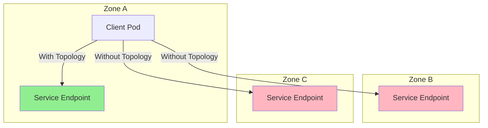
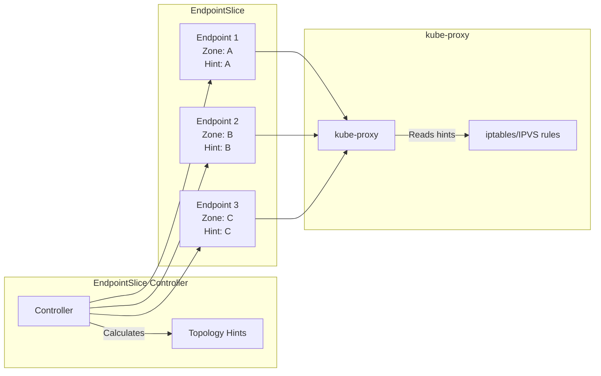

# How to Configure Kubernetes Service Topology for Locality-Aware Routing

Author: [nawazdhandala](https://www.github.com/nawazdhandala)

Tags: Kubernetes, Service Topology, Locality-Aware Routing, Traffic Management, Multi-Zone, Performance

Description: Learn how to configure Kubernetes service topology to route traffic to the closest endpoints, reducing latency and cross-zone costs in multi-zone clusters.

---

In multi-zone Kubernetes clusters, traffic between pods can traverse availability zones unnecessarily, increasing latency and cloud networking costs. Service topology and topology-aware routing help direct traffic to the closest healthy endpoints.

## Why Locality-Aware Routing Matters



| Without Topology Routing | With Topology Routing |
|--------------------------|----------------------|
| Random endpoint selection | Prefer local endpoints |
| Cross-zone traffic charges | Minimize cross-zone traffic |
| Higher latency (1-2ms per zone) | Lower latency |
| 33% local traffic (3 zones) | 90%+ local traffic |

## Enable Topology Aware Routing

### Using Service Annotation (Kubernetes 1.27+)

```yaml
# topology-aware-service.yaml
apiVersion: v1
kind: Service
metadata:
  name: myapp
  namespace: production
  annotations:
    # Enable topology-aware routing (replaces deprecated topologyKeys)
    service.kubernetes.io/topology-mode: Auto
spec:
  selector:
    app: myapp
  ports:
    - port: 80
      targetPort: 8080
```

### Topology Modes

```yaml
# Auto mode - enables topology hints when beneficial
annotations:
  service.kubernetes.io/topology-mode: Auto

# Disabled - always use all endpoints (default behavior)
annotations:
  service.kubernetes.io/topology-mode: Disabled
```

## Understanding Topology Hints

### How Hints Work



### View Topology Hints

```bash
# Check EndpointSlice for topology hints
kubectl get endpointslice -n production -l kubernetes.io/service-name=myapp -o yaml

# Example output with hints:
# endpoints:
# - addresses:
#   - 10.244.1.5
#   conditions:
#     ready: true
#   hints:
#     forZones:
#     - name: us-west-2a
#   nodeName: node-1
#   zone: us-west-2a
```

## Deployment Strategies for Topology

### Ensure Pods in All Zones

```yaml
# multi-zone-deployment.yaml
apiVersion: apps/v1
kind: Deployment
metadata:
  name: myapp
  namespace: production
spec:
  replicas: 9  # 3 replicas per zone (3 zones)
  selector:
    matchLabels:
      app: myapp
  template:
    metadata:
      labels:
        app: myapp
    spec:
      # Spread pods evenly across zones
      topologySpreadConstraints:
        - maxSkew: 1
          topologyKey: topology.kubernetes.io/zone
          whenUnsatisfiable: DoNotSchedule
          labelSelector:
            matchLabels:
              app: myapp
      
      # Also spread across nodes within zones
        - maxSkew: 1
          topologyKey: kubernetes.io/hostname
          whenUnsatisfiable: ScheduleAnyway
          labelSelector:
            matchLabels:
              app: myapp
      
      containers:
        - name: myapp
          image: myregistry/myapp:v1.2.0
          ports:
            - containerPort: 8080
          resources:
            requests:
              cpu: 100m
              memory: 128Mi
```

### Pod Disruption Budget for Zone Awareness

```yaml
# zone-aware-pdb.yaml
apiVersion: policy/v1
kind: PodDisruptionBudget
metadata:
  name: myapp-pdb
  namespace: production
spec:
  # Ensure at least 2 pods per zone
  minAvailable: 6  # With 3 zones and 9 replicas
  selector:
    matchLabels:
      app: myapp
```

## Troubleshooting Topology Routing

### Check if Hints are Being Generated

```bash
#!/bin/bash
# check-topology-hints.sh

SERVICE_NAME="myapp"
NAMESPACE="production"

echo "=== Checking Service Topology Configuration ==="
kubectl get service $SERVICE_NAME -n $NAMESPACE -o yaml | grep -A5 "annotations:"

echo -e "\n=== EndpointSlice Details ==="
kubectl get endpointslice -n $NAMESPACE \
  -l kubernetes.io/service-name=$SERVICE_NAME \
  -o jsonpath='{range .items[*]}{.metadata.name}{"\n"}{range .endpoints[*]}  Address: {.addresses[0]}, Zone: {.zone}, Hints: {.hints.forZones[*].name}{"\n"}{end}{end}'

echo -e "\n=== Pod Distribution by Zone ==="
kubectl get pods -n $NAMESPACE -l app=$SERVICE_NAME \
  -o jsonpath='{range .items[*]}{.metadata.name}{"\t"}{.spec.nodeName}{"\n"}{end}' | \
while read pod node; do
  zone=$(kubectl get node $node -o jsonpath='{.metadata.labels.topology\.kubernetes\.io/zone}')
  echo "$pod -> $node (Zone: $zone)"
done
```

### Why Hints Might Not Be Generated

```yaml
# Hints won't be generated if:
# 1. Uneven pod distribution across zones
# 2. Too few endpoints
# 3. Service doesn't have topology-mode annotation

# Check for "hintsAnnotation" event
kubectl describe endpointslice -n production -l kubernetes.io/service-name=myapp
```

### Common Issues and Solutions

```yaml
# Issue: Pods not evenly distributed
# Solution: Use topologySpreadConstraints
spec:
  topologySpreadConstraints:
    - maxSkew: 1
      topologyKey: topology.kubernetes.io/zone
      whenUnsatisfiable: DoNotSchedule

# Issue: Not enough replicas
# Solution: Have at least 3 replicas per zone
spec:
  replicas: 9  # For 3 zones

# Issue: Zone labels not present
# Check node labels
kubectl get nodes --show-labels | grep topology
```

## Combining with Service Mesh

### Istio Locality Load Balancing

```yaml
# istio-destination-rule.yaml
apiVersion: networking.istio.io/v1beta1
kind: DestinationRule
metadata:
  name: myapp
  namespace: production
spec:
  host: myapp.production.svc.cluster.local
  trafficPolicy:
    connectionPool:
      tcp:
        maxConnections: 100
      http:
        h2UpgradePolicy: UPGRADE
    
    loadBalancer:
      simple: ROUND_ROBIN
      localityLbSetting:
        enabled: true
        # Distribute traffic with preference for local zone
        distribute:
          - from: "us-west-2/us-west-2a/*"
            to:
              "us-west-2/us-west-2a/*": 80
              "us-west-2/us-west-2b/*": 10
              "us-west-2/us-west-2c/*": 10
          - from: "us-west-2/us-west-2b/*"
            to:
              "us-west-2/us-west-2a/*": 10
              "us-west-2/us-west-2b/*": 80
              "us-west-2/us-west-2c/*": 10
          - from: "us-west-2/us-west-2c/*"
            to:
              "us-west-2/us-west-2a/*": 10
              "us-west-2/us-west-2b/*": 10
              "us-west-2/us-west-2c/*": 80
    
    outlierDetection:
      consecutive5xxErrors: 5
      interval: 30s
      baseEjectionTime: 30s
      maxEjectionPercent: 100
```

### Istio Failover Configuration

```yaml
# istio-failover.yaml
apiVersion: networking.istio.io/v1beta1
kind: DestinationRule
metadata:
  name: myapp-failover
  namespace: production
spec:
  host: myapp.production.svc.cluster.local
  trafficPolicy:
    loadBalancer:
      localityLbSetting:
        enabled: true
        # Failover to other zones when local is unhealthy
        failover:
          - from: us-west-2/us-west-2a
            to: us-west-2/us-west-2b
          - from: us-west-2/us-west-2b
            to: us-west-2/us-west-2c
          - from: us-west-2/us-west-2c
            to: us-west-2/us-west-2a
    
    outlierDetection:
      consecutiveGatewayErrors: 5
      interval: 10s
      baseEjectionTime: 30s
```

## Cross-Region Topology

### Multi-Region Service Routing

```yaml
# multi-region-service.yaml
apiVersion: v1
kind: Service
metadata:
  name: global-api
  namespace: production
  annotations:
    service.kubernetes.io/topology-mode: Auto
spec:
  selector:
    app: api
  ports:
    - port: 443
      targetPort: 8443
---
# Ensure pods exist in all regions
apiVersion: apps/v1
kind: Deployment
metadata:
  name: api
  namespace: production
spec:
  replicas: 6
  template:
    spec:
      topologySpreadConstraints:
        # Spread across regions
        - maxSkew: 1
          topologyKey: topology.kubernetes.io/region
          whenUnsatisfiable: DoNotSchedule
          labelSelector:
            matchLabels:
              app: api
        # Then spread across zones within regions
        - maxSkew: 1
          topologyKey: topology.kubernetes.io/zone
          whenUnsatisfiable: ScheduleAnyway
          labelSelector:
            matchLabels:
              app: api
```

## Monitoring Topology Routing

### Prometheus Metrics

```yaml
# prometheus-rules.yaml
groups:
  - name: topology-routing
    rules:
      # Track cross-zone traffic
      - record: service:cross_zone_requests:rate5m
        expr: |
          sum by (source_zone, destination_zone, service) (
            rate(istio_requests_total{
              source_workload_namespace!="",
              destination_service_namespace!=""
            }[5m])
          )
          unless on (source_zone, destination_zone)
          (
            label_replace(
              up{job="kubernetes-nodes"},
              "source_zone",
              "$1",
              "zone",
              "(.*)"
            )
            * on() group_left()
            label_replace(
              up{job="kubernetes-nodes"},
              "destination_zone",
              "$1",
              "zone",
              "(.*)"
            )
          )
```

### Grafana Dashboard Query

```promql
# Local vs cross-zone traffic ratio
sum(rate(istio_requests_total{source_zone=destination_zone}[5m])) 
/ 
sum(rate(istio_requests_total[5m]))

# Cross-zone traffic by service
sum by (destination_service) (
  rate(istio_requests_total{source_zone!=destination_zone}[5m])
)
```

## Best Practices

### 1. Ensure Balanced Pod Distribution

```yaml
# Always use topologySpreadConstraints
topologySpreadConstraints:
  - maxSkew: 1
    topologyKey: topology.kubernetes.io/zone
    whenUnsatisfiable: DoNotSchedule
```

### 2. Set Appropriate Replica Counts

```bash
# Calculate replicas needed
ZONES=3
MIN_PER_ZONE=2
TOTAL_REPLICAS=$((ZONES * MIN_PER_ZONE))
echo "Minimum replicas needed: $TOTAL_REPLICAS"
```

### 3. Handle Zone Failures

```yaml
# Configure PDB to allow zone-level failures
apiVersion: policy/v1
kind: PodDisruptionBudget
metadata:
  name: myapp-pdb
spec:
  # Allow one zone to be unavailable
  maxUnavailable: 33%
  selector:
    matchLabels:
      app: myapp
```

### 4. Monitor Endpoint Distribution

```bash
# Regular health check script
#!/bin/bash
for svc in $(kubectl get svc -A -o jsonpath='{range .items[*]}{.metadata.namespace}/{.metadata.name}{"\n"}{end}'); do
  ns=$(echo $svc | cut -d'/' -f1)
  name=$(echo $svc | cut -d'/' -f2)
  
  zones=$(kubectl get endpointslice -n $ns \
    -l kubernetes.io/service-name=$name \
    -o jsonpath='{.items[*].endpoints[*].zone}' | tr ' ' '\n' | sort | uniq -c)
  
  echo "Service: $svc"
  echo "$zones"
  echo "---"
done
```

## Summary

| Feature | Kubernetes Native | With Istio |
|---------|------------------|------------|
| Enable | `topology-mode: Auto` | `localityLbSetting.enabled: true` |
| Failover | Automatic via hints | Configurable failover rules |
| Weighting | Equal distribution | Custom distribution weights |
| Metrics | EndpointSlice events | Full traffic metrics |

## Related Posts

- [How to Set Up gRPC Load Balancing in Kubernetes](https://oneuptime.com/blog/post/2026-01-19-kubernetes-grpc-load-balancing/view) - Locality-aware gRPC
- [How to Set Up Kubernetes Topology Spread Constraints](https://oneuptime.com/blog/post/2026-01-19-kubernetes-topology-spread-constraints/view) - Pod distribution
- [How to Reduce Kubernetes Costs with Spot/Preemptible Nodes](https://oneuptime.com/blog/post/2026-01-19-kubernetes-spot-preemptible-nodes-cost/view) - Cost optimization including cross-zone charges
