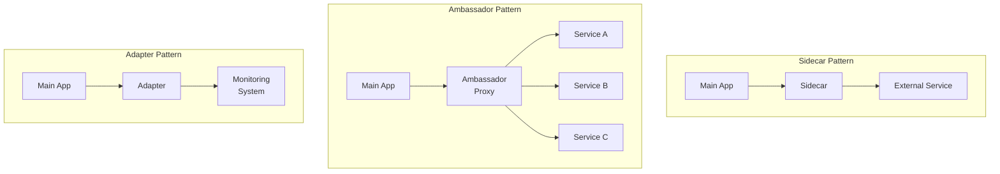

# How to Implement Sidecar and Ambassador Patterns in Kubernetes

Author: [nawazdhandala](https://www.github.com/nawazdhandala)

Tags: Kubernetes, Sidecar, Ambassador, Design Patterns, Microservices, DevOps

Description: Master the sidecar and ambassador container patterns in Kubernetes for logging, proxying, configuration, and extending application functionality.

---

Sidecar and ambassador patterns extend application functionality without modifying the main container. This guide covers implementing these patterns for logging, proxying, encryption, and more.

## Container Patterns Overview



| Pattern | Purpose | Example Use Cases |
|---------|---------|-------------------|
| Sidecar | Extend functionality | Logging, sync, proxy |
| Ambassador | Proxy connections | Service mesh, load balancing |
| Adapter | Standardize output | Metrics export, log formatting |

## Sidecar Pattern

### Logging Sidecar

```yaml
# logging-sidecar.yaml
apiVersion: v1
kind: Pod
metadata:
  name: app-with-logging
spec:
  volumes:
    # Shared volume for logs
    - name: log-volume
      emptyDir: {}
  
  containers:
    # Main application
    - name: app
      image: myapp:latest
      volumeMounts:
        - name: log-volume
          mountPath: /var/log/app
      command:
        - /bin/sh
        - -c
        - |
          while true; do
            echo "$(date) - Application log entry" >> /var/log/app/application.log
            sleep 5
          done
    
    # Logging sidecar (Fluent Bit)
    - name: log-shipper
      image: fluent/fluent-bit:latest
      volumeMounts:
        - name: log-volume
          mountPath: /var/log/app
          readOnly: true
      env:
        - name: FLUENT_ELASTICSEARCH_HOST
          value: "elasticsearch.logging"
        - name: FLUENT_ELASTICSEARCH_PORT
          value: "9200"
```

### Fluent Bit Sidecar Configuration

```yaml
# fluentbit-sidecar-configmap.yaml
apiVersion: v1
kind: ConfigMap
metadata:
  name: fluent-bit-config
data:
  fluent-bit.conf: |
    [SERVICE]
        Flush         1
        Log_Level     info
        Daemon        off
        Parsers_File  parsers.conf
    
    [INPUT]
        Name              tail
        Path              /var/log/app/*.log
        Parser            json
        Tag               app.logs
        Refresh_Interval  5
        Mem_Buf_Limit     5MB
    
    [OUTPUT]
        Name            es
        Match           *
        Host            ${ELASTICSEARCH_HOST}
        Port            ${ELASTICSEARCH_PORT}
        Logstash_Format On
        Logstash_Prefix app-logs
  
  parsers.conf: |
    [PARSER]
        Name        json
        Format      json
        Time_Key    timestamp
        Time_Format %Y-%m-%dT%H:%M:%S.%L
---
apiVersion: v1
kind: Pod
metadata:
  name: app-with-fluentbit
spec:
  volumes:
    - name: log-volume
      emptyDir: {}
    - name: fluent-bit-config
      configMap:
        name: fluent-bit-config
  
  containers:
    - name: app
      image: myapp:latest
      volumeMounts:
        - name: log-volume
          mountPath: /var/log/app
    
    - name: fluent-bit
      image: fluent/fluent-bit:latest
      volumeMounts:
        - name: log-volume
          mountPath: /var/log/app
          readOnly: true
        - name: fluent-bit-config
          mountPath: /fluent-bit/etc/
      env:
        - name: ELASTICSEARCH_HOST
          value: "elasticsearch.logging.svc.cluster.local"
        - name: ELASTICSEARCH_PORT
          value: "9200"
```

### Git-Sync Sidecar

```yaml
# git-sync-sidecar.yaml
apiVersion: v1
kind: Pod
metadata:
  name: app-with-git-sync
spec:
  volumes:
    - name: content
      emptyDir: {}
    - name: git-secret
      secret:
        secretName: git-credentials
  
  containers:
    # Main application (nginx serving content)
    - name: nginx
      image: nginx:alpine
      volumeMounts:
        - name: content
          mountPath: /usr/share/nginx/html
      ports:
        - containerPort: 80
    
    # Git sync sidecar
    - name: git-sync
      image: k8s.gcr.io/git-sync/git-sync:v3.6.0
      volumeMounts:
        - name: content
          mountPath: /data
        - name: git-secret
          mountPath: /etc/git-secret
          readOnly: true
      env:
        - name: GIT_SYNC_REPO
          value: "https://github.com/example/content.git"
        - name: GIT_SYNC_BRANCH
          value: "main"
        - name: GIT_SYNC_ROOT
          value: "/data"
        - name: GIT_SYNC_DEST
          value: "html"
        - name: GIT_SYNC_PERIOD
          value: "30s"
        - name: GIT_SYNC_ONE_TIME
          value: "false"
      securityContext:
        runAsUser: 65533
```

### TLS/SSL Termination Sidecar

```yaml
# tls-sidecar.yaml
apiVersion: v1
kind: ConfigMap
metadata:
  name: nginx-ssl-config
data:
  nginx.conf: |
    events {
        worker_connections 1024;
    }
    http {
        server {
            listen 443 ssl;
            ssl_certificate /etc/ssl/certs/tls.crt;
            ssl_certificate_key /etc/ssl/certs/tls.key;
            
            location / {
                proxy_pass http://localhost:8080;
                proxy_set_header Host $host;
                proxy_set_header X-Real-IP $remote_addr;
            }
        }
    }
---
apiVersion: v1
kind: Pod
metadata:
  name: app-with-ssl
spec:
  volumes:
    - name: ssl-certs
      secret:
        secretName: app-tls
    - name: nginx-config
      configMap:
        name: nginx-ssl-config
  
  containers:
    # Main application (HTTP only)
    - name: app
      image: myapp:latest
      ports:
        - containerPort: 8080
    
    # NGINX SSL termination sidecar
    - name: ssl-proxy
      image: nginx:alpine
      ports:
        - containerPort: 443
      volumeMounts:
        - name: ssl-certs
          mountPath: /etc/ssl/certs
          readOnly: true
        - name: nginx-config
          mountPath: /etc/nginx/nginx.conf
          subPath: nginx.conf
```

## Ambassador Pattern

### Database Connection Ambassador

```yaml
# db-ambassador.yaml
apiVersion: v1
kind: Pod
metadata:
  name: app-with-db-ambassador
spec:
  containers:
    # Main application
    - name: app
      image: myapp:latest
      env:
        # Connect to ambassador on localhost
        - name: DATABASE_HOST
          value: "localhost"
        - name: DATABASE_PORT
          value: "5432"
    
    # PgBouncer ambassador for connection pooling
    - name: pgbouncer
      image: edoburu/pgbouncer:latest
      ports:
        - containerPort: 5432
      env:
        - name: DATABASE_URL
          valueFrom:
            secretKeyRef:
              name: db-credentials
              key: url
        - name: POOL_MODE
          value: "transaction"
        - name: DEFAULT_POOL_SIZE
          value: "20"
        - name: MAX_CLIENT_CONN
          value: "100"
```

### Cloud SQL Proxy Ambassador

```yaml
# cloudsql-ambassador.yaml
apiVersion: v1
kind: Pod
metadata:
  name: app-with-cloudsql
spec:
  serviceAccountName: cloudsql-proxy-sa
  volumes:
    - name: cloudsql-credentials
      secret:
        secretName: cloudsql-sa-key
  
  containers:
    # Main application
    - name: app
      image: myapp:latest
      env:
        - name: DB_HOST
          value: "localhost"
        - name: DB_PORT
          value: "5432"
        - name: DB_NAME
          valueFrom:
            secretKeyRef:
              name: db-config
              key: database
    
    # Cloud SQL Proxy ambassador
    - name: cloudsql-proxy
      image: gcr.io/cloudsql-docker/gce-proxy:latest
      command:
        - /cloud_sql_proxy
        - -instances=project:region:instance=tcp:5432
        - -credential_file=/secrets/cloudsql/credentials.json
      ports:
        - containerPort: 5432
      volumeMounts:
        - name: cloudsql-credentials
          mountPath: /secrets/cloudsql
          readOnly: true
      securityContext:
        runAsNonRoot: true
```

### Service Mesh Ambassador (Envoy)

```yaml
# envoy-ambassador.yaml
apiVersion: v1
kind: ConfigMap
metadata:
  name: envoy-config
data:
  envoy.yaml: |
    static_resources:
      listeners:
        - name: listener_0
          address:
            socket_address:
              address: 0.0.0.0
              port_value: 8080
          filter_chains:
            - filters:
                - name: envoy.filters.network.http_connection_manager
                  typed_config:
                    "@type": type.googleapis.com/envoy.extensions.filters.network.http_connection_manager.v3.HttpConnectionManager
                    stat_prefix: ingress_http
                    route_config:
                      name: local_route
                      virtual_hosts:
                        - name: backend
                          domains: ["*"]
                          routes:
                            - match:
                                prefix: "/api/users"
                              route:
                                cluster: user_service
                            - match:
                                prefix: "/api/orders"
                              route:
                                cluster: order_service
                    http_filters:
                      - name: envoy.filters.http.router
      clusters:
        - name: user_service
          connect_timeout: 5s
          type: STRICT_DNS
          lb_policy: ROUND_ROBIN
          load_assignment:
            cluster_name: user_service
            endpoints:
              - lb_endpoints:
                  - endpoint:
                      address:
                        socket_address:
                          address: user-service
                          port_value: 80
        - name: order_service
          connect_timeout: 5s
          type: STRICT_DNS
          lb_policy: ROUND_ROBIN
          load_assignment:
            cluster_name: order_service
            endpoints:
              - lb_endpoints:
                  - endpoint:
                      address:
                        socket_address:
                          address: order-service
                          port_value: 80
---
apiVersion: v1
kind: Pod
metadata:
  name: app-with-envoy
spec:
  volumes:
    - name: envoy-config
      configMap:
        name: envoy-config
  
  containers:
    # Main application
    - name: app
      image: myapp:latest
      env:
        - name: UPSTREAM_URL
          value: "http://localhost:8080"
    
    # Envoy ambassador
    - name: envoy
      image: envoyproxy/envoy:v1.27-latest
      ports:
        - containerPort: 8080
      volumeMounts:
        - name: envoy-config
          mountPath: /etc/envoy
      args:
        - -c
        - /etc/envoy/envoy.yaml
```

## Adapter Pattern

### Prometheus Metrics Adapter

```yaml
# prometheus-adapter.yaml
apiVersion: v1
kind: Pod
metadata:
  name: app-with-metrics-adapter
  annotations:
    prometheus.io/scrape: "true"
    prometheus.io/port: "9113"
    prometheus.io/path: "/metrics"
spec:
  containers:
    # Main application (outputs custom metrics format)
    - name: app
      image: myapp:latest
      ports:
        - containerPort: 8080
    
    # Prometheus exporter adapter (nginx example)
    - name: nginx-exporter
      image: nginx/nginx-prometheus-exporter:latest
      args:
        - -nginx.scrape-uri=http://localhost:8080/stub_status
      ports:
        - containerPort: 9113
```

### Log Format Adapter

```yaml
# log-adapter.yaml
apiVersion: v1
kind: ConfigMap
metadata:
  name: vector-config
data:
  vector.toml: |
    [sources.app_logs]
    type = "file"
    include = ["/var/log/app/*.log"]
    
    [transforms.parse_logs]
    type = "remap"
    inputs = ["app_logs"]
    source = '''
    . = parse_regex!(.message, r'^(?P<timestamp>\S+) (?P<level>\S+) (?P<message>.*)$')
    .timestamp = parse_timestamp!(.timestamp, "%Y-%m-%dT%H:%M:%S")
    '''
    
    [transforms.enrich]
    type = "remap"
    inputs = ["parse_logs"]
    source = '''
    .kubernetes.pod_name = "${POD_NAME}"
    .kubernetes.namespace = "${POD_NAMESPACE}"
    '''
    
    [sinks.stdout]
    type = "console"
    inputs = ["enrich"]
    encoding.codec = "json"
---
apiVersion: v1
kind: Pod
metadata:
  name: app-with-log-adapter
spec:
  volumes:
    - name: log-volume
      emptyDir: {}
    - name: vector-config
      configMap:
        name: vector-config
  
  containers:
    - name: app
      image: myapp:latest
      volumeMounts:
        - name: log-volume
          mountPath: /var/log/app
    
    - name: log-adapter
      image: timberio/vector:latest-alpine
      volumeMounts:
        - name: log-volume
          mountPath: /var/log/app
          readOnly: true
        - name: vector-config
          mountPath: /etc/vector
      env:
        - name: POD_NAME
          valueFrom:
            fieldRef:
              fieldPath: metadata.name
        - name: POD_NAMESPACE
          valueFrom:
            fieldRef:
              fieldPath: metadata.namespace
```

## Init Containers

### Database Migration Init Container

```yaml
# init-container-migration.yaml
apiVersion: v1
kind: Pod
metadata:
  name: app-with-migration
spec:
  initContainers:
    # Wait for database to be ready
    - name: wait-for-db
      image: busybox:latest
      command:
        - sh
        - -c
        - |
          until nc -z postgres-service 5432; do
            echo "Waiting for database..."
            sleep 2
          done
          echo "Database is ready"
    
    # Run migrations
    - name: migrate
      image: myapp:latest
      command: ["python", "manage.py", "migrate"]
      env:
        - name: DATABASE_URL
          valueFrom:
            secretKeyRef:
              name: db-credentials
              key: url
  
  containers:
    - name: app
      image: myapp:latest
      ports:
        - containerPort: 8080
      env:
        - name: DATABASE_URL
          valueFrom:
            secretKeyRef:
              name: db-credentials
              key: url
```

### Configuration Download Init Container

```yaml
# init-container-config.yaml
apiVersion: v1
kind: Pod
metadata:
  name: app-with-config-init
spec:
  volumes:
    - name: config-volume
      emptyDir: {}
  
  initContainers:
    - name: download-config
      image: curlimages/curl:latest
      volumeMounts:
        - name: config-volume
          mountPath: /config
      command:
        - sh
        - -c
        - |
          curl -o /config/app.conf https://config-server/myapp/config
          curl -o /config/secrets.json https://vault:8200/v1/secret/data/myapp
  
  containers:
    - name: app
      image: myapp:latest
      volumeMounts:
        - name: config-volume
          mountPath: /app/config
          readOnly: true
```

## Deployment with Sidecars

```yaml
# deployment-with-sidecars.yaml
apiVersion: apps/v1
kind: Deployment
metadata:
  name: myapp
spec:
  replicas: 3
  selector:
    matchLabels:
      app: myapp
  template:
    metadata:
      labels:
        app: myapp
      annotations:
        prometheus.io/scrape: "true"
        prometheus.io/port: "9113"
    spec:
      volumes:
        - name: log-volume
          emptyDir: {}
        - name: fluent-bit-config
          configMap:
            name: fluent-bit-config
      
      containers:
        # Main application
        - name: app
          image: myapp:latest
          ports:
            - containerPort: 8080
          volumeMounts:
            - name: log-volume
              mountPath: /var/log/app
          resources:
            requests:
              memory: "256Mi"
              cpu: "250m"
            limits:
              memory: "512Mi"
              cpu: "500m"
        
        # Logging sidecar
        - name: fluent-bit
          image: fluent/fluent-bit:latest
          volumeMounts:
            - name: log-volume
              mountPath: /var/log/app
              readOnly: true
            - name: fluent-bit-config
              mountPath: /fluent-bit/etc/
          resources:
            requests:
              memory: "64Mi"
              cpu: "50m"
            limits:
              memory: "128Mi"
              cpu: "100m"
        
        # Metrics exporter sidecar
        - name: metrics-exporter
          image: nginx/nginx-prometheus-exporter:latest
          args:
            - -nginx.scrape-uri=http://localhost:8080/metrics
          ports:
            - containerPort: 9113
          resources:
            requests:
              memory: "32Mi"
              cpu: "25m"
            limits:
              memory: "64Mi"
              cpu: "50m"
```

## Best Practices

### Resource Allocation for Sidecars

```yaml
# Always set resource limits for sidecars
containers:
  - name: main-app
    resources:
      requests:
        memory: "512Mi"
        cpu: "500m"
      limits:
        memory: "1Gi"
        cpu: "1000m"
  
  - name: sidecar
    resources:
      requests:
        memory: "64Mi"    # Keep sidecars lightweight
        cpu: "50m"
      limits:
        memory: "128Mi"
        cpu: "100m"
```

### Health Checks for Sidecars

```yaml
- name: sidecar
  livenessProbe:
    httpGet:
      path: /health
      port: 8081
    initialDelaySeconds: 10
    periodSeconds: 30
  readinessProbe:
    httpGet:
      path: /ready
      port: 8081
    initialDelaySeconds: 5
    periodSeconds: 10
```

## Conclusion

Sidecar and ambassador patterns are powerful tools for extending applications in Kubernetes:

1. **Sidecars for cross-cutting concerns** - Logging, monitoring, sync
2. **Ambassadors for proxying** - Connection pooling, service discovery
3. **Adapters for standardization** - Metrics export, log formatting
4. **Init containers for setup** - Migrations, configuration download
5. **Resource management** - Always set limits for sidecars

For monitoring your sidecar-enabled applications, check out [OneUptime's container monitoring](https://oneuptime.com/product/metrics).

## Related Resources

- [How to Ship Logs with Fluent Bit](https://oneuptime.com/blog/post/2026-02-02-fluent-bit-kubernetes/view)
- [How to Set Up Jaeger for Distributed Tracing](https://oneuptime.com/blog/post/2026-01-19-kubernetes-jaeger-distributed-tracing/view)
- [How to Set Up Prometheus ServiceMonitor](https://oneuptime.com/blog/post/2026-01-19-kubernetes-prometheus-servicemonitor/view)
