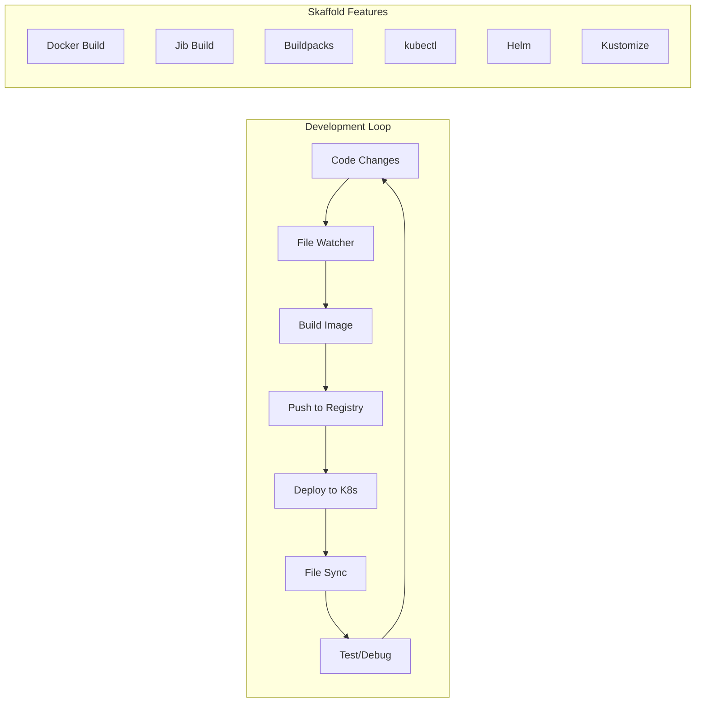

# How to Use Skaffold for Kubernetes Development Workflow

Author: [nawazdhandala](https://www.github.com/nawazdhandala)

Tags: Kubernetes, Skaffold, Development, DevOps, CI/CD, Local Development

Description: Master Skaffold for streamlined Kubernetes development with automatic builds, deployments, and hot-reload capabilities for rapid iteration.

---

Skaffold is a command-line tool that facilitates continuous development for Kubernetes applications. This guide covers setting up Skaffold for efficient local development and CI/CD pipelines.

## Skaffold Overview



| Feature | Description |
|---------|-------------|
| Fast Development | Hot reload with file sync |
| Multiple Builders | Docker, Jib, Buildpacks, Bazel |
| Multiple Deployers | kubectl, Helm, Kustomize |
| Profiles | Environment-specific configurations |
| Port Forwarding | Automatic service access |

## Installation

```bash
# macOS
brew install skaffold

# Linux
curl -Lo skaffold https://storage.googleapis.com/skaffold/releases/latest/skaffold-linux-amd64
chmod +x skaffold
sudo mv skaffold /usr/local/bin

# Windows
choco install skaffold

# Verify installation
skaffold version
```

## Basic Configuration

### Simple skaffold.yaml

```yaml
# skaffold.yaml
apiVersion: skaffold/v4beta6
kind: Config
metadata:
  name: my-app

build:
  artifacts:
    - image: myapp
      context: .
      docker:
        dockerfile: Dockerfile

deploy:
  kubectl:
    manifests:
      - k8s/*.yaml
```

### Project Structure

```
my-project/
├── skaffold.yaml
├── Dockerfile
├── src/
│   └── app.py
├── k8s/
│   ├── deployment.yaml
│   └── service.yaml
└── requirements.txt
```

### Kubernetes Manifests

```yaml
# k8s/deployment.yaml
apiVersion: apps/v1
kind: Deployment
metadata:
  name: myapp
spec:
  replicas: 1
  selector:
    matchLabels:
      app: myapp
  template:
    metadata:
      labels:
        app: myapp
    spec:
      containers:
        - name: myapp
          image: myapp  # Skaffold will replace this
          ports:
            - containerPort: 8080
---
# k8s/service.yaml
apiVersion: v1
kind: Service
metadata:
  name: myapp
spec:
  selector:
    app: myapp
  ports:
    - port: 80
      targetPort: 8080
```

## Development Commands

```bash
# Start development mode (watch for changes)
skaffold dev

# Build once and deploy
skaffold run

# Build images only
skaffold build

# Deploy pre-built images
skaffold deploy

# Delete deployed resources
skaffold delete

# Debug mode (attach debugger)
skaffold debug

# Render manifests without deploying
skaffold render
```

## File Sync (Hot Reload)

### Direct File Sync

```yaml
# skaffold.yaml
apiVersion: skaffold/v4beta6
kind: Config

build:
  artifacts:
    - image: myapp
      context: .
      docker:
        dockerfile: Dockerfile
      sync:
        manual:
          # Sync Python files without rebuilding
          - src: "src/**/*.py"
            dest: /app
          # Sync static files
          - src: "static/**/*"
            dest: /app/static
        
deploy:
  kubectl:
    manifests:
      - k8s/*.yaml
```

### Inferred Sync

```yaml
# skaffold.yaml - Auto-detect sync based on Dockerfile
build:
  artifacts:
    - image: myapp
      sync:
        infer:
          - "**/*.py"
          - "**/*.html"
          - "**/*.css"
          - "**/*.js"
```

### Dockerfile for Sync

```dockerfile
# Dockerfile
FROM python:3.11-slim

WORKDIR /app

# Copy requirements first (for caching)
COPY requirements.txt .
RUN pip install -r requirements.txt

# Copy application code (this layer is synced)
COPY src/ /app/

# Use a development server that supports hot reload
CMD ["python", "-m", "flask", "run", "--host=0.0.0.0", "--reload"]
```

## Multiple Services

```yaml
# skaffold.yaml
apiVersion: skaffold/v4beta6
kind: Config

build:
  artifacts:
    - image: frontend
      context: ./frontend
      docker:
        dockerfile: Dockerfile
      sync:
        infer:
          - "**/*.js"
          - "**/*.jsx"
          - "**/*.css"
    
    - image: backend
      context: ./backend
      docker:
        dockerfile: Dockerfile
      sync:
        infer:
          - "**/*.py"
    
    - image: worker
      context: ./worker
      docker:
        dockerfile: Dockerfile

deploy:
  kubectl:
    manifests:
      - k8s/frontend/*.yaml
      - k8s/backend/*.yaml
      - k8s/worker/*.yaml
```

## Helm Deployment

```yaml
# skaffold.yaml
apiVersion: skaffold/v4beta6
kind: Config

build:
  artifacts:
    - image: myapp

deploy:
  helm:
    releases:
      - name: myapp
        chartPath: ./charts/myapp
        valuesFiles:
          - values.yaml
        setValues:
          image.repository: myapp
        setValueTemplates:
          image.tag: "{{.IMAGE_TAG}}"
        namespace: development
        createNamespace: true
```

### Helm Chart Values

```yaml
# charts/myapp/values.yaml
replicaCount: 1

image:
  repository: myapp
  tag: latest
  pullPolicy: IfNotPresent

service:
  type: ClusterIP
  port: 80

resources:
  requests:
    memory: "128Mi"
    cpu: "100m"
  limits:
    memory: "256Mi"
    cpu: "200m"
```

## Kustomize Deployment

```yaml
# skaffold.yaml
apiVersion: skaffold/v4beta6
kind: Config

build:
  artifacts:
    - image: myapp

deploy:
  kustomize:
    paths:
      - k8s/overlays/development
```

### Kustomize Structure

```
k8s/
├── base/
│   ├── deployment.yaml
│   ├── service.yaml
│   └── kustomization.yaml
└── overlays/
    ├── development/
    │   ├── kustomization.yaml
    │   └── patches/
    │       └── replicas.yaml
    └── production/
        └── kustomization.yaml
```

## Profiles

```yaml
# skaffold.yaml
apiVersion: skaffold/v4beta6
kind: Config

build:
  artifacts:
    - image: myapp

deploy:
  kubectl:
    manifests:
      - k8s/base/*.yaml

profiles:
  # Development profile
  - name: dev
    activation:
      - kubeContext: minikube
      - env: SKAFFOLD_ENV=dev
    build:
      local:
        push: false  # Don't push to registry
    deploy:
      kubectl:
        manifests:
          - k8s/dev/*.yaml
  
  # Staging profile
  - name: staging
    build:
      googleCloudBuild:
        projectId: my-project
    deploy:
      helm:
        releases:
          - name: myapp
            chartPath: ./charts/myapp
            valuesFiles:
              - values-staging.yaml
  
  # Production profile
  - name: prod
    build:
      googleCloudBuild:
        projectId: my-project
    deploy:
      helm:
        releases:
          - name: myapp
            chartPath: ./charts/myapp
            valuesFiles:
              - values-prod.yaml
```

### Using Profiles

```bash
# Activate profile
skaffold dev -p dev
skaffold run -p staging
skaffold run -p prod

# Multiple profiles
skaffold dev -p dev,debug
```

## Port Forwarding

```yaml
# skaffold.yaml
apiVersion: skaffold/v4beta6
kind: Config

build:
  artifacts:
    - image: myapp

deploy:
  kubectl:
    manifests:
      - k8s/*.yaml

portForward:
  - resourceType: service
    resourceName: myapp
    port: 80
    localPort: 8080
  
  - resourceType: deployment
    resourceName: myapp
    port: 5432
    localPort: 5432
  
  - resourceType: pod
    resourceName: myapp
    port: 9229  # Debug port
    localPort: 9229
```

## Custom Builders

### Buildpacks

```yaml
# skaffold.yaml
apiVersion: skaffold/v4beta6
kind: Config

build:
  artifacts:
    - image: myapp
      buildpacks:
        builder: gcr.io/buildpacks/builder:v1
        env:
          - GOOGLE_ENTRYPOINT="gunicorn -b 0.0.0.0:8080 app:app"
```

### Jib (Java)

```yaml
# skaffold.yaml
apiVersion: skaffold/v4beta6
kind: Config

build:
  artifacts:
    - image: myapp
      jib:
        project: .
        type: maven  # or gradle
        args:
          - -DskipTests
```

### Custom Script

```yaml
# skaffold.yaml
apiVersion: skaffold/v4beta6
kind: Config

build:
  artifacts:
    - image: myapp
      custom:
        buildCommand: ./build.sh
        dependencies:
          paths:
            - src/**
            - Dockerfile
```

## CI/CD Integration

### GitHub Actions

```yaml
# .github/workflows/deploy.yaml
name: Deploy

on:
  push:
    branches: [main]

jobs:
  deploy:
    runs-on: ubuntu-latest
    steps:
      - uses: actions/checkout@v3
      
      - name: Install Skaffold
        run: |
          curl -Lo skaffold https://storage.googleapis.com/skaffold/releases/latest/skaffold-linux-amd64
          chmod +x skaffold
          sudo mv skaffold /usr/local/bin
      
      - name: Configure kubectl
        uses: azure/k8s-set-context@v3
        with:
          kubeconfig: ${{ secrets.KUBECONFIG }}
      
      - name: Deploy with Skaffold
        run: |
          skaffold run -p prod --default-repo=gcr.io/my-project
```

### GitLab CI

```yaml
# .gitlab-ci.yml
deploy:
  stage: deploy
  image: gcr.io/k8s-skaffold/skaffold:latest
  script:
    - skaffold run -p prod --default-repo=$CI_REGISTRY_IMAGE
  only:
    - main
```

## Development Workflow Example

### Full Stack Application

```yaml
# skaffold.yaml
apiVersion: skaffold/v4beta6
kind: Config
metadata:
  name: fullstack-app

build:
  tagPolicy:
    sha256: {}
  local:
    push: false
    useBuildkit: true
  artifacts:
    # React Frontend
    - image: frontend
      context: ./frontend
      docker:
        dockerfile: Dockerfile.dev
      sync:
        infer:
          - "src/**/*.js"
          - "src/**/*.jsx"
          - "src/**/*.ts"
          - "src/**/*.tsx"
          - "src/**/*.css"
          - "public/**/*"
    
    # Python API
    - image: api
      context: ./api
      docker:
        dockerfile: Dockerfile.dev
      sync:
        manual:
          - src: "app/**/*.py"
            dest: /app
    
    # Go Worker
    - image: worker
      context: ./worker
      docker:
        dockerfile: Dockerfile

deploy:
  kubectl:
    manifests:
      - k8s/*.yaml
    defaultNamespace: development

portForward:
  - resourceType: service
    resourceName: frontend
    port: 3000
    localPort: 3000
  - resourceType: service
    resourceName: api
    port: 8000
    localPort: 8000
  - resourceType: service
    resourceName: postgres
    port: 5432
    localPort: 5432
  - resourceType: service
    resourceName: redis
    port: 6379
    localPort: 6379

profiles:
  - name: debug
    patches:
      - op: add
        path: /portForward/-
        value:
          resourceType: deployment
          resourceName: api
          port: 5678
          localPort: 5678
```

### Development Dockerfiles

```dockerfile
# frontend/Dockerfile.dev
FROM node:18-alpine

WORKDIR /app
COPY package*.json ./
RUN npm install

COPY . .
EXPOSE 3000

# Hot reload with React
CMD ["npm", "start"]
```

```dockerfile
# api/Dockerfile.dev
FROM python:3.11-slim

WORKDIR /app

COPY requirements.txt .
RUN pip install -r requirements.txt

COPY . .
EXPOSE 8000

# Hot reload with uvicorn
CMD ["uvicorn", "app.main:app", "--host", "0.0.0.0", "--port", "8000", "--reload"]
```

## Debugging with Skaffold

```bash
# Start in debug mode
skaffold debug

# Debug specific profile
skaffold debug -p dev
```

### Debug Configuration (VS Code)

```json
// .vscode/launch.json
{
  "version": "0.2.0",
  "configurations": [
    {
      "name": "Skaffold Debug Python",
      "type": "python",
      "request": "attach",
      "port": 5678,
      "host": "localhost",
      "pathMappings": [
        {
          "localRoot": "${workspaceFolder}/api",
          "remoteRoot": "/app"
        }
      ]
    },
    {
      "name": "Skaffold Debug Node",
      "type": "node",
      "request": "attach",
      "port": 9229,
      "remoteRoot": "/app"
    }
  ]
}
```

## Conclusion

Skaffold streamlines Kubernetes development with these key features:

1. **Automatic builds and deploys** - Focus on code, not deployment
2. **Hot reload with file sync** - Instant feedback without rebuilds
3. **Multiple builders** - Docker, Jib, Buildpacks, custom scripts
4. **Environment profiles** - Dev, staging, production configs
5. **CI/CD ready** - Same tool for local dev and pipelines

For monitoring your Skaffold-deployed applications, check out [OneUptime's Kubernetes monitoring](https://oneuptime.com/product/metrics).

## Related Resources

- [How to Set Up ArgoCD for GitOps](https://oneuptime.com/blog/post/kubernetes-argocd-gitops/view)
- [How to Build Helm Charts from Scratch](https://oneuptime.com/blog/post/kubernetes-helm-charts-from-scratch/view)
- [How to Implement Blue-Green and Canary Deployments](https://oneuptime.com/blog/post/kubernetes-blue-green-canary-deployments/view)
