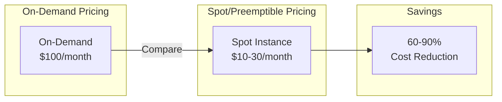
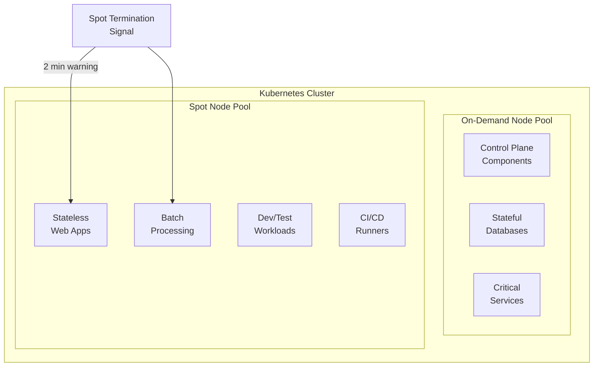

# How to Reduce Kubernetes Costs with Spot and Preemptible Nodes

Author: [nawazdhandala](https://www.github.com/nawazdhandala)

Tags: Kubernetes, Cost Optimization, Spot Instances, Preemptible Nodes, AWS, GCP, Azure, FinOps

Description: Learn how to significantly reduce Kubernetes infrastructure costs by using spot instances, preemptible VMs, and interruptible nodes while maintaining application reliability.

---

Cloud costs can spiral out of control quickly when running Kubernetes clusters at scale. Spot instances (AWS), preemptible VMs (GCP), and spot VMs (Azure) offer up to 90% cost savings compared to on-demand pricing—but they come with a catch: they can be terminated with little notice.

This guide covers strategies for safely using interruptible nodes in production Kubernetes clusters.

## Cost Comparison



| Cloud Provider | Instance Type | Typical Savings | Termination Notice |
|---------------|---------------|-----------------|-------------------|
| AWS | Spot Instances | 60-90% | 2 minutes |
| GCP | Preemptible VMs | 60-91% | 30 seconds |
| GCP | Spot VMs | 60-91% | 30 seconds |
| Azure | Spot VMs | 60-90% | 30 seconds |

## Architecture for Spot-Friendly Workloads



## Setting Up Spot Node Pools

### AWS EKS with Spot Instances

```yaml
# spot-node-group.yaml
apiVersion: eksctl.io/v1alpha5
kind: ClusterConfig

metadata:
  name: production-cluster
  region: us-west-2

managedNodeGroups:
  # On-demand node group for critical workloads
  - name: on-demand-critical
    instanceType: m5.xlarge
    desiredCapacity: 3
    minSize: 3
    maxSize: 6
    labels:
      node-type: on-demand
      workload-type: critical
    taints:
      - key: workload-type
        value: critical
        effect: NoSchedule

  # Spot node group for cost optimization
  - name: spot-workers
    instanceTypes:
      - m5.xlarge
      - m5a.xlarge
      - m5n.xlarge
      - m4.xlarge
    spot: true
    desiredCapacity: 5
    minSize: 0
    maxSize: 20
    labels:
      node-type: spot
      workload-type: interruptible
    taints:
      - key: node-type
        value: spot
        effect: NoSchedule
```

### Create EKS Cluster with eksctl

```bash
# Create cluster with spot node groups
eksctl create cluster -f spot-node-group.yaml

# Or add spot node group to existing cluster
eksctl create nodegroup \
  --cluster=production-cluster \
  --name=spot-workers \
  --spot \
  --instance-types=m5.xlarge,m5a.xlarge,m5n.xlarge \
  --nodes=5 \
  --nodes-min=0 \
  --nodes-max=20
```

### GCP GKE with Preemptible/Spot VMs

```bash
# Create node pool with spot VMs (recommended over preemptible)
gcloud container node-pools create spot-pool \
  --cluster=production-cluster \
  --zone=us-central1-a \
  --spot \
  --num-nodes=5 \
  --min-nodes=0 \
  --max-nodes=20 \
  --machine-type=n2-standard-4 \
  --node-labels=node-type=spot,workload-type=interruptible \
  --node-taints=node-type=spot:NoSchedule

# Create on-demand pool for critical workloads
gcloud container node-pools create on-demand-pool \
  --cluster=production-cluster \
  --zone=us-central1-a \
  --num-nodes=3 \
  --min-nodes=3 \
  --max-nodes=6 \
  --machine-type=n2-standard-4 \
  --node-labels=node-type=on-demand,workload-type=critical
```

### Azure AKS with Spot Node Pools

```bash
# Add spot node pool to existing AKS cluster
az aks nodepool add \
  --resource-group myResourceGroup \
  --cluster-name myAKSCluster \
  --name spotnodepool \
  --priority Spot \
  --eviction-policy Delete \
  --spot-max-price -1 \
  --node-count 5 \
  --min-count 0 \
  --max-count 20 \
  --node-vm-size Standard_D4s_v3 \
  --labels node-type=spot workload-type=interruptible \
  --node-taints node-type=spot:NoSchedule \
  --enable-cluster-autoscaler
```

## Configuring Workloads for Spot Nodes

### Deployment with Spot Tolerations

```yaml
# spot-tolerant-deployment.yaml
apiVersion: apps/v1
kind: Deployment
metadata:
  name: web-api
  namespace: production
spec:
  replicas: 6
  selector:
    matchLabels:
      app: web-api
  template:
    metadata:
      labels:
        app: web-api
    spec:
      # Tolerate spot node taint
      tolerations:
        - key: node-type
          operator: Equal
          value: spot
          effect: NoSchedule
      
      # Prefer spot nodes but can run on on-demand
      affinity:
        nodeAffinity:
          preferredDuringSchedulingIgnoredDuringExecution:
            - weight: 100
              preference:
                matchExpressions:
                  - key: node-type
                    operator: In
                    values:
                      - spot
          # Spread across availability zones
          requiredDuringSchedulingIgnoredDuringExecution:
            nodeSelectorTerms:
              - matchExpressions:
                  - key: topology.kubernetes.io/zone
                    operator: In
                    values:
                      - us-west-2a
                      - us-west-2b
                      - us-west-2c
        
        # Spread pods across nodes
        podAntiAffinity:
          preferredDuringSchedulingIgnoredDuringExecution:
            - weight: 100
              podAffinityTerm:
                labelSelector:
                  matchLabels:
                    app: web-api
                topologyKey: kubernetes.io/hostname
      
      # Topology spread for even distribution
      topologySpreadConstraints:
        - maxSkew: 1
          topologyKey: kubernetes.io/hostname
          whenUnsatisfiable: ScheduleAnyway
          labelSelector:
            matchLabels:
              app: web-api
      
      terminationGracePeriodSeconds: 60
      
      containers:
        - name: web-api
          image: myregistry/web-api:v1.2.3
          ports:
            - containerPort: 8080
          resources:
            requests:
              cpu: 500m
              memory: 512Mi
            limits:
              cpu: 1000m
              memory: 1Gi
          
          # Graceful shutdown handling
          lifecycle:
            preStop:
              exec:
                command:
                  - /bin/sh
                  - -c
                  - |
                    # Signal application to stop accepting new requests
                    curl -X POST localhost:8080/admin/drain
                    # Wait for in-flight requests to complete
                    sleep 30
          
          readinessProbe:
            httpGet:
              path: /health/ready
              port: 8080
            initialDelaySeconds: 5
            periodSeconds: 5
          
          livenessProbe:
            httpGet:
              path: /health/live
              port: 8080
            initialDelaySeconds: 10
            periodSeconds: 10
```

### Pod Disruption Budget for Spot Workloads

```yaml
# pdb-spot-workload.yaml
apiVersion: policy/v1
kind: PodDisruptionBudget
metadata:
  name: web-api-pdb
  namespace: production
spec:
  # At least 50% of pods must remain available
  minAvailable: 50%
  # Or use maxUnavailable
  # maxUnavailable: 2
  selector:
    matchLabels:
      app: web-api
```

## Handling Spot Termination

### AWS Node Termination Handler

```bash
# Install AWS Node Termination Handler via Helm
helm repo add eks https://aws.github.io/eks-charts
helm repo update

helm install aws-node-termination-handler eks/aws-node-termination-handler \
  --namespace kube-system \
  --set enableSpotInterruptionDraining=true \
  --set enableRebalanceMonitoring=true \
  --set enableRebalanceDraining=true \
  --set enableScheduledEventDraining=true
```

```yaml
# aws-node-termination-handler-values.yaml
enableSpotInterruptionDraining: true
enableRebalanceMonitoring: true
enableRebalanceDraining: true
enableScheduledEventDraining: true

# Cordon and drain nodes when termination notice received
nodeTerminationGracePeriod: 120
podTerminationGracePeriod: 60

# Webhook for custom notifications
webhookURL: "https://hooks.slack.com/services/xxx/yyy/zzz"
webhookTemplate: |
  {
    "text": "Spot instance {{ .NodeName }} is being terminated. Reason: {{ .Kind }}"
  }

# Taint nodes to prevent new pods from being scheduled
taintNode: true
```

### GKE Preemption Handler

GKE automatically handles preemption, but you can improve behavior:

```yaml
# gke-preemption-aware-deployment.yaml
apiVersion: apps/v1
kind: Deployment
metadata:
  name: preemption-aware-app
spec:
  replicas: 4
  template:
    spec:
      # GKE-specific: listen for SIGTERM
      terminationGracePeriodSeconds: 25  # Less than 30s GKE warning
      
      containers:
        - name: app
          image: myapp:latest
          
          # Handle SIGTERM gracefully
          lifecycle:
            preStop:
              exec:
                command:
                  - /bin/sh
                  - -c
                  - |
                    echo "Received preemption notice, draining..."
                    # Your graceful shutdown logic
                    kill -SIGTERM 1
                    sleep 20
```

### Azure Scheduled Events Handler

```yaml
# azure-scheduled-events-daemonset.yaml
apiVersion: apps/v1
kind: DaemonSet
metadata:
  name: azure-scheduled-events-handler
  namespace: kube-system
spec:
  selector:
    matchLabels:
      app: azure-scheduled-events
  template:
    metadata:
      labels:
        app: azure-scheduled-events
    spec:
      hostNetwork: true
      nodeSelector:
        kubernetes.azure.com/scalesetpriority: spot
      tolerations:
        - key: node-type
          operator: Equal
          value: spot
          effect: NoSchedule
      containers:
        - name: handler
          image: mcr.microsoft.com/aks/scheduled-events-handler:latest
          env:
            - name: NODE_NAME
              valueFrom:
                fieldRef:
                  fieldPath: spec.nodeName
          volumeMounts:
            - name: host-run
              mountPath: /var/run
      volumes:
        - name: host-run
          hostPath:
            path: /var/run
```

## Cluster Autoscaler Configuration

### AWS Cluster Autoscaler for Spot

```yaml
# cluster-autoscaler-spot-config.yaml
apiVersion: v1
kind: ConfigMap
metadata:
  name: cluster-autoscaler-priority-expander
  namespace: kube-system
data:
  priorities: |
    10:
      - .*spot.*
    50:
      - .*on-demand.*
---
apiVersion: apps/v1
kind: Deployment
metadata:
  name: cluster-autoscaler
  namespace: kube-system
spec:
  template:
    spec:
      containers:
        - name: cluster-autoscaler
          image: registry.k8s.io/autoscaling/cluster-autoscaler:v1.28.0
          command:
            - ./cluster-autoscaler
            - --v=4
            - --cloud-provider=aws
            - --skip-nodes-with-local-storage=false
            - --expander=priority
            - --balance-similar-node-groups=true
            - --skip-nodes-with-system-pods=false
            # Scale down aggressively for spot nodes
            - --scale-down-enabled=true
            - --scale-down-delay-after-add=5m
            - --scale-down-unneeded-time=3m
            - --scale-down-utilization-threshold=0.5
```

### Karpenter for Spot (AWS)

```yaml
# karpenter-spot-provisioner.yaml
apiVersion: karpenter.sh/v1alpha5
kind: Provisioner
metadata:
  name: spot-provisioner
spec:
  # Requirements for spot nodes
  requirements:
    - key: karpenter.sh/capacity-type
      operator: In
      values:
        - spot
        - on-demand  # Fallback to on-demand if no spot available
    - key: kubernetes.io/arch
      operator: In
      values:
        - amd64
    - key: node.kubernetes.io/instance-type
      operator: In
      values:
        - m5.xlarge
        - m5.2xlarge
        - m5a.xlarge
        - m5a.2xlarge
        - m5n.xlarge
        - m5n.2xlarge
        - m4.xlarge
        - m4.2xlarge
  
  # Consolidation settings
  consolidation:
    enabled: true
  
  # TTL settings
  ttlSecondsAfterEmpty: 30
  ttlSecondsUntilExpired: 2592000  # 30 days
  
  # Limits
  limits:
    resources:
      cpu: 1000
      memory: 1000Gi
  
  # Provider configuration
  provider:
    subnetSelector:
      karpenter.sh/discovery: my-cluster
    securityGroupSelector:
      karpenter.sh/discovery: my-cluster
    
    # Spot-specific settings
    capacityType:
      - spot
      - on-demand
    
    # Diversify across instance types
    instanceProfile: KarpenterNodeInstanceProfile
    
  # Taints for spot nodes
  taints:
    - key: node-type
      value: spot
      effect: NoSchedule
  
  # Labels
  labels:
    node-type: spot
    workload-type: interruptible
```

```yaml
# karpenter-on-demand-provisioner.yaml
apiVersion: karpenter.sh/v1alpha5
kind: Provisioner
metadata:
  name: on-demand-provisioner
spec:
  requirements:
    - key: karpenter.sh/capacity-type
      operator: In
      values:
        - on-demand
    - key: node.kubernetes.io/instance-type
      operator: In
      values:
        - m5.xlarge
        - m5.2xlarge
  
  ttlSecondsAfterEmpty: 300
  
  limits:
    resources:
      cpu: 100
      memory: 200Gi
  
  provider:
    subnetSelector:
      karpenter.sh/discovery: my-cluster
    securityGroupSelector:
      karpenter.sh/discovery: my-cluster
  
  taints:
    - key: workload-type
      value: critical
      effect: NoSchedule
  
  labels:
    node-type: on-demand
    workload-type: critical
```

## Workload Classification

### Critical Workloads (On-Demand Only)

```yaml
# critical-workload.yaml
apiVersion: apps/v1
kind: Deployment
metadata:
  name: payment-service
  namespace: production
spec:
  replicas: 3
  template:
    spec:
      # Only run on on-demand nodes
      nodeSelector:
        node-type: on-demand
      
      # Tolerate critical workload taint
      tolerations:
        - key: workload-type
          operator: Equal
          value: critical
          effect: NoSchedule
      
      # High priority
      priorityClassName: high-priority
      
      containers:
        - name: payment-service
          image: myregistry/payment-service:v2.1.0
```

### Spot-Friendly Workloads

```yaml
# spot-friendly-batch-job.yaml
apiVersion: batch/v1
kind: Job
metadata:
  name: data-processing-job
spec:
  parallelism: 10
  completions: 100
  backoffLimit: 20  # Retry on spot termination
  
  template:
    spec:
      restartPolicy: OnFailure
      
      tolerations:
        - key: node-type
          operator: Equal
          value: spot
          effect: NoSchedule
      
      affinity:
        nodeAffinity:
          requiredDuringSchedulingIgnoredDuringExecution:
            nodeSelectorTerms:
              - matchExpressions:
                  - key: node-type
                    operator: In
                    values:
                      - spot
      
      containers:
        - name: processor
          image: myregistry/data-processor:v1.0.0
          
          # Checkpoint progress to survive interruption
          env:
            - name: CHECKPOINT_ENABLED
              value: "true"
            - name: CHECKPOINT_PATH
              value: /data/checkpoints
          
          volumeMounts:
            - name: checkpoint-storage
              mountPath: /data/checkpoints
      
      volumes:
        - name: checkpoint-storage
          persistentVolumeClaim:
            claimName: checkpoint-pvc
```

## Cost Monitoring and Optimization

### Kubecost Integration

```bash
# Install Kubecost for cost visibility
helm repo add kubecost https://kubecost.github.io/cost-analyzer/
helm repo update

helm install kubecost kubecost/cost-analyzer \
  --namespace kubecost \
  --create-namespace \
  --set kubecostToken="YOUR_TOKEN" \
  --set prometheus.server.persistentVolume.enabled=false
```

### Cost Allocation Labels

```yaml
# cost-labeled-deployment.yaml
apiVersion: apps/v1
kind: Deployment
metadata:
  name: api-service
  labels:
    # Cost allocation labels
    cost-center: engineering
    team: platform
    environment: production
    app: api-service
spec:
  template:
    metadata:
      labels:
        cost-center: engineering
        team: platform
        environment: production
        app: api-service
```

### Spot Savings Calculator Script

```bash
#!/bin/bash
# calculate-spot-savings.sh

# Get current spot vs on-demand usage
SPOT_CPU=$(kubectl get nodes -l node-type=spot -o jsonpath='{.items[*].status.capacity.cpu}' | tr ' ' '+' | bc)
ONDEMAND_CPU=$(kubectl get nodes -l node-type=on-demand -o jsonpath='{.items[*].status.capacity.cpu}' | tr ' ' '+' | bc)

# Approximate costs (adjust for your instance types and region)
ONDEMAND_COST_PER_CPU=0.05  # $/hour
SPOT_COST_PER_CPU=0.015     # $/hour

SPOT_COST=$(echo "$SPOT_CPU * $SPOT_COST_PER_CPU" | bc)
SPOT_AS_ONDEMAND=$(echo "$SPOT_CPU * $ONDEMAND_COST_PER_CPU" | bc)
SAVINGS=$(echo "$SPOT_AS_ONDEMAND - $SPOT_COST" | bc)

echo "=== Spot Instance Savings Report ==="
echo "Spot CPUs: $SPOT_CPU"
echo "On-Demand CPUs: $ONDEMAND_CPU"
echo "Hourly spot cost: \$$SPOT_COST"
echo "Equivalent on-demand cost: \$$SPOT_AS_ONDEMAND"
echo "Hourly savings: \$$SAVINGS"
echo "Monthly savings (730 hours): \$$(echo "$SAVINGS * 730" | bc)"
```

## Best Practices

### 1. Diversify Instance Types

```yaml
# Use multiple instance types to increase spot availability
instanceTypes:
  - m5.xlarge     # Primary choice
  - m5a.xlarge    # AMD variant
  - m5n.xlarge    # Network optimized
  - m4.xlarge     # Previous generation
  - m5d.xlarge    # With NVMe
  - m5ad.xlarge   # AMD with NVMe
```

### 2. Multi-AZ Deployment

```yaml
# Spread across availability zones
topologySpreadConstraints:
  - maxSkew: 1
    topologyKey: topology.kubernetes.io/zone
    whenUnsatisfiable: DoNotSchedule
    labelSelector:
      matchLabels:
        app: my-app
```

### 3. Graceful Shutdown

```go
// Go application example for graceful shutdown
package main

import (
    "context"
    "net/http"
    "os"
    "os/signal"
    "syscall"
    "time"
)

func main() {
    server := &http.Server{Addr: ":8080"}
    
    // Channel for shutdown signals
    shutdown := make(chan os.Signal, 1)
    signal.Notify(shutdown, syscall.SIGTERM, syscall.SIGINT)
    
    go func() {
        <-shutdown
        
        // Create context with timeout for graceful shutdown
        ctx, cancel := context.WithTimeout(context.Background(), 30*time.Second)
        defer cancel()
        
        // Stop accepting new connections
        server.SetKeepAlivesEnabled(false)
        
        // Gracefully shutdown
        if err := server.Shutdown(ctx); err != nil {
            log.Printf("Graceful shutdown failed: %v", err)
        }
    }()
    
    server.ListenAndServe()
}
```

### 4. Checkpointing for Long-Running Jobs

```python
# Python example with checkpointing
import pickle
import os
import signal

CHECKPOINT_FILE = '/data/checkpoints/progress.pkl'

def save_checkpoint(state):
    with open(CHECKPOINT_FILE, 'wb') as f:
        pickle.dump(state, f)

def load_checkpoint():
    if os.path.exists(CHECKPOINT_FILE):
        with open(CHECKPOINT_FILE, 'rb') as f:
            return pickle.load(f)
    return {'processed': 0, 'results': []}

def handle_sigterm(signum, frame):
    print("Received SIGTERM, saving checkpoint...")
    save_checkpoint(current_state)
    sys.exit(0)

signal.signal(signal.SIGTERM, handle_sigterm)

# Resume from checkpoint
current_state = load_checkpoint()
start_from = current_state['processed']

for i in range(start_from, total_items):
    # Process item
    result = process_item(items[i])
    current_state['results'].append(result)
    current_state['processed'] = i + 1
    
    # Periodic checkpointing
    if i % 100 == 0:
        save_checkpoint(current_state)
```

## Summary

Using spot instances can dramatically reduce Kubernetes costs:

| Strategy | Implementation | Benefit |
|----------|---------------|---------|
| Multi-instance types | Diversify across 6+ types | Higher availability |
| Multi-AZ | Spread across zones | Survive zone-level interruptions |
| Graceful shutdown | Handle SIGTERM properly | Clean connection draining |
| Checkpointing | Save progress periodically | Resume interrupted jobs |
| PDBs | Set minAvailable | Maintain availability during churn |
| Node termination handler | Install cloud-specific handler | Early warning and drainage |

Start with non-critical workloads and gradually expand spot usage as you gain confidence in your termination handling strategies.

## Related Posts

- [How to Right-Size Kubernetes Resource Requests and Limits](https://oneuptime.com/blog/post/2026-01-19-kubernetes-resource-requests-limits-rightsizing/view) - Optimize resource allocation alongside cost
- [How to Configure Pod Priority and Preemption in Kubernetes](https://oneuptime.com/blog/post/2026-01-19-kubernetes-pod-priority-preemption/view) - Prioritize workloads during resource contention
- [How to Use Kubernetes Taints and Tolerations Effectively](https://oneuptime.com/blog/post/2026-01-19-kubernetes-taints-tolerations-scheduling/view) - Control scheduling to spot nodes
