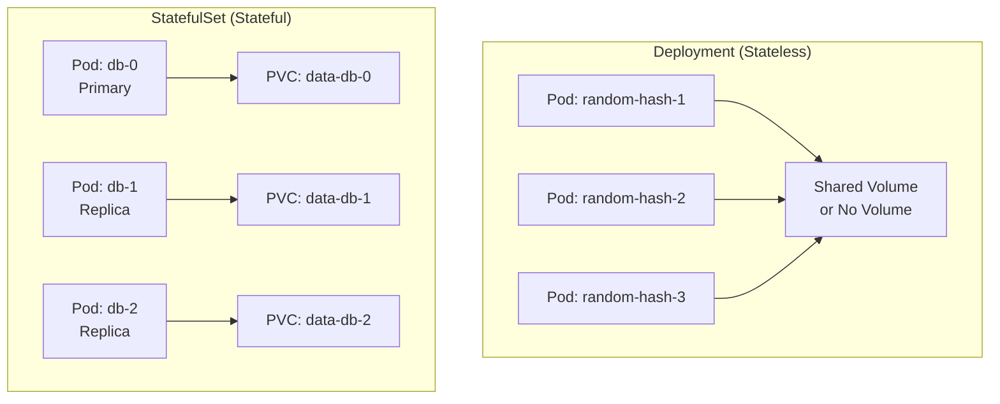

# How to Set Up StatefulSets for Databases in Kubernetes

Author: [nawazdhandala](https://www.github.com/nawazdhandala)

Tags: Kubernetes, StatefulSets, Databases, PostgreSQL, MySQL, MongoDB, Persistent Storage

Description: Learn how to properly run stateful databases in Kubernetes using StatefulSets with stable network identities, persistent storage, and ordered deployment for MySQL, PostgreSQL, and MongoDB.

---

Running databases in Kubernetes requires special consideration. Unlike stateless applications that can be freely scaled and replaced, databases need stable identities, persistent storage, and careful orchestration during scaling and updates.

StatefulSets are Kubernetes workloads designed specifically for stateful applications. This guide shows you how to run production-ready databases using StatefulSets.

## Why StatefulSets for Databases?



StatefulSets provide:

| Feature | Deployment | StatefulSet |
|---------|------------|-------------|
| Pod Names | Random hash | Ordered index (db-0, db-1, db-2) |
| DNS Names | Through Service only | Individual DNS per pod |
| Storage | Shared or ephemeral | Dedicated PVC per pod |
| Scaling | Parallel | Ordered (one at a time) |
| Updates | Rolling (parallel) | Rolling (ordered) |
| Pod Identity | Interchangeable | Sticky (survives restarts) |

## PostgreSQL StatefulSet

### Basic PostgreSQL Setup

```yaml
# postgresql/statefulset.yaml
apiVersion: apps/v1
kind: StatefulSet
metadata:
  name: postgres
  namespace: database
spec:
  # Service name must match the headless service
  serviceName: postgres-headless
  replicas: 1
  selector:
    matchLabels:
      app: postgres
  template:
    metadata:
      labels:
        app: postgres
    spec:
      containers:
        - name: postgres
          image: postgres:16
          ports:
            - containerPort: 5432
              name: postgres
          env:
            # Use secrets in production!
            - name: POSTGRES_USER
              valueFrom:
                secretKeyRef:
                  name: postgres-credentials
                  key: username
            - name: POSTGRES_PASSWORD
              valueFrom:
                secretKeyRef:
                  name: postgres-credentials
                  key: password
            - name: POSTGRES_DB
              value: myapp
            # Data directory
            - name: PGDATA
              value: /var/lib/postgresql/data/pgdata
          volumeMounts:
            - name: data
              mountPath: /var/lib/postgresql/data
          # Resource limits are important for databases
          resources:
            requests:
              cpu: "500m"
              memory: "1Gi"
            limits:
              cpu: "2"
              memory: "4Gi"
          # Liveness and readiness probes
          livenessProbe:
            exec:
              command:
                - pg_isready
                - -U
                - postgres
            initialDelaySeconds: 30
            periodSeconds: 10
          readinessProbe:
            exec:
              command:
                - pg_isready
                - -U
                - postgres
            initialDelaySeconds: 5
            periodSeconds: 5
  # Volume claim template creates a PVC for each pod
  volumeClaimTemplates:
    - metadata:
        name: data
      spec:
        accessModes: ["ReadWriteOnce"]
        storageClassName: fast-ssd  # Use appropriate storage class
        resources:
          requests:
            storage: 100Gi
```

```yaml
# postgresql/service.yaml
# Headless service for StatefulSet (required)
apiVersion: v1
kind: Service
metadata:
  name: postgres-headless
  namespace: database
spec:
  clusterIP: None  # Headless service
  selector:
    app: postgres
  ports:
    - port: 5432
      name: postgres

---
# Regular service for client connections
apiVersion: v1
kind: Service
metadata:
  name: postgres
  namespace: database
spec:
  selector:
    app: postgres
  ports:
    - port: 5432
      targetPort: 5432
```

```yaml
# postgresql/secret.yaml
apiVersion: v1
kind: Secret
metadata:
  name: postgres-credentials
  namespace: database
type: Opaque
stringData:
  username: postgres
  password: your-secure-password-here  # Use sealed-secrets or external-secrets in production
```

### PostgreSQL with Replication

```yaml
# postgresql-ha/statefulset.yaml
apiVersion: apps/v1
kind: StatefulSet
metadata:
  name: postgres
  namespace: database
spec:
  serviceName: postgres-headless
  replicas: 3
  selector:
    matchLabels:
      app: postgres
  template:
    metadata:
      labels:
        app: postgres
    spec:
      initContainers:
        # Initialize replica from primary
        - name: init-replica
          image: postgres:16
          command:
            - bash
            - -c
            - |
              # Only run on replicas (not postgres-0)
              if [[ $(hostname) != "postgres-0" ]]; then
                # Wait for primary to be ready
                until pg_isready -h postgres-0.postgres-headless -U postgres; do
                  echo "Waiting for primary..."
                  sleep 2
                done
                
                # If data directory is empty, clone from primary
                if [ -z "$(ls -A /var/lib/postgresql/data)" ]; then
                  pg_basebackup -h postgres-0.postgres-headless -U replicator \
                    -D /var/lib/postgresql/data -Fp -Xs -P -R
                fi
              fi
          volumeMounts:
            - name: data
              mountPath: /var/lib/postgresql/data
          env:
            - name: PGPASSWORD
              valueFrom:
                secretKeyRef:
                  name: postgres-credentials
                  key: replicator-password
      containers:
        - name: postgres
          image: postgres:16
          ports:
            - containerPort: 5432
          env:
            - name: POSTGRES_USER
              value: postgres
            - name: POSTGRES_PASSWORD
              valueFrom:
                secretKeyRef:
                  name: postgres-credentials
                  key: password
            - name: PGDATA
              value: /var/lib/postgresql/data/pgdata
          volumeMounts:
            - name: data
              mountPath: /var/lib/postgresql/data
            - name: config
              mountPath: /etc/postgresql/postgresql.conf
              subPath: postgresql.conf
          args:
            - -c
            - config_file=/etc/postgresql/postgresql.conf
          resources:
            requests:
              cpu: "1"
              memory: "2Gi"
            limits:
              cpu: "4"
              memory: "8Gi"
      volumes:
        - name: config
          configMap:
            name: postgres-config
  volumeClaimTemplates:
    - metadata:
        name: data
      spec:
        accessModes: ["ReadWriteOnce"]
        storageClassName: fast-ssd
        resources:
          requests:
            storage: 100Gi
```

```yaml
# postgresql-ha/configmap.yaml
apiVersion: v1
kind: ConfigMap
metadata:
  name: postgres-config
  namespace: database
data:
  postgresql.conf: |
    # Replication settings
    wal_level = replica
    max_wal_senders = 10
    wal_keep_size = 1GB
    hot_standby = on
    
    # Connection settings
    listen_addresses = '*'
    max_connections = 200
    
    # Memory settings (adjust based on container limits)
    shared_buffers = 2GB
    effective_cache_size = 6GB
    work_mem = 64MB
    maintenance_work_mem = 512MB
    
    # Logging
    logging_collector = on
    log_directory = 'log'
    log_filename = 'postgresql-%Y-%m-%d.log'
```

## MySQL StatefulSet

```yaml
# mysql/statefulset.yaml
apiVersion: apps/v1
kind: StatefulSet
metadata:
  name: mysql
  namespace: database
spec:
  serviceName: mysql-headless
  replicas: 3
  selector:
    matchLabels:
      app: mysql
  template:
    metadata:
      labels:
        app: mysql
    spec:
      initContainers:
        # Configure server-id based on ordinal index
        - name: init-mysql
          image: mysql:8.0
          command:
            - bash
            - -c
            - |
              # Generate server-id from pod ordinal
              ordinal=$(hostname | awk -F'-' '{print $NF}')
              echo "[mysqld]" > /mnt/conf.d/server-id.cnf
              echo "server-id=$((100 + ordinal))" >> /mnt/conf.d/server-id.cnf
              
              # First pod is primary
              if [[ $ordinal -eq 0 ]]; then
                cp /mnt/config-map/primary.cnf /mnt/conf.d/
              else
                cp /mnt/config-map/replica.cnf /mnt/conf.d/
              fi
          volumeMounts:
            - name: conf
              mountPath: /mnt/conf.d
            - name: config-map
              mountPath: /mnt/config-map
        # Clone data from primary for new replicas
        - name: clone-mysql
          image: gcr.io/google-samples/xtrabackup:1.0
          command:
            - bash
            - -c
            - |
              ordinal=$(hostname | awk -F'-' '{print $NF}')
              # Skip for primary or if data exists
              [[ $ordinal -eq 0 ]] && exit 0
              [[ -d /var/lib/mysql/mysql ]] && exit 0
              
              # Clone from primary
              ncat --recv-only mysql-0.mysql-headless 3307 | xbstream -x -C /var/lib/mysql
              xtrabackup --prepare --target-dir=/var/lib/mysql
          volumeMounts:
            - name: data
              mountPath: /var/lib/mysql
            - name: conf
              mountPath: /etc/mysql/conf.d
      containers:
        - name: mysql
          image: mysql:8.0
          env:
            - name: MYSQL_ROOT_PASSWORD
              valueFrom:
                secretKeyRef:
                  name: mysql-credentials
                  key: root-password
            - name: MYSQL_DATABASE
              value: myapp
          ports:
            - containerPort: 3306
              name: mysql
          volumeMounts:
            - name: data
              mountPath: /var/lib/mysql
            - name: conf
              mountPath: /etc/mysql/conf.d
          resources:
            requests:
              cpu: "500m"
              memory: "1Gi"
            limits:
              cpu: "2"
              memory: "4Gi"
          livenessProbe:
            exec:
              command:
                - mysqladmin
                - ping
                - -h
                - localhost
            initialDelaySeconds: 30
            periodSeconds: 10
          readinessProbe:
            exec:
              command:
                - bash
                - -c
                - |
                  mysql -h localhost -u root -p$MYSQL_ROOT_PASSWORD -e "SELECT 1"
            initialDelaySeconds: 5
            periodSeconds: 2
        # Sidecar for data export (used by clone-mysql)
        - name: xtrabackup
          image: gcr.io/google-samples/xtrabackup:1.0
          ports:
            - containerPort: 3307
              name: xtrabackup
          command:
            - bash
            - -c
            - |
              cd /var/lib/mysql
              # Start streaming server only if we're the primary
              ordinal=$(hostname | awk -F'-' '{print $NF}')
              if [[ $ordinal -eq 0 ]]; then
                exec ncat --listen --keep-open --send-only --max-conns=1 3307 -c \
                  "xtrabackup --backup --slave-info --stream=xbstream --host=127.0.0.1 --user=root --password=$MYSQL_ROOT_PASSWORD"
              else
                sleep infinity
              fi
          volumeMounts:
            - name: data
              mountPath: /var/lib/mysql
          env:
            - name: MYSQL_ROOT_PASSWORD
              valueFrom:
                secretKeyRef:
                  name: mysql-credentials
                  key: root-password
      volumes:
        - name: conf
          emptyDir: {}
        - name: config-map
          configMap:
            name: mysql-config
  volumeClaimTemplates:
    - metadata:
        name: data
      spec:
        accessModes: ["ReadWriteOnce"]
        storageClassName: fast-ssd
        resources:
          requests:
            storage: 100Gi
```

```yaml
# mysql/configmap.yaml
apiVersion: v1
kind: ConfigMap
metadata:
  name: mysql-config
  namespace: database
data:
  primary.cnf: |
    [mysqld]
    log-bin=mysql-bin
    binlog_format=ROW
    gtid_mode=ON
    enforce_gtid_consistency=ON
  replica.cnf: |
    [mysqld]
    super-read-only
    log-bin=mysql-bin
    binlog_format=ROW
    gtid_mode=ON
    enforce_gtid_consistency=ON
```

```yaml
# mysql/services.yaml
# Headless service for StatefulSet
apiVersion: v1
kind: Service
metadata:
  name: mysql-headless
  namespace: database
spec:
  clusterIP: None
  selector:
    app: mysql
  ports:
    - port: 3306
      name: mysql

---
# Service for read replicas
apiVersion: v1
kind: Service
metadata:
  name: mysql-read
  namespace: database
spec:
  selector:
    app: mysql
  ports:
    - port: 3306
      targetPort: 3306

---
# Service for primary only
apiVersion: v1
kind: Service
metadata:
  name: mysql-primary
  namespace: database
spec:
  selector:
    app: mysql
    # This requires pod readiness gates or manual label management
    role: primary
  ports:
    - port: 3306
      targetPort: 3306
```

## MongoDB StatefulSet

```yaml
# mongodb/statefulset.yaml
apiVersion: apps/v1
kind: StatefulSet
metadata:
  name: mongodb
  namespace: database
spec:
  serviceName: mongodb-headless
  replicas: 3
  selector:
    matchLabels:
      app: mongodb
  template:
    metadata:
      labels:
        app: mongodb
    spec:
      terminationGracePeriodSeconds: 30
      containers:
        - name: mongodb
          image: mongo:7.0
          command:
            - mongod
            - --replSet
            - rs0
            - --bind_ip_all
            - --auth
            - --keyFile
            - /etc/mongodb-keyfile/keyfile
          ports:
            - containerPort: 27017
              name: mongodb
          env:
            - name: MONGO_INITDB_ROOT_USERNAME
              valueFrom:
                secretKeyRef:
                  name: mongodb-credentials
                  key: username
            - name: MONGO_INITDB_ROOT_PASSWORD
              valueFrom:
                secretKeyRef:
                  name: mongodb-credentials
                  key: password
          volumeMounts:
            - name: data
              mountPath: /data/db
            - name: keyfile
              mountPath: /etc/mongodb-keyfile
              readOnly: true
          resources:
            requests:
              cpu: "500m"
              memory: "2Gi"
            limits:
              cpu: "2"
              memory: "8Gi"
          livenessProbe:
            exec:
              command:
                - mongosh
                - --eval
                - "db.adminCommand('ping')"
            initialDelaySeconds: 30
            periodSeconds: 10
          readinessProbe:
            exec:
              command:
                - mongosh
                - --eval
                - "db.adminCommand('ping')"
            initialDelaySeconds: 5
            periodSeconds: 5
      volumes:
        - name: keyfile
          secret:
            secretName: mongodb-keyfile
            defaultMode: 0400
  volumeClaimTemplates:
    - metadata:
        name: data
      spec:
        accessModes: ["ReadWriteOnce"]
        storageClassName: fast-ssd
        resources:
          requests:
            storage: 100Gi
```

```yaml
# mongodb/services.yaml
# Headless service for replica set discovery
apiVersion: v1
kind: Service
metadata:
  name: mongodb-headless
  namespace: database
spec:
  clusterIP: None
  selector:
    app: mongodb
  ports:
    - port: 27017
      name: mongodb

---
# Regular service for client connections
apiVersion: v1
kind: Service
metadata:
  name: mongodb
  namespace: database
spec:
  selector:
    app: mongodb
  ports:
    - port: 27017
      targetPort: 27017
```

```bash
# Initialize MongoDB replica set (run after all pods are ready)
kubectl exec -n database mongodb-0 -- mongosh --eval '
rs.initiate({
  _id: "rs0",
  members: [
    {_id: 0, host: "mongodb-0.mongodb-headless.database.svc.cluster.local:27017", priority: 2},
    {_id: 1, host: "mongodb-1.mongodb-headless.database.svc.cluster.local:27017", priority: 1},
    {_id: 2, host: "mongodb-2.mongodb-headless.database.svc.cluster.local:27017", priority: 1}
  ]
})'
```

## Storage Considerations

### Choosing the Right Storage Class

```yaml
# storage-classes.yaml
# Fast SSD storage for database workloads
apiVersion: storage.k8s.io/v1
kind: StorageClass
metadata:
  name: fast-ssd
provisioner: kubernetes.io/aws-ebs  # or your cloud provider
parameters:
  type: gp3
  iops: "3000"
  throughput: "125"
reclaimPolicy: Retain  # Important: Don't delete data when PVC is deleted
allowVolumeExpansion: true  # Allow resizing
volumeBindingMode: WaitForFirstConsumer  # Bind in the same zone as pod
```

### Pod Disruption Budget

```yaml
# pdb.yaml
# Ensure at least one database pod is always available
apiVersion: policy/v1
kind: PodDisruptionBudget
metadata:
  name: postgres-pdb
  namespace: database
spec:
  minAvailable: 1  # Or use maxUnavailable: 1
  selector:
    matchLabels:
      app: postgres
```

## Backup Strategies

```yaml
# backup-cronjob.yaml
# Scheduled database backups
apiVersion: batch/v1
kind: CronJob
metadata:
  name: postgres-backup
  namespace: database
spec:
  schedule: "0 2 * * *"  # Daily at 2 AM
  jobTemplate:
    spec:
      template:
        spec:
          containers:
            - name: backup
              image: postgres:16
              command:
                - bash
                - -c
                - |
                  TIMESTAMP=$(date +%Y%m%d-%H%M%S)
                  pg_dump -h postgres -U postgres myapp | \
                    gzip > /backup/myapp-$TIMESTAMP.sql.gz
                  # Upload to S3 or other storage
                  aws s3 cp /backup/myapp-$TIMESTAMP.sql.gz \
                    s3://my-backups/postgres/
              env:
                - name: PGPASSWORD
                  valueFrom:
                    secretKeyRef:
                      name: postgres-credentials
                      key: password
              volumeMounts:
                - name: backup
                  mountPath: /backup
          volumes:
            - name: backup
              emptyDir: {}
          restartPolicy: OnFailure
```

## Conclusion

Running databases on Kubernetes with StatefulSets provides the stability and persistence that stateful applications require. Key takeaways:

1. **Always use StatefulSets** for databases, not Deployments
2. **Use headless services** for stable DNS names per pod
3. **volumeClaimTemplates** give each pod its own persistent storage
4. **Configure proper probes** for accurate health checking
5. **Set resource limits** to prevent resource contention
6. **Use Pod Disruption Budgets** for high availability during maintenance

For monitoring your database performance and availability, check out [OneUptime's Kubernetes monitoring](https://oneuptime.com/product/metrics).

## Related Resources

- [How to Back Up Kubernetes with Velero](https://oneuptime.com/blog/post/kubernetes-velero-backup-restore/view)
- [How to Resize Persistent Volumes Without Downtime](https://oneuptime.com/blog/post/kubernetes-resize-persistent-volumes/view)
- [How to Right-Size Resource Requests and Limits](https://oneuptime.com/blog/post/kubernetes-resource-requests-limits-rightsizing/view)
