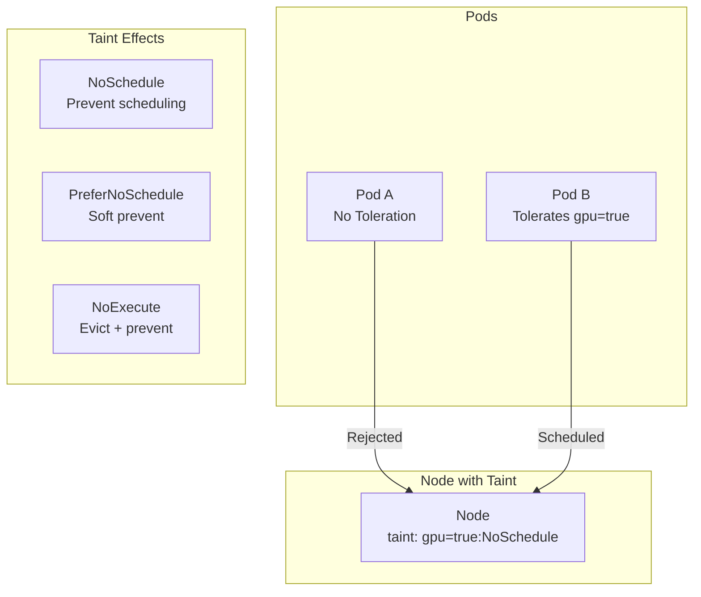

# How to Configure Taints and Tolerations in Kubernetes

Author: [nawazdhandala](https://www.github.com/nawazdhandala)

Tags: Kubernetes, Taints, Tolerations, Scheduling, Node Management, DevOps

Description: Master Kubernetes taints and tolerations to control pod scheduling, dedicate nodes for specific workloads, and manage node lifecycle events.

---

Taints and tolerations work together to ensure pods are scheduled on appropriate nodes. This guide covers configuring taints and tolerations for various use cases including dedicated nodes, graceful evictions, and workload isolation.

## Taints and Tolerations Overview



| Effect | Behavior |
|--------|----------|
| NoSchedule | New pods without toleration cannot be scheduled |
| PreferNoSchedule | Scheduler tries to avoid, but may schedule if necessary |
| NoExecute | Evict existing pods and prevent new ones |

## Managing Taints

### Adding Taints

```bash
# Add NoSchedule taint
kubectl taint nodes node-1 dedicated=gpu:NoSchedule

# Add NoExecute taint
kubectl taint nodes node-1 maintenance=true:NoExecute

# Add PreferNoSchedule taint
kubectl taint nodes node-1 workload=batch:PreferNoSchedule

# Add multiple taints
kubectl taint nodes node-1 \
  team=data-science:NoSchedule \
  gpu=nvidia-v100:NoSchedule
```

### Viewing Taints

```bash
# View taints on a node
kubectl describe node node-1 | grep -A 5 Taints

# View all nodes with taints
kubectl get nodes -o custom-columns=NAME:.metadata.name,TAINTS:.spec.taints

# JSON output for automation
kubectl get nodes -o json | jq '.items[] | {name: .metadata.name, taints: .spec.taints}'
```

### Removing Taints

```bash
# Remove specific taint
kubectl taint nodes node-1 dedicated=gpu:NoSchedule-

# Remove taint by key (any effect)
kubectl taint nodes node-1 dedicated-

# Remove all taints from a node
kubectl patch node node-1 -p '{"spec":{"taints":[]}}'
```

## Configuring Tolerations

### Basic Toleration

```yaml
# basic-toleration.yaml
apiVersion: v1
kind: Pod
metadata:
  name: gpu-workload
spec:
  tolerations:
    - key: "dedicated"
      operator: "Equal"
      value: "gpu"
      effect: "NoSchedule"
  containers:
    - name: cuda
      image: nvidia/cuda:latest
```

### Tolerate Any Value

```yaml
# tolerate-any-value.yaml
apiVersion: v1
kind: Pod
metadata:
  name: flexible-pod
spec:
  tolerations:
    # Tolerate any value for the key
    - key: "dedicated"
      operator: "Exists"
      effect: "NoSchedule"
  containers:
    - name: app
      image: myapp:latest
```

### Tolerate All Taints

```yaml
# tolerate-all.yaml
apiVersion: v1
kind: Pod
metadata:
  name: system-critical
spec:
  tolerations:
    # Tolerate all taints
    - operator: "Exists"
  containers:
    - name: monitoring
      image: datadog/agent:latest
```

### Multiple Tolerations

```yaml
# multiple-tolerations.yaml
apiVersion: apps/v1
kind: Deployment
metadata:
  name: ml-training
spec:
  replicas: 3
  selector:
    matchLabels:
      app: ml-training
  template:
    metadata:
      labels:
        app: ml-training
    spec:
      tolerations:
        # Tolerate GPU nodes
        - key: "gpu"
          operator: "Exists"
          effect: "NoSchedule"
        # Tolerate high-memory nodes
        - key: "memory"
          operator: "Equal"
          value: "high"
          effect: "NoSchedule"
        # Tolerate short maintenance windows
        - key: "node.kubernetes.io/unschedulable"
          operator: "Exists"
          effect: "NoSchedule"
      containers:
        - name: training
          image: tensorflow:latest-gpu
```

## NoExecute with Toleration Seconds

```yaml
# noexecute-toleration.yaml
apiVersion: v1
kind: Pod
metadata:
  name: critical-job
spec:
  tolerations:
    # Stay for 60 seconds after node is tainted
    - key: "node.kubernetes.io/not-ready"
      operator: "Exists"
      effect: "NoExecute"
      tolerationSeconds: 60
    # Stay for 300 seconds during maintenance
    - key: "maintenance"
      operator: "Exists"
      effect: "NoExecute"
      tolerationSeconds: 300
  containers:
    - name: job
      image: batch-job:latest
```

## Dedicated Nodes

### GPU Dedicated Nodes

```bash
# Taint GPU nodes
kubectl taint nodes gpu-node-1 nvidia.com/gpu=present:NoSchedule
kubectl taint nodes gpu-node-2 nvidia.com/gpu=present:NoSchedule

# Label for affinity
kubectl label nodes gpu-node-1 gpu-node-2 nvidia.com/gpu=present
```

```yaml
# gpu-deployment.yaml
apiVersion: apps/v1
kind: Deployment
metadata:
  name: ml-inference
spec:
  replicas: 2
  selector:
    matchLabels:
      app: ml-inference
  template:
    metadata:
      labels:
        app: ml-inference
    spec:
      tolerations:
        - key: "nvidia.com/gpu"
          operator: "Equal"
          value: "present"
          effect: "NoSchedule"
      affinity:
        nodeAffinity:
          requiredDuringSchedulingIgnoredDuringExecution:
            nodeSelectorTerms:
              - matchExpressions:
                  - key: nvidia.com/gpu
                    operator: In
                    values:
                      - present
      containers:
        - name: inference
          image: ml-model:latest
          resources:
            limits:
              nvidia.com/gpu: 1
```

### Team-Dedicated Nodes

```bash
# Taint nodes for specific teams
kubectl taint nodes node-1 node-2 team=data-science:NoSchedule
kubectl taint nodes node-3 node-4 team=backend:NoSchedule
kubectl taint nodes node-5 team=frontend:NoSchedule
```

```yaml
# team-deployment.yaml
apiVersion: apps/v1
kind: Deployment
metadata:
  name: data-pipeline
  namespace: data-science
spec:
  replicas: 3
  selector:
    matchLabels:
      app: data-pipeline
  template:
    metadata:
      labels:
        app: data-pipeline
    spec:
      tolerations:
        - key: "team"
          operator: "Equal"
          value: "data-science"
          effect: "NoSchedule"
      nodeSelector:
        team: data-science
      containers:
        - name: pipeline
          image: spark:latest
```

### High-Security Nodes

```yaml
# secure-node-setup.yaml
# Apply taint to secure nodes
# kubectl taint nodes secure-node-1 security=high:NoSchedule:NoExecute

apiVersion: apps/v1
kind: Deployment
metadata:
  name: payment-service
spec:
  replicas: 2
  selector:
    matchLabels:
      app: payment-service
  template:
    metadata:
      labels:
        app: payment-service
    spec:
      tolerations:
        - key: "security"
          operator: "Equal"
          value: "high"
          effect: "NoSchedule"
        - key: "security"
          operator: "Equal"
          value: "high"
          effect: "NoExecute"
      nodeSelector:
        security: high
      containers:
        - name: payment
          image: payment-service:latest
          securityContext:
            readOnlyRootFilesystem: true
            runAsNonRoot: true
```

## Built-in Kubernetes Taints

### Node Condition Taints

```yaml
# Auto-added by Kubernetes when node has issues
# Handle these taints for critical pods

apiVersion: apps/v1
kind: Deployment
metadata:
  name: critical-service
spec:
  replicas: 3
  selector:
    matchLabels:
      app: critical-service
  template:
    metadata:
      labels:
        app: critical-service
    spec:
      tolerations:
        # Node not ready
        - key: "node.kubernetes.io/not-ready"
          operator: "Exists"
          effect: "NoExecute"
          tolerationSeconds: 300
        
        # Node unreachable
        - key: "node.kubernetes.io/unreachable"
          operator: "Exists"
          effect: "NoExecute"
          tolerationSeconds: 300
        
        # Memory pressure
        - key: "node.kubernetes.io/memory-pressure"
          operator: "Exists"
          effect: "NoSchedule"
        
        # Disk pressure
        - key: "node.kubernetes.io/disk-pressure"
          operator: "Exists"
          effect: "NoSchedule"
        
        # PID pressure
        - key: "node.kubernetes.io/pid-pressure"
          operator: "Exists"
          effect: "NoSchedule"
        
        # Network unavailable
        - key: "node.kubernetes.io/network-unavailable"
          operator: "Exists"
          effect: "NoSchedule"
        
        # Node unschedulable (cordoned)
        - key: "node.kubernetes.io/unschedulable"
          operator: "Exists"
          effect: "NoSchedule"
      containers:
        - name: app
          image: myapp:latest
```

### Control Plane Tolerations

```yaml
# Run on control plane nodes (masters)
apiVersion: v1
kind: Pod
metadata:
  name: control-plane-agent
spec:
  tolerations:
    - key: "node-role.kubernetes.io/control-plane"
      operator: "Exists"
      effect: "NoSchedule"
    - key: "node-role.kubernetes.io/master"
      operator: "Exists"
      effect: "NoSchedule"
  nodeSelector:
    node-role.kubernetes.io/control-plane: ""
  containers:
    - name: agent
      image: monitoring-agent:latest
```

## Node Maintenance

### Cordon and Drain with Taints

```bash
# Cordon node (adds unschedulable taint)
kubectl cordon node-1

# Drain node (evicts pods)
kubectl drain node-1 --ignore-daemonsets --delete-emptydir-data

# Add maintenance taint before work
kubectl taint nodes node-1 maintenance=scheduled:NoExecute

# Remove taint after maintenance
kubectl taint nodes node-1 maintenance=scheduled:NoExecute-

# Uncordon node
kubectl uncordon node-1
```

### Graceful Pod Migration

```yaml
# critical-app-with-tolerations.yaml
apiVersion: apps/v1
kind: Deployment
metadata:
  name: database
spec:
  replicas: 3
  selector:
    matchLabels:
      app: database
  template:
    metadata:
      labels:
        app: database
    spec:
      tolerations:
        # Allow 10 minutes to migrate during maintenance
        - key: "maintenance"
          operator: "Exists"
          effect: "NoExecute"
          tolerationSeconds: 600
      terminationGracePeriodSeconds: 300
      containers:
        - name: db
          image: postgresql:14
          lifecycle:
            preStop:
              exec:
                command:
                  - /bin/sh
                  - -c
                  - pg_ctl stop -m fast -D /var/lib/postgresql/data
```

## DaemonSet Tolerations

```yaml
# daemonset-with-tolerations.yaml
apiVersion: apps/v1
kind: DaemonSet
metadata:
  name: node-exporter
spec:
  selector:
    matchLabels:
      app: node-exporter
  template:
    metadata:
      labels:
        app: node-exporter
    spec:
      tolerations:
        # Run on all nodes including control plane
        - operator: "Exists"
      containers:
        - name: node-exporter
          image: prom/node-exporter:latest
          ports:
            - containerPort: 9100
          securityContext:
            privileged: true
          volumeMounts:
            - name: proc
              mountPath: /host/proc
              readOnly: true
            - name: sys
              mountPath: /host/sys
              readOnly: true
      volumes:
        - name: proc
          hostPath:
            path: /proc
        - name: sys
          hostPath:
            path: /sys
```

## Taint-Based Eviction Controller

### Priority Class with Tolerations

```yaml
# priority-classes.yaml
apiVersion: scheduling.k8s.io/v1
kind: PriorityClass
metadata:
  name: system-critical
value: 1000000
globalDefault: false
description: "Critical system components"
---
apiVersion: scheduling.k8s.io/v1
kind: PriorityClass
metadata:
  name: high-priority
value: 100000
globalDefault: false
description: "High priority workloads"
---
# High priority deployment
apiVersion: apps/v1
kind: Deployment
metadata:
  name: critical-api
spec:
  replicas: 3
  selector:
    matchLabels:
      app: critical-api
  template:
    metadata:
      labels:
        app: critical-api
    spec:
      priorityClassName: system-critical
      tolerations:
        - key: "node.kubernetes.io/not-ready"
          operator: "Exists"
          effect: "NoExecute"
          tolerationSeconds: 60
        - key: "node.kubernetes.io/unreachable"
          operator: "Exists"
          effect: "NoExecute"
          tolerationSeconds: 60
      containers:
        - name: api
          image: critical-api:latest
```

## Troubleshooting

### Debug Scheduling Issues

```bash
# Check pod events
kubectl describe pod <pod-name> | grep -A 10 Events

# Check node taints
kubectl get nodes -o custom-columns='NAME:.metadata.name,TAINTS:.spec.taints[*].key'

# See why pod is pending
kubectl get pod <pod-name> -o yaml | grep -A 20 status

# Check scheduler logs
kubectl logs -n kube-system -l component=kube-scheduler
```

### Common Issues

```bash
# Pod stuck Pending due to taint
# Error: 0/3 nodes are available: 3 node(s) had taint {key: NoSchedule}

# Solution 1: Add toleration to pod
# Solution 2: Remove taint from node
kubectl taint nodes node-1 key:NoSchedule-

# Pod evicted due to NoExecute taint
# Check if tolerationSeconds expired
kubectl describe pod <pod-name> | grep -A 5 Tolerations
```

## Conclusion

Taints and tolerations are essential for advanced pod scheduling:

1. **Dedicated nodes** - Reserve nodes for specific workloads
2. **Graceful evictions** - Use tolerationSeconds for controlled migration
3. **System components** - Tolerate all taints for DaemonSets
4. **Maintenance windows** - Combine with cordon/drain for safe updates
5. **Node conditions** - Handle built-in Kubernetes taints

For monitoring node health and scheduling, check out [OneUptime's Kubernetes monitoring](https://oneuptime.com/product/metrics).

## Related Resources

- [How to Configure Node Affinity](https://oneuptime.com/blog/post/kubernetes-node-affinity-anti-affinity/view)
- [How to Drain Nodes for Maintenance](https://oneuptime.com/blog/post/kubernetes-drain-cordon-node-maintenance/view)
- [How to Manage Pod Evictions](https://oneuptime.com/blog/post/kubernetes-pod-evictions-resource-pressure/view)
