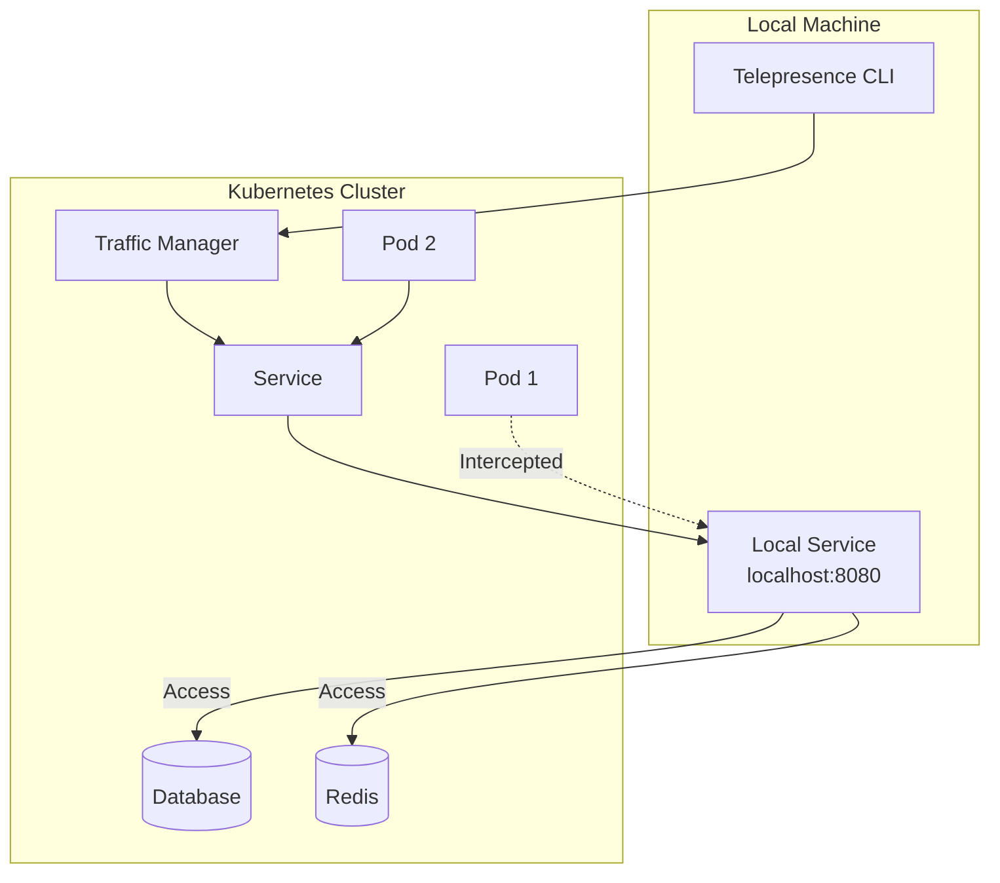

# How to Debug Locally with Telepresence in Kubernetes

Author: [nawazdhandala](https://www.github.com/nawazdhandala)

Tags: Kubernetes, Telepresence, Debugging, Development, Local Development, DevOps

Description: Learn how to use Telepresence to connect your local development environment to a remote Kubernetes cluster for seamless debugging and testing.

---

Telepresence allows you to run a service locally while connecting it to a remote Kubernetes cluster. This guide covers setting up Telepresence for efficient debugging and development workflows.

## Telepresence Overview



| Feature | Description |
|---------|-------------|
| Intercept Traffic | Route cluster traffic to local service |
| Cluster Access | Connect to in-cluster services |
| Fast Iteration | No image builds needed |
| Preview URLs | Share intercepted services |
| Personal Intercepts | Per-developer filtering |

## Installation

### Install Telepresence CLI

```bash
# macOS
brew install telepresence

# Linux
curl -fL https://app.getambassador.io/download/tel2/linux/amd64/latest/telepresence -o telepresence
chmod +x telepresence
sudo mv telepresence /usr/local/bin/

# Windows
choco install telepresence
```

### Install Traffic Manager

```bash
# Connect to cluster (installs traffic manager automatically)
telepresence connect

# Or install manually
telepresence helm install

# Verify connection
telepresence status
```

## Basic Commands

```bash
# Connect to cluster
telepresence connect

# List available services
telepresence list

# Intercept a service
telepresence intercept <service-name> --port <local-port>:<remote-port>

# Leave intercept
telepresence leave <service-name>

# Disconnect from cluster
telepresence quit
```

## Connecting to Cluster

### Simple Connection

```bash
# Connect to cluster
telepresence connect

# Verify connection
telepresence status

# Output:
# Root Daemon: Running
#   Version: v2.x.x
# User Daemon: Running
#   Version: v2.x.x
# Connected to context: my-cluster
```

### Access Cluster Services

```bash
# After connecting, you can access cluster services directly
curl http://backend-service.default.svc.cluster.local:8080/api/health

# Access database
psql -h postgres-service.default.svc.cluster.local -U myuser -d mydb

# Access Redis
redis-cli -h redis-service.default.svc.cluster.local
```

### DNS Resolution

```bash
# Verify DNS works
nslookup backend-service.default.svc.cluster.local

# Ping service
ping backend-service.default.svc.cluster.local
```

## Intercepting Services

### Basic Intercept

```bash
# Intercept all traffic to a service
telepresence intercept api-service --port 8080:8080

# Your local service on port 8080 now receives all traffic
# meant for api-service in the cluster
```

### Intercept with Environment Variables

```bash
# Capture environment variables from the pod
telepresence intercept api-service --port 8080:8080 --env-file api.env

# Source the environment
source api.env

# Run your local service
python app.py
```

### Running with Docker

```bash
# Run Docker container with intercept
telepresence intercept api-service --port 8080:8080 --docker-run \
  -- -v $(pwd):/app -e DEBUG=true myapp:dev
```

## Personal Intercepts (Headers)

```bash
# Intercept only requests with specific header
telepresence intercept api-service \
  --port 8080:8080 \
  --http-header "x-telepresence-id=dev-john"

# Now only requests with this header go to your local service
# Other traffic continues to the cluster service
```

### Header Configuration

```yaml
# intercept-spec.yaml
apiVersion: getambassador.io/v1alpha1
kind: InterceptSpecification
metadata:
  name: personal-intercept
spec:
  workload: api-service
  namespace: default
  localPort: 8080
  remotePort: 8080
  headers:
    x-telepresence-id: dev-john
    x-feature-flag: experimental
```

```bash
# Apply intercept specification
telepresence intercept --specification intercept-spec.yaml
```

## Development Workflows

### Python Flask Development

```bash
# 1. Connect to cluster
telepresence connect

# 2. Start intercept with env vars
telepresence intercept api-service --port 5000:8080 --env-file api.env

# 3. Source environment
source api.env

# 4. Run Flask locally with hot reload
export FLASK_ENV=development
export FLASK_DEBUG=1
flask run --host=0.0.0.0 --port=5000
```

### Node.js Development

```bash
# 1. Connect and intercept
telepresence connect
telepresence intercept frontend-service --port 3000:80 --env-file frontend.env

# 2. Load environment
export $(cat frontend.env | xargs)

# 3. Run with nodemon
npm run dev
```

### Go Development

```bash
# 1. Connect and intercept
telepresence connect
telepresence intercept backend-service --port 8080:8080 --env-file backend.env

# 2. Source environment
source backend.env

# 3. Run with air (hot reload)
air
```

## Volume Mounts

### Mounting Cluster Volumes

```bash
# Mount volumes from the pod to local directory
telepresence intercept api-service \
  --port 8080:8080 \
  --mount /tmp/telepresence

# Volumes are available at /tmp/telepresence
ls /tmp/telepresence/var/run/secrets/kubernetes.io/serviceaccount/
```

### Specific Volume Mount

```bash
# Mount specific path
telepresence intercept api-service \
  --port 8080:8080 \
  --mount /tmp/telepresence \
  --docker-run -- \
    -v /tmp/telepresence/etc/config:/etc/config:ro \
    myapp:dev
```

## Preview URLs

### Creating Preview URL

```bash
# Login to Ambassador Cloud
telepresence login

# Create intercept with preview URL
telepresence intercept api-service \
  --port 8080:8080 \
  --preview-url=true

# Output:
#    Intercept name    : api-service
#    State             : ACTIVE
#    Workload kind     : Deployment
#    Preview URL       : https://abc123.preview.edgestack.me
```

### Share Preview URL

```bash
# Preview URL can be shared with team members
# They can test your local changes without deployment
```

## Configuration

### Telepresence Config File

```yaml
# ~/.config/telepresence/config.yml
timeouts:
  agentInstall: 2m
  apply: 1m
  clusterConnect: 30s
  intercept: 30s
  proxyDial: 30s
  trafficManagerConnect: 60s
  trafficManagerAPI: 15s

logLevels:
  userDaemon: info
  rootDaemon: info

images:
  registry: docker.io/datawire
  agentImage: tel2:2.x.x

cloud:
  skipLogin: false

grpc:
  maxReceiveSize: 10Mi

intercept:
  defaultPort: 8080
  
telepresenceAPI:
  port: 9980
```

### Namespace-Specific Settings

```yaml
# ~/.config/telepresence/config.yml
intercept:
  defaultPort: 8080

# Namespace-specific configurations
namespaces:
  development:
    env:
      DATABASE_HOST: localhost
      REDIS_HOST: localhost
  staging:
    env:
      DEBUG: "true"
```

## Integration with IDEs

### VS Code Configuration

```json
// .vscode/launch.json
{
  "version": "0.2.0",
  "configurations": [
    {
      "name": "Python: Telepresence",
      "type": "python",
      "request": "launch",
      "program": "${workspaceFolder}/app.py",
      "envFile": "${workspaceFolder}/api.env",
      "console": "integratedTerminal",
      "preLaunchTask": "telepresence-intercept"
    }
  ]
}
```

```json
// .vscode/tasks.json
{
  "version": "2.0.0",
  "tasks": [
    {
      "label": "telepresence-intercept",
      "type": "shell",
      "command": "telepresence intercept api-service --port 8080:8080 --env-file api.env",
      "isBackground": true,
      "problemMatcher": []
    },
    {
      "label": "telepresence-leave",
      "type": "shell",
      "command": "telepresence leave api-service"
    }
  ]
}
```

### IntelliJ Configuration

```xml
<!-- .idea/runConfigurations/Telepresence.xml -->
<component name="ProjectRunConfigurationManager">
  <configuration name="Telepresence Debug" type="PythonConfigurationType">
    <envs>
      <env name="DATABASE_URL" value="$DATABASE_URL$" />
    </envs>
    <EXTENSION ID="PythonCoverageRunConfigurationExtension" runner="coverage.py"/>
    <option name="SCRIPT_NAME" value="$PROJECT_DIR$/app.py"/>
    <option name="ENV_FILES" value="$PROJECT_DIR$/api.env"/>
  </configuration>
</component>
```

## Multi-Service Development

### Intercepting Multiple Services

```bash
# Terminal 1: Intercept frontend
telepresence intercept frontend-service \
  --port 3000:80 \
  --env-file frontend.env

# Terminal 2: Intercept backend
telepresence intercept backend-service \
  --port 8080:8080 \
  --env-file backend.env

# Now both services run locally and can communicate
```

### Development Script

```bash
#!/bin/bash
# dev-setup.sh

set -e

# Connect to cluster
telepresence connect

# Start intercepts
echo "Setting up intercepts..."
telepresence intercept api-service --port 8080:8080 --env-file api.env &
telepresence intercept worker-service --port 8081:8080 --env-file worker.env &

wait

echo "Intercepts ready!"
echo "API: http://localhost:8080"
echo "Worker: http://localhost:8081"

# Cleanup on exit
trap 'telepresence leave api-service; telepresence leave worker-service; telepresence quit' EXIT

# Keep script running
read -p "Press Enter to stop..."
```

## Docker Compose Integration

```yaml
# docker-compose.telepresence.yml
version: '3.8'

services:
  api:
    build:
      context: ./api
      dockerfile: Dockerfile.dev
    volumes:
      - ./api:/app
    ports:
      - "8080:8080"
    env_file:
      - api.env
    # Uses cluster services via Telepresence connection
    network_mode: host

  frontend:
    build:
      context: ./frontend
      dockerfile: Dockerfile.dev
    volumes:
      - ./frontend:/app
    ports:
      - "3000:3000"
    env_file:
      - frontend.env
    network_mode: host
```

```bash
# Start development with Telepresence
telepresence connect
telepresence intercept api-service --port 8080:8080 --env-file api.env
telepresence intercept frontend-service --port 3000:80 --env-file frontend.env

docker-compose -f docker-compose.telepresence.yml up
```

## Troubleshooting

### Common Issues

```bash
# Check connection status
telepresence status

# View logs
telepresence gather-logs

# Reset connection
telepresence quit
telepresence uninstall --everything
telepresence connect

# Check traffic manager
kubectl get pods -n ambassador

# Verify intercept agent
kubectl get pods -n default -l app=api-service -o yaml | grep -A5 containers
```

### Network Issues

```bash
# Check if DNS is working
telepresence connect
nslookup kubernetes.default.svc.cluster.local

# Check if services are accessible
curl -v http://service-name.namespace.svc.cluster.local:8080

# Reset networking
telepresence quit
sudo killall telepresence
telepresence connect
```

## Conclusion

Telepresence transforms Kubernetes development by:

1. **Eliminating build-deploy cycles** - Code locally, run against cluster
2. **Accessing cluster resources** - Databases, caches, other services
3. **Personal intercepts** - No conflicts with team members
4. **Preview URLs** - Share work without deploying
5. **Environment parity** - Same env vars and configs as production

For monitoring your applications during development, check out [OneUptime's local debugging tools](https://oneuptime.com/product/metrics).

## Related Resources

- [How to Use Skaffold for Development Workflow](https://oneuptime.com/blog/post/2026-01-19-kubernetes-skaffold-development-workflow/view)
- [How to Implement Sidecar Patterns](https://oneuptime.com/blog/post/2026-01-19-kubernetes-sidecar-ambassador-patterns/view)
- [How to Set Up Distributed Tracing with Jaeger](https://oneuptime.com/blog/post/2026-01-19-kubernetes-jaeger-distributed-tracing/view)
