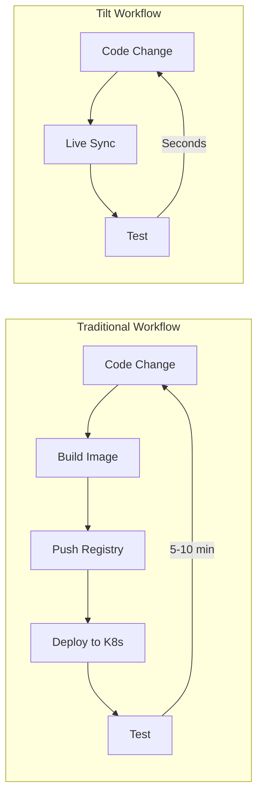

# How to Set Up a Local Kubernetes Development Environment with Tilt

Author: [nawazdhandala](https://www.github.com/nawazdhandala)

Tags: Kubernetes, Tilt, Local Development, Developer Experience, DevOps, Hot Reload

Description: Learn how to use Tilt for rapid Kubernetes development with live updates, automatic rebuilds, and instant feedback loops for your containerized applications.

---

Tilt supercharges your local Kubernetes development by providing live updates, automatic rebuilds, and a unified dashboard. Say goodbye to slow build-push-deploy cycles and hello to instant feedback.

## Why Tilt?



| Feature | Without Tilt | With Tilt |
|---------|--------------|-----------|
| Build time | Minutes | Seconds |
| Feedback loop | 5-10 min | Instant |
| Debug visibility | Limited | Full dashboard |
| Multi-service | Manual coordination | Automatic |

## Installation

### Install Tilt

```bash
# macOS
brew install tilt-dev/tap/tilt

# Linux
curl -fsSL https://raw.githubusercontent.com/tilt-dev/tilt/master/scripts/install.sh | bash

# Windows (PowerShell)
iex ((new-object net.webclient).DownloadString('https://raw.githubusercontent.com/tilt-dev/tilt/master/scripts/install.ps1'))

# Verify installation
tilt version
```

### Prerequisites

```bash
# Local Kubernetes cluster (choose one)
# Kind
kind create cluster --name dev

# Minikube
minikube start

# Docker Desktop Kubernetes
# Enable in Docker Desktop settings

# k3d
k3d cluster create dev
```

## Basic Tiltfile

### Simple Node.js Application

```python
# Tiltfile
# Build Docker image
docker_build('myapp', '.')

# Deploy Kubernetes manifests
k8s_yaml('kubernetes/deployment.yaml')

# Port forward for local access
k8s_resource('myapp', port_forwards='3000:3000')
```

### Project Structure

```
myapp/
├── Tiltfile
├── Dockerfile
├── package.json
├── src/
│   └── index.js
└── kubernetes/
    ├── deployment.yaml
    └── service.yaml
```

### Kubernetes Manifests

```yaml
# kubernetes/deployment.yaml
apiVersion: apps/v1
kind: Deployment
metadata:
  name: myapp
spec:
  replicas: 1
  selector:
    matchLabels:
      app: myapp
  template:
    metadata:
      labels:
        app: myapp
    spec:
      containers:
        - name: myapp
          image: myapp
          ports:
            - containerPort: 3000
---
apiVersion: v1
kind: Service
metadata:
  name: myapp
spec:
  ports:
    - port: 3000
  selector:
    app: myapp
```

## Live Update (Hot Reload)

### Node.js with Nodemon

```python
# Tiltfile with live_update
docker_build(
    'myapp',
    '.',
    live_update=[
        # Sync source code to container
        sync('./src', '/app/src'),
        sync('./package.json', '/app/package.json'),
        
        # Run npm install when package.json changes
        run('npm install', trigger=['./package.json']),
        
        # Nodemon auto-restarts on file changes
    ]
)

k8s_yaml('kubernetes/')
k8s_resource('myapp', port_forwards='3000:3000')
```

### Python Flask with Hot Reload

```python
# Tiltfile
docker_build(
    'flask-app',
    '.',
    live_update=[
        sync('./app', '/app/app'),
        sync('./requirements.txt', '/app/requirements.txt'),
        run('pip install -r requirements.txt', trigger=['./requirements.txt']),
    ]
)

k8s_yaml('k8s/')
k8s_resource('flask-app', port_forwards='5000:5000')
```

```dockerfile
# Dockerfile
FROM python:3.11-slim

WORKDIR /app

COPY requirements.txt .
RUN pip install -r requirements.txt

COPY app/ ./app/

# Flask debug mode for auto-reload
ENV FLASK_DEBUG=1
CMD ["flask", "run", "--host=0.0.0.0"]
```

### Go with Air

```python
# Tiltfile
docker_build(
    'go-app',
    '.',
    live_update=[
        sync('./cmd', '/app/cmd'),
        sync('./internal', '/app/internal'),
        sync('./go.mod', '/app/go.mod'),
        sync('./go.sum', '/app/go.sum'),
        run('go mod download', trigger=['./go.mod', './go.sum']),
    ]
)

k8s_yaml('k8s/')
k8s_resource('go-app', port_forwards='8080:8080')
```

```dockerfile
# Dockerfile
FROM golang:1.21-alpine

# Install air for hot reload
RUN go install github.com/cosmtrek/air@latest

WORKDIR /app

COPY go.mod go.sum ./
RUN go mod download

COPY . .

# Air watches for changes and rebuilds
CMD ["air"]
```

## Multi-Service Development

### Microservices Tiltfile

```python
# Tiltfile for microservices

# --- Frontend ---
docker_build(
    'frontend',
    './frontend',
    live_update=[
        sync('./frontend/src', '/app/src'),
        sync('./frontend/public', '/app/public'),
    ]
)

# --- API Gateway ---
docker_build(
    'api-gateway',
    './api-gateway',
    live_update=[
        sync('./api-gateway/src', '/app/src'),
    ]
)

# --- User Service ---
docker_build(
    'user-service',
    './services/user',
    live_update=[
        sync('./services/user/src', '/app/src'),
    ]
)

# --- Order Service ---
docker_build(
    'order-service',
    './services/order',
    live_update=[
        sync('./services/order/src', '/app/src'),
    ]
)

# Deploy all services
k8s_yaml([
    'k8s/frontend.yaml',
    'k8s/api-gateway.yaml',
    'k8s/user-service.yaml',
    'k8s/order-service.yaml',
    'k8s/postgres.yaml',
    'k8s/redis.yaml',
])

# Configure resources
k8s_resource('frontend', port_forwards='3000:3000', labels=['frontend'])
k8s_resource('api-gateway', port_forwards='8080:8080', labels=['backend'])
k8s_resource('user-service', labels=['backend'])
k8s_resource('order-service', labels=['backend'])
k8s_resource('postgres', labels=['database'])
k8s_resource('redis', labels=['cache'])
```

### Resource Dependencies

```python
# Tiltfile with dependencies
k8s_yaml('k8s/')

# Database must be ready before services
k8s_resource('postgres', labels=['database'])

# Services depend on database
k8s_resource(
    'user-service',
    resource_deps=['postgres'],
    labels=['backend']
)

k8s_resource(
    'order-service',
    resource_deps=['postgres', 'redis'],
    labels=['backend']
)

# Frontend depends on API
k8s_resource(
    'frontend',
    resource_deps=['api-gateway'],
    port_forwards='3000:3000',
    labels=['frontend']
)
```

## Helm Integration

### Deploying Helm Charts

```python
# Tiltfile with Helm
# Load Helm extension
load('ext://helm_resource', 'helm_resource', 'helm_repo')

# Add Helm repositories
helm_repo('bitnami', 'https://charts.bitnami.com/bitnami')

# Deploy PostgreSQL from Helm
helm_resource(
    'postgres',
    'bitnami/postgresql',
    flags=['--set=auth.postgresPassword=devpassword'],
    labels=['database']
)

# Deploy your app
docker_build('myapp', '.')
k8s_yaml('k8s/')

k8s_resource(
    'myapp',
    resource_deps=['postgres'],
    port_forwards='8080:8080'
)
```

### Local Helm Charts

```python
# Tiltfile
# Deploy local Helm chart with values
k8s_yaml(helm(
    './charts/myapp',
    name='myapp',
    namespace='default',
    values=['./charts/myapp/values-dev.yaml'],
    set=[
        'image.repository=myapp',
        'image.tag=dev',
        'replicaCount=1',
    ]
))

docker_build('myapp', '.')
k8s_resource('myapp', port_forwards='8080:8080')
```

## Kustomize Integration

```python
# Tiltfile with Kustomize
k8s_yaml(kustomize('./k8s/overlays/dev'))

docker_build('myapp', '.')
k8s_resource('myapp', port_forwards='8080:8080')
```

## Custom Build Commands

### Using Custom Builders

```python
# Tiltfile with custom build
# For languages that need special build steps

custom_build(
    'myapp',
    # Build command
    'docker build -t $EXPECTED_REF .',
    # Files to watch
    deps=['./src', './Cargo.toml'],
    # Live update still works
    live_update=[
        sync('./src', '/app/src'),
    ]
)
```

### Skaffold-style Builds

```python
# Tiltfile with Buildkit
docker_build(
    'myapp',
    '.',
    dockerfile='Dockerfile',
    build_args={'NODE_ENV': 'development'},
    target='development',  # Multi-stage target
    extra_tag='myregistry/myapp:dev',
    network='host',
)
```

## Testing Integration

### Run Tests on Change

```python
# Tiltfile with tests
docker_build('myapp', '.', live_update=[
    sync('./src', '/app/src'),
    sync('./test', '/app/test'),
])

k8s_yaml('k8s/')

# Local resource for tests
local_resource(
    'unit-tests',
    cmd='npm test',
    deps=['./src', './test'],
    labels=['tests'],
    auto_init=False,  # Don't run on startup
)

# Integration tests in cluster
local_resource(
    'integration-tests',
    cmd='kubectl exec deploy/myapp -- npm run test:integration',
    resource_deps=['myapp'],
    labels=['tests'],
    auto_init=False,
)
```

### Test Buttons

```python
# Tiltfile
k8s_resource(
    'myapp',
    port_forwards='8080:8080',
    trigger_mode=TRIGGER_MODE_MANUAL,  # Manual trigger for expensive rebuilds
)

# Button to run tests
local_resource(
    'run-tests',
    cmd='./scripts/run-tests.sh',
    labels=['tests'],
    auto_init=False,
)
```

## Debugging

### Enable Debugging

```python
# Tiltfile with debug ports
docker_build('myapp', '.', target='debug')

k8s_yaml('k8s/')
k8s_resource(
    'myapp',
    port_forwards=[
        '8080:8080',  # Application
        '9229:9229',  # Node.js debugger
    ]
)
```

### Debug Dockerfile

```dockerfile
# Dockerfile with debug target
FROM node:20-alpine AS base
WORKDIR /app
COPY package*.json ./
RUN npm install

FROM base AS development
COPY . .
CMD ["npm", "run", "dev"]

FROM base AS debug
COPY . .
# Start with debugger
CMD ["node", "--inspect=0.0.0.0:9229", "src/index.js"]

FROM base AS production
COPY . .
RUN npm prune --production
CMD ["node", "src/index.js"]
```

## Resource Management

### Custom Resource Labels

```python
# Tiltfile with organized resources
config.define_string_list('services', args=True)
cfg = config.parse()

# Only enable selected services
enabled_services = cfg.get('services', ['all'])

if 'all' in enabled_services or 'frontend' in enabled_services:
    docker_build('frontend', './frontend')
    k8s_yaml('k8s/frontend.yaml')
    k8s_resource('frontend', labels=['tier-frontend'])

if 'all' in enabled_services or 'backend' in enabled_services:
    docker_build('backend', './backend')
    k8s_yaml('k8s/backend.yaml')
    k8s_resource('backend', labels=['tier-backend'])
```

### Run with Filters

```bash
# Start only specific services
tilt up -- --services=frontend

# Start multiple services
tilt up -- --services=frontend --services=backend
```

## Environment Configuration

### Multiple Environments

```python
# Tiltfile
# Read environment from config
config.define_string('env', args=True)
cfg = config.parse()
env = cfg.get('env', 'local')

# Load environment-specific settings
if env == 'local':
    k8s_yaml(kustomize('./k8s/overlays/local'))
    allow_k8s_contexts('docker-desktop')
elif env == 'dev':
    k8s_yaml(kustomize('./k8s/overlays/dev'))
    allow_k8s_contexts('dev-cluster')

docker_build('myapp', '.')
k8s_resource('myapp', port_forwards='8080:8080')
```

### Secrets and ConfigMaps

```python
# Tiltfile with secrets
# Create secret from local file (for development only!)
k8s_yaml(secret_from_env(
    'myapp-secrets',
    namespace='default',
    env=['DB_PASSWORD', 'API_KEY']
))

# Or from files
k8s_yaml(secret_from_files(
    'tls-secret',
    namespace='default',
    files={
        'tls.crt': './certs/dev.crt',
        'tls.key': './certs/dev.key',
    }
))
```

## Tilt Extensions

### Loading Extensions

```python
# Tiltfile
# Helm extension
load('ext://helm_resource', 'helm_resource')

# Restart extension (for when live update isn't enough)
load('ext://restart_process', 'docker_build_with_restart')

# Namespace extension
load('ext://namespace', 'namespace_create', 'namespace_inject')

# Git resource (deploy from git repo)
load('ext://git_resource', 'git_resource')
```

### Useful Extensions

```python
# Tiltfile with multiple extensions

# Create namespace if not exists
load('ext://namespace', 'namespace_create')
namespace_create('development')

# Build with auto-restart
load('ext://restart_process', 'docker_build_with_restart')
docker_build_with_restart(
    'myapp',
    '.',
    entrypoint='/app/start.sh',
    live_update=[sync('./src', '/app/src')]
)

# Cancel outstanding builds on Ctrl+C
load('ext://cancel', 'cancel')
```

## Running Tilt

### Basic Commands

```bash
# Start Tilt
tilt up

# Start in background
tilt up -d

# View dashboard
tilt up --web-mode=local

# Stop Tilt
tilt down

# Check status
tilt status

# View logs
tilt logs

# Trigger manual rebuild
tilt trigger myapp
```

### CI Mode

```bash
# Run Tilt in CI (no interactive mode)
tilt ci

# With timeout
tilt ci --timeout=10m

# Only build (don't deploy)
tilt docker-build myapp
```

## Best Practices

### 1. Optimize Build Context

```python
# Use .dockerignore effectively
# .dockerignore
node_modules
.git
*.md
test/
```

### 2. Use Build Caching

```dockerfile
# Dockerfile optimized for caching
FROM node:20-alpine

WORKDIR /app

# Copy package files first (rarely change)
COPY package*.json ./
RUN npm ci

# Copy source (frequently changes)
COPY . .

CMD ["npm", "start"]
```

### 3. Minimal Live Update

```python
# Only sync what changes frequently
live_update=[
    sync('./src', '/app/src'),
    # Don't sync node_modules, package.json, etc.
]
```

## Summary

| Feature | Benefit |
|---------|---------|
| Live Update | Instant feedback |
| Multi-service | Single dashboard |
| Helm/Kustomize | Native integration |
| Extensions | Extensible workflow |
| CI Mode | Pipeline integration |

## Related Posts

- [How to Set Up Ephemeral Preview Environments in Kubernetes](https://oneuptime.com/blog/post/2026-01-19-kubernetes-ephemeral-preview-environments/view) - Preview environments
- [How to Test Kubernetes Manifests with Conftest and OPA](https://oneuptime.com/blog/post/2026-01-19-kubernetes-conftest-opa-testing/view) - Policy testing
- [How to Build Multi-Stage Docker Images for Python](https://oneuptime.com/blog/post/2025-01-06-python-docker-multi-stage/view) - Docker optimization
