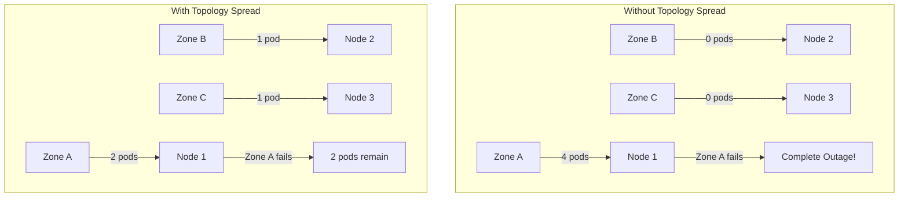

# How to Set Up Kubernetes Topology Spread Constraints

Author: [nawazdhandala](https://www.github.com/nawazdhandala)

Tags: Kubernetes, Topology Spread, High Availability, Scheduling, Multi-Zone, DevOps

Description: Learn how to use Kubernetes Topology Spread Constraints to distribute pods evenly across nodes, zones, and regions for improved availability and resilience.

---

Topology Spread Constraints ensure your pods are distributed evenly across failure domains—nodes, zones, or regions. This prevents all replicas from landing on the same node or zone, improving availability during failures.

## Why Topology Spread?



| Scenario | Without Spread | With Spread |
|----------|----------------|-------------|
| Zone failure | Total outage | Partial availability |
| Node failure | May lose all pods | Lose only 1-2 pods |
| Maintenance | Risk of downtime | Safe rolling drains |

## Basic Topology Spread

### Spread Across Nodes

```yaml
# node-spread.yaml
apiVersion: apps/v1
kind: Deployment
metadata:
  name: web-app
spec:
  replicas: 6
  selector:
    matchLabels:
      app: web-app
  template:
    metadata:
      labels:
        app: web-app
    spec:
      topologySpreadConstraints:
        - maxSkew: 1
          topologyKey: kubernetes.io/hostname
          whenUnsatisfiable: DoNotSchedule
          labelSelector:
            matchLabels:
              app: web-app
      containers:
        - name: app
          image: nginx:1.25
```

### Spread Across Zones

```yaml
# zone-spread.yaml
apiVersion: apps/v1
kind: Deployment
metadata:
  name: api-service
spec:
  replicas: 4
  selector:
    matchLabels:
      app: api-service
  template:
    metadata:
      labels:
        app: api-service
    spec:
      topologySpreadConstraints:
        - maxSkew: 1
          topologyKey: topology.kubernetes.io/zone
          whenUnsatisfiable: DoNotSchedule
          labelSelector:
            matchLabels:
              app: api-service
      containers:
        - name: api
          image: myregistry/api:v1.0.0
```

### Spread Across Regions

```yaml
# region-spread.yaml
apiVersion: apps/v1
kind: Deployment
metadata:
  name: global-service
spec:
  replicas: 6
  selector:
    matchLabels:
      app: global-service
  template:
    metadata:
      labels:
        app: global-service
    spec:
      topologySpreadConstraints:
        - maxSkew: 1
          topologyKey: topology.kubernetes.io/region
          whenUnsatisfiable: DoNotSchedule
          labelSelector:
            matchLabels:
              app: global-service
      containers:
        - name: app
          image: myregistry/global-app:v1.0.0
```

## Understanding Parameters

### maxSkew

```yaml
# maxSkew determines the maximum allowed difference in pod counts
# between topology domains

# maxSkew: 1 - Pods must be evenly spread (max 1 difference)
# Example with 4 pods across 3 zones: 2-1-1 is OK, 3-1-0 is NOT OK

topologySpreadConstraints:
  - maxSkew: 1
    topologyKey: topology.kubernetes.io/zone
    whenUnsatisfiable: DoNotSchedule
    labelSelector:
      matchLabels:
        app: myapp

# maxSkew: 2 - Allow up to 2 difference
# Example with 6 pods: 4-2-0 is OK, 5-1-0 is NOT OK
```

### whenUnsatisfiable

```yaml
# DoNotSchedule - Hard requirement (pod won't schedule if constraint can't be met)
topologySpreadConstraints:
  - maxSkew: 1
    topologyKey: topology.kubernetes.io/zone
    whenUnsatisfiable: DoNotSchedule
    labelSelector:
      matchLabels:
        app: myapp

# ScheduleAnyway - Soft requirement (scheduler will try but won't block)
topologySpreadConstraints:
  - maxSkew: 1
    topologyKey: topology.kubernetes.io/zone
    whenUnsatisfiable: ScheduleAnyway
    labelSelector:
      matchLabels:
        app: myapp
```

### minDomains (Kubernetes 1.25+)

```yaml
# Require minimum number of domains
topologySpreadConstraints:
  - maxSkew: 1
    topologyKey: topology.kubernetes.io/zone
    whenUnsatisfiable: DoNotSchedule
    minDomains: 3  # Require at least 3 zones
    labelSelector:
      matchLabels:
        app: myapp
```

### nodeAffinityPolicy and nodeTaintsPolicy (Kubernetes 1.26+)

```yaml
# Control how node affinity/taints affect topology spread
topologySpreadConstraints:
  - maxSkew: 1
    topologyKey: topology.kubernetes.io/zone
    whenUnsatisfiable: DoNotSchedule
    # Honor: Consider nodes matching affinity rules (default)
    # Ignore: Consider all nodes regardless of affinity
    nodeAffinityPolicy: Honor
    # Honor: Exclude nodes with taints (default)
    # Ignore: Include nodes with taints
    nodeTaintsPolicy: Honor
    labelSelector:
      matchLabels:
        app: myapp
```

## Multiple Constraints

### Zone and Node Spread

```yaml
# multi-constraint-spread.yaml
apiVersion: apps/v1
kind: Deployment
metadata:
  name: critical-app
spec:
  replicas: 6
  selector:
    matchLabels:
      app: critical-app
  template:
    metadata:
      labels:
        app: critical-app
    spec:
      topologySpreadConstraints:
        # First: Spread across zones (hard requirement)
        - maxSkew: 1
          topologyKey: topology.kubernetes.io/zone
          whenUnsatisfiable: DoNotSchedule
          labelSelector:
            matchLabels:
              app: critical-app
        
        # Second: Spread across nodes within each zone (soft)
        - maxSkew: 1
          topologyKey: kubernetes.io/hostname
          whenUnsatisfiable: ScheduleAnyway
          labelSelector:
            matchLabels:
              app: critical-app
      
      containers:
        - name: app
          image: myregistry/critical-app:v1.0.0
```

### Hard and Soft Constraints

```yaml
# mixed-constraints.yaml
apiVersion: apps/v1
kind: Deployment
metadata:
  name: balanced-app
spec:
  replicas: 8
  selector:
    matchLabels:
      app: balanced-app
  template:
    metadata:
      labels:
        app: balanced-app
    spec:
      topologySpreadConstraints:
        # Hard: Must have at least 1 pod per zone
        - maxSkew: 2
          topologyKey: topology.kubernetes.io/zone
          whenUnsatisfiable: DoNotSchedule
          labelSelector:
            matchLabels:
              app: balanced-app
        
        # Soft: Try to spread across nodes
        - maxSkew: 1
          topologyKey: kubernetes.io/hostname
          whenUnsatisfiable: ScheduleAnyway
          labelSelector:
            matchLabels:
              app: balanced-app
        
        # Soft: Try to spread across racks (custom label)
        - maxSkew: 2
          topologyKey: rack
          whenUnsatisfiable: ScheduleAnyway
          labelSelector:
            matchLabels:
              app: balanced-app
      
      containers:
        - name: app
          image: myregistry/balanced-app:v1.0.0
```

## Common Patterns

### StatefulSet with Zone Spread

```yaml
# statefulset-zone-spread.yaml
apiVersion: apps/v1
kind: StatefulSet
metadata:
  name: database
spec:
  serviceName: database
  replicas: 3
  selector:
    matchLabels:
      app: database
  template:
    metadata:
      labels:
        app: database
    spec:
      topologySpreadConstraints:
        - maxSkew: 1
          topologyKey: topology.kubernetes.io/zone
          whenUnsatisfiable: DoNotSchedule
          labelSelector:
            matchLabels:
              app: database
      containers:
        - name: db
          image: postgres:15
          volumeMounts:
            - name: data
              mountPath: /var/lib/postgresql/data
  volumeClaimTemplates:
    - metadata:
        name: data
      spec:
        accessModes: ["ReadWriteOnce"]
        storageClassName: zone-aware-storage
        resources:
          requests:
            storage: 100Gi
```

### DaemonSet-like Behavior

```yaml
# spread-one-per-node.yaml
apiVersion: apps/v1
kind: Deployment
metadata:
  name: one-per-node
spec:
  # Set replicas equal to node count for one pod per node
  replicas: 3
  selector:
    matchLabels:
      app: one-per-node
  template:
    metadata:
      labels:
        app: one-per-node
    spec:
      topologySpreadConstraints:
        - maxSkew: 1
          topologyKey: kubernetes.io/hostname
          whenUnsatisfiable: DoNotSchedule
          labelSelector:
            matchLabels:
              app: one-per-node
      
      # Anti-affinity as backup
      affinity:
        podAntiAffinity:
          requiredDuringSchedulingIgnoredDuringExecution:
            - labelSelector:
                matchLabels:
                  app: one-per-node
              topologyKey: kubernetes.io/hostname
      
      containers:
        - name: app
          image: myregistry/one-per-node:v1.0.0
```

### Kafka Brokers

```yaml
# kafka-spread.yaml
apiVersion: apps/v1
kind: StatefulSet
metadata:
  name: kafka
  namespace: messaging
spec:
  serviceName: kafka-headless
  replicas: 6
  selector:
    matchLabels:
      app: kafka
  template:
    metadata:
      labels:
        app: kafka
    spec:
      topologySpreadConstraints:
        # Spread evenly across zones
        - maxSkew: 1
          topologyKey: topology.kubernetes.io/zone
          whenUnsatisfiable: DoNotSchedule
          labelSelector:
            matchLabels:
              app: kafka
        
        # Spread across nodes within zones
        - maxSkew: 1
          topologyKey: kubernetes.io/hostname
          whenUnsatisfiable: ScheduleAnyway
          labelSelector:
            matchLabels:
              app: kafka
      
      containers:
        - name: kafka
          image: confluentinc/cp-kafka:7.5.0
```

### Elasticsearch Cluster

```yaml
# elasticsearch-spread.yaml
apiVersion: apps/v1
kind: StatefulSet
metadata:
  name: elasticsearch-data
  namespace: logging
spec:
  serviceName: elasticsearch-data
  replicas: 6
  selector:
    matchLabels:
      app: elasticsearch
      role: data
  template:
    metadata:
      labels:
        app: elasticsearch
        role: data
    spec:
      topologySpreadConstraints:
        # Data nodes spread across zones
        - maxSkew: 1
          topologyKey: topology.kubernetes.io/zone
          whenUnsatisfiable: DoNotSchedule
          labelSelector:
            matchLabels:
              app: elasticsearch
              role: data
        
        # And across nodes
        - maxSkew: 1
          topologyKey: kubernetes.io/hostname
          whenUnsatisfiable: ScheduleAnyway
          labelSelector:
            matchLabels:
              app: elasticsearch
              role: data
      
      containers:
        - name: elasticsearch
          image: elasticsearch:8.11.0
```

## Combining with Affinity

### Topology Spread with Node Affinity

```yaml
# spread-with-affinity.yaml
apiVersion: apps/v1
kind: Deployment
metadata:
  name: gpu-app
spec:
  replicas: 4
  selector:
    matchLabels:
      app: gpu-app
  template:
    metadata:
      labels:
        app: gpu-app
    spec:
      # Only schedule on GPU nodes
      affinity:
        nodeAffinity:
          requiredDuringSchedulingIgnoredDuringExecution:
            nodeSelectorTerms:
              - matchExpressions:
                  - key: accelerator
                    operator: In
                    values:
                      - nvidia-tesla-v100
      
      # Spread across zones (within GPU nodes only)
      topologySpreadConstraints:
        - maxSkew: 1
          topologyKey: topology.kubernetes.io/zone
          whenUnsatisfiable: DoNotSchedule
          labelSelector:
            matchLabels:
              app: gpu-app
      
      containers:
        - name: gpu-app
          image: myregistry/gpu-app:v1.0.0
          resources:
            limits:
              nvidia.com/gpu: 1
```

### Topology Spread with Pod Anti-Affinity

```yaml
# spread-with-antiaffinity.yaml
apiVersion: apps/v1
kind: Deployment
metadata:
  name: ha-app
spec:
  replicas: 6
  selector:
    matchLabels:
      app: ha-app
  template:
    metadata:
      labels:
        app: ha-app
    spec:
      topologySpreadConstraints:
        - maxSkew: 1
          topologyKey: topology.kubernetes.io/zone
          whenUnsatisfiable: DoNotSchedule
          labelSelector:
            matchLabels:
              app: ha-app
      
      # Additional anti-affinity for nodes
      affinity:
        podAntiAffinity:
          preferredDuringSchedulingIgnoredDuringExecution:
            - weight: 100
              podAffinityTerm:
                labelSelector:
                  matchLabels:
                    app: ha-app
                topologyKey: kubernetes.io/hostname
      
      containers:
        - name: app
          image: myregistry/ha-app:v1.0.0
```

## Cluster-Level Defaults

### Default Topology Spread Constraints (Kubernetes 1.24+)

```yaml
# kube-scheduler-config.yaml
apiVersion: kubescheduler.config.k8s.io/v1
kind: KubeSchedulerConfiguration
profiles:
  - schedulerName: default-scheduler
    pluginConfig:
      - name: PodTopologySpread
        args:
          defaultConstraints:
            - maxSkew: 1
              topologyKey: topology.kubernetes.io/zone
              whenUnsatisfiable: ScheduleAnyway
            - maxSkew: 1
              topologyKey: kubernetes.io/hostname
              whenUnsatisfiable: ScheduleAnyway
          defaultingType: List  # or System
```

## Monitoring and Troubleshooting

### Check Pod Distribution

```bash
# View pods by zone
kubectl get pods -l app=myapp -o wide --sort-by='.spec.nodeName'

# Check distribution across zones
kubectl get pods -l app=myapp -o jsonpath='{range .items[*]}{.metadata.name}{"\t"}{.spec.nodeName}{"\n"}{end}' | \
while read pod node; do
  zone=$(kubectl get node $node -o jsonpath='{.metadata.labels.topology\.kubernetes\.io/zone}')
  echo "$pod -> $node ($zone)"
done

# Count pods per zone
kubectl get pods -l app=myapp -o json | \
jq -r '.items[].spec.nodeName' | \
while read node; do
  kubectl get node $node -o jsonpath='{.metadata.labels.topology\.kubernetes\.io/zone}'
  echo ""
done | sort | uniq -c
```

### Debug Scheduling Issues

```bash
# Check pending pods
kubectl get pods -l app=myapp --field-selector=status.phase=Pending

# Describe pending pod for scheduling events
kubectl describe pod <pending-pod-name>

# Look for topology spread events
kubectl get events --field-selector reason=FailedScheduling
```

### Prometheus Metrics

```promql
# Pods per zone
sum by (zone) (
  kube_pod_info{pod=~"myapp.*"}
  * on(node) group_left(zone)
  kube_node_labels{label_topology_kubernetes_io_zone!=""}
)

# Skew across zones
max(
  count by (zone) (kube_pod_info{pod=~"myapp.*"} * on(node) group_left(zone) kube_node_labels)
) - min(
  count by (zone) (kube_pod_info{pod=~"myapp.*"} * on(node) group_left(zone) kube_node_labels)
)
```

## Summary

| Constraint Type | Use Case | maxSkew |
|-----------------|----------|---------|
| Zone spread | HA across availability zones | 1 |
| Node spread | Distribute load | 1-2 |
| Region spread | Geo-redundancy | 1 |
| Custom topology | Rack/datacenter awareness | Varies |

## Related Posts

- [How to Configure Kubernetes Service Topology and Locality-Aware Routing](https://oneuptime.com/blog/post/2026-01-19-kubernetes-service-topology-locality/view) - Traffic locality
- [How to Set Up Pod Disruption Budgets for High Availability](https://oneuptime.com/blog/post/2026-01-19-kubernetes-pod-disruption-budgets-ha/view) - Availability during disruptions
- [How to Schedule GPU Workloads in Kubernetes](https://oneuptime.com/blog/post/2026-01-19-kubernetes-gpu-workload-scheduling/view) - GPU scheduling
