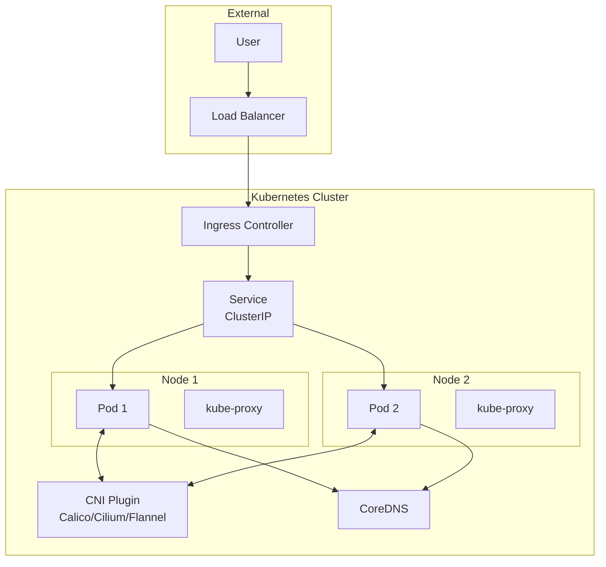

# How to Troubleshoot Kubernetes Networking Issues

Author: [nawazdhandala](https://www.github.com/nawazdhandala)

Tags: Kubernetes, Networking, Troubleshooting, DNS, CNI, DevOps

Description: A comprehensive guide to diagnosing and resolving common Kubernetes networking issues including pod connectivity, service discovery, and CNI problems.

---

Kubernetes networking issues can be challenging to debug. This guide provides systematic approaches to diagnose and resolve common networking problems including pod-to-pod communication, service connectivity, and external access issues.

## Networking Architecture



## Diagnostic Tools

### Deploy Network Debug Pod

```yaml
# netshoot-pod.yaml
apiVersion: v1
kind: Pod
metadata:
  name: netshoot
spec:
  containers:
    - name: netshoot
      image: nicolaka/netshoot:latest
      command:
        - sleep
        - "infinity"
      securityContext:
        capabilities:
          add:
            - NET_ADMIN
            - NET_RAW
---
# Apply and use
# kubectl apply -f netshoot-pod.yaml
# kubectl exec -it netshoot -- bash
```

### Essential Commands

```bash
# DNS Resolution
nslookup kubernetes.default.svc.cluster.local
dig kubernetes.default.svc.cluster.local

# Connectivity Testing
ping <pod-ip>
curl -v http://service-name:port/path
telnet service-name port
nc -zv service-name port

# Network Tracing
traceroute <destination>
mtr <destination>
tcpdump -i eth0 port 80

# IP and Route Information
ip addr show
ip route show
iptables -L -n -v
```

## Pod-to-Pod Connectivity

### Test Pod Communication

```bash
# Get pod IPs
kubectl get pods -o wide

# Test from one pod to another
kubectl exec -it pod-a -- curl http://<pod-b-ip>:8080

# Using netshoot
kubectl exec -it netshoot -- ping <pod-ip>
kubectl exec -it netshoot -- curl -v http://<pod-ip>:8080
```

### Debug CNI Issues

```bash
# Check CNI pods
kubectl get pods -n kube-system -l k8s-app=calico-node  # Calico
kubectl get pods -n kube-system -l k8s-app=cilium      # Cilium
kubectl get pods -n kube-system -l app=flannel         # Flannel

# Check CNI logs
kubectl logs -n kube-system -l k8s-app=calico-node

# Verify CNI configuration
cat /etc/cni/net.d/*.conf

# Check node routes (on node)
ip route show
route -n
```

### Verify Pod Network

```bash
# Check if pod has IP
kubectl get pod <pod-name> -o jsonpath='{.status.podIP}'

# Describe pod for network issues
kubectl describe pod <pod-name> | grep -A 10 "Events:"

# Check pod network interface
kubectl exec -it <pod-name> -- ip addr show
kubectl exec -it <pod-name> -- ip route show
```

## Service Connectivity

### Debug Service Issues

```bash
# Check service details
kubectl get svc <service-name> -o yaml
kubectl describe svc <service-name>

# Verify endpoints exist
kubectl get endpoints <service-name>
kubectl get endpointslices -l kubernetes.io/service-name=<service-name>

# Test service DNS
kubectl exec -it netshoot -- nslookup <service-name>
kubectl exec -it netshoot -- nslookup <service-name>.<namespace>.svc.cluster.local

# Test service connectivity
kubectl exec -it netshoot -- curl http://<service-name>:<port>
kubectl exec -it netshoot -- curl http://<service-name>.<namespace>.svc.cluster.local:<port>
```

### Common Service Problems

```yaml
# Problem: No endpoints
# Check selector matches pod labels
apiVersion: v1
kind: Service
metadata:
  name: my-service
spec:
  selector:
    app: my-app  # Must match pod labels exactly
  ports:
    - port: 80
      targetPort: 8080

# Debug:
# kubectl get pods -l app=my-app
# kubectl get endpoints my-service
```

### Debug kube-proxy

```bash
# Check kube-proxy pods
kubectl get pods -n kube-system -l k8s-app=kube-proxy

# Check kube-proxy logs
kubectl logs -n kube-system -l k8s-app=kube-proxy

# Check kube-proxy mode
kubectl logs -n kube-system -l k8s-app=kube-proxy | grep "Using"

# Check iptables rules (on node)
iptables -t nat -L KUBE-SERVICES -n
iptables -t nat -L KUBE-SVC-<hash> -n

# Check IPVS rules (if using IPVS mode)
ipvsadm -Ln
```

## DNS Issues

### Debug CoreDNS

```bash
# Check CoreDNS pods
kubectl get pods -n kube-system -l k8s-app=kube-dns

# Check CoreDNS logs
kubectl logs -n kube-system -l k8s-app=kube-dns

# Check CoreDNS ConfigMap
kubectl get configmap coredns -n kube-system -o yaml

# Test DNS resolution
kubectl exec -it netshoot -- nslookup kubernetes.default
kubectl exec -it netshoot -- dig @10.96.0.10 kubernetes.default.svc.cluster.local

# Check /etc/resolv.conf in pod
kubectl exec -it netshoot -- cat /etc/resolv.conf
```

### DNS Troubleshooting Pod

```yaml
# dnsutils.yaml
apiVersion: v1
kind: Pod
metadata:
  name: dnsutils
spec:
  containers:
    - name: dnsutils
      image: gcr.io/kubernetes-e2e-test-images/dnsutils:1.3
      command:
        - sleep
        - "infinity"
---
# Test DNS
# kubectl exec -it dnsutils -- nslookup kubernetes.default
# kubectl exec -it dnsutils -- nslookup <service-name>.<namespace>
```

### Common DNS Fixes

```yaml
# Fix: DNS not resolving
# Check CoreDNS is running
# kubectl rollout restart deployment coredns -n kube-system

# Fix: Custom DNS policy
apiVersion: v1
kind: Pod
metadata:
  name: custom-dns-pod
spec:
  dnsPolicy: "None"
  dnsConfig:
    nameservers:
      - 10.96.0.10      # CoreDNS
      - 8.8.8.8         # Google DNS fallback
    searches:
      - default.svc.cluster.local
      - svc.cluster.local
      - cluster.local
    options:
      - name: ndots
        value: "5"
  containers:
    - name: app
      image: myapp:latest
```

## Ingress Issues

### Debug Ingress Controller

```bash
# Check Ingress resource
kubectl get ingress <ingress-name> -o yaml
kubectl describe ingress <ingress-name>

# Check Ingress controller pods
kubectl get pods -n ingress-nginx  # NGINX
kubectl get pods -n traefik        # Traefik

# Check Ingress controller logs
kubectl logs -n ingress-nginx -l app.kubernetes.io/name=ingress-nginx

# Test backend service
kubectl exec -it netshoot -- curl http://<backend-service>:<port>
```

### Common Ingress Problems

```yaml
# Problem: 404 Not Found
# Check path matching
apiVersion: networking.k8s.io/v1
kind: Ingress
metadata:
  name: my-ingress
  annotations:
    # For NGINX, ensure correct rewrite
    nginx.ingress.kubernetes.io/rewrite-target: /$2
spec:
  ingressClassName: nginx
  rules:
    - host: example.com
      http:
        paths:
          - path: /api(/|$)(.*)  # Regex path
            pathType: ImplementationSpecific
            backend:
              service:
                name: api-service
                port:
                  number: 80
```

### Check SSL/TLS

```bash
# Check certificate
kubectl get secret <tls-secret-name> -o yaml
kubectl get certificate <cert-name>  # If using cert-manager

# Test HTTPS connection
curl -v -k https://example.com

# Check certificate details
openssl s_client -connect example.com:443 -servername example.com
```

## Network Policies

### Debug Network Policies

```bash
# List network policies
kubectl get networkpolicies -A

# Check if pod is blocked
kubectl describe networkpolicy <policy-name>

# Test connectivity with network policy
kubectl exec -it netshoot -- curl -v http://<target-pod>:8080
```

### Common Network Policy Issues

```yaml
# Problem: Pods can't communicate after adding NetworkPolicy
# Solution: Allow ingress from necessary pods

apiVersion: networking.k8s.io/v1
kind: NetworkPolicy
metadata:
  name: allow-frontend
spec:
  podSelector:
    matchLabels:
      app: backend
  policyTypes:
    - Ingress
  ingress:
    - from:
        - podSelector:
            matchLabels:
              app: frontend
        # Also allow from same namespace
        - namespaceSelector:
            matchLabels:
              name: production
      ports:
        - protocol: TCP
          port: 8080
```

### Default Deny with Exceptions

```yaml
# Default deny all ingress
apiVersion: networking.k8s.io/v1
kind: NetworkPolicy
metadata:
  name: default-deny-ingress
spec:
  podSelector: {}
  policyTypes:
    - Ingress
---
# Allow DNS
apiVersion: networking.k8s.io/v1
kind: NetworkPolicy
metadata:
  name: allow-dns
spec:
  podSelector: {}
  policyTypes:
    - Egress
  egress:
    - to:
        - namespaceSelector: {}
          podSelector:
            matchLabels:
              k8s-app: kube-dns
      ports:
        - protocol: UDP
          port: 53
        - protocol: TCP
          port: 53
```

## External Connectivity

### Debug External Access

```bash
# Test outbound connectivity from pod
kubectl exec -it netshoot -- curl -v https://google.com
kubectl exec -it netshoot -- wget -O- https://example.com

# Check NAT and masquerading (on node)
iptables -t nat -L POSTROUTING -n -v

# Check if egress is blocked
kubectl get networkpolicies -A
```

### LoadBalancer Issues

```bash
# Check LoadBalancer status
kubectl get svc <service-name> -o wide

# Check external IP assignment
kubectl describe svc <service-name> | grep -A 5 "LoadBalancer"

# Check cloud provider events
kubectl get events --field-selector involvedObject.kind=Service

# Test LoadBalancer IP
curl -v http://<external-ip>:<port>
```

### NodePort Issues

```bash
# Check NodePort
kubectl get svc <service-name> -o jsonpath='{.spec.ports[0].nodePort}'

# Test NodePort
curl -v http://<node-ip>:<node-port>

# Check firewall rules (on node)
iptables -L INPUT -n -v | grep <node-port>

# Check if port is listening
ss -tlnp | grep <node-port>
```

## Packet Capture and Analysis

### Capture Traffic

```bash
# Capture on pod interface
kubectl exec -it netshoot -- tcpdump -i eth0 -w /tmp/capture.pcap

# Capture specific traffic
kubectl exec -it netshoot -- tcpdump -i eth0 port 80 -n

# Copy capture file
kubectl cp netshoot:/tmp/capture.pcap ./capture.pcap
```

### Analyze Traffic

```bash
# Quick analysis
tcpdump -r capture.pcap -n

# Filter by host
tcpdump -r capture.pcap host 10.0.0.1

# Show HTTP requests
tcpdump -r capture.pcap -A 'tcp port 80'

# Use tshark for detailed analysis
tshark -r capture.pcap -Y "http.request"
```

## Systematic Troubleshooting Script

```bash
#!/bin/bash
# network-debug.sh

POD_NAME=$1
NAMESPACE=${2:-default}

echo "=== Pod Network Info ==="
kubectl exec -n $NAMESPACE $POD_NAME -- ip addr show
kubectl exec -n $NAMESPACE $POD_NAME -- ip route show

echo "=== DNS Resolution ==="
kubectl exec -n $NAMESPACE $POD_NAME -- cat /etc/resolv.conf
kubectl exec -n $NAMESPACE $POD_NAME -- nslookup kubernetes.default

echo "=== Service Connectivity ==="
for svc in $(kubectl get svc -n $NAMESPACE -o jsonpath='{.items[*].metadata.name}'); do
  echo "Testing $svc..."
  kubectl exec -n $NAMESPACE $POD_NAME -- nc -zv $svc 80 2>&1 || true
done

echo "=== External Connectivity ==="
kubectl exec -n $NAMESPACE $POD_NAME -- curl -s -o /dev/null -w "%{http_code}" https://google.com

echo "=== Network Policies ==="
kubectl get networkpolicies -n $NAMESPACE -o wide
```

## Conclusion

Effective Kubernetes network troubleshooting requires:

1. **Systematic approach** - Start from pod, work outward
2. **Right tools** - netshoot, tcpdump, dig, curl
3. **Understanding layers** - CNI, Service, Ingress, DNS
4. **Check basics first** - Pod IPs, endpoints, DNS
5. **Use logs** - CNI, kube-proxy, CoreDNS logs

For monitoring your Kubernetes network health, check out [OneUptime's infrastructure monitoring](https://oneuptime.com/product/metrics).

## Related Resources

- [How to Configure CoreDNS](https://oneuptime.com/blog/post/kubernetes-coredns-configuration/view)
- [How to Set Up Ingress with NGINX](https://oneuptime.com/blog/post/kubernetes-ingress-nginx-controller/view)
- [How to Implement Network Policies](https://oneuptime.com/blog/post/kubernetes-network-policies-security/view)
