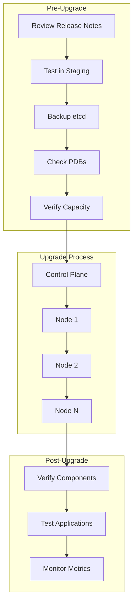

# How to Upgrade Kubernetes Clusters with Zero Downtime

Author: [nawazdhandala](https://www.github.com/nawazdhandala)

Tags: Kubernetes, Upgrades, Zero Downtime, Rolling Updates, High Availability, DevOps

Description: Learn how to perform Kubernetes cluster upgrades with zero downtime using proper planning, rolling updates, and rollback strategies.

---

Upgrading Kubernetes clusters is essential for security patches, new features, and bug fixes. However, upgrades must be carefully planned to avoid service disruptions. This guide covers strategies for zero-downtime Kubernetes upgrades.

## Upgrade Planning



## Pre-Upgrade Checklist

### 1. Review Release Notes

```bash
# Check current version
kubectl version

# Review changelog for target version
# https://github.com/kubernetes/kubernetes/blob/master/CHANGELOG/

# Check deprecations
kubectl get apiservices -o jsonpath='{range .items[*]}{.metadata.name}{"\t"}{.spec.version}{"\n"}{end}'

# Look for deprecated APIs in use
kubectl get --raw /metrics | grep apiserver_requested_deprecated_apis
```

### 2. Backup etcd

```bash
# On control plane node
ETCDCTL_API=3 etcdctl snapshot save /backup/etcd-$(date +%Y%m%d).db \
  --endpoints=https://127.0.0.1:2379 \
  --cacert=/etc/kubernetes/pki/etcd/ca.crt \
  --cert=/etc/kubernetes/pki/etcd/server.crt \
  --key=/etc/kubernetes/pki/etcd/server.key

# Verify backup
ETCDCTL_API=3 etcdctl snapshot status /backup/etcd-$(date +%Y%m%d).db

# Backup Kubernetes PKI
cp -r /etc/kubernetes/pki /backup/pki-$(date +%Y%m%d)
```

### 3. Check Pod Disruption Budgets

```bash
# List all PDBs
kubectl get pdb --all-namespaces

# Check PDB status
kubectl get pdb --all-namespaces -o custom-columns=\
"NAMESPACE:.metadata.namespace,\
NAME:.metadata.name,\
MIN-AVAILABLE:.spec.minAvailable,\
MAX-UNAVAILABLE:.spec.maxUnavailable,\
CURRENT:.status.currentHealthy,\
DESIRED:.status.desiredHealthy"

# Verify PDBs won't block drain
for pdb in $(kubectl get pdb -A -o jsonpath='{range .items[*]}{.metadata.namespace}/{.metadata.name}{" "}{end}'); do
  ns=$(echo $pdb | cut -d'/' -f1)
  name=$(echo $pdb | cut -d'/' -f2)
  echo "Checking $ns/$name..."
  kubectl describe pdb $name -n $ns | grep -E "(Min Available|Current|Allowed)"
done
```

### 4. Verify Cluster Health

```bash
# Check node status
kubectl get nodes

# Check component status (deprecated but useful)
kubectl get componentstatuses

# Check critical pods
kubectl get pods -n kube-system

# Check etcd health
kubectl exec -it -n kube-system etcd-<master> -- etcdctl \
  --endpoints=https://127.0.0.1:2379 \
  --cacert=/etc/kubernetes/pki/etcd/ca.crt \
  --cert=/etc/kubernetes/pki/etcd/server.crt \
  --key=/etc/kubernetes/pki/etcd/server.key \
  endpoint health

# Check certificates expiration
kubeadm certs check-expiration
```

### 5. Ensure Adequate Capacity

```bash
# Check node resources
kubectl describe nodes | grep -A5 "Allocated resources:"

# Verify each node can handle the load during rolling upgrade
kubectl top nodes

# Calculate if N-1 nodes can handle workload
kubectl get pods --all-namespaces -o wide | awk '{print $8}' | sort | uniq -c
```

## Upgrading Control Plane (kubeadm)

### Upgrade First Control Plane Node

```bash
# Check available versions
apt update
apt-cache madison kubeadm

# Upgrade kubeadm
apt-mark unhold kubeadm
apt-get update && apt-get install -y kubeadm=1.28.0-00
apt-mark hold kubeadm

# Verify upgrade plan
kubeadm upgrade plan

# Apply upgrade
kubeadm upgrade apply v1.28.0

# Upgrade kubelet and kubectl
apt-mark unhold kubelet kubectl
apt-get update && apt-get install -y kubelet=1.28.0-00 kubectl=1.28.0-00
apt-mark hold kubelet kubectl

# Restart kubelet
systemctl daemon-reload
systemctl restart kubelet

# Verify
kubectl get nodes
```

### Upgrade Additional Control Plane Nodes

```bash
# On each additional control plane node
apt-mark unhold kubeadm
apt-get update && apt-get install -y kubeadm=1.28.0-00
apt-mark hold kubeadm

# Apply upgrade (different command for additional nodes)
kubeadm upgrade node

# Upgrade kubelet and kubectl
apt-mark unhold kubelet kubectl
apt-get update && apt-get install -y kubelet=1.28.0-00 kubectl=1.28.0-00
apt-mark hold kubelet kubectl

# Restart kubelet
systemctl daemon-reload
systemctl restart kubelet
```

## Upgrading Worker Nodes

### Rolling Node Upgrade Script

```bash
#!/bin/bash
# upgrade-workers.sh

VERSION="1.28.0-00"
NODES=$(kubectl get nodes -l 'node-role.kubernetes.io/control-plane!=' -o name)

for NODE in $NODES; do
  NODE_NAME=$(echo $NODE | cut -d'/' -f2)
  echo "=== Upgrading $NODE_NAME ==="
  
  # 1. Cordon the node
  echo "Cordoning $NODE_NAME..."
  kubectl cordon $NODE_NAME
  
  # 2. Drain the node
  echo "Draining $NODE_NAME..."
  kubectl drain $NODE_NAME \
    --ignore-daemonsets \
    --delete-emptydir-data \
    --force \
    --grace-period=60 \
    --timeout=300s
  
  if [ $? -ne 0 ]; then
    echo "Failed to drain $NODE_NAME, aborting"
    kubectl uncordon $NODE_NAME
    exit 1
  fi
  
  # 3. Upgrade the node (SSH and run upgrade commands)
  echo "Running upgrade on $NODE_NAME..."
  ssh $NODE_NAME << EOF
    apt-mark unhold kubeadm kubelet kubectl
    apt-get update
    apt-get install -y kubeadm=$VERSION kubelet=$VERSION kubectl=$VERSION
    apt-mark hold kubeadm kubelet kubectl
    kubeadm upgrade node
    systemctl daemon-reload
    systemctl restart kubelet
EOF
  
  # 4. Wait for node to be ready
  echo "Waiting for $NODE_NAME to be Ready..."
  until kubectl get node $NODE_NAME | grep -q "Ready"; do
    sleep 10
  done
  
  # 5. Uncordon the node
  echo "Uncordoning $NODE_NAME..."
  kubectl uncordon $NODE_NAME
  
  # 6. Wait for pods to stabilize
  echo "Waiting for pods to stabilize..."
  sleep 60
  
  # 7. Verify node version
  kubectl get node $NODE_NAME
  
  echo "=== Completed $NODE_NAME ==="
  echo ""
done

echo "All nodes upgraded!"
```

### Parallel Node Upgrade (with buffer)

```bash
#!/bin/bash
# upgrade-workers-parallel.sh
# Upgrade multiple nodes at once while maintaining capacity

VERSION="1.28.0-00"
MAX_UNAVAILABLE=2  # Maximum nodes to upgrade simultaneously

NODES=$(kubectl get nodes -l 'node-role.kubernetes.io/control-plane!=' -o name)
NODE_COUNT=$(echo "$NODES" | wc -l)

echo "Upgrading $NODE_COUNT nodes, max $MAX_UNAVAILABLE at a time"

# Convert to array
NODE_ARRAY=($NODES)

for ((i=0; i<$NODE_COUNT; i+=$MAX_UNAVAILABLE)); do
  BATCH=("${NODE_ARRAY[@]:$i:$MAX_UNAVAILABLE}")
  echo "=== Upgrading batch: ${BATCH[@]} ==="
  
  # Cordon all nodes in batch
  for NODE in "${BATCH[@]}"; do
    NODE_NAME=$(echo $NODE | cut -d'/' -f2)
    kubectl cordon $NODE_NAME &
  done
  wait
  
  # Drain all nodes in batch
  for NODE in "${BATCH[@]}"; do
    NODE_NAME=$(echo $NODE | cut -d'/' -f2)
    kubectl drain $NODE_NAME \
      --ignore-daemonsets \
      --delete-emptydir-data \
      --force \
      --timeout=300s &
  done
  wait
  
  # Upgrade all nodes in batch (in parallel)
  for NODE in "${BATCH[@]}"; do
    NODE_NAME=$(echo $NODE | cut -d'/' -f2)
    (
      ssh $NODE_NAME "apt-mark unhold kubeadm kubelet kubectl && \
        apt-get update && \
        apt-get install -y kubeadm=$VERSION kubelet=$VERSION kubectl=$VERSION && \
        apt-mark hold kubeadm kubelet kubectl && \
        kubeadm upgrade node && \
        systemctl daemon-reload && \
        systemctl restart kubelet"
    ) &
  done
  wait
  
  # Wait for all nodes to be ready
  for NODE in "${BATCH[@]}"; do
    NODE_NAME=$(echo $NODE | cut -d'/' -f2)
    until kubectl get node $NODE_NAME | grep -q "Ready"; do
      sleep 10
    done
    kubectl uncordon $NODE_NAME
  done
  
  # Stabilization period
  sleep 120
done
```

## Managed Kubernetes Upgrades

### EKS Upgrade

```bash
# Check current version
aws eks describe-cluster --name my-cluster --query "cluster.version"

# Update control plane
aws eks update-cluster-version \
  --name my-cluster \
  --kubernetes-version 1.28

# Wait for upgrade
aws eks wait cluster-active --name my-cluster

# Update node groups
aws eks update-nodegroup-version \
  --cluster-name my-cluster \
  --nodegroup-name my-nodegroup \
  --kubernetes-version 1.28

# Or with managed node groups, use launch template update
```

### GKE Upgrade

```bash
# Check available versions
gcloud container get-server-config --zone us-central1-a

# Upgrade control plane
gcloud container clusters upgrade my-cluster \
  --master \
  --cluster-version 1.28.0-gke.100 \
  --zone us-central1-a

# Upgrade node pools
gcloud container clusters upgrade my-cluster \
  --node-pool default-pool \
  --cluster-version 1.28.0-gke.100 \
  --zone us-central1-a
```

### AKS Upgrade

```bash
# Check available upgrades
az aks get-upgrades \
  --resource-group myResourceGroup \
  --name myAKSCluster \
  --output table

# Upgrade cluster
az aks upgrade \
  --resource-group myResourceGroup \
  --name myAKSCluster \
  --kubernetes-version 1.28.0 \
  --yes
```

## Application Considerations

### Ensure High Availability

```yaml
# Deployment with proper HA settings
apiVersion: apps/v1
kind: Deployment
metadata:
  name: my-app
spec:
  replicas: 3  # Multiple replicas
  strategy:
    type: RollingUpdate
    rollingUpdate:
      maxSurge: 1
      maxUnavailable: 0  # Never reduce below desired
  template:
    spec:
      affinity:
        podAntiAffinity:
          requiredDuringSchedulingIgnoredDuringExecution:
            - labelSelector:
                matchExpressions:
                  - key: app
                    operator: In
                    values:
                      - my-app
              topologyKey: kubernetes.io/hostname  # Spread across nodes
      topologySpreadConstraints:
        - maxSkew: 1
          topologyKey: topology.kubernetes.io/zone
          whenUnsatisfiable: DoNotSchedule
          labelSelector:
            matchLabels:
              app: my-app
```

### Pod Disruption Budget

```yaml
# PDB to prevent too many pods being unavailable
apiVersion: policy/v1
kind: PodDisruptionBudget
metadata:
  name: my-app-pdb
spec:
  minAvailable: 2  # Or use maxUnavailable: 1
  selector:
    matchLabels:
      app: my-app
```

### Graceful Shutdown

```yaml
# Ensure pods can terminate gracefully
apiVersion: v1
kind: Pod
spec:
  terminationGracePeriodSeconds: 60
  containers:
    - name: app
      lifecycle:
        preStop:
          exec:
            command:
              - /bin/sh
              - -c
              - |
                # Notify load balancer
                sleep 5
                # Wait for in-flight requests
                /app/graceful-shutdown
```

## Rollback Procedures

### Rollback Control Plane

```bash
# Restore etcd from backup
ETCDCTL_API=3 etcdctl snapshot restore /backup/etcd-backup.db \
  --data-dir=/var/lib/etcd-restored \
  --skip-hash-check

# Update etcd to use restored data
# Edit /etc/kubernetes/manifests/etcd.yaml to point to restored data

# Restore certificates if needed
cp -r /backup/pki/* /etc/kubernetes/pki/

# Restart kubelet
systemctl restart kubelet
```

### Downgrade Nodes (if needed)

```bash
# Downgrade is generally not recommended
# Better to restore from backup or rebuild

# If absolutely necessary:
apt-mark unhold kubeadm kubelet kubectl
apt-get install -y kubeadm=1.27.0-00 kubelet=1.27.0-00 kubectl=1.27.0-00
apt-mark hold kubeadm kubelet kubectl

kubeadm upgrade node
systemctl daemon-reload
systemctl restart kubelet
```

## Monitoring During Upgrade

### Key Metrics to Watch

```promql
# Node status
kube_node_status_condition{condition="Ready", status="true"}

# Pod restarts
increase(kube_pod_container_status_restarts_total[5m])

# API server latency
histogram_quantile(0.99, sum(rate(apiserver_request_duration_seconds_bucket[5m])) by (le))

# etcd latency
histogram_quantile(0.99, sum(rate(etcd_request_duration_seconds_bucket[5m])) by (le))

# Scheduler latency
scheduler_e2e_scheduling_duration_seconds_bucket
```

### Upgrade Monitoring Dashboard

```yaml
# Grafana dashboard query examples
- title: "Nodes Ready"
  query: sum(kube_node_status_condition{condition="Ready", status="true"})

- title: "Pods Not Ready"
  query: sum(kube_pod_status_phase{phase!="Running", phase!="Succeeded"})

- title: "API Server Error Rate"
  query: sum(rate(apiserver_request_total{code=~"5.."}[5m]))
```

## Best Practices Summary

1. **Always backup etcd** before upgrading
2. **Test in staging first** with production-like workloads
3. **Upgrade one minor version at a time** (1.27 → 1.28, not 1.27 → 1.29)
4. **Use PDBs** to protect application availability
5. **Monitor continuously** during the upgrade
6. **Have rollback plan** ready before starting

## Conclusion

Zero-downtime Kubernetes upgrades require careful planning and execution. Key takeaways:

1. **Prepare thoroughly** - Backup, check PDBs, verify capacity
2. **Upgrade control plane first** - Then workers one by one
3. **Drain nodes properly** - Respect PDBs and grace periods
4. **Monitor actively** - Watch for issues during the process
5. **Have rollback ready** - Know how to recover if needed

For monitoring your cluster health during upgrades, check out [OneUptime's Kubernetes monitoring](https://oneuptime.com/product/metrics).

## Related Resources

- [How to Drain and Cordon Nodes for Maintenance](https://oneuptime.com/blog/post/2026-01-19-kubernetes-drain-cordon-node-maintenance/view)
- [How to Set Up Pod Disruption Budgets](https://oneuptime.com/blog/post/2026-01-19-kubernetes-resource-quotas-limit-ranges/view)
- [How to Backup and Restore with Velero](https://oneuptime.com/blog/post/2026-01-19-kubernetes-velero-backup-restore/view)
