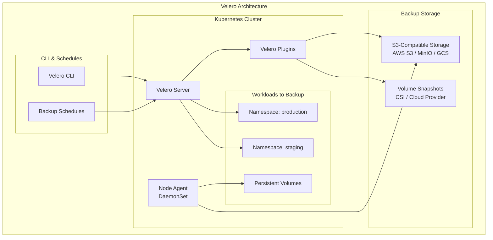
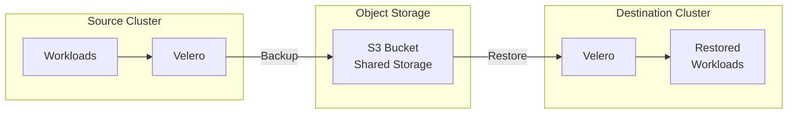

# How to Back Up and Restore Kubernetes Clusters with Velero

Author: [nawazdhandala](https://www.github.com/nawazdhandala)

Tags: Kubernetes, Velero, Backup, Disaster Recovery, DR, Migration, S3, Persistent Volumes

Description: Learn how to implement comprehensive backup and disaster recovery for Kubernetes clusters using Velero, covering backing up resources, persistent volumes, scheduled backups, and cross-cluster restores.

---

Kubernetes clusters contain critical data: application configurations, secrets, persistent volume data, and custom resources. Without proper backups, a misconfiguration, accidental deletion, or cluster failure can lead to significant data loss and downtime.

Velero (formerly Heptio Ark) is the de-facto standard for Kubernetes backup and restore. It can back up your entire cluster or specific namespaces, including persistent volume data, and restore them to the same or a completely different cluster.

## Why Velero for Kubernetes Backup?

Before diving into implementation, let's understand what makes Velero essential:

1. **Resource Backup** - Backs up all Kubernetes objects (Deployments, Services, ConfigMaps, Secrets, CRDs)
2. **Volume Snapshots** - Integrates with CSI drivers to snapshot persistent volumes
3. **Scheduled Backups** - Automated backup schedules with retention policies
4. **Cluster Migration** - Move workloads between clusters (even across cloud providers)
5. **Disaster Recovery** - Restore entire namespaces or clusters from backups

## Architecture Overview



## Installing Velero

### Prerequisites

1. A Kubernetes cluster (1.16+)
2. kubectl configured to access the cluster
3. An S3-compatible storage bucket (AWS S3, MinIO, GCS, Azure Blob)
4. Velero CLI installed locally

### Installing Velero CLI

```bash
# macOS with Homebrew
brew install velero

# Linux (download binary)
VELERO_VERSION=v1.13.0
wget https://github.com/vmware-tanzu/velero/releases/download/${VELERO_VERSION}/velero-${VELERO_VERSION}-linux-amd64.tar.gz
tar -xvf velero-${VELERO_VERSION}-linux-amd64.tar.gz
sudo mv velero-${VELERO_VERSION}-linux-amd64/velero /usr/local/bin/

# Verify installation
velero version
```

### Installing Velero with AWS S3

```bash
# Create credentials file for AWS
cat > credentials-velero <<EOF
[default]
aws_access_key_id=YOUR_ACCESS_KEY
aws_secret_access_key=YOUR_SECRET_KEY
EOF

# Install Velero with AWS plugin
# This creates the velero namespace and deploys all components
velero install \
    --provider aws \
    --plugins velero/velero-plugin-for-aws:v1.9.0 \
    --bucket my-velero-backups \
    --backup-location-config region=us-east-1 \
    --snapshot-location-config region=us-east-1 \
    --secret-file ./credentials-velero

# Verify installation
kubectl get pods -n velero
kubectl get backupstoragelocations -n velero
```

### Installing Velero with MinIO (On-Premises)

For air-gapped or on-premises environments, MinIO provides S3-compatible storage:

```yaml
# minio-deployment.yaml
# Deploy MinIO for backup storage (production should use distributed mode)
apiVersion: apps/v1
kind: Deployment
metadata:
  name: minio
  namespace: velero
spec:
  replicas: 1
  selector:
    matchLabels:
      app: minio
  template:
    metadata:
      labels:
        app: minio
    spec:
      containers:
        - name: minio
          image: minio/minio:latest
          args:
            - server
            - /data
            - --console-address
            - ":9001"
          env:
            # Set access credentials (use secrets in production)
            - name: MINIO_ROOT_USER
              value: "minioadmin"
            - name: MINIO_ROOT_PASSWORD
              value: "minioadmin123"
          ports:
            - containerPort: 9000  # S3 API
            - containerPort: 9001  # Console
          volumeMounts:
            - name: data
              mountPath: /data
      volumes:
        - name: data
          persistentVolumeClaim:
            claimName: minio-pvc

---
apiVersion: v1
kind: Service
metadata:
  name: minio
  namespace: velero
spec:
  ports:
    - port: 9000
      name: api
    - port: 9001
      name: console
  selector:
    app: minio
```

```bash
# Install Velero with MinIO
velero install \
    --provider aws \
    --plugins velero/velero-plugin-for-aws:v1.9.0 \
    --bucket velero \
    --secret-file ./credentials-velero \
    --use-volume-snapshots=false \
    --backup-location-config region=minio,s3ForcePathStyle="true",s3Url=http://minio.velero.svc:9000
```

### Installing with CSI Snapshots

For persistent volume backups using CSI snapshots:

```bash
# Install Velero with CSI plugin
velero install \
    --provider aws \
    --plugins velero/velero-plugin-for-aws:v1.9.0,velero/velero-plugin-for-csi:v0.7.0 \
    --bucket my-velero-backups \
    --backup-location-config region=us-east-1 \
    --snapshot-location-config region=us-east-1 \
    --secret-file ./credentials-velero \
    --features=EnableCSI

# Verify CSI snapshot classes exist
kubectl get volumesnapshotclass
```

## Creating Backups

### Full Cluster Backup

```bash
# Back up the entire cluster (all namespaces)
# This captures all Kubernetes resources except cluster-scoped resources
# that are managed by the system (nodes, persistent volumes, etc.)
velero backup create full-cluster-backup \
    --wait

# Check backup status
velero backup describe full-cluster-backup

# List all backups
velero backup get
```

### Namespace Backup

```bash
# Back up a specific namespace
# Most common use case for application backups
velero backup create production-backup \
    --include-namespaces production \
    --wait

# Back up multiple namespaces
velero backup create apps-backup \
    --include-namespaces production,staging,monitoring \
    --wait
```

### Selective Backup with Labels

```bash
# Back up only resources with specific labels
# Useful for backing up specific applications
velero backup create app-backup \
    --selector app=myapp \
    --wait

# Combine namespace and label selectors
velero backup create myapp-prod-backup \
    --include-namespaces production \
    --selector app=myapp,tier=backend \
    --wait
```

### Backup with Volume Snapshots

```yaml
# backup-with-volumes.yaml
# Declarative backup specification with volume handling
apiVersion: velero.io/v1
kind: Backup
metadata:
  name: production-with-volumes
  namespace: velero
spec:
  # Include specific namespaces
  includedNamespaces:
    - production
  
  # Include persistent volumes (default is true)
  snapshotVolumes: true
  
  # Default volume backup strategy
  # opt-in: Only back up volumes with backup annotation
  # opt-out: Back up all volumes except those with exclusion annotation
  defaultVolumesToFsBackup: true
  
  # Time to live for this backup
  ttl: 720h  # 30 days
  
  # Storage location for this backup
  storageLocation: default
  
  # Volume snapshot location
  volumeSnapshotLocations:
    - default
  
  # Hooks to run before/after backup
  hooks:
    resources:
      - name: database-backup
        includedNamespaces:
          - production
        labelSelector:
          matchLabels:
            app: postgresql
        pre:
          - exec:
              container: postgresql
              # Run pg_dump before snapshot to ensure consistency
              command:
                - /bin/bash
                - -c
                - "pg_dump -U postgres mydb > /backup/pre-snapshot.sql"
              onError: Fail
              timeout: 300s
```

### File System Backup (Restic/Kopia)

For volumes that don't support CSI snapshots, Velero can use file system backup:

```bash
# Enable file system backup for a deployment
kubectl annotate pod/my-pod backup.velero.io/backup-volumes=data-volume

# Or use the defaultVolumesToFsBackup option in backup spec
velero backup create fs-backup \
    --include-namespaces production \
    --default-volumes-to-fs-backup \
    --wait
```

```yaml
# Pod annotation for file system backup
apiVersion: v1
kind: Pod
metadata:
  name: my-app
  annotations:
    # Specify which volumes to back up via file system
    backup.velero.io/backup-volumes: data,config
spec:
  containers:
    - name: app
      volumeMounts:
        - name: data
          mountPath: /data
        - name: config
          mountPath: /config
  volumes:
    - name: data
      persistentVolumeClaim:
        claimName: app-data
    - name: config
      configMap:
        name: app-config
```

## Scheduled Backups

Automated backups are essential for disaster recovery:

```yaml
# scheduled-backup.yaml
# Create automatic backups on a schedule
apiVersion: velero.io/v1
kind: Schedule
metadata:
  name: daily-production-backup
  namespace: velero
spec:
  # Cron schedule (UTC timezone)
  # This runs at 2:00 AM UTC every day
  schedule: "0 2 * * *"
  
  # Backup template
  template:
    # Namespaces to back up
    includedNamespaces:
      - production
      - staging
    
    # Include cluster resources (like ClusterRoles, CRDs)
    includeClusterResources: true
    
    # Snapshot persistent volumes
    snapshotVolumes: true
    
    # Time to live for backups
    # After this time, backups are automatically deleted
    ttl: 720h  # 30 days
    
    # Storage location
    storageLocation: default
    
    # Volume snapshot location
    volumeSnapshotLocations:
      - default
    
    # Labels to add to backups
    metadata:
      labels:
        backup-type: scheduled
        environment: production

---
# Weekly full cluster backup with longer retention
apiVersion: velero.io/v1
kind: Schedule
metadata:
  name: weekly-full-backup
  namespace: velero
spec:
  # Every Sunday at 3:00 AM UTC
  schedule: "0 3 * * 0"
  template:
    # Back up all namespaces
    includedNamespaces:
      - "*"
    includeClusterResources: true
    snapshotVolumes: true
    # Longer retention for weekly backups
    ttl: 2160h  # 90 days
    storageLocation: default
    volumeSnapshotLocations:
      - default
    metadata:
      labels:
        backup-type: weekly-full
```

```bash
# Create schedule from CLI
velero schedule create hourly-backup \
    --schedule="0 * * * *" \
    --include-namespaces production \
    --ttl 168h

# List schedules
velero schedule get

# Describe a schedule
velero schedule describe daily-production-backup

# Trigger a schedule manually (creates backup immediately)
velero backup create --from-schedule daily-production-backup
```

## Restoring from Backups

### Full Restore

```bash
# Restore everything from a backup
velero restore create full-restore \
    --from-backup full-cluster-backup \
    --wait

# Check restore status
velero restore describe full-restore

# View restore logs for troubleshooting
velero restore logs full-restore
```

### Selective Restore

```bash
# Restore only specific namespaces
velero restore create production-restore \
    --from-backup production-backup \
    --include-namespaces production \
    --wait

# Restore specific resources
velero restore create deployments-restore \
    --from-backup production-backup \
    --include-resources deployments,services,configmaps \
    --wait

# Restore with label selector
velero restore create app-restore \
    --from-backup production-backup \
    --selector app=myapp \
    --wait
```

### Restore to Different Namespace

```yaml
# restore-to-new-namespace.yaml
# Restore production to a test namespace
apiVersion: velero.io/v1
kind: Restore
metadata:
  name: restore-prod-to-test
  namespace: velero
spec:
  backupName: production-backup
  
  # Map namespaces during restore
  # production -> production-test
  namespaceMapping:
    production: production-test
  
  # Restore specific resource types
  includedResources:
    - deployments
    - services
    - configmaps
    - secrets
    - persistentvolumeclaims
  
  # Preserve original node ports (if possible)
  preserveNodePorts: false
  
  # Restore persistent volumes
  restorePVs: true
```

### Cross-Cluster Migration



```bash
# On source cluster: Create backup
velero backup create migration-backup \
    --include-namespaces production \
    --snapshot-volumes=true \
    --wait

# On destination cluster: Configure same backup location
# (Must point to same S3 bucket)
velero backup-location create migration-source \
    --provider aws \
    --bucket my-velero-backups \
    --config region=us-east-1

# Wait for backup to sync
velero backup get

# Restore on destination cluster
velero restore create migration-restore \
    --from-backup migration-backup \
    --wait
```

## Backup Hooks

Hooks allow you to run commands before or after backups:

```yaml
# backup-with-hooks.yaml
apiVersion: velero.io/v1
kind: Backup
metadata:
  name: database-backup
  namespace: velero
spec:
  includedNamespaces:
    - production
  hooks:
    resources:
      # PostgreSQL pre-backup hook
      - name: postgresql-hook
        includedNamespaces:
          - production
        labelSelector:
          matchLabels:
            app: postgresql
        pre:
          - exec:
              container: postgresql
              # Ensure all transactions are flushed to disk
              command:
                - /bin/bash
                - -c
                - |
                  # Create a consistent checkpoint before backup
                  psql -U postgres -c "CHECKPOINT;"
                  # Optionally create a logical backup
                  pg_dump -U postgres -Fc mydb > /backup/mydb.dump
              onError: Fail  # Fail backup if hook fails
              timeout: 600s
        post:
          - exec:
              container: postgresql
              # Clean up after backup
              command:
                - /bin/bash
                - -c
                - "rm -f /backup/mydb.dump"
              onError: Continue
              timeout: 60s
      
      # Redis pre-backup hook
      - name: redis-hook
        includedNamespaces:
          - production
        labelSelector:
          matchLabels:
            app: redis
        pre:
          - exec:
              container: redis
              # Force Redis to write to disk
              command:
                - redis-cli
                - BGSAVE
              onError: Continue
              timeout: 120s
```

```yaml
# Pod annotation for hooks (alternative approach)
apiVersion: v1
kind: Pod
metadata:
  name: postgresql
  annotations:
    # Pre-backup hook
    pre.hook.backup.velero.io/container: postgresql
    pre.hook.backup.velero.io/command: '["/bin/bash", "-c", "pg_dump -U postgres mydb > /backup/dump.sql"]'
    pre.hook.backup.velero.io/timeout: 300s
    pre.hook.backup.velero.io/on-error: Fail
    # Post-backup hook
    post.hook.backup.velero.io/container: postgresql
    post.hook.backup.velero.io/command: '["/bin/bash", "-c", "rm /backup/dump.sql"]'
spec:
  containers:
    - name: postgresql
      # ... container spec
```

## Monitoring Backups

### Backup Status Dashboard

```bash
# Check backup status
velero backup get

# Detailed backup information
velero backup describe my-backup --details

# View backup logs
velero backup logs my-backup

# Check for failed backups
velero backup get | grep -E "Failed|PartiallyFailed"
```

### Prometheus Metrics

Velero exposes Prometheus metrics for monitoring:

```yaml
# servicemonitor-velero.yaml
apiVersion: monitoring.coreos.com/v1
kind: ServiceMonitor
metadata:
  name: velero
  namespace: velero
spec:
  selector:
    matchLabels:
      app.kubernetes.io/name: velero
  endpoints:
    - port: metrics
      interval: 30s
```

Key metrics to monitor:

```promql
# Backup success/failure
velero_backup_success_total
velero_backup_failure_total

# Backup duration
velero_backup_duration_seconds

# Restore status
velero_restore_success_total
velero_restore_partial_failure_total

# Backup storage location status
velero_backup_storage_location_last_reconciliation_status
```

```yaml
# Example Prometheus alert rules
apiVersion: monitoring.coreos.com/v1
kind: PrometheusRule
metadata:
  name: velero-alerts
  namespace: velero
spec:
  groups:
    - name: velero
      rules:
        - alert: VeleroBackupFailed
          expr: increase(velero_backup_failure_total[1h]) > 0
          for: 5m
          labels:
            severity: critical
          annotations:
            summary: "Velero backup failed"
            description: "A Velero backup has failed in the last hour"
        
        - alert: VeleroNoRecentBackup
          expr: time() - velero_backup_last_successful_timestamp > 86400
          for: 1h
          labels:
            severity: warning
          annotations:
            summary: "No recent Velero backup"
            description: "No successful backup in the last 24 hours"
```

## Troubleshooting

### Backup Stuck or Failing

```bash
# Check Velero pod logs
kubectl logs -n velero deployment/velero

# Check node agent logs (for file system backups)
kubectl logs -n velero daemonset/node-agent

# Check backup storage location status
velero backup-location get

# Verify credentials
kubectl get secret -n velero cloud-credentials -o yaml

# Test S3 connectivity manually
kubectl run -n velero test-s3 --rm -it --image=amazon/aws-cli -- \
    s3 ls s3://my-velero-backups/
```

### Volume Snapshot Issues

```bash
# Check if CSI driver supports snapshots
kubectl get csidrivers

# Verify volume snapshot class exists
kubectl get volumesnapshotclass

# Check snapshot controller logs
kubectl logs -n kube-system deployment/snapshot-controller

# For file system backups, check node-agent
kubectl logs -n velero daemonset/node-agent -c node-agent
```

### Restore Failures

```bash
# Check restore logs
velero restore logs my-restore

# Common issues:
# 1. Namespace already exists with conflicting resources
#    Solution: Delete existing resources or use --existing-resource-policy=update

# 2. PVC binding issues
#    Solution: Check if storage class exists in destination cluster

# 3. Service account doesn't exist
#    Solution: Ensure cluster-scoped resources are included in backup
```

## Best Practices

### 1. Test Your Restores Regularly

```bash
# Monthly restore drill to a test namespace
velero restore create monthly-test-$(date +%Y%m) \
    --from-backup daily-production-backup \
    --namespace-mappings production:restore-test \
    --wait

# Verify application works
kubectl get pods -n restore-test
kubectl port-forward -n restore-test svc/my-app 8080:80

# Clean up after testing
kubectl delete namespace restore-test
```

### 2. Use Multiple Backup Locations

```yaml
# backup-locations.yaml
# Primary backup location
apiVersion: velero.io/v1
kind: BackupStorageLocation
metadata:
  name: primary
  namespace: velero
spec:
  provider: aws
  objectStorage:
    bucket: velero-backups-primary
  config:
    region: us-east-1

---
# Secondary backup location (different region/provider)
apiVersion: velero.io/v1
kind: BackupStorageLocation
metadata:
  name: secondary
  namespace: velero
spec:
  provider: aws
  objectStorage:
    bucket: velero-backups-secondary
  config:
    region: us-west-2
```

### 3. Implement Backup Policies

```yaml
# retention-policy.yaml
# Different retention for different environments
---
# Production: Daily backups, 30-day retention
apiVersion: velero.io/v1
kind: Schedule
metadata:
  name: production-daily
  namespace: velero
spec:
  schedule: "0 2 * * *"
  template:
    includedNamespaces:
      - production
    ttl: 720h
    storageLocation: primary

---
# Staging: Daily backups, 7-day retention
apiVersion: velero.io/v1
kind: Schedule
metadata:
  name: staging-daily
  namespace: velero
spec:
  schedule: "0 3 * * *"
  template:
    includedNamespaces:
      - staging
    ttl: 168h
    storageLocation: primary
```

## Conclusion

Velero is an essential tool for any production Kubernetes environment. It provides:

- **Peace of mind** with automated, scheduled backups
- **Fast recovery** from accidental deletions or disasters
- **Cluster migration** capabilities for moving between environments

Key takeaways:

1. **Start simple** - Begin with namespace backups, add volume snapshots later
2. **Automate everything** - Use schedules for regular backups
3. **Test regularly** - A backup is only useful if you can restore from it
4. **Monitor proactively** - Alert on backup failures before you need them

For comprehensive monitoring of your Kubernetes clusters and backup jobs, check out [OneUptime's Kubernetes monitoring](https://oneuptime.com/product/metrics).

## Related Resources

- [How to Set Up Health Checks for Kubernetes](https://oneuptime.com/blog/post/python-health-checks-kubernetes/view)
- [How to Gracefully Shutdown Applications in Kubernetes](https://oneuptime.com/blog/post/python-graceful-shutdown-kubernetes/view)
- [Moving from AWS to Bare Metal](https://oneuptime.com/blog/post/moving-from-aws-to-bare-metal/view)
