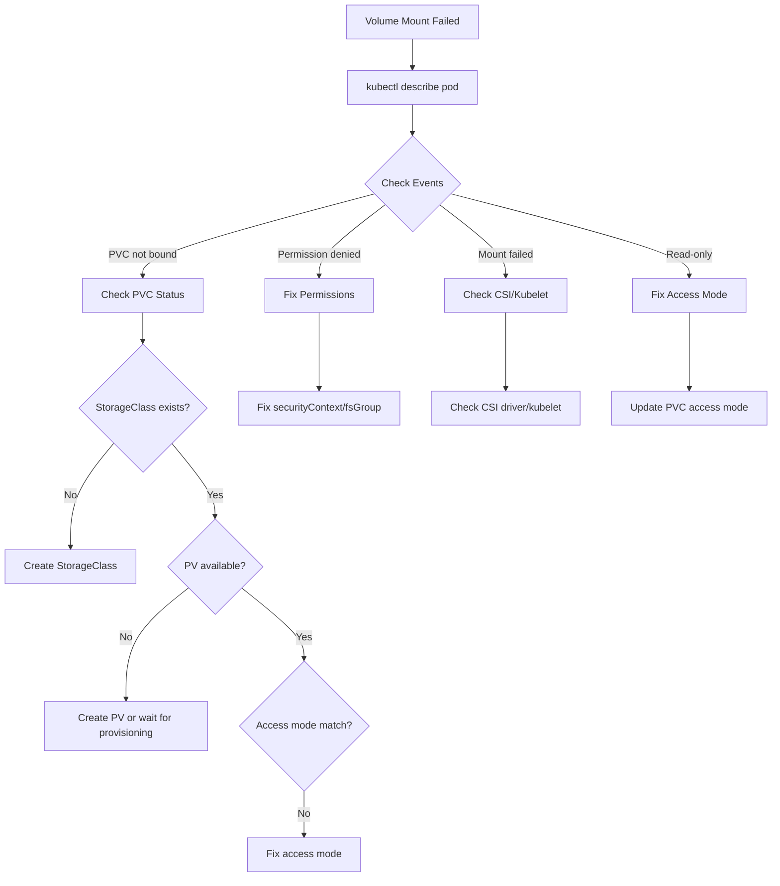

# How to Debug Kubernetes Volume Mount Failures

Author: [nawazdhandala](https://www.github.com/nawazdhandala)

Tags: Kubernetes, Troubleshooting, Volumes, PVC, Storage, Debugging, DevOps

Description: Learn how to diagnose and fix Kubernetes volume mount failures including PVC binding issues, access mode problems, permission errors, and CSI driver problems.

---

Volume mount failures in Kubernetes can prevent pods from starting. Common causes include PVC binding issues, access mode conflicts, permission problems, and CSI driver failures. This guide provides systematic debugging approaches.

## Diagnostic Flow



## Step 1: Check Pod Events

```bash
# Get detailed pod information
kubectl describe pod <pod-name>

# Look for Events section:
# Events:
#   Type     Reason            Age   Message
#   ----     ------            ----  -------
#   Warning  FailedMount       1m    Unable to attach or mount volumes: 
#                                    timeout expired waiting for volumes to attach
#   Warning  FailedMount       1m    MountVolume.SetUp failed for volume "data":
#                                    mount failed: exit status 32

# Check pod status
kubectl get pod <pod-name> -o wide
```

## Step 2: Check PVC Status

```bash
# List PVCs
kubectl get pvc

# Output:
# NAME       STATUS    VOLUME   CAPACITY   ACCESS MODES   STORAGECLASS   AGE
# data-pvc   Bound     pv-123   10Gi       RWO            standard       1h
# logs-pvc   Pending   <none>   <none>     RWX            standard       5m  <- Problem!

# Describe pending PVC
kubectl describe pvc logs-pvc

# Look for:
# - Events showing why binding failed
# - StorageClass reference
# - Access modes requested
```

### PVC Binding Issues

```bash
# Common PVC events:
# - "no persistent volumes available for this claim"
# - "storageclass.storage.k8s.io 'nonexistent' not found"
# - "waiting for first consumer to be created"

# Check storage classes
kubectl get storageclass

# Check available PVs
kubectl get pv
```

## Issue 1: StorageClass Not Found

### Diagnosis

```bash
# Check if storage class exists
kubectl get storageclass

# Check what storage class PVC requests
kubectl get pvc data-pvc -o jsonpath='{.spec.storageClassName}'
```

### Solution

```yaml
# Create storage class if missing
apiVersion: storage.k8s.io/v1
kind: StorageClass
metadata:
  name: standard
provisioner: kubernetes.io/aws-ebs  # or your provider
parameters:
  type: gp3
reclaimPolicy: Delete
volumeBindingMode: WaitForFirstConsumer
allowVolumeExpansion: true
```

## Issue 2: Access Mode Conflict

### Diagnosis

```bash
# Check PVC access modes
kubectl get pvc data-pvc -o jsonpath='{.spec.accessModes}'
# ["ReadWriteOnce"]

# Check PV access modes
kubectl get pv <pv-name> -o jsonpath='{.spec.accessModes}'
# ["ReadWriteOnce"]

# If pod needs RWX but PV/PVC is RWO, binding fails
```

### Solution

```yaml
# PVC with correct access mode
apiVersion: v1
kind: PersistentVolumeClaim
metadata:
  name: shared-data
spec:
  accessModes:
    - ReadWriteMany  # RWX - multiple pods can mount
    # - ReadWriteOnce  # RWO - single pod
    # - ReadOnlyMany   # ROX - multiple pods read-only
  resources:
    requests:
      storage: 10Gi
  storageClassName: nfs-storage  # NFS supports RWX
```

## Issue 3: Volume Already Attached (Multi-Attach Error)

### Diagnosis

```bash
# Error: "Multi-Attach error for volume"
# Occurs when RWO volume is attached to node but pod on different node

# Check which node has volume attached
kubectl get volumeattachment

# Check pod and PV node affinity
kubectl get pod <pod-name> -o jsonpath='{.spec.nodeName}'
kubectl get pv <pv-name> -o jsonpath='{.spec.nodeAffinity}'
```

### Solution

```yaml
# Option 1: Use node affinity to schedule on same node
spec:
  affinity:
    nodeAffinity:
      requiredDuringSchedulingIgnoredDuringExecution:
        nodeSelectorTerms:
          - matchExpressions:
              - key: kubernetes.io/hostname
                operator: In
                values:
                  - node-1  # Where volume is attached

# Option 2: Delete old pod to release volume
kubectl delete pod <old-pod-name>

# Option 3: Use RWX storage class
```

## Issue 4: Permission Denied

### Diagnosis

```bash
# Check container logs
kubectl logs <pod-name>
# Error: permission denied on /data

# Check volume mount in pod
kubectl exec <pod-name> -- ls -la /data

# Check what user container runs as
kubectl exec <pod-name> -- id
```

### Solution: Fix Security Context

```yaml
# deployment.yaml
spec:
  template:
    spec:
      # Set fsGroup to make volume writable by container
      securityContext:
        fsGroup: 1000  # Group ID for volume
        runAsUser: 1000
        runAsGroup: 1000
      
      containers:
        - name: app
          securityContext:
            runAsUser: 1000
            runAsGroup: 1000
          volumeMounts:
            - name: data
              mountPath: /data
```

### Solution: Init Container to Fix Permissions

```yaml
spec:
  initContainers:
    - name: fix-permissions
      image: busybox
      command: ["sh", "-c", "chown -R 1000:1000 /data"]
      securityContext:
        runAsUser: 0  # Root to change ownership
      volumeMounts:
        - name: data
          mountPath: /data
  containers:
    - name: app
      # ...
```

## Issue 5: CSI Driver Problems

### Diagnosis

```bash
# Check CSI driver pods
kubectl get pods -n kube-system | grep csi

# Check CSI driver logs
kubectl logs -n kube-system <csi-driver-pod>

# Check CSI driver node plugin
kubectl get pods -n kube-system -l app=csi-node-driver -o wide

# Check volume attachments
kubectl get volumeattachment
kubectl describe volumeattachment <attachment-name>
```

### Solution: Restart CSI Components

```bash
# Restart CSI controller
kubectl rollout restart deployment -n kube-system csi-controller

# Restart CSI node daemonset
kubectl rollout restart daemonset -n kube-system csi-node

# Check CSI driver health
kubectl get csidrivers
kubectl describe csidriver <driver-name>
```

## Issue 6: Subpath Mount Failures

### Diagnosis

```bash
# Error: "subPath ... does not exist"
# The subPath directory doesn't exist in the volume

kubectl describe pod <pod-name>
# Events show subPath error
```

### Solution

```yaml
# Option 1: Create subPath with init container
spec:
  initContainers:
    - name: create-subpath
      image: busybox
      command: ["mkdir", "-p", "/data/logs"]
      volumeMounts:
        - name: data
          mountPath: /data
  
  containers:
    - name: app
      volumeMounts:
        - name: data
          mountPath: /app/logs
          subPath: logs  # Now exists

# Option 2: Use subPathExpr (dynamic, Kubernetes 1.17+)
volumeMounts:
  - name: data
    mountPath: /app/logs
    subPathExpr: $(POD_NAME)/logs
```

## Issue 7: ConfigMap/Secret Volume Not Updating

### Diagnosis

```bash
# ConfigMap mounted volumes have update delay (up to kubelet sync period)
# subPath mounts NEVER update automatically

kubectl get pod <pod-name> -o yaml | grep subPath
```

### Solution

```yaml
# DON'T use subPath for configs that need updates
# BAD - won't update:
volumeMounts:
  - name: config
    mountPath: /etc/app/config.yaml
    subPath: config.yaml

# GOOD - will update:
volumeMounts:
  - name: config
    mountPath: /etc/app/
```

## Issue 8: ReadOnly Volume Error

### Diagnosis

```bash
# Error: "read-only file system"
kubectl exec <pod-name> -- touch /data/test
# touch: /data/test: Read-only file system
```

### Solution

```yaml
# Check if mounted as readOnly
spec:
  containers:
    - volumeMounts:
        - name: data
          mountPath: /data
          readOnly: false  # Make sure this isn't true!

# For PVC, check if PV has readOnly in claimRef
kubectl get pv <pv-name> -o yaml
```

## Quick Diagnosis Script

```bash
#!/bin/bash
# diagnose-volume.sh

POD=$1
NAMESPACE=${2:-default}

echo "=== Pod Volume Mounts ==="
kubectl get pod $POD -n $NAMESPACE -o jsonpath='{.spec.volumes[*].name}' | tr ' ' '\n'

echo -e "\n=== PVC Status ==="
for pvc in $(kubectl get pod $POD -n $NAMESPACE -o jsonpath='{.spec.volumes[*].persistentVolumeClaim.claimName}'); do
    echo "--- PVC: $pvc ---"
    kubectl get pvc $pvc -n $NAMESPACE
    kubectl describe pvc $pvc -n $NAMESPACE | grep -A 10 "Events:"
done

echo -e "\n=== Volume Attachments ==="
NODE=$(kubectl get pod $POD -n $NAMESPACE -o jsonpath='{.spec.nodeName}')
kubectl get volumeattachment | grep $NODE

echo -e "\n=== CSI Drivers ==="
kubectl get csidrivers

echo -e "\n=== Storage Classes ==="
kubectl get storageclass

echo -e "\n=== Pod Events ==="
kubectl describe pod $POD -n $NAMESPACE | grep -A 20 "Events:"

echo -e "\n=== Container Security Context ==="
kubectl get pod $POD -n $NAMESPACE -o jsonpath='{.spec.securityContext}'
kubectl get pod $POD -n $NAMESPACE -o jsonpath='{.spec.containers[*].securityContext}'
```

## Test Volume From Debug Pod

```bash
# Create debug pod with same volume
kubectl run debug-volume --rm -it --image=busybox \
  --overrides='
{
  "spec": {
    "containers": [{
      "name": "debug",
      "image": "busybox",
      "command": ["sh"],
      "stdin": true,
      "tty": true,
      "volumeMounts": [{
        "name": "test-vol",
        "mountPath": "/data"
      }]
    }],
    "volumes": [{
      "name": "test-vol",
      "persistentVolumeClaim": {
        "claimName": "data-pvc"
      }
    }]
  }
}' -- sh
```

## Summary

| Error | Cause | Solution |
|-------|-------|----------|
| PVC Pending | No matching PV | Create PV or check StorageClass |
| Multi-Attach | RWO volume on multiple nodes | Use RWX or node affinity |
| Permission denied | Wrong fsGroup/user | Set securityContext |
| Mount failed | CSI driver issue | Restart CSI components |
| Subpath not found | Directory missing | Use init container |
| Read-only | Volume mounted RO | Check readOnly setting |

## Related Posts

- [How to Fix Pending Pods That Never Schedule](https://oneuptime.com/blog/post/2026-01-19-kubernetes-pending-pods-scheduling/view) - Pod scheduling
- [How to Debug Kubernetes Service Not Reaching Pods](https://oneuptime.com/blog/post/2026-01-19-kubernetes-service-not-reaching-pods/view) - Service issues
- [How to Implement Pod Security Contexts Correctly](https://oneuptime.com/blog/post/2026-01-19-kubernetes-pod-security-contexts/view) - Security contexts
