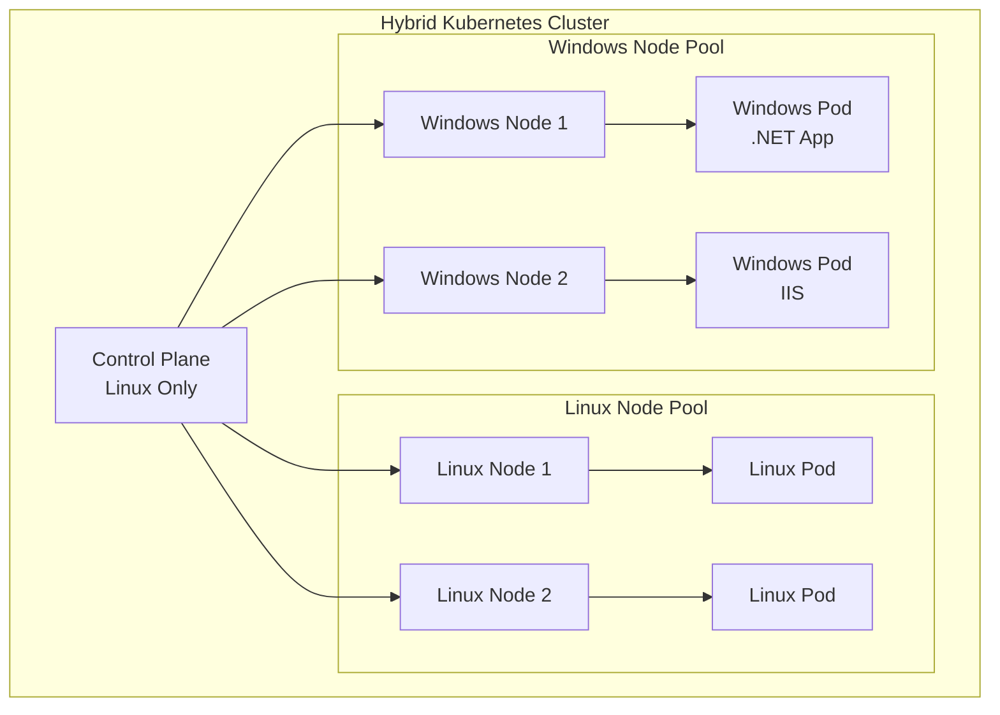

# How to Run Windows Containers in Kubernetes

Author: [nawazdhandala](https://www.github.com/nawazdhandala)

Tags: Kubernetes, Windows, Containers, Hybrid, Multi-OS, DevOps

Description: Learn how to run Windows containers alongside Linux containers in Kubernetes by configuring Windows node pools and deploying Windows workloads.

---

Windows container support in Kubernetes enables running .NET Framework, IIS, and other Windows-based applications. This guide covers setting up Windows nodes and deploying Windows workloads in a hybrid cluster.

## Windows Containers Overview



| Aspect | Linux | Windows |
|--------|-------|---------|
| Control Plane | ✅ Supported | ❌ Not Supported |
| Worker Nodes | ✅ Supported | ✅ Supported |
| Container Runtime | containerd, CRI-O | containerd |
| Networking | All CNIs | Limited CNI support |
| Storage | All CSI drivers | Limited CSI support |

## Prerequisites

### Windows Server Requirements

```plaintext
# Supported Windows versions:
- Windows Server 2019 (LTSC)
- Windows Server 2022 (LTSC)
- Windows Server SAC (Semi-Annual Channel)

# Kubernetes version:
- Kubernetes 1.14+ for Windows support
- Kubernetes 1.22+ recommended for GA features

# Container runtime:
- containerd 1.6+ (recommended)
```

## Setting Up Windows Nodes

### EKS Windows Node Group

```yaml
# eks-windows-nodegroup.yaml
apiVersion: eksctl.io/v1alpha5
kind: ClusterConfig
metadata:
  name: hybrid-cluster
  region: us-east-1

nodeGroups:
  # Linux nodes (required for system pods)
  - name: linux-ng
    instanceType: m5.large
    desiredCapacity: 2
    labels:
      kubernetes.io/os: linux
    taints:
      - key: "os"
        value: "linux"
        effect: "NoSchedule"

managedNodeGroups:
  # Windows nodes
  - name: windows-ng
    instanceType: m5.large
    desiredCapacity: 2
    amiFamily: WindowsServer2022FullContainer
    labels:
      kubernetes.io/os: windows
    taints:
      - key: "os"
        value: "windows"
        effect: "NoSchedule"
```

### AKS Windows Node Pool

```bash
# Create AKS cluster with Windows support
az aks create \
  --resource-group myResourceGroup \
  --name myAKSCluster \
  --node-count 2 \
  --network-plugin azure \
  --windows-admin-username azureuser \
  --windows-admin-password 'SecurePassword123!'

# Add Windows node pool
az aks nodepool add \
  --resource-group myResourceGroup \
  --cluster-name myAKSCluster \
  --name winnp \
  --os-type Windows \
  --os-sku Windows2022 \
  --node-count 2 \
  --node-vm-size Standard_D4s_v3 \
  --labels kubernetes.io/os=windows
```

### GKE Windows Node Pool

```bash
# Create GKE cluster
gcloud container clusters create hybrid-cluster \
  --zone us-central1-a \
  --num-nodes 2 \
  --enable-ip-alias

# Add Windows node pool
gcloud container node-pools create windows-pool \
  --cluster hybrid-cluster \
  --zone us-central1-a \
  --image-type WINDOWS_LTSC_CONTAINERD \
  --machine-type n1-standard-4 \
  --num-nodes 2 \
  --metadata disable-legacy-endpoints=true
```

### Manual Windows Node Setup

```powershell
# On Windows Server node
# Install containerd
$Version = "1.6.8"
curl.exe -L https://github.com/containerd/containerd/releases/download/v$Version/containerd-$Version-windows-amd64.tar.gz -o containerd.tar.gz
tar xvf containerd.tar.gz

# Configure containerd
mkdir "C:\Program Files\containerd"
Copy-Item .\bin\* "C:\Program Files\containerd"
cd "C:\Program Files\containerd"
.\containerd.exe config default | Set-Content config.toml

# Register and start containerd service
.\containerd.exe --register-service
Start-Service containerd

# Install kubeadm, kubelet, kubectl
curl.exe -LO https://dl.k8s.io/release/v1.28.0/bin/windows/amd64/kubeadm.exe
curl.exe -LO https://dl.k8s.io/release/v1.28.0/bin/windows/amd64/kubelet.exe
curl.exe -LO https://dl.k8s.io/release/v1.28.0/bin/windows/amd64/kubectl.exe
```

## Deploying Windows Workloads

### Simple Windows Deployment

```yaml
# windows-deployment.yaml
apiVersion: apps/v1
kind: Deployment
metadata:
  name: windows-app
  labels:
    app: windows-app
spec:
  replicas: 2
  selector:
    matchLabels:
      app: windows-app
  template:
    metadata:
      labels:
        app: windows-app
    spec:
      nodeSelector:
        kubernetes.io/os: windows
      tolerations:
        - key: "os"
          operator: "Equal"
          value: "windows"
          effect: "NoSchedule"
      containers:
        - name: windows-app
          image: mcr.microsoft.com/windows/servercore:ltsc2022
          command:
            - powershell
            - -Command
            - |
              while ($true) {
                Write-Host "Windows container running..."
                Start-Sleep -Seconds 10
              }
          resources:
            requests:
              cpu: "500m"
              memory: "1Gi"
            limits:
              cpu: "1"
              memory: "2Gi"
```

### IIS Web Server

```yaml
# iis-deployment.yaml
apiVersion: apps/v1
kind: Deployment
metadata:
  name: iis-web
spec:
  replicas: 3
  selector:
    matchLabels:
      app: iis-web
  template:
    metadata:
      labels:
        app: iis-web
    spec:
      nodeSelector:
        kubernetes.io/os: windows
      tolerations:
        - key: "os"
          operator: "Equal"
          value: "windows"
          effect: "NoSchedule"
      containers:
        - name: iis
          image: mcr.microsoft.com/windows/servercore/iis:windowsservercore-ltsc2022
          ports:
            - containerPort: 80
          resources:
            requests:
              cpu: "500m"
              memory: "1Gi"
            limits:
              cpu: "2"
              memory: "4Gi"
---
apiVersion: v1
kind: Service
metadata:
  name: iis-service
spec:
  selector:
    app: iis-web
  ports:
    - port: 80
      targetPort: 80
  type: LoadBalancer
```

### ASP.NET Application

```yaml
# aspnet-deployment.yaml
apiVersion: apps/v1
kind: Deployment
metadata:
  name: aspnet-app
spec:
  replicas: 3
  selector:
    matchLabels:
      app: aspnet-app
  template:
    metadata:
      labels:
        app: aspnet-app
    spec:
      nodeSelector:
        kubernetes.io/os: windows
      tolerations:
        - key: "os"
          operator: "Equal"
          value: "windows"
          effect: "NoSchedule"
      containers:
        - name: aspnet
          image: mcr.microsoft.com/dotnet/framework/aspnet:4.8-windowsservercore-ltsc2022
          ports:
            - containerPort: 80
          env:
            - name: ConnectionStrings__DefaultConnection
              valueFrom:
                secretKeyRef:
                  name: db-connection
                  key: connection-string
          volumeMounts:
            - name: config
              mountPath: C:\inetpub\wwwroot\Web.config
              subPath: Web.config
          resources:
            requests:
              cpu: "1"
              memory: "2Gi"
            limits:
              cpu: "2"
              memory: "4Gi"
          livenessProbe:
            httpGet:
              path: /health
              port: 80
            initialDelaySeconds: 30
            periodSeconds: 10
          readinessProbe:
            httpGet:
              path: /ready
              port: 80
            initialDelaySeconds: 10
            periodSeconds: 5
      volumes:
        - name: config
          configMap:
            name: aspnet-config
---
apiVersion: v1
kind: ConfigMap
metadata:
  name: aspnet-config
data:
  Web.config: |
    <?xml version="1.0" encoding="utf-8"?>
    <configuration>
      <appSettings>
        <add key="Environment" value="Kubernetes" />
      </appSettings>
    </configuration>
```

### .NET Core (Cross-Platform)

```yaml
# dotnet-core-deployment.yaml
apiVersion: apps/v1
kind: Deployment
metadata:
  name: dotnet-api
spec:
  replicas: 3
  selector:
    matchLabels:
      app: dotnet-api
  template:
    metadata:
      labels:
        app: dotnet-api
    spec:
      # Can run on both Linux and Windows
      affinity:
        nodeAffinity:
          preferredDuringSchedulingIgnoredDuringExecution:
            - weight: 100
              preference:
                matchExpressions:
                  - key: kubernetes.io/os
                    operator: In
                    values:
                      - linux
      containers:
        - name: api
          image: myregistry/dotnet-api:latest
          ports:
            - containerPort: 5000
          env:
            - name: ASPNETCORE_URLS
              value: "http://+:5000"
```

## Hybrid Application Architecture

### Frontend-Backend Split

```yaml
# hybrid-app.yaml
# Linux-based frontend (React/Angular)
apiVersion: apps/v1
kind: Deployment
metadata:
  name: frontend
spec:
  replicas: 3
  selector:
    matchLabels:
      app: frontend
  template:
    metadata:
      labels:
        app: frontend
    spec:
      nodeSelector:
        kubernetes.io/os: linux
      containers:
        - name: frontend
          image: nginx:alpine
          ports:
            - containerPort: 80
---
# Windows-based backend (.NET Framework)
apiVersion: apps/v1
kind: Deployment
metadata:
  name: backend-api
spec:
  replicas: 3
  selector:
    matchLabels:
      app: backend-api
  template:
    metadata:
      labels:
        app: backend-api
    spec:
      nodeSelector:
        kubernetes.io/os: windows
      tolerations:
        - key: "os"
          operator: "Equal"
          value: "windows"
          effect: "NoSchedule"
      containers:
        - name: api
          image: myregistry/legacy-api:latest
          ports:
            - containerPort: 80
---
# Service for cross-OS communication
apiVersion: v1
kind: Service
metadata:
  name: backend-api
spec:
  selector:
    app: backend-api
  ports:
    - port: 80
      targetPort: 80
```

## Windows-Specific Configurations

### Group Managed Service Accounts (gMSA)

```yaml
# gmsa-credential-spec.yaml
apiVersion: windows.k8s.io/v1
kind: GMSACredentialSpec
metadata:
  name: webapp-gmsa
credspec:
  ActiveDirectoryConfig:
    GroupManagedServiceAccounts:
      - Name: WebApp
        Scope: DOMAIN
    HostAccountConfig:
      PluginGUID: "{859E1386-BDB4-49E8-85C7-3070B13920E1}"
      PortableCcgVersion: "1"
      PluginInput: "ObjectGuid=<guid>;Sid=<sid>"
  CmsPlugins:
    - ActiveDirectory
  DomainJoinConfig:
    DnsName: domain.local
    DnsTreeName: domain.local
    Guid: <domain-guid>
    MachineAccountName: WebApp
    NetBiosName: DOMAIN
    Sid: <domain-sid>
---
# Pod using gMSA
apiVersion: v1
kind: Pod
metadata:
  name: gmsa-demo
spec:
  nodeSelector:
    kubernetes.io/os: windows
  securityContext:
    windowsOptions:
      gmsaCredentialSpecName: webapp-gmsa
  containers:
    - name: webapp
      image: myregistry/webapp:latest
```

### Host Process Containers

```yaml
# hostprocess-pod.yaml
apiVersion: v1
kind: Pod
metadata:
  name: windows-host-process
spec:
  nodeSelector:
    kubernetes.io/os: windows
  securityContext:
    windowsOptions:
      hostProcess: true
      runAsUserName: "NT AUTHORITY\\SYSTEM"
  hostNetwork: true
  containers:
    - name: host-process
      image: mcr.microsoft.com/windows/servercore:ltsc2022
      command:
        - powershell
        - -Command
        - |
          # Has access to host Windows
          Get-Process
          Get-Service
```

## Storage for Windows

### SMB Volume

```yaml
# smb-storage.yaml
apiVersion: v1
kind: PersistentVolume
metadata:
  name: smb-pv
spec:
  capacity:
    storage: 100Gi
  accessModes:
    - ReadWriteMany
  persistentVolumeReclaimPolicy: Retain
  storageClassName: smb
  mountOptions:
    - dir_mode=0777
    - file_mode=0777
  csi:
    driver: smb.csi.k8s.io
    volumeHandle: smb-server.default.svc.cluster.local/share
    volumeAttributes:
      source: //smb-server.default.svc.cluster.local/share
    nodeStageSecretRef:
      name: smb-creds
      namespace: default
---
apiVersion: v1
kind: Secret
metadata:
  name: smb-creds
type: Opaque
stringData:
  username: smbuser
  password: smbpassword
---
apiVersion: v1
kind: PersistentVolumeClaim
metadata:
  name: smb-pvc
spec:
  accessModes:
    - ReadWriteMany
  resources:
    requests:
      storage: 10Gi
  storageClassName: smb
```

### Azure Files for Windows

```yaml
# azure-files-windows.yaml
apiVersion: storage.k8s.io/v1
kind: StorageClass
metadata:
  name: azurefile-windows
provisioner: file.csi.azure.com
parameters:
  skuName: Standard_LRS
  protocol: smb
mountOptions:
  - dir_mode=0777
  - file_mode=0777
  - mfsymlinks
---
apiVersion: v1
kind: PersistentVolumeClaim
metadata:
  name: windows-storage
spec:
  accessModes:
    - ReadWriteMany
  storageClassName: azurefile-windows
  resources:
    requests:
      storage: 10Gi
```

## Networking Considerations

### Windows CNI Support

```yaml
# calico-windows-config.yaml
# Example Calico configuration for Windows
apiVersion: v1
kind: ConfigMap
metadata:
  name: calico-windows-config
  namespace: calico-system
data:
  CALICO_NETWORKING_BACKEND: "windows-bgp"
  KUBERNETES_SERVICE_HOST: "kubernetes.default.svc"
  KUBERNETES_SERVICE_PORT: "443"
  K8S_SERVICE_CIDR: "10.96.0.0/12"
```

### Service Configuration

```yaml
# windows-service.yaml
apiVersion: v1
kind: Service
metadata:
  name: windows-app-service
spec:
  selector:
    app: windows-app
  ports:
    - name: http
      port: 80
      targetPort: 80
    - name: https
      port: 443
      targetPort: 443
  type: LoadBalancer
  # External traffic policy for Windows
  externalTrafficPolicy: Cluster
```

## Monitoring Windows Containers

### Windows Exporter DaemonSet

```yaml
# windows-exporter.yaml
apiVersion: apps/v1
kind: DaemonSet
metadata:
  name: windows-exporter
  namespace: monitoring
spec:
  selector:
    matchLabels:
      app: windows-exporter
  template:
    metadata:
      labels:
        app: windows-exporter
      annotations:
        prometheus.io/scrape: "true"
        prometheus.io/port: "9182"
    spec:
      nodeSelector:
        kubernetes.io/os: windows
      tolerations:
        - key: "os"
          operator: "Equal"
          value: "windows"
          effect: "NoSchedule"
      containers:
        - name: windows-exporter
          image: ghcr.io/prometheus-community/windows-exporter:latest
          args:
            - --collectors.enabled
            - cpu,cs,logical_disk,memory,net,os,process,system
          ports:
            - containerPort: 9182
              name: metrics
```

## Troubleshooting

### Common Issues

```powershell
# Check Windows node status
kubectl get nodes -l kubernetes.io/os=windows

# Check Windows pod logs
kubectl logs <pod-name>

# Execute into Windows container
kubectl exec -it <pod-name> -- powershell

# Check container runtime on node (SSH to Windows node)
crictl ps
crictl logs <container-id>

# Check HNS (Host Networking Service)
Get-HnsNetwork
Get-HnsPolicyList
```

### Debug Container Networking

```powershell
# Inside Windows container
Get-NetAdapter
Get-NetIPAddress
Test-NetConnection -ComputerName backend-service -Port 80

# Check DNS resolution
Resolve-DnsName backend-service.default.svc.cluster.local
```

## Conclusion

Running Windows containers in Kubernetes enables:

1. **Hybrid workloads** - Linux and Windows side by side
2. **Legacy application support** - .NET Framework, IIS, Windows services
3. **Consistent management** - Same kubectl for all workloads
4. **Gradual modernization** - Move to containers without rewriting

For monitoring your Windows workloads in Kubernetes, check out [OneUptime's container monitoring](https://oneuptime.com/product/metrics).

## Related Resources

- [How to Configure Node Affinity](https://oneuptime.com/blog/post/2026-01-19-kubernetes-node-affinity-anti-affinity/view)
- [How to Configure Taints and Tolerations](https://oneuptime.com/blog/post/2026-01-19-kubernetes-taints-tolerations-scheduling/view)
- [How to Set Up Prometheus Monitoring](https://oneuptime.com/blog/post/2026-01-19-kubernetes-prometheus-servicemonitor/view)
