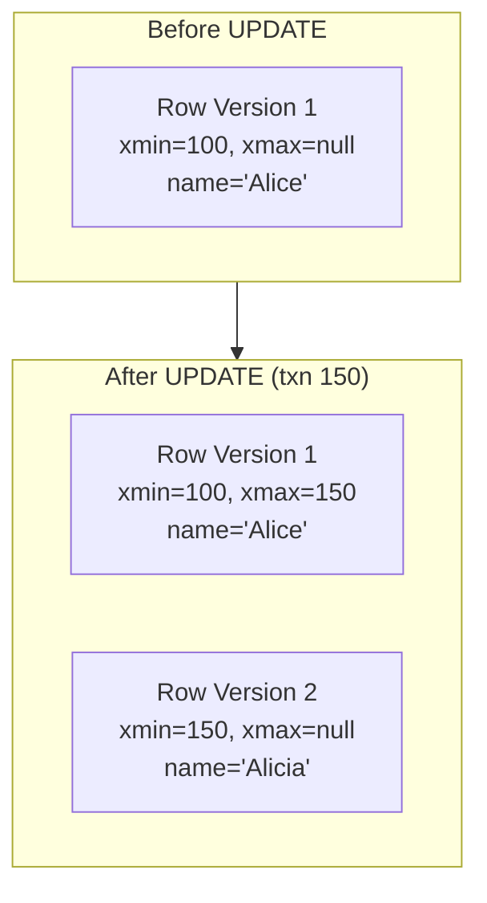

# How to Handle Concurrency with MVCC in PostgreSQL

Author: [nawazdhandala](https://www.github.com/nawazdhandala)

Tags: PostgreSQL, MVCC, Concurrency, Transactions, Database Internals, Performance

Description: Understand how PostgreSQL's Multi-Version Concurrency Control (MVCC) works, why it matters for application performance, and how to avoid common pitfalls like table bloat and long-running transactions.

---

PostgreSQL handles concurrent access differently than many databases. Instead of locking rows during reads, it keeps multiple versions of each row and shows transactions only the versions they should see. This approach, called Multi-Version Concurrency Control (MVCC), enables high concurrency without readers blocking writers.

## How MVCC Works

When you update a row, PostgreSQL does not modify it in place. Instead, it creates a new version and marks the old version as obsolete. Each row version carries metadata about which transactions can see it.



Key row metadata fields:

- **xmin**: Transaction ID that created this row version
- **xmax**: Transaction ID that deleted/updated this row (null if active)
- **ctid**: Physical location of the row

## Transaction Visibility Rules

A transaction sees a row version if:
1. The creating transaction (xmin) committed before this transaction started
2. The row has not been deleted, or the deleting transaction (xmax) has not committed

```sql
-- Transaction A (xid = 200) starts
BEGIN;

-- Transaction B (xid = 201) updates a row
-- Creates new version with xmin=201

-- Transaction A still sees the old version
-- because 201 has not committed yet

-- Transaction B commits
COMMIT;

-- Transaction A STILL sees the old version
-- because A's snapshot was taken before B committed
```

## Examining Row Versions

Use system columns to inspect MVCC metadata:

```sql
-- Create test table
CREATE TABLE accounts (
    id serial PRIMARY KEY,
    name varchar(100),
    balance numeric(10,2)
);

INSERT INTO accounts (name, balance) VALUES ('Alice', 1000);

-- View row metadata
SELECT ctid, xmin, xmax, id, name, balance
FROM accounts;
```

Result:
```
 ctid  | xmin | xmax | id | name  | balance
-------+------+------+----+-------+---------
 (0,1) |  100 |    0 |  1 | Alice | 1000.00
```

Now update the row:

```sql
UPDATE accounts SET balance = 1500 WHERE id = 1;

-- Check metadata again
SELECT ctid, xmin, xmax, id, name, balance
FROM accounts;
```

The ctid changed because a new row version was created at a different physical location.

## Transaction Isolation Levels

PostgreSQL supports four isolation levels that affect MVCC behavior:

### Read Committed (Default)

Each statement sees a new snapshot. Other committed changes become visible between statements.

```sql
SET TRANSACTION ISOLATION LEVEL READ COMMITTED;

BEGIN;
SELECT balance FROM accounts WHERE id = 1;  -- Sees 1000

-- Another transaction updates balance to 1500 and commits

SELECT balance FROM accounts WHERE id = 1;  -- Sees 1500
COMMIT;
```

### Repeatable Read

The entire transaction uses a single snapshot taken at the first query.

```sql
SET TRANSACTION ISOLATION LEVEL REPEATABLE READ;

BEGIN;
SELECT balance FROM accounts WHERE id = 1;  -- Sees 1000

-- Another transaction updates balance to 1500 and commits

SELECT balance FROM accounts WHERE id = 1;  -- Still sees 1000
COMMIT;
```

### Serializable

The strictest level. PostgreSQL detects conflicts that would violate serializability.

```sql
SET TRANSACTION ISOLATION LEVEL SERIALIZABLE;

-- If two serializable transactions conflict,
-- one will fail with:
-- ERROR: could not serialize access due to concurrent update
```

## Common Concurrency Patterns

### Optimistic Locking with Version Columns

```sql
-- Add version column
ALTER TABLE accounts ADD COLUMN version integer DEFAULT 1;

-- Application reads row
SELECT id, balance, version FROM accounts WHERE id = 1;
-- Returns: id=1, balance=1000, version=1

-- Update only if version matches
UPDATE accounts
SET balance = 1200, version = version + 1
WHERE id = 1 AND version = 1;

-- If affected rows = 0, another transaction modified the row
-- Application should re-read and retry
```

### Pessimistic Locking with SELECT FOR UPDATE

```sql
BEGIN;

-- Lock the row for this transaction
SELECT * FROM accounts WHERE id = 1 FOR UPDATE;

-- Other transactions trying to lock this row will wait

UPDATE accounts SET balance = balance - 100 WHERE id = 1;

COMMIT;
```

### Advisory Locks for Application-Level Locking

```sql
-- Acquire an advisory lock (non-blocking)
SELECT pg_try_advisory_lock(12345);

-- Do work...

-- Release the lock
SELECT pg_advisory_unlock(12345);
```

## Table Bloat and VACUUM

Dead row versions accumulate over time. VACUUM removes them.

```sql
-- Check table bloat
SELECT
    schemaname,
    tablename,
    n_dead_tup,
    n_live_tup,
    round(100 * n_dead_tup / nullif(n_live_tup + n_dead_tup, 0), 2) AS dead_ratio
FROM pg_stat_user_tables
WHERE n_dead_tup > 0
ORDER BY n_dead_tup DESC;
```

### Manual VACUUM

```sql
-- Regular vacuum (removes dead tuples, updates statistics)
VACUUM accounts;

-- Vacuum with verbose output
VACUUM VERBOSE accounts;

-- Vacuum and reclaim disk space (locks table)
VACUUM FULL accounts;
```

### Autovacuum Configuration

```sql
-- Check autovacuum settings
SHOW autovacuum;
SHOW autovacuum_vacuum_threshold;
SHOW autovacuum_vacuum_scale_factor;

-- Per-table autovacuum settings for high-churn tables
ALTER TABLE accounts SET (
    autovacuum_vacuum_threshold = 50,
    autovacuum_vacuum_scale_factor = 0.05,
    autovacuum_analyze_threshold = 50,
    autovacuum_analyze_scale_factor = 0.05
);
```

## Transaction ID Wraparound

PostgreSQL uses 32-bit transaction IDs that wrap around. VACUUM prevents issues by freezing old row versions.

```sql
-- Check transaction ID age
SELECT
    datname,
    age(datfrozenxid) AS xid_age,
    current_setting('autovacuum_freeze_max_age') AS freeze_threshold
FROM pg_database
ORDER BY age(datfrozenxid) DESC;
```

If xid_age approaches 2 billion, you have a wraparound risk. Ensure autovacuum runs regularly.

## Long-Running Transactions

Long transactions hold back VACUUM from removing dead tuples.

```sql
-- Find long-running transactions
SELECT
    pid,
    now() - xact_start AS duration,
    state,
    query
FROM pg_stat_activity
WHERE xact_start IS NOT NULL
  AND state != 'idle'
ORDER BY xact_start;

-- Check oldest transaction preventing cleanup
SELECT
    backend_xmin,
    backend_xid,
    pid,
    now() - xact_start AS duration
FROM pg_stat_activity
WHERE backend_xmin IS NOT NULL
ORDER BY age(backend_xmin) DESC;
```

## Monitoring MVCC Health

### Dead Tuple Ratio

```sql
-- Tables with high dead tuple ratio need attention
SELECT
    schemaname || '.' || relname AS table_name,
    n_live_tup,
    n_dead_tup,
    round(100.0 * n_dead_tup / nullif(n_live_tup + n_dead_tup, 0), 2) AS pct_dead,
    last_vacuum,
    last_autovacuum
FROM pg_stat_user_tables
WHERE n_live_tup > 1000
ORDER BY pct_dead DESC NULLS LAST;
```

### VACUUM Progress

```sql
-- Monitor running vacuum operations
SELECT
    p.pid,
    a.query,
    p.phase,
    p.heap_blks_total,
    p.heap_blks_scanned,
    p.heap_blks_vacuumed,
    round(100.0 * p.heap_blks_vacuumed / nullif(p.heap_blks_total, 0), 2) AS pct_complete
FROM pg_stat_progress_vacuum p
JOIN pg_stat_activity a ON p.pid = a.pid;
```

## Best Practices

### Keep Transactions Short

```python
# Bad: Long transaction
with connection.cursor() as cursor:
    cursor.execute("BEGIN")
    # ... lots of processing ...
    time.sleep(60)  # Holds back vacuum for 60 seconds
    cursor.execute("COMMIT")

# Good: Quick transaction
with connection.cursor() as cursor:
    cursor.execute("BEGIN")
    cursor.execute("UPDATE accounts SET balance = %s WHERE id = %s", (new_balance, id))
    cursor.execute("COMMIT")
```

### Use Appropriate Isolation Levels

```sql
-- Read Committed for most OLTP workloads (default)
-- Repeatable Read for reports that need consistent snapshot
-- Serializable for financial calculations requiring strict consistency
```

### Monitor and Tune Autovacuum

```ini
# postgresql.conf for high-write workloads
autovacuum_max_workers = 4
autovacuum_naptime = 10s
autovacuum_vacuum_cost_limit = 1000
```

---

MVCC gives PostgreSQL excellent read/write concurrency, but it requires understanding the trade-offs. Dead tuples accumulate, transactions hold visibility horizons, and autovacuum needs resources. Monitor your tables for bloat, keep transactions short, and ensure autovacuum runs effectively. With these practices, MVCC becomes a performance advantage rather than a maintenance burden.
