# Why Markdown Is the Best Format for Note-Taking

Author: [nawazdhandala](https://www.github.com/nawazdhandala)

Tags: Markdown, Productivity, Note-Taking, Developer Tools, Knowledge Management, Git, Plain Text

Description: Discover why Markdown has become the ultimate format for note-taking. Learn how plain text files outlast proprietary apps, integrate with Git for versioning, work with any tool, and put you in control of your knowledge base forever.

---

> Your notes are your second brain. Why would you lock your second brain inside someone else's proprietary vault?

---

## The Problem with Note-Taking Apps

We've all been there. You invest months or years building a knowledge base in a shiny note-taking app. Then one of these happens:

- The company gets acquired and shuts down
- Pricing changes make it unaffordable
- A "sync conflict" corrupts your data
- You want to switch tools but can't export cleanly
- The app goes offline and you can't access your own notes

**Your knowledge becomes hostage to someone else's business decisions.**

This diagram illustrates the typical lifecycle of proprietary note-taking platforms. Users invest heavily, then face disruption when the platform changes.

```mermaid
flowchart LR
    subgraph Vendor["Proprietary Note App"]
        direction TB
        A[Start Using App] --> B[Build Knowledge Base]
        B --> C[Years of Notes]
        C --> D{Platform Change}
        D --> E[Price Increase]
        D --> F[App Shutdown]
        D --> G[Feature Removal]
        D --> H[Export Limitations]
    end
    
    E --> I[😱 Migrate or Pay]
    F --> I
    G --> I
    H --> I
    
    I --> J[Start Over]
```



The solution? **Files over platforms. Markdown over proprietary formats.**

---

## Why Markdown Wins for Note-Taking

### 1. Files Are Forever

A `.md` file from 2004 opens perfectly in 2026. Can you say the same about notes from Evernote Classic? Or Google Keep? Or that startup note app that no longer exists?

**Markdown files will outlive every note-taking app on the market.**

Text files are the oldest and most universal data format in computing. They survived:
- The transition from mainframes to PCs
- The shift from desktop to mobile
- The move from local to cloud
- Every operating system change in history

Your Markdown notes will still be readable when today's SaaS apps are forgotten footnotes in tech history.

### 2. Git Versioning: Time Travel for Your Notes

This is the killer feature that no proprietary app can match. Put your notes in a Git repository and you get:

This script demonstrates initializing a notes repository with Git. Each commit creates a permanent, recoverable snapshot of your entire knowledge base.

```bash
#!/bin/bash
# initialize-notes-repo.sh
# Set up a Git-versioned notes repository

# Create and initialize the notes directory
mkdir -p ~/notes
cd ~/notes
git init

# Create initial structure
mkdir -p projects meetings learning journal

# Create a sample note
cat > projects/example-project.md << 'EOF'
# Example Project Notes

## 2026-01-19: Project Kickoff

- Defined scope and timeline
- Assigned team members
- Set up initial infrastructure

## Next Steps

- [ ] Create detailed specifications
- [ ] Set up CI/CD pipeline
- [ ] Schedule design review
EOF

# Make first commit
git add .
git commit -m "Initial notes structure"

echo "Notes repository initialized at ~/notes"
```

**What Git gives you:**

| Feature | How It Helps |
|---------|--------------|
| Complete history | See every change ever made to any note |
| Blame tracking | Know when and why something was added |
| Branch experimentation | Try reorganizations without risk |
| Distributed backup | Push to GitHub/GitLab for automatic backup |
| Diff viewing | See exactly what changed between versions |
| Conflict resolution | Merge changes from multiple devices |

**No sync conflicts. No data loss. No "oops, I deleted something important."**

This script shows how to view the history of changes to a specific note. Git's log and diff commands reveal the complete evolution of your thinking.

```bash
#!/bin/bash
# view-note-history.sh
# Explore the history of a specific note

NOTE_PATH="projects/example-project.md"

# View all changes to this file
echo "=== Commit history for $NOTE_PATH ==="
git log --oneline -- "$NOTE_PATH"

# See what changed in the last commit
echo -e "\n=== Last change ==="
git diff HEAD~1 -- "$NOTE_PATH"

# Restore a previous version (without committing)
echo -e "\n=== Previous version preview ==="
git show HEAD~1:"$NOTE_PATH"
```

### 3. Any Tool, Any Time

Markdown works with literally every text editor ever created:

**Simple editors:**
- Notepad, TextEdit, nano, vim
- VS Code, Sublime Text, Atom
- Any IDE you already use

**Dedicated Markdown editors:**
- Obsidian, Typora, iA Writer
- Mark Text, Zettlr, Notable

**Rendering and publishing:**
- GitHub, GitLab (auto-renders README.md)
- Jekyll, Hugo, Gatsby (static site generators)
- Pandoc (converts to PDF, DOCX, HTML, anything)

**The key insight:** You're never locked to one tool. Switch editors whenever you want. Your notes don't care.

This diagram shows how Markdown files serve as a universal hub. Any tool can read or write them, giving you complete freedom.

```mermaid
flowchart TB
    subgraph Files["Your Markdown Files"]
        MD[("📄 .md files")]
    end
    
    subgraph Editors["Write With"]
        E1[VS Code]
        E2[Obsidian]
        E3[Vim/Neovim]
        E4[Any Text Editor]
    end
    
    subgraph Tools["Process With"]
        T1[Git for versioning]
        T2[grep/ripgrep for search]
        T3[Pandoc for conversion]
        T4[Custom scripts]
    end
    
    subgraph Output["Publish To"]
        O1[GitHub Pages]
        O2[PDF Documents]
        O3[HTML Websites]
        O4[Confluence/Notion import]
    end
    
    E1 <--> MD
    E2 <--> MD
    E3 <--> MD
    E4 <--> MD
    
    MD <--> T1
    MD <--> T2
    MD <--> T3
    MD <--> T4
    
    T3 --> O1
    T3 --> O2
    T3 --> O3
    T3 --> O4
```



### 4. Search That Actually Works

With Markdown files, you can use the most powerful search tools ever created:

This script demonstrates searching notes with ripgrep. Command-line tools provide instant, powerful search across thousands of notes.

```bash
#!/bin/bash
# search-notes.sh
# Powerful search patterns for Markdown notes

NOTES_DIR=~/notes

# Find all notes mentioning "kubernetes"
echo "=== Notes about Kubernetes ==="
rg -l "kubernetes" "$NOTES_DIR" --type md

# Find TODO items across all notes
echo -e "\n=== All TODO items ==="
rg "- \[ \]" "$NOTES_DIR" --type md

# Find notes modified this week
echo -e "\n=== Recently modified ==="
find "$NOTES_DIR" -name "*.md" -mtime -7

# Full-text search with context
echo -e "\n=== Search with context ==="
rg -C 2 "important decision" "$NOTES_DIR" --type md

# Find all headers in a file
echo -e "\n=== Document structure ==="
rg "^#+ " "$NOTES_DIR/projects/example-project.md"
```

**Search options you get with plain files:**

| Tool | Best For |
|------|----------|
| `grep` / `ripgrep` | Fast text search across all files |
| `find` | Locate files by name, date, size |
| `fzf` | Fuzzy finding with preview |
| VS Code search | IDE-integrated multi-file search |
| Obsidian search | Graph-aware semantic search |

Every search tool built in the last 50 years works with your Markdown notes. Can Notion say that?

### 5. Your Files, Your Rules

With Markdown, you control everything. You own it and markdowns are simple text documents anyway.

## Common Objections Answered

### "But I need sync across devices!"

Use any file sync service:
- Git + GitHub/GitLab (best for versioning)
- Dropbox, Google Drive, iCloud
- Syncthing (self-hosted, encrypted)

### "But I need mobile editing!"

Mobile Markdown editors that work with synced files:
- **iOS:** iA Writer, 1Writer, Obsidian Mobile
- **Android:** Obsidian Mobile, Markor, iA Writer

### "But I need collaboration!"

- Git + pull requests for async collaboration
- HackMD/CodiMD for real-time collaborative Markdown
- Simply share the file via any cloud storage

### "But Markdown doesn't support X!"

Markdown is extensible:
- Tables: supported
- Diagrams: Mermaid syntax
- Math: LaTeX syntax ($e = mc^2$)
- Custom elements: HTML works in Markdown

---

## The Bottom Line

Markdown for note-taking isn't about being trendy or technical. It's about **owning your knowledge**.

Your notes contain years of accumulated wisdom, decisions, and context. They deserve a format that:

- ✅ Will exist forever (plain text)
- ✅ Works with any tool (universal format)
- ✅ Supports versioning (Git-compatible)
- ✅ Belongs to you (local files)
- ✅ Costs nothing (free and open)

**Stop renting your second brain. Own it.**

---