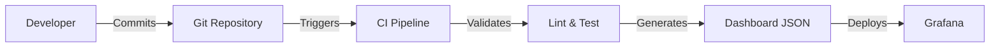

# How to Provision Dashboards as Code in Grafana

Author: [nawazdhandala](https://www.github.com/nawazdhandala)

Tags: Grafana, Dashboards as Code, GitOps, Provisioning, Infrastructure as Code, DevOps

Description: Learn how to manage Grafana dashboards as code using provisioning, Grafonnet, and GitOps workflows for version-controlled, reproducible dashboard deployments.

---

Clicking through the Grafana UI to create dashboards works for prototyping, but production environments need dashboards managed as code. This enables version control, code review, automated deployment, and consistent environments. This guide covers multiple approaches to dashboard-as-code.

## Why Dashboards as Code?

Manual dashboard management creates problems:
- No history of who changed what and when
- Inconsistent dashboards across environments
- Lost work when dashboards are accidentally deleted
- No review process for dashboard changes

Dashboards as code solves these issues by treating dashboards like any other configuration.

## Approach 1: Grafana Provisioning

Grafana can automatically load dashboards from files on startup. This is the simplest approach.

### Directory Structure

```
/etc/grafana/provisioning/
├── dashboards/
│   └── dashboard-provider.yaml
└── dashboards-json/
    ├── kubernetes-cluster.json
    ├── application-overview.json
    └── service-detail.json
```

### Configure the Dashboard Provider

```yaml
# /etc/grafana/provisioning/dashboards/dashboard-provider.yaml
apiVersion: 1

providers:
  - name: 'default'
    orgId: 1
    folder: 'Provisioned'
    folderUid: 'provisioned'
    type: file
    disableDeletion: false
    updateIntervalSeconds: 30
    allowUiUpdates: true
    options:
      path: /etc/grafana/provisioning/dashboards-json
      foldersFromFilesStructure: true
```

Key options:
- **disableDeletion**: When true, dashboards cannot be deleted from UI
- **updateIntervalSeconds**: How often to check for changes
- **allowUiUpdates**: Whether UI changes are saved back to files
- **foldersFromFilesStructure**: Create folders matching directory structure

### Dashboard JSON Format

Export an existing dashboard or create one:

```json
{
  "uid": "kubernetes-cluster",
  "title": "Kubernetes Cluster Overview",
  "tags": ["kubernetes", "cluster"],
  "timezone": "browser",
  "schemaVersion": 39,
  "version": 1,
  "refresh": "30s",
  "panels": [
    {
      "id": 1,
      "type": "stat",
      "title": "Node Count",
      "gridPos": { "h": 4, "w": 6, "x": 0, "y": 0 },
      "targets": [
        {
          "expr": "count(kube_node_info)",
          "refId": "A"
        }
      ],
      "options": {
        "colorMode": "value",
        "graphMode": "none"
      }
    },
    {
      "id": 2,
      "type": "timeseries",
      "title": "CPU Usage by Node",
      "gridPos": { "h": 8, "w": 12, "x": 0, "y": 4 },
      "targets": [
        {
          "expr": "sum by (node) (rate(node_cpu_seconds_total{mode!=\"idle\"}[5m]))",
          "legendFormat": "{{node}}",
          "refId": "A"
        }
      ]
    }
  ],
  "templating": {
    "list": [
      {
        "name": "namespace",
        "type": "query",
        "query": "label_values(kube_pod_info, namespace)",
        "datasource": { "type": "prometheus", "uid": "prometheus" }
      }
    ]
  }
}
```

### Kubernetes Deployment

Deploy dashboards via ConfigMaps:

```yaml
# dashboards-configmap.yaml
apiVersion: v1
kind: ConfigMap
metadata:
  name: grafana-dashboards
  namespace: monitoring
  labels:
    grafana_dashboard: "1"
data:
  kubernetes-cluster.json: |
    {
      "uid": "kubernetes-cluster",
      "title": "Kubernetes Cluster Overview",
      ...
    }
```

Configure the Grafana sidecar to watch for ConfigMaps:

```yaml
# grafana-values.yaml (Helm)
sidecar:
  dashboards:
    enabled: true
    label: grafana_dashboard
    labelValue: "1"
    folder: /tmp/dashboards
    searchNamespace: ALL
```

## Approach 2: Grafonnet (Jsonnet)

Grafonnet is a Jsonnet library for generating Grafana dashboards programmatically. It reduces repetition and enables reusable components.

### Install Grafonnet

```bash
# Install jsonnet
brew install jsonnet

# Install jsonnet-bundler for dependency management
go install github.com/jsonnet-bundler/jsonnet-bundler/cmd/jb@latest

# Initialize project and install grafonnet
mkdir grafana-dashboards && cd grafana-dashboards
jb init
jb install github.com/grafana/grafonnet/gen/grafonnet-latest@main
```

### Create a Dashboard with Grafonnet

```jsonnet
// dashboards/service-overview.jsonnet
local g = import 'github.com/grafana/grafonnet/gen/grafonnet-latest/main.libsonnet';

local dashboard = g.dashboard;
local panel = g.panel;
local prometheus = g.query.prometheus;

// Reusable query builder
local promQuery(expr, legendFormat='') =
  prometheus.new('prometheus', expr)
  + prometheus.withLegendFormat(legendFormat);

// Stat panel helper
local statPanel(title, query) =
  panel.stat.new(title)
  + panel.stat.queryOptions.withTargets([query])
  + panel.stat.standardOptions.withUnit('short')
  + panel.stat.options.withColorMode('value');

// Time series panel helper
local timeSeriesPanel(title, queries) =
  panel.timeSeries.new(title)
  + panel.timeSeries.queryOptions.withTargets(queries)
  + panel.timeSeries.options.legend.withDisplayMode('table')
  + panel.timeSeries.options.legend.withPlacement('bottom');

// Build the dashboard
dashboard.new('Service Overview')
+ dashboard.withUid('service-overview')
+ dashboard.withTags(['service', 'overview'])
+ dashboard.withRefresh('30s')
+ dashboard.withTimezone('browser')
+ dashboard.withPanels([
  statPanel(
    'Request Rate',
    promQuery('sum(rate(http_requests_total[5m]))', '')
  )
  + panel.stat.gridPos.withW(6)
  + panel.stat.gridPos.withH(4)
  + panel.stat.gridPos.withX(0)
  + panel.stat.gridPos.withY(0),

  statPanel(
    'Error Rate',
    promQuery('sum(rate(http_requests_total{status_code=~"5.."}[5m])) / sum(rate(http_requests_total[5m])) * 100', '')
  )
  + panel.stat.standardOptions.withUnit('percent')
  + panel.stat.gridPos.withW(6)
  + panel.stat.gridPos.withH(4)
  + panel.stat.gridPos.withX(6)
  + panel.stat.gridPos.withY(0),

  timeSeriesPanel(
    'Request Rate by Status',
    [promQuery('sum by (status_code) (rate(http_requests_total[5m]))', '{{status_code}}')]
  )
  + panel.timeSeries.gridPos.withW(24)
  + panel.timeSeries.gridPos.withH(8)
  + panel.timeSeries.gridPos.withX(0)
  + panel.timeSeries.gridPos.withY(4),
])
```

### Generate JSON from Jsonnet

```bash
# Generate single dashboard
jsonnet -J vendor dashboards/service-overview.jsonnet > output/service-overview.json

# Generate all dashboards
for file in dashboards/*.jsonnet; do
  name=$(basename "$file" .jsonnet)
  jsonnet -J vendor "$file" > "output/${name}.json"
done
```

## Approach 3: Terraform Provider

Use Terraform to manage Grafana resources:

```hcl
# main.tf
terraform {
  required_providers {
    grafana = {
      source  = "grafana/grafana"
      version = "~> 2.0"
    }
  }
}

provider "grafana" {
  url  = "https://grafana.example.com"
  auth = var.grafana_api_key
}

# Create a folder
resource "grafana_folder" "kubernetes" {
  title = "Kubernetes"
}

# Create a dashboard from JSON file
resource "grafana_dashboard" "kubernetes_cluster" {
  folder      = grafana_folder.kubernetes.id
  config_json = file("${path.module}/dashboards/kubernetes-cluster.json")
}

# Create a dashboard from template
resource "grafana_dashboard" "service" {
  for_each = toset(["api", "web", "worker"])

  folder = grafana_folder.kubernetes.id
  config_json = templatefile("${path.module}/templates/service.json.tpl", {
    service_name = each.key
    uid          = "service-${each.key}"
  })
}
```

## GitOps Workflow

Integrate dashboards into your CI/CD pipeline:



### GitHub Actions Workflow

```yaml
# .github/workflows/grafana-dashboards.yaml
name: Deploy Grafana Dashboards

on:
  push:
    branches: [main]
    paths:
      - 'dashboards/**'
  pull_request:
    paths:
      - 'dashboards/**'

jobs:
  validate:
    runs-on: ubuntu-latest
    steps:
      - uses: actions/checkout@v4

      - name: Install jsonnet
        run: |
          wget https://github.com/google/go-jsonnet/releases/download/v0.20.0/jsonnet-go_0.20.0_linux_amd64.tar.gz
          tar -xzf jsonnet-go_0.20.0_linux_amd64.tar.gz
          sudo mv jsonnet /usr/local/bin/

      - name: Install dependencies
        run: |
          go install github.com/jsonnet-bundler/jsonnet-bundler/cmd/jb@latest
          jb install

      - name: Generate dashboards
        run: |
          mkdir -p output
          for file in dashboards/*.jsonnet; do
            name=$(basename "$file" .jsonnet)
            jsonnet -J vendor "$file" > "output/${name}.json"
          done

      - name: Validate JSON
        run: |
          for file in output/*.json; do
            jq empty "$file"
          done

  deploy:
    needs: validate
    if: github.ref == 'refs/heads/main'
    runs-on: ubuntu-latest
    steps:
      - uses: actions/checkout@v4

      - name: Generate dashboards
        run: |
          # Same generation steps as above
          mkdir -p output
          for file in dashboards/*.jsonnet; do
            name=$(basename "$file" .jsonnet)
            jsonnet -J vendor "$file" > "output/${name}.json"
          done

      - name: Deploy to Grafana
        env:
          GRAFANA_URL: ${{ secrets.GRAFANA_URL }}
          GRAFANA_API_KEY: ${{ secrets.GRAFANA_API_KEY }}
        run: |
          for file in output/*.json; do
            curl -X POST "$GRAFANA_URL/api/dashboards/db" \
              -H "Authorization: Bearer $GRAFANA_API_KEY" \
              -H "Content-Type: application/json" \
              -d "{\"dashboard\": $(cat $file), \"overwrite\": true}"
          done
```

## Versioning Strategy

### Using Dashboard UIDs

Always set explicit UIDs in dashboards:

```json
{
  "uid": "service-overview-v2",
  "title": "Service Overview",
  "version": 2
}
```

UIDs prevent duplicate dashboards when reimporting.

### Version in Tags

Include version in tags for tracking:

```json
{
  "tags": ["service", "v2.1.0"]
}
```

### Changelog in Description

Document changes in the dashboard description:

```json
{
  "description": "v2.1.0: Added latency percentiles panel\nv2.0.0: Redesigned layout\nv1.0.0: Initial version"
}
```

## Best Practices

1. **Store dashboards in Git**: Version control all dashboard definitions
2. **Review dashboard changes**: Require PR reviews for dashboard changes
3. **Use consistent naming**: Follow naming conventions for UIDs and titles
4. **Modularize with Grafonnet**: Create reusable components for common patterns
5. **Test in staging first**: Deploy to staging environment before production
6. **Document variables**: Explain what each variable controls
7. **Export before migrating**: Export existing dashboards before converting to code

## Migrating Existing Dashboards

Export existing dashboards and convert to code:

```bash
# Export dashboard via API
curl -H "Authorization: Bearer $GRAFANA_API_KEY" \
  "$GRAFANA_URL/api/dashboards/uid/existing-dashboard" | jq '.dashboard' > exported.json

# Clean up the export
# Remove: id, version (let Grafana assign them)
# Keep: uid (for updates)
jq 'del(.id, .version)' exported.json > dashboard.json
```

Dashboards as code requires initial investment but pays off in maintainability, consistency, and collaboration. Start with provisioning for simple setups, graduate to Grafonnet for complex environments, and integrate with your existing GitOps workflow for full automation.
