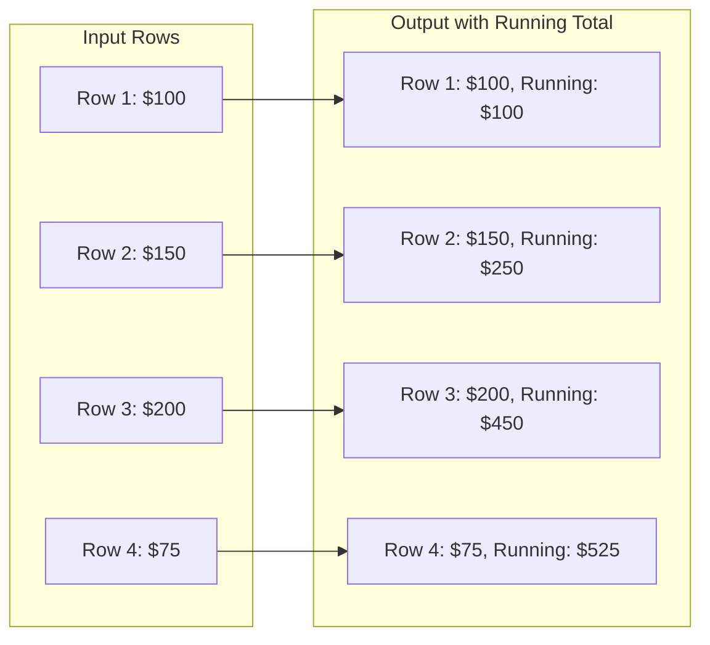

# How to Calculate Running Totals with Window Functions in PostgreSQL

Author: [nawazdhandala](https://www.github.com/nawazdhandala)

Tags: PostgreSQL, SQL, Window Functions, Analytics, Running Totals, Data Analysis

Description: Master PostgreSQL window functions to calculate running totals, moving averages, rankings, and cumulative statistics without complex subqueries or self-joins.

---

Running totals and cumulative calculations used to require painful self-joins or correlated subqueries. PostgreSQL window functions let you perform these calculations in a single pass over the data, making your queries faster and easier to read.

## Understanding Window Functions

A window function performs calculations across a set of rows related to the current row. Unlike GROUP BY, it does not collapse rows.



## Basic Running Total

Let's start with sales data:

```sql
-- Create sample data
CREATE TABLE sales (
    id serial PRIMARY KEY,
    sale_date date,
    region varchar(50),
    amount numeric(10,2)
);

INSERT INTO sales (sale_date, region, amount) VALUES
    ('2026-01-01', 'North', 1500),
    ('2026-01-01', 'South', 2000),
    ('2026-01-02', 'North', 1800),
    ('2026-01-02', 'South', 1200),
    ('2026-01-03', 'North', 2200),
    ('2026-01-03', 'South', 1900),
    ('2026-01-04', 'North', 1600),
    ('2026-01-04', 'South', 2100);
```

Calculate a running total ordered by date:

```sql
SELECT
    sale_date,
    region,
    amount,
    SUM(amount) OVER (ORDER BY sale_date) AS running_total
FROM sales
ORDER BY sale_date, region;
```

Result:
```
 sale_date  | region | amount  | running_total
------------+--------+---------+---------------
 2026-01-01 | North  | 1500.00 |       3500.00
 2026-01-01 | South  | 2000.00 |       3500.00
 2026-01-02 | North  | 1800.00 |       6500.00
 2026-01-02 | South  | 1200.00 |       6500.00
```

Notice that rows with the same date get the same running total. This is the default behavior.

## Running Total with Row-Level Precision

To calculate a true row-by-row running total, use ROWS BETWEEN:

```sql
SELECT
    sale_date,
    region,
    amount,
    SUM(amount) OVER (
        ORDER BY sale_date, id
        ROWS BETWEEN UNBOUNDED PRECEDING AND CURRENT ROW
    ) AS running_total
FROM sales
ORDER BY sale_date, id;
```

Result:
```
 sale_date  | region | amount  | running_total
------------+--------+---------+---------------
 2026-01-01 | North  | 1500.00 |       1500.00
 2026-01-01 | South  | 2000.00 |       3500.00
 2026-01-02 | North  | 1800.00 |       5300.00
 2026-01-02 | South  | 1200.00 |       6500.00
```

## Partitioned Running Totals

Calculate running totals within each region:

```sql
SELECT
    sale_date,
    region,
    amount,
    SUM(amount) OVER (
        PARTITION BY region
        ORDER BY sale_date
        ROWS BETWEEN UNBOUNDED PRECEDING AND CURRENT ROW
    ) AS regional_running_total
FROM sales
ORDER BY region, sale_date;
```

Result:
```
 sale_date  | region | amount  | regional_running_total
------------+--------+---------+------------------------
 2026-01-01 | North  | 1500.00 |                1500.00
 2026-01-02 | North  | 1800.00 |                3300.00
 2026-01-03 | North  | 2200.00 |                5500.00
 2026-01-04 | North  | 1600.00 |                7100.00
 2026-01-01 | South  | 2000.00 |                2000.00
 2026-01-02 | South  | 1200.00 |                3200.00
```

## Moving Averages

Calculate a 3-day moving average:

```sql
SELECT
    sale_date,
    amount,
    ROUND(
        AVG(amount) OVER (
            ORDER BY sale_date
            ROWS BETWEEN 2 PRECEDING AND CURRENT ROW
        ),
        2
    ) AS moving_avg_3day
FROM sales
ORDER BY sale_date;
```

For daily aggregates first:

```sql
WITH daily_totals AS (
    SELECT sale_date, SUM(amount) AS daily_amount
    FROM sales
    GROUP BY sale_date
)
SELECT
    sale_date,
    daily_amount,
    ROUND(
        AVG(daily_amount) OVER (
            ORDER BY sale_date
            ROWS BETWEEN 2 PRECEDING AND CURRENT ROW
        ),
        2
    ) AS moving_avg_3day
FROM daily_totals
ORDER BY sale_date;
```

## Percentage of Total

Calculate each row's contribution to the total:

```sql
SELECT
    sale_date,
    region,
    amount,
    ROUND(
        100.0 * amount / SUM(amount) OVER (),
        2
    ) AS percent_of_total
FROM sales
ORDER BY percent_of_total DESC;
```

Percentage within each region:

```sql
SELECT
    sale_date,
    region,
    amount,
    ROUND(
        100.0 * amount / SUM(amount) OVER (PARTITION BY region),
        2
    ) AS percent_of_region
FROM sales
ORDER BY region, percent_of_region DESC;
```

## Ranking Functions

### ROW_NUMBER for Sequential Numbering

```sql
SELECT
    ROW_NUMBER() OVER (ORDER BY amount DESC) AS rank,
    sale_date,
    region,
    amount
FROM sales;
```

### RANK with Ties

```sql
SELECT
    RANK() OVER (ORDER BY amount DESC) AS rank,
    sale_date,
    amount
FROM sales;
```

### DENSE_RANK without Gaps

```sql
SELECT
    DENSE_RANK() OVER (ORDER BY amount DESC) AS dense_rank,
    sale_date,
    amount
FROM sales;
```

### Top N per Group

Find the top 2 sales per region:

```sql
WITH ranked AS (
    SELECT
        sale_date,
        region,
        amount,
        ROW_NUMBER() OVER (
            PARTITION BY region
            ORDER BY amount DESC
        ) AS rn
    FROM sales
)
SELECT sale_date, region, amount
FROM ranked
WHERE rn <= 2
ORDER BY region, amount DESC;
```

## Lead and Lag Functions

Compare current row to previous or next rows:

```sql
SELECT
    sale_date,
    amount,
    LAG(amount, 1) OVER (ORDER BY sale_date) AS prev_day,
    amount - LAG(amount, 1) OVER (ORDER BY sale_date) AS change,
    LEAD(amount, 1) OVER (ORDER BY sale_date) AS next_day
FROM (
    SELECT sale_date, SUM(amount) AS amount
    FROM sales
    GROUP BY sale_date
) daily
ORDER BY sale_date;
```

Calculate day-over-day percentage change:

```sql
WITH daily AS (
    SELECT sale_date, SUM(amount) AS amount
    FROM sales
    GROUP BY sale_date
)
SELECT
    sale_date,
    amount,
    LAG(amount, 1) OVER (ORDER BY sale_date) AS prev_amount,
    ROUND(
        100.0 * (amount - LAG(amount, 1) OVER (ORDER BY sale_date))
        / LAG(amount, 1) OVER (ORDER BY sale_date),
        2
    ) AS pct_change
FROM daily
ORDER BY sale_date;
```

## First and Last Values

Get the first and last values within a window:

```sql
SELECT
    sale_date,
    region,
    amount,
    FIRST_VALUE(amount) OVER (
        PARTITION BY region
        ORDER BY sale_date
    ) AS first_sale,
    LAST_VALUE(amount) OVER (
        PARTITION BY region
        ORDER BY sale_date
        ROWS BETWEEN UNBOUNDED PRECEDING AND UNBOUNDED FOLLOWING
    ) AS last_sale
FROM sales
ORDER BY region, sale_date;
```

## Named Windows for Reusability

Define a window once and reuse it:

```sql
SELECT
    sale_date,
    region,
    amount,
    SUM(amount) OVER regional_window AS regional_total,
    AVG(amount) OVER regional_window AS regional_avg,
    ROW_NUMBER() OVER regional_window AS row_num
FROM sales
WINDOW regional_window AS (
    PARTITION BY region
    ORDER BY sale_date
    ROWS BETWEEN UNBOUNDED PRECEDING AND CURRENT ROW
)
ORDER BY region, sale_date;
```

## Cumulative Distribution

Calculate percentile rankings:

```sql
SELECT
    sale_date,
    region,
    amount,
    ROUND(
        CUME_DIST() OVER (ORDER BY amount) * 100,
        2
    ) AS percentile,
    NTILE(4) OVER (ORDER BY amount) AS quartile
FROM sales
ORDER BY amount;
```

## Real-World Example: Account Balance History

Track account balance over time:

```sql
CREATE TABLE transactions (
    id serial PRIMARY KEY,
    account_id integer,
    txn_date date,
    txn_type varchar(10),
    amount numeric(10,2)
);

INSERT INTO transactions (account_id, txn_date, txn_type, amount) VALUES
    (1, '2026-01-01', 'deposit', 1000),
    (1, '2026-01-05', 'withdraw', -200),
    (1, '2026-01-10', 'deposit', 500),
    (1, '2026-01-15', 'withdraw', -150),
    (2, '2026-01-02', 'deposit', 2000),
    (2, '2026-01-08', 'withdraw', -300);

-- Calculate running balance per account
SELECT
    account_id,
    txn_date,
    txn_type,
    amount,
    SUM(amount) OVER (
        PARTITION BY account_id
        ORDER BY txn_date, id
        ROWS BETWEEN UNBOUNDED PRECEDING AND CURRENT ROW
    ) AS balance
FROM transactions
ORDER BY account_id, txn_date;
```

Result:
```
 account_id |  txn_date  | txn_type | amount  | balance
------------+------------+----------+---------+---------
          1 | 2026-01-01 | deposit  | 1000.00 | 1000.00
          1 | 2026-01-05 | withdraw | -200.00 |  800.00
          1 | 2026-01-10 | deposit  |  500.00 | 1300.00
          1 | 2026-01-15 | withdraw | -150.00 | 1150.00
          2 | 2026-01-02 | deposit  | 2000.00 | 2000.00
          2 | 2026-01-08 | withdraw | -300.00 | 1700.00
```

---

Window functions eliminate the need for self-joins and correlated subqueries. They process data in a single pass, improving both performance and readability. Start with simple running totals, then explore rankings, moving averages, and lag/lead comparisons. Once you understand the OVER clause syntax, these calculations become second nature.
