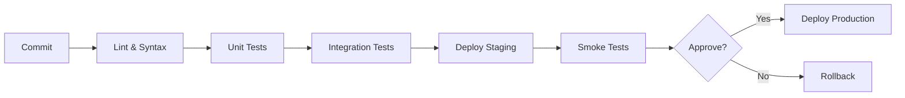

# How to Integrate Ansible with CI/CD

Author: [nawazdhandala](https://www.github.com/nawazdhandala)

Tags: Ansible, CI/CD, DevOps, GitHub Actions, GitLab CI, Jenkins, Automation

Description: Integrate Ansible into your CI/CD pipelines for automated testing, deployment, and infrastructure provisioning with GitHub Actions, GitLab CI, and Jenkins.

---

CI/CD pipelines turn Ansible from a manual tool into automated infrastructure delivery. Every commit can trigger tests, every merge can deploy to staging, and every release can provision production. Integrating Ansible with your CI/CD platform ensures consistent, repeatable deployments while maintaining the audit trail your security team loves.

This guide covers integrating Ansible with popular CI/CD platforms and best practices for pipeline design.

## Pipeline Design Principles

Before diving into specific platforms, consider these design principles:

1. **Test before deploy**: Run syntax checks and molecule tests before any deployment
2. **Environment progression**: dev -> staging -> production with gates
3. **Secrets management**: Never store credentials in repositories
4. **Idempotency verification**: Run playbooks twice to verify no unexpected changes
5. **Rollback capability**: Always have a way to revert changes



## GitHub Actions Integration

Create workflows for testing and deployment.

### Testing Workflow

```yaml
# .github/workflows/ansible-test.yml
name: Ansible Tests

on:
  push:
    branches: [main, develop]
  pull_request:
    branches: [main]

env:
  ANSIBLE_FORCE_COLOR: "1"
  PY_COLORS: "1"

jobs:
  lint:
    name: Lint
    runs-on: ubuntu-latest
    steps:
      - name: Checkout
        uses: actions/checkout@v4

      - name: Set up Python
        uses: actions/setup-python@v5
        with:
          python-version: "3.11"

      - name: Install dependencies
        run: |
          pip install ansible ansible-lint yamllint

      - name: Run yamllint
        run: yamllint .

      - name: Run ansible-lint
        run: ansible-lint

  syntax-check:
    name: Syntax Check
    runs-on: ubuntu-latest
    needs: lint
    steps:
      - uses: actions/checkout@v4

      - name: Set up Python
        uses: actions/setup-python@v5
        with:
          python-version: "3.11"

      - name: Install Ansible
        run: pip install ansible

      - name: Install collections
        run: ansible-galaxy collection install -r requirements.yml

      - name: Syntax check all playbooks
        run: |
          for playbook in playbooks/*.yml; do
            ansible-playbook "$playbook" --syntax-check
          done

  molecule:
    name: Molecule Tests
    runs-on: ubuntu-latest
    needs: syntax-check
    strategy:
      matrix:
        role:
          - common
          - nginx
          - postgresql
      fail-fast: false

    steps:
      - uses: actions/checkout@v4

      - name: Set up Python
        uses: actions/setup-python@v5
        with:
          python-version: "3.11"

      - name: Install dependencies
        run: |
          pip install molecule molecule-plugins[docker] ansible pytest-testinfra

      - name: Run Molecule tests
        run: |
          cd roles/${{ matrix.role }}
          molecule test
```

### Deployment Workflow

```yaml
# .github/workflows/deploy.yml
name: Deploy

on:
  push:
    branches: [main]
  workflow_dispatch:
    inputs:
      environment:
        description: "Environment to deploy to"
        required: true
        default: "staging"
        type: choice
        options:
          - staging
          - production
      playbook:
        description: "Playbook to run"
        required: true
        default: "site.yml"

jobs:
  deploy-staging:
    name: Deploy to Staging
    runs-on: ubuntu-latest
    environment: staging
    if: github.event_name == 'push' || github.event.inputs.environment == 'staging'

    steps:
      - name: Checkout
        uses: actions/checkout@v4

      - name: Set up Python
        uses: actions/setup-python@v5
        with:
          python-version: "3.11"

      - name: Install Ansible
        run: |
          pip install ansible boto3

      - name: Install collections
        run: ansible-galaxy collection install -r requirements.yml

      - name: Configure SSH key
        run: |
          mkdir -p ~/.ssh
          echo "${{ secrets.SSH_PRIVATE_KEY }}" > ~/.ssh/deploy_key
          chmod 600 ~/.ssh/deploy_key
          ssh-keyscan -H ${{ secrets.STAGING_HOST }} >> ~/.ssh/known_hosts

      - name: Create vault password file
        run: echo "${{ secrets.ANSIBLE_VAULT_PASSWORD }}" > .vault_pass

      - name: Run playbook
        run: |
          ansible-playbook playbooks/${{ github.event.inputs.playbook || 'site.yml' }} \
            -i inventory/staging/ \
            --vault-password-file .vault_pass \
            --private-key ~/.ssh/deploy_key \
            -e "deploy_version=${{ github.sha }}"

      - name: Cleanup
        if: always()
        run: rm -f .vault_pass ~/.ssh/deploy_key

  deploy-production:
    name: Deploy to Production
    runs-on: ubuntu-latest
    environment: production
    needs: deploy-staging
    if: github.event.inputs.environment == 'production'

    steps:
      - name: Checkout
        uses: actions/checkout@v4

      - name: Set up Python
        uses: actions/setup-python@v5
        with:
          python-version: "3.11"

      - name: Install Ansible
        run: pip install ansible boto3

      - name: Install collections
        run: ansible-galaxy collection install -r requirements.yml

      - name: Configure SSH key
        run: |
          mkdir -p ~/.ssh
          echo "${{ secrets.SSH_PRIVATE_KEY }}" > ~/.ssh/deploy_key
          chmod 600 ~/.ssh/deploy_key

      - name: Create vault password file
        run: echo "${{ secrets.ANSIBLE_VAULT_PASSWORD }}" > .vault_pass

      - name: Run playbook with confirmation
        run: |
          ansible-playbook playbooks/site.yml \
            -i inventory/production/ \
            --vault-password-file .vault_pass \
            --private-key ~/.ssh/deploy_key \
            -e "deploy_version=${{ github.sha }}"

      - name: Cleanup
        if: always()
        run: rm -f .vault_pass ~/.ssh/deploy_key
```

## GitLab CI Integration

Configure GitLab CI with environments and approvals.

```yaml
# .gitlab-ci.yml
stages:
  - lint
  - test
  - deploy-staging
  - deploy-production

variables:
  ANSIBLE_FORCE_COLOR: "true"
  PY_COLORS: "1"

.ansible-base:
  image: python:3.11
  before_script:
    - pip install ansible ansible-lint boto3
    - ansible-galaxy collection install -r requirements.yml
    - echo "$ANSIBLE_VAULT_PASSWORD" > .vault_pass
    - mkdir -p ~/.ssh
    - echo "$SSH_PRIVATE_KEY" > ~/.ssh/id_rsa
    - chmod 600 ~/.ssh/id_rsa
  after_script:
    - rm -f .vault_pass ~/.ssh/id_rsa

lint:
  stage: lint
  image: python:3.11
  script:
    - pip install ansible-lint yamllint
    - yamllint .
    - ansible-lint
  rules:
    - if: $CI_PIPELINE_SOURCE == "merge_request_event"
    - if: $CI_COMMIT_BRANCH == $CI_DEFAULT_BRANCH

syntax-check:
  stage: lint
  extends: .ansible-base
  script:
    - |
      for playbook in playbooks/*.yml; do
        ansible-playbook "$playbook" --syntax-check
      done
  rules:
    - if: $CI_PIPELINE_SOURCE == "merge_request_event"
    - if: $CI_COMMIT_BRANCH == $CI_DEFAULT_BRANCH

molecule-tests:
  stage: test
  image: docker:24
  services:
    - docker:24-dind
  variables:
    DOCKER_HOST: tcp://docker:2375
  before_script:
    - apk add --no-cache python3 py3-pip
    - pip install molecule molecule-plugins[docker] ansible pytest-testinfra
  script:
    - |
      for role in roles/*/; do
        if [ -d "$role/molecule" ]; then
          cd "$role"
          molecule test
          cd ../..
        fi
      done
  rules:
    - if: $CI_PIPELINE_SOURCE == "merge_request_event"
    - if: $CI_COMMIT_BRANCH == $CI_DEFAULT_BRANCH

deploy-staging:
  stage: deploy-staging
  extends: .ansible-base
  environment:
    name: staging
    url: https://staging.example.com
  script:
    - |
      ansible-playbook playbooks/site.yml \
        -i inventory/staging/ \
        --vault-password-file .vault_pass \
        -e "deploy_version=$CI_COMMIT_SHA"
  rules:
    - if: $CI_COMMIT_BRANCH == $CI_DEFAULT_BRANCH

deploy-production:
  stage: deploy-production
  extends: .ansible-base
  environment:
    name: production
    url: https://example.com
  script:
    - |
      ansible-playbook playbooks/site.yml \
        -i inventory/production/ \
        --vault-password-file .vault_pass \
        -e "deploy_version=$CI_COMMIT_SHA"
  rules:
    - if: $CI_COMMIT_BRANCH == $CI_DEFAULT_BRANCH
      when: manual
  needs:
    - deploy-staging
```

## Jenkins Integration

Configure Jenkins with declarative pipeline.

```groovy
// Jenkinsfile
pipeline {
    agent {
        docker {
            image 'python:3.11'
            args '-v /var/run/docker.sock:/var/run/docker.sock'
        }
    }

    environment {
        ANSIBLE_FORCE_COLOR = 'true'
        ANSIBLE_VAULT_PASSWORD = credentials('ansible-vault-password')
        SSH_KEY = credentials('deploy-ssh-key')
    }

    parameters {
        choice(
            name: 'ENVIRONMENT',
            choices: ['staging', 'production'],
            description: 'Deployment environment'
        )
        string(
            name: 'PLAYBOOK',
            defaultValue: 'site.yml',
            description: 'Playbook to run'
        )
    }

    stages {
        stage('Setup') {
            steps {
                sh '''
                    pip install ansible ansible-lint boto3
                    ansible-galaxy collection install -r requirements.yml
                '''
            }
        }

        stage('Lint') {
            steps {
                sh 'pip install yamllint ansible-lint'
                sh 'yamllint .'
                sh 'ansible-lint'
            }
        }

        stage('Syntax Check') {
            steps {
                sh '''
                    for playbook in playbooks/*.yml; do
                        ansible-playbook "$playbook" --syntax-check
                    done
                '''
            }
        }

        stage('Deploy Staging') {
            when {
                anyOf {
                    branch 'main'
                    expression { params.ENVIRONMENT == 'staging' }
                }
            }
            steps {
                script {
                    withCredentials([
                        file(credentialsId: 'deploy-ssh-key', variable: 'SSH_KEY_FILE'),
                        string(credentialsId: 'ansible-vault-password', variable: 'VAULT_PASS')
                    ]) {
                        sh '''
                            mkdir -p ~/.ssh
                            cp $SSH_KEY_FILE ~/.ssh/deploy_key
                            chmod 600 ~/.ssh/deploy_key
                            echo "$VAULT_PASS" > .vault_pass

                            ansible-playbook playbooks/${PLAYBOOK} \
                                -i inventory/staging/ \
                                --vault-password-file .vault_pass \
                                --private-key ~/.ssh/deploy_key \
                                -e "deploy_version=${GIT_COMMIT}"

                            rm -f .vault_pass ~/.ssh/deploy_key
                        '''
                    }
                }
            }
        }

        stage('Approval') {
            when {
                expression { params.ENVIRONMENT == 'production' }
            }
            steps {
                input message: 'Deploy to production?', ok: 'Deploy'
            }
        }

        stage('Deploy Production') {
            when {
                expression { params.ENVIRONMENT == 'production' }
            }
            steps {
                script {
                    withCredentials([
                        file(credentialsId: 'deploy-ssh-key', variable: 'SSH_KEY_FILE'),
                        string(credentialsId: 'ansible-vault-password', variable: 'VAULT_PASS')
                    ]) {
                        sh '''
                            mkdir -p ~/.ssh
                            cp $SSH_KEY_FILE ~/.ssh/deploy_key
                            chmod 600 ~/.ssh/deploy_key
                            echo "$VAULT_PASS" > .vault_pass

                            ansible-playbook playbooks/${PLAYBOOK} \
                                -i inventory/production/ \
                                --vault-password-file .vault_pass \
                                --private-key ~/.ssh/deploy_key \
                                -e "deploy_version=${GIT_COMMIT}"

                            rm -f .vault_pass ~/.ssh/deploy_key
                        '''
                    }
                }
            }
        }
    }

    post {
        always {
            cleanWs()
        }
        success {
            slackSend(
                color: 'good',
                message: "Deployment successful: ${env.JOB_NAME} #${env.BUILD_NUMBER}"
            )
        }
        failure {
            slackSend(
                color: 'danger',
                message: "Deployment failed: ${env.JOB_NAME} #${env.BUILD_NUMBER}"
            )
        }
    }
}
```

## Secrets Management

Never store secrets in repositories. Use CI/CD platform secret management.

### GitHub Secrets

```bash
# Set secrets via GitHub CLI
gh secret set ANSIBLE_VAULT_PASSWORD --body "your_vault_password"
gh secret set SSH_PRIVATE_KEY < ~/.ssh/deploy_key
```

### GitLab Variables

```bash
# Set via GitLab API
curl --request POST \
  --header "PRIVATE-TOKEN: $GITLAB_TOKEN" \
  --form "key=ANSIBLE_VAULT_PASSWORD" \
  --form "value=your_vault_password" \
  --form "protected=true" \
  --form "masked=true" \
  "https://gitlab.com/api/v4/projects/PROJECT_ID/variables"
```

### HashiCorp Vault Integration

```yaml
# GitHub Actions with Vault
- name: Import secrets from Vault
  uses: hashicorp/vault-action@v2
  with:
    url: https://vault.example.com
    method: jwt
    role: ansible-deploy
    secrets: |
      secret/data/ansible/vault_password value | ANSIBLE_VAULT_PASSWORD ;
      secret/data/ansible/ssh_key value | SSH_PRIVATE_KEY

- name: Run playbook
  run: |
    echo "$SSH_PRIVATE_KEY" > ~/.ssh/deploy_key
    chmod 600 ~/.ssh/deploy_key
    echo "$ANSIBLE_VAULT_PASSWORD" > .vault_pass
    ansible-playbook playbooks/site.yml --vault-password-file .vault_pass
```

## Best Practices

### 1. Use Environment Protection

```yaml
# GitHub repository settings
# Settings > Environments > production
# - Required reviewers: @senior-devs
# - Wait timer: 5 minutes
# - Deployment branches: main only
```

### 2. Run Diff Before Apply

```yaml
- name: Show changes without applying
  run: ansible-playbook playbooks/site.yml --check --diff

- name: Apply changes
  run: ansible-playbook playbooks/site.yml
```

### 3. Tag Deployments

```yaml
- name: Tag deployment
  run: |
    git tag "deploy-${{ github.run_number }}-$(date +%Y%m%d)"
    git push origin --tags
```

### 4. Parallel Testing

```yaml
strategy:
  matrix:
    os: [ubuntu-22.04, debian-12, rocky-9]
    role: [common, nginx, postgresql]
  fail-fast: false
```

---

CI/CD integration transforms Ansible into an automated delivery system. Start with basic syntax checking and linting, add molecule tests for role validation, then implement staged deployments with approval gates. The goal is confidence that every deployment is tested, consistent, and reversible.
