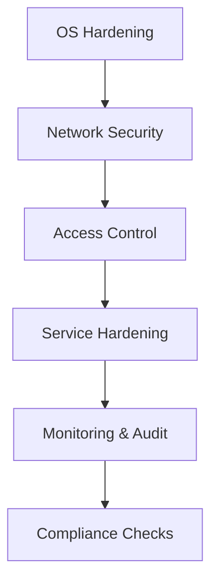

# How to Implement Security Hardening with Ansible

Author: [nawazdhandala](https://www.github.com/nawazdhandala)

Tags: Ansible, Security, Hardening, CIS Benchmarks, DevSecOps, Compliance

Description: Automate security hardening with Ansible using CIS benchmarks, security baselines, and compliance checks to protect your infrastructure systematically.

---

Manual security hardening is error-prone and impossible to maintain at scale. Ansible enables consistent security configuration across your entire infrastructure, from SSH hardening to kernel parameters. By codifying security standards as playbooks, you create an auditable, repeatable process that evolves with your security requirements.

This guide covers implementing comprehensive security hardening with Ansible based on CIS benchmarks and industry best practices.

## Security Hardening Strategy

Security hardening should be layered:



Each layer builds on the previous, creating defense in depth.

## SSH Hardening

SSH is often the first target for attackers. Lock it down.

```yaml
# roles/ssh_hardening/tasks/main.yml
---
- name: Configure SSH daemon
  template:
    src: sshd_config.j2
    dest: /etc/ssh/sshd_config
    owner: root
    group: root
    mode: '0600'
    validate: '/usr/sbin/sshd -t -f %s'
  notify: restart sshd

- name: Ensure SSH host keys have correct permissions
  file:
    path: "{{ item }}"
    owner: root
    group: root
    mode: '0600'
  loop:
    - /etc/ssh/ssh_host_rsa_key
    - /etc/ssh/ssh_host_ecdsa_key
    - /etc/ssh/ssh_host_ed25519_key
  notify: restart sshd

- name: Remove weak SSH host keys
  file:
    path: /etc/ssh/ssh_host_dsa_key
    state: absent
  notify: restart sshd

- name: Configure SSH banner
  copy:
    content: |
      *******************************************************************
      *                         WARNING                                  *
      *  This system is for authorized users only.                      *
      *  All activities are logged and monitored.                       *
      *  Unauthorized access will be prosecuted.                        *
      *******************************************************************
    dest: /etc/ssh/banner
    owner: root
    group: root
    mode: '0644'
```

```jinja2
# roles/ssh_hardening/templates/sshd_config.j2
# SSH Server Configuration - Hardened
# Managed by Ansible

# Protocol and listening
Port {{ ssh_port | default(22) }}
Protocol 2
AddressFamily inet
ListenAddress 0.0.0.0

# Host keys - prefer Ed25519 and ECDSA
HostKey /etc/ssh/ssh_host_ed25519_key
HostKey /etc/ssh/ssh_host_ecdsa_key
HostKey /etc/ssh/ssh_host_rsa_key

# Ciphers and key exchange
KexAlgorithms curve25519-sha256@libssh.org,ecdh-sha2-nistp521,ecdh-sha2-nistp384,ecdh-sha2-nistp256
Ciphers chacha20-poly1305@openssh.com,aes256-gcm@openssh.com,aes128-gcm@openssh.com
MACs hmac-sha2-512-etm@openssh.com,hmac-sha2-256-etm@openssh.com

# Authentication
PermitRootLogin {{ 'prohibit-password' if allow_root_ssh_keys else 'no' }}
PubkeyAuthentication yes
PasswordAuthentication {{ 'yes' if allow_password_auth else 'no' }}
PermitEmptyPasswords no
ChallengeResponseAuthentication no
UsePAM yes

# Access control
AllowUsers {{ ssh_allowed_users | default(['deploy']) | join(' ') }}

AllowGroups {{ ssh_allowed_groups | join(' ') }}


# Session settings
MaxAuthTries 3
MaxSessions 5
LoginGraceTime 30
ClientAliveInterval 300
ClientAliveCountMax 2

# Forwarding
AllowTcpForwarding {{ 'yes' if allow_tcp_forwarding else 'no' }}
X11Forwarding no
AllowAgentForwarding {{ 'yes' if allow_agent_forwarding else 'no' }}

# Security
StrictModes yes
IgnoreRhosts yes
HostbasedAuthentication no
PermitUserEnvironment no

# Logging
SyslogFacility AUTH
LogLevel VERBOSE

# Banner
Banner /etc/ssh/banner
PrintMotd no
PrintLastLog yes
```

## User and Access Control

Implement least privilege access.

```yaml
# roles/access_control/tasks/main.yml
---
- name: Create security groups
  group:
    name: "{{ item.name }}"
    gid: "{{ item.gid | default(omit) }}"
    state: present
  loop: "{{ security_groups }}"

- name: Configure sudo access
  template:
    src: sudoers.j2
    dest: /etc/sudoers.d/ansible-managed
    owner: root
    group: root
    mode: '0440'
    validate: '/usr/sbin/visudo -cf %s'

- name: Set password policies
  template:
    src: login.defs.j2
    dest: /etc/login.defs
    owner: root
    group: root
    mode: '0644'

- name: Configure PAM password quality
  template:
    src: pwquality.conf.j2
    dest: /etc/security/pwquality.conf
    owner: root
    group: root
    mode: '0644'

- name: Lock inactive user accounts
  user:
    name: "{{ item }}"
    password_lock: yes
  loop: "{{ inactive_users | default([]) }}"

- name: Remove unauthorized users
  user:
    name: "{{ item }}"
    state: absent
    remove: yes
  loop: "{{ unauthorized_users | default([]) }}"

- name: Set file permissions on sensitive files
  file:
    path: "{{ item.path }}"
    owner: "{{ item.owner | default('root') }}"
    group: "{{ item.group | default('root') }}"
    mode: "{{ item.mode }}"
  loop:
    - { path: '/etc/passwd', mode: '0644' }
    - { path: '/etc/shadow', mode: '0000' }
    - { path: '/etc/group', mode: '0644' }
    - { path: '/etc/gshadow', mode: '0000' }
    - { path: '/etc/sudoers', mode: '0440' }
    - { path: '/etc/ssh/sshd_config', mode: '0600' }
```

```jinja2
# roles/access_control/templates/sudoers.j2
# Sudoers configuration - Managed by Ansible
Defaults    env_reset
Defaults    mail_badpass
Defaults    secure_path="/usr/local/sbin:/usr/local/bin:/usr/sbin:/usr/bin:/sbin:/bin"
Defaults    logfile="/var/log/sudo.log"
Defaults    log_input, log_output
Defaults    requiretty
Defaults    use_pty

# Root access
root    ALL=(ALL:ALL) ALL

# Admin group with full sudo
%sudo   ALL=(ALL:ALL) ALL

# Deploy user for automation
deploy  ALL=(ALL) NOPASSWD: /usr/bin/systemctl, /usr/bin/docker

# Application-specific permissions

{{ rule.user }}  {{ rule.hosts | default('ALL') }}=({{ rule.runas | default('ALL') }}) NOPASSWD: {{ rule.commands | join(', ') }}

```

## Kernel and System Hardening

Configure kernel parameters for security.

```yaml
# roles/kernel_hardening/tasks/main.yml
---
- name: Configure kernel security parameters
  sysctl:
    name: "{{ item.key }}"
    value: "{{ item.value }}"
    state: present
    reload: yes
    sysctl_file: /etc/sysctl.d/99-security.conf
  loop: "{{ kernel_security_params }}"

- name: Disable unnecessary kernel modules
  template:
    src: disable-modules.conf.j2
    dest: /etc/modprobe.d/disable-modules.conf
    owner: root
    group: root
    mode: '0644'
```

```yaml
# roles/kernel_hardening/defaults/main.yml
---
kernel_security_params:
  # Network security
  - { key: 'net.ipv4.conf.all.send_redirects', value: '0' }
  - { key: 'net.ipv4.conf.default.send_redirects', value: '0' }
  - { key: 'net.ipv4.conf.all.accept_source_route', value: '0' }
  - { key: 'net.ipv4.conf.default.accept_source_route', value: '0' }
  - { key: 'net.ipv4.conf.all.accept_redirects', value: '0' }
  - { key: 'net.ipv4.conf.default.accept_redirects', value: '0' }
  - { key: 'net.ipv4.conf.all.secure_redirects', value: '0' }
  - { key: 'net.ipv4.conf.default.secure_redirects', value: '0' }
  - { key: 'net.ipv4.conf.all.log_martians', value: '1' }
  - { key: 'net.ipv4.conf.default.log_martians', value: '1' }
  - { key: 'net.ipv4.icmp_echo_ignore_broadcasts', value: '1' }
  - { key: 'net.ipv4.icmp_ignore_bogus_error_responses', value: '1' }
  - { key: 'net.ipv4.conf.all.rp_filter', value: '1' }
  - { key: 'net.ipv4.conf.default.rp_filter', value: '1' }
  - { key: 'net.ipv4.tcp_syncookies', value: '1' }

  # IPv6 hardening
  - { key: 'net.ipv6.conf.all.accept_redirects', value: '0' }
  - { key: 'net.ipv6.conf.default.accept_redirects', value: '0' }
  - { key: 'net.ipv6.conf.all.accept_source_route', value: '0' }
  - { key: 'net.ipv6.conf.default.accept_source_route', value: '0' }
  - { key: 'net.ipv6.conf.all.disable_ipv6', value: "{{ '1' if disable_ipv6 else '0' }}" }

  # Kernel hardening
  - { key: 'kernel.randomize_va_space', value: '2' }
  - { key: 'kernel.dmesg_restrict', value: '1' }
  - { key: 'kernel.kptr_restrict', value: '2' }
  - { key: 'kernel.yama.ptrace_scope', value: '1' }
  - { key: 'kernel.sysrq', value: '0' }

  # File system
  - { key: 'fs.suid_dumpable', value: '0' }
  - { key: 'fs.protected_hardlinks', value: '1' }
  - { key: 'fs.protected_symlinks', value: '1' }

disabled_kernel_modules:
  - cramfs
  - freevxfs
  - jffs2
  - hfs
  - hfsplus
  - udf
  - dccp
  - sctp
  - rds
  - tipc
  - usb-storage
```

## Firewall Configuration

Configure firewall rules with either iptables or firewalld.

```yaml
# roles/firewall/tasks/main.yml
---
- name: Install firewalld
  package:
    name: firewalld
    state: present
  when: firewall_backend == 'firewalld'

- name: Start and enable firewalld
  service:
    name: firewalld
    state: started
    enabled: yes
  when: firewall_backend == 'firewalld'

- name: Configure firewall zones
  firewalld:
    zone: "{{ item.zone }}"
    source: "{{ item.source | default(omit) }}"
    service: "{{ item.service | default(omit) }}"
    port: "{{ item.port | default(omit) }}"
    permanent: yes
    immediate: yes
    state: enabled
  loop: "{{ firewall_rules }}"
  when: firewall_backend == 'firewalld'

- name: Set default zone
  command: firewall-cmd --set-default-zone={{ firewall_default_zone }}
  when: firewall_backend == 'firewalld'

# iptables alternative
- name: Configure iptables rules
  iptables:
    chain: "{{ item.chain }}"
    protocol: "{{ item.protocol | default('tcp') }}"
    destination_port: "{{ item.port | default(omit) }}"
    source: "{{ item.source | default(omit) }}"
    jump: "{{ item.action }}"
    comment: "{{ item.comment | default(omit) }}"
  loop: "{{ iptables_rules }}"
  when: firewall_backend == 'iptables'

- name: Save iptables rules
  shell: iptables-save > /etc/iptables/rules.v4
  when: firewall_backend == 'iptables'
```

```yaml
# group_vars/all/firewall.yml
---
firewall_backend: firewalld
firewall_default_zone: drop

firewall_rules:
  - zone: public
    service: ssh

  - zone: public
    port: "80/tcp"

  - zone: public
    port: "443/tcp"

  - zone: internal
    source: "10.0.0.0/8"
    service: ssh
```

## Audit Configuration

Enable and configure auditd for security monitoring.

```yaml
# roles/audit/tasks/main.yml
---
- name: Install auditd
  package:
    name:
      - auditd
      - audispd-plugins
    state: present

- name: Configure auditd
  template:
    src: auditd.conf.j2
    dest: /etc/audit/auditd.conf
    owner: root
    group: root
    mode: '0640'
  notify: restart auditd

- name: Configure audit rules
  template:
    src: audit.rules.j2
    dest: /etc/audit/rules.d/hardening.rules
    owner: root
    group: root
    mode: '0640'
  notify: reload audit rules

- name: Enable auditd service
  service:
    name: auditd
    state: started
    enabled: yes
```

```jinja2
# roles/audit/templates/audit.rules.j2
# Audit rules for security monitoring
# Managed by Ansible

# Remove all existing rules
-D

# Set buffer size
-b 8192

# Panic on failure
-f 2

# Monitor changes to user/group files
-w /etc/passwd -p wa -k identity
-w /etc/group -p wa -k identity
-w /etc/shadow -p wa -k identity
-w /etc/gshadow -p wa -k identity
-w /etc/sudoers -p wa -k sudoers
-w /etc/sudoers.d/ -p wa -k sudoers

# Monitor SSH configuration
-w /etc/ssh/sshd_config -p wa -k sshd

# Monitor login attempts
-w /var/log/lastlog -p wa -k logins
-w /var/log/faillog -p wa -k logins

# Monitor privileged commands
-a always,exit -F path=/usr/bin/sudo -F perm=x -F auid>=1000 -F auid!=4294967295 -k privileged
-a always,exit -F path=/usr/bin/su -F perm=x -F auid>=1000 -F auid!=4294967295 -k privileged

# Monitor file deletion
-a always,exit -F arch=b64 -S unlink -S unlinkat -S rename -S renameat -F auid>=1000 -F auid!=4294967295 -k delete

# Monitor kernel module loading
-w /sbin/insmod -p x -k modules
-w /sbin/rmmod -p x -k modules
-w /sbin/modprobe -p x -k modules

# Monitor network configuration changes
-w /etc/hosts -p wa -k hosts
-w /etc/network/ -p wa -k network

# Make audit configuration immutable
-e 2
```

## Compliance Scanning

Verify compliance with security standards.

```yaml
# playbooks/compliance-scan.yml
---
- name: Security compliance scan
  hosts: all
  gather_facts: yes

  tasks:
    - name: Check SSH configuration
      assert:
        that:
          - "'PermitRootLogin no' in lookup('file', '/etc/ssh/sshd_config') or 'PermitRootLogin prohibit-password' in lookup('file', '/etc/ssh/sshd_config')"
        fail_msg: "Root login is not properly restricted"
        success_msg: "SSH root login is properly restricted"
      tags: [ssh, cis]

    - name: Check password expiration policy
      shell: grep "^PASS_MAX_DAYS" /etc/login.defs | awk '{print $2}'
      register: pass_max_days
      changed_when: false

    - name: Verify password max days
      assert:
        that:
          - pass_max_days.stdout | int <= 90
        fail_msg: "Password expiration exceeds 90 days"
        success_msg: "Password expiration is compliant"
      tags: [password, cis]

    - name: Check for unowned files
      shell: find / -xdev -nouser -o -nogroup 2>/dev/null | head -20
      register: unowned_files
      changed_when: false
      failed_when: false

    - name: Report unowned files
      debug:
        msg: "Found unowned files: {{ unowned_files.stdout_lines }}"
      when: unowned_files.stdout_lines | length > 0
      tags: [filesystem, cis]

    - name: Check world-writable files
      shell: find / -xdev -type f -perm -0002 2>/dev/null | head -20
      register: world_writable
      changed_when: false
      failed_when: false

    - name: Report world-writable files
      debug:
        msg: "Found world-writable files: {{ world_writable.stdout_lines }}"
      when: world_writable.stdout_lines | length > 0
      tags: [filesystem, cis]

    - name: Verify audit daemon is running
      service_facts:

    - name: Check auditd status
      assert:
        that:
          - "'auditd.service' in ansible_facts.services"
          - "ansible_facts.services['auditd.service'].state == 'running'"
        fail_msg: "Audit daemon is not running"
        success_msg: "Audit daemon is running"
      tags: [audit, cis]
```

## Complete Hardening Playbook

```yaml
# playbooks/security-hardening.yml
---
- name: Apply security hardening
  hosts: all
  become: yes

  vars:
    ssh_port: 22
    allow_root_ssh_keys: false
    allow_password_auth: false
    disable_ipv6: false

  roles:
    - role: kernel_hardening
      tags: [kernel]

    - role: access_control
      tags: [access]

    - role: ssh_hardening
      tags: [ssh]

    - role: firewall
      tags: [firewall]

    - role: audit
      tags: [audit]

  post_tasks:
    - name: Reboot if required
      reboot:
        reboot_timeout: 300
      when: reboot_required | default(false)

    - name: Verify services after hardening
      service_facts:

    - name: Report hardening complete
      debug:
        msg: "Security hardening applied to {{ ansible_fqdn }}"
```

---

Automated security hardening ensures every server meets your security standards from the moment it is provisioned. Start with the basics like SSH hardening and firewall configuration, then add compliance scanning to verify controls are in place. The combination of preventive hardening and detective controls creates a robust security posture that scales with your infrastructure.
