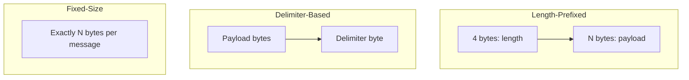

# How to Handle Binary Protocols Over TCP in Python

Author: [nawazdhandala](https://www.github.com/nawazdhandala)

Tags: Python, TCP, Binary Protocols, Networking, asyncio, Sockets, Protocol Buffers, Performance

Description: Learn how to implement binary protocol handlers over TCP in Python. This guide covers message framing, struct parsing, async servers, and building custom protocol implementations for high-performance networking.

---

> Binary protocols are the backbone of high-performance systems. Unlike text-based protocols like HTTP, binary protocols pack data efficiently, reduce parsing overhead, and minimize bandwidth. This guide shows you how to build robust TCP servers and clients that handle binary protocols in Python.

When you need maximum performance or interoperability with systems that speak binary (databases, game servers, IoT devices, financial systems), you need to know how to work with raw bytes over TCP.

---

## Understanding Binary Protocol Basics

Binary protocols define how data is structured in bytes. The key concepts are:

| Concept | Description |
|---------|-------------|
| **Framing** | How to know where one message ends and the next begins |
| **Encoding** | How to convert values to bytes (endianness, sizes) |
| **Schema** | The structure of fields within a message |
| **Version** | How to handle protocol evolution |

Common framing strategies:



---

## Message Framing with Length Prefix

The most common and reliable approach is length-prefixed framing. Each message starts with its length, so the receiver knows exactly how many bytes to read.

```python
# framing.py
# Length-prefixed message framing for binary protocols
import struct
from typing import Optional, Tuple
import asyncio

class LengthPrefixedFramer:
    """
    Handles length-prefixed message framing.
    Format: [4-byte length][payload]
    """

    HEADER_SIZE = 4  # 4 bytes for message length
    MAX_MESSAGE_SIZE = 16 * 1024 * 1024  # 16 MB limit
    BYTE_ORDER = '>'  # Big-endian (network byte order)

    def __init__(self):
        self.buffer = bytearray()

    def frame_message(self, data: bytes) -> bytes:
        """
        Add length prefix to a message for sending.
        """
        length = len(data)
        if length > self.MAX_MESSAGE_SIZE:
            raise ValueError(f"Message too large: {length} bytes")

        # Pack length as 4-byte big-endian unsigned int
        header = struct.pack(f'{self.BYTE_ORDER}I', length)
        return header + data

    def feed(self, data: bytes) -> None:
        """
        Feed received bytes into the buffer.
        """
        self.buffer.extend(data)

    def try_read_message(self) -> Optional[bytes]:
        """
        Try to extract a complete message from the buffer.
        Returns None if not enough data is available.
        """
        # Need at least header to read length
        if len(self.buffer) < self.HEADER_SIZE:
            return None

        # Unpack length from header
        length = struct.unpack(
            f'{self.BYTE_ORDER}I',
            self.buffer[:self.HEADER_SIZE]
        )[0]

        # Validate message size
        if length > self.MAX_MESSAGE_SIZE:
            raise ValueError(f"Message too large: {length} bytes")

        # Check if we have the complete message
        total_size = self.HEADER_SIZE + length
        if len(self.buffer) < total_size:
            return None

        # Extract the message
        message = bytes(self.buffer[self.HEADER_SIZE:total_size])

        # Remove consumed bytes from buffer
        del self.buffer[:total_size]

        return message

    def read_all_messages(self) -> list:
        """
        Read all complete messages from the buffer.
        """
        messages = []
        while True:
            message = self.try_read_message()
            if message is None:
                break
            messages.append(message)
        return messages

# Example usage
def demo_framing():
    framer = LengthPrefixedFramer()

    # Create a framed message
    original = b"Hello, World!"
    framed = framer.frame_message(original)
    print(f"Original: {len(original)} bytes")
    print(f"Framed: {len(framed)} bytes (4 header + {len(original)} payload)")

    # Simulate receiving data in chunks
    framer.feed(framed[:5])  # Partial data
    msg = framer.try_read_message()
    print(f"After partial: {msg}")  # None

    framer.feed(framed[5:])  # Rest of data
    msg = framer.try_read_message()
    print(f"After complete: {msg}")  # b"Hello, World!"
```

---

## Parsing Binary Structures with struct

Python's `struct` module is essential for packing and unpacking binary data:

```python
# binary_parser.py
# Parsing binary structures with the struct module
import struct
from dataclasses import dataclass
from typing import Tuple, Any
from enum import IntEnum

class MessageType(IntEnum):
    """Message type identifiers"""
    HEARTBEAT = 0
    LOGIN = 1
    LOGIN_RESPONSE = 2
    DATA = 3
    ERROR = 4

@dataclass
class MessageHeader:
    """
    Common header for all messages.
    Format: [1 byte type][1 byte version][2 bytes flags][4 bytes sequence]
    Total: 8 bytes
    """
    message_type: MessageType
    version: int
    flags: int
    sequence: int

    FORMAT = '>BBHI'  # Big-endian: byte, byte, unsigned short, unsigned int
    SIZE = struct.calcsize(FORMAT)

    def pack(self) -> bytes:
        """Serialize header to bytes"""
        return struct.pack(
            self.FORMAT,
            self.message_type,
            self.version,
            self.flags,
            self.sequence
        )

    @classmethod
    def unpack(cls, data: bytes) -> 'MessageHeader':
        """Deserialize header from bytes"""
        if len(data) < cls.SIZE:
            raise ValueError(f"Need {cls.SIZE} bytes, got {len(data)}")

        msg_type, version, flags, sequence = struct.unpack(
            cls.FORMAT,
            data[:cls.SIZE]
        )

        return cls(
            message_type=MessageType(msg_type),
            version=version,
            flags=flags,
            sequence=sequence
        )

@dataclass
class LoginMessage:
    """
    Login request message.
    Format: [header][4 bytes user_id][32 bytes token]
    """
    header: MessageHeader
    user_id: int
    token: bytes

    BODY_FORMAT = '>I32s'  # unsigned int + 32-byte string
    BODY_SIZE = struct.calcsize(BODY_FORMAT)

    def pack(self) -> bytes:
        """Serialize complete message to bytes"""
        header_bytes = self.header.pack()
        body_bytes = struct.pack(
            self.BODY_FORMAT,
            self.user_id,
            self.token.ljust(32, b'\x00')  # Pad to 32 bytes
        )
        return header_bytes + body_bytes

    @classmethod
    def unpack(cls, data: bytes) -> 'LoginMessage':
        """Deserialize message from bytes"""
        header = MessageHeader.unpack(data)

        body_data = data[MessageHeader.SIZE:]
        if len(body_data) < cls.BODY_SIZE:
            raise ValueError(f"Need {cls.BODY_SIZE} body bytes")

        user_id, token = struct.unpack(
            cls.BODY_FORMAT,
            body_data[:cls.BODY_SIZE]
        )

        # Strip null padding from token
        token = token.rstrip(b'\x00')

        return cls(header=header, user_id=user_id, token=token)

@dataclass
class DataMessage:
    """
    Variable-length data message.
    Format: [header][4 bytes payload_length][N bytes payload]
    """
    header: MessageHeader
    payload: bytes

    def pack(self) -> bytes:
        """Serialize complete message to bytes"""
        header_bytes = self.header.pack()
        # Include payload length before variable data
        length_bytes = struct.pack('>I', len(self.payload))
        return header_bytes + length_bytes + self.payload

    @classmethod
    def unpack(cls, data: bytes) -> 'DataMessage':
        """Deserialize message from bytes"""
        header = MessageHeader.unpack(data)

        # Read payload length
        length_offset = MessageHeader.SIZE
        payload_length = struct.unpack(
            '>I',
            data[length_offset:length_offset + 4]
        )[0]

        # Read payload
        payload_offset = length_offset + 4
        payload = data[payload_offset:payload_offset + payload_length]

        if len(payload) < payload_length:
            raise ValueError(f"Incomplete payload: need {payload_length}, got {len(payload)}")

        return cls(header=header, payload=payload)

# Example usage
def demo_parsing():
    # Create a login message
    header = MessageHeader(
        message_type=MessageType.LOGIN,
        version=1,
        flags=0,
        sequence=42
    )
    login = LoginMessage(
        header=header,
        user_id=12345,
        token=b"secret_token_here"
    )

    # Serialize
    packed = login.pack()
    print(f"Packed login: {len(packed)} bytes")
    print(f"Hex: {packed.hex()}")

    # Deserialize
    unpacked = LoginMessage.unpack(packed)
    print(f"User ID: {unpacked.user_id}")
    print(f"Token: {unpacked.token}")
```

---

## Async TCP Server

Here is a complete async TCP server that handles binary protocols:

```python
# tcp_server.py
# Async TCP server for binary protocols
import asyncio
from typing import Dict, Optional, Callable, Awaitable
from dataclasses import dataclass
import logging

logging.basicConfig(level=logging.INFO)
logger = logging.getLogger(__name__)

@dataclass
class ClientConnection:
    """Represents a connected client"""
    reader: asyncio.StreamReader
    writer: asyncio.StreamWriter
    client_id: str
    framer: LengthPrefixedFramer
    authenticated: bool = False
    user_id: Optional[int] = None

class BinaryProtocolServer:
    """
    Async TCP server for handling binary protocols.
    """

    def __init__(
        self,
        host: str = "0.0.0.0",
        port: int = 8888,
        max_clients: int = 1000
    ):
        self.host = host
        self.port = port
        self.max_clients = max_clients

        self.clients: Dict[str, ClientConnection] = {}
        self.server: asyncio.Server = None
        self.running = False

        # Message handlers by type
        self.handlers: Dict[MessageType, Callable] = {}

    def register_handler(
        self,
        msg_type: MessageType,
        handler: Callable[[ClientConnection, bytes], Awaitable[Optional[bytes]]]
    ):
        """Register a handler for a message type"""
        self.handlers[msg_type] = handler

    async def start(self):
        """Start the TCP server"""
        self.server = await asyncio.start_server(
            self._handle_client,
            self.host,
            self.port
        )
        self.running = True

        addr = self.server.sockets[0].getsockname()
        logger.info(f"Server listening on {addr}")

        async with self.server:
            await self.server.serve_forever()

    async def stop(self):
        """Stop the server gracefully"""
        self.running = False

        # Close all client connections
        for client in list(self.clients.values()):
            await self._close_client(client)

        if self.server:
            self.server.close()
            await self.server.wait_closed()

    async def _handle_client(
        self,
        reader: asyncio.StreamReader,
        writer: asyncio.StreamWriter
    ):
        """Handle a new client connection"""
        addr = writer.get_extra_info('peername')
        client_id = f"{addr[0]}:{addr[1]}"

        # Check max clients
        if len(self.clients) >= self.max_clients:
            logger.warning(f"Max clients reached, rejecting {client_id}")
            writer.close()
            await writer.wait_closed()
            return

        client = ClientConnection(
            reader=reader,
            writer=writer,
            client_id=client_id,
            framer=LengthPrefixedFramer()
        )
        self.clients[client_id] = client

        logger.info(f"Client connected: {client_id}")

        try:
            await self._client_loop(client)
        except asyncio.CancelledError:
            pass
        except Exception as e:
            logger.error(f"Error handling {client_id}: {e}")
        finally:
            await self._close_client(client)

    async def _client_loop(self, client: ClientConnection):
        """Main loop for processing client messages"""
        while self.running:
            try:
                # Read data from socket
                data = await asyncio.wait_for(
                    client.reader.read(4096),
                    timeout=60.0  # Idle timeout
                )

                if not data:
                    # Client disconnected
                    break

                # Feed data to framer
                client.framer.feed(data)

                # Process all complete messages
                for message in client.framer.read_all_messages():
                    await self._process_message(client, message)

            except asyncio.TimeoutError:
                # Send heartbeat on idle
                await self._send_heartbeat(client)
            except ConnectionResetError:
                break

    async def _process_message(
        self,
        client: ClientConnection,
        data: bytes
    ):
        """Process a single message"""
        if len(data) < MessageHeader.SIZE:
            logger.warning(f"Message too short from {client.client_id}")
            return

        # Parse header to determine message type
        header = MessageHeader.unpack(data)

        logger.debug(f"Received {header.message_type.name} from {client.client_id}")

        # Find and call handler
        handler = self.handlers.get(header.message_type)
        if handler:
            try:
                response = await handler(client, data)
                if response:
                    await self._send_message(client, response)
            except Exception as e:
                logger.error(f"Handler error: {e}")
                await self._send_error(client, str(e))
        else:
            logger.warning(f"No handler for {header.message_type.name}")

    async def _send_message(self, client: ClientConnection, data: bytes):
        """Send a framed message to client"""
        framed = client.framer.frame_message(data)
        client.writer.write(framed)
        await client.writer.drain()

    async def _send_heartbeat(self, client: ClientConnection):
        """Send a heartbeat to keep connection alive"""
        header = MessageHeader(
            message_type=MessageType.HEARTBEAT,
            version=1,
            flags=0,
            sequence=0
        )
        await self._send_message(client, header.pack())

    async def _send_error(self, client: ClientConnection, message: str):
        """Send an error message"""
        header = MessageHeader(
            message_type=MessageType.ERROR,
            version=1,
            flags=0,
            sequence=0
        )
        error_data = header.pack() + message.encode('utf-8')
        await self._send_message(client, error_data)

    async def _close_client(self, client: ClientConnection):
        """Close a client connection"""
        if client.client_id in self.clients:
            del self.clients[client.client_id]

        try:
            client.writer.close()
            await client.writer.wait_closed()
        except Exception:
            pass

        logger.info(f"Client disconnected: {client.client_id}")

    async def broadcast(self, data: bytes, exclude: Optional[str] = None):
        """Send a message to all connected clients"""
        for client_id, client in list(self.clients.items()):
            if client_id != exclude:
                try:
                    await self._send_message(client, data)
                except Exception:
                    await self._close_client(client)
```

---

## Async TCP Client

Here is a client implementation that connects to our binary protocol server:

```python
# tcp_client.py
# Async TCP client for binary protocols
import asyncio
from typing import Optional, Callable, Awaitable
import logging

logger = logging.getLogger(__name__)

class BinaryProtocolClient:
    """
    Async TCP client for binary protocols.
    """

    def __init__(
        self,
        host: str,
        port: int,
        on_message: Optional[Callable[[bytes], Awaitable[None]]] = None
    ):
        self.host = host
        self.port = port
        self.on_message = on_message

        self.reader: asyncio.StreamReader = None
        self.writer: asyncio.StreamWriter = None
        self.framer = LengthPrefixedFramer()
        self.connected = False
        self.sequence = 0

        self._receive_task: asyncio.Task = None

    async def connect(self, timeout: float = 10.0):
        """Connect to the server"""
        self.reader, self.writer = await asyncio.wait_for(
            asyncio.open_connection(self.host, self.port),
            timeout=timeout
        )
        self.connected = True

        # Start receive loop
        self._receive_task = asyncio.create_task(self._receive_loop())

        logger.info(f"Connected to {self.host}:{self.port}")

    async def disconnect(self):
        """Disconnect from the server"""
        self.connected = False

        if self._receive_task:
            self._receive_task.cancel()
            try:
                await self._receive_task
            except asyncio.CancelledError:
                pass

        if self.writer:
            self.writer.close()
            await self.writer.wait_closed()

        logger.info("Disconnected")

    async def send(self, data: bytes):
        """Send a message to the server"""
        if not self.connected:
            raise ConnectionError("Not connected")

        framed = self.framer.frame_message(data)
        self.writer.write(framed)
        await self.writer.drain()

    async def send_login(self, user_id: int, token: bytes) -> bool:
        """Send a login message"""
        self.sequence += 1

        header = MessageHeader(
            message_type=MessageType.LOGIN,
            version=1,
            flags=0,
            sequence=self.sequence
        )

        login = LoginMessage(
            header=header,
            user_id=user_id,
            token=token
        )

        await self.send(login.pack())
        return True

    async def send_data(self, payload: bytes):
        """Send a data message"""
        self.sequence += 1

        header = MessageHeader(
            message_type=MessageType.DATA,
            version=1,
            flags=0,
            sequence=self.sequence
        )

        data_msg = DataMessage(header=header, payload=payload)
        await self.send(data_msg.pack())

    async def _receive_loop(self):
        """Background loop for receiving messages"""
        while self.connected:
            try:
                data = await self.reader.read(4096)
                if not data:
                    break

                self.framer.feed(data)

                for message in self.framer.read_all_messages():
                    if self.on_message:
                        await self.on_message(message)

            except asyncio.CancelledError:
                break
            except Exception as e:
                logger.error(f"Receive error: {e}")
                break

        self.connected = False

# Example usage
async def client_example():
    received_messages = []

    async def on_message(data: bytes):
        header = MessageHeader.unpack(data)
        print(f"Received: {header.message_type.name}")
        received_messages.append(data)

    client = BinaryProtocolClient(
        host="localhost",
        port=8888,
        on_message=on_message
    )

    await client.connect()
    await client.send_login(12345, b"my_token")
    await client.send_data(b"Hello, Server!")

    # Wait for responses
    await asyncio.sleep(1)

    await client.disconnect()
```

---

## Complete Server Example

Here is how to put it all together:

```python
# server_example.py
# Complete binary protocol server example
import asyncio

async def handle_login(
    client: ClientConnection,
    data: bytes
) -> Optional[bytes]:
    """Handle login requests"""
    login = LoginMessage.unpack(data)

    # Validate credentials (simplified)
    if login.token == b"valid_token":
        client.authenticated = True
        client.user_id = login.user_id

        # Send success response
        response_header = MessageHeader(
            message_type=MessageType.LOGIN_RESPONSE,
            version=1,
            flags=1,  # Success flag
            sequence=login.header.sequence
        )
        return response_header.pack()
    else:
        # Send failure response
        response_header = MessageHeader(
            message_type=MessageType.LOGIN_RESPONSE,
            version=1,
            flags=0,  # Failure flag
            sequence=login.header.sequence
        )
        return response_header.pack()

async def handle_data(
    client: ClientConnection,
    data: bytes
) -> Optional[bytes]:
    """Handle data messages"""
    if not client.authenticated:
        raise PermissionError("Not authenticated")

    data_msg = DataMessage.unpack(data)
    print(f"Data from user {client.user_id}: {data_msg.payload}")

    # Echo back with acknowledgment
    ack_header = MessageHeader(
        message_type=MessageType.DATA,
        version=1,
        flags=1,  # ACK flag
        sequence=data_msg.header.sequence
    )
    return DataMessage(header=ack_header, payload=b"ACK").pack()

async def main():
    server = BinaryProtocolServer(host="0.0.0.0", port=8888)

    # Register message handlers
    server.register_handler(MessageType.LOGIN, handle_login)
    server.register_handler(MessageType.DATA, handle_data)

    # Handle shutdown gracefully
    try:
        await server.start()
    except KeyboardInterrupt:
        await server.stop()

if __name__ == "__main__":
    asyncio.run(main())
```

---

## Best Practices

### 1. Always Validate Input

```python
def unpack_message(data: bytes) -> Message:
    # Check minimum size
    if len(data) < HEADER_SIZE:
        raise ValueError("Message too short")

    # Validate message type
    msg_type = data[0]
    if msg_type not in MessageType.__members__.values():
        raise ValueError(f"Unknown message type: {msg_type}")

    # Validate length fields before reading
    # ...
```

### 2. Handle Partial Reads

```python
# Always use a framer to handle TCP stream reassembly
framer = LengthPrefixedFramer()

while True:
    data = await reader.read(4096)
    framer.feed(data)

    # Process all complete messages
    for message in framer.read_all_messages():
        await process(message)
```

### 3. Use Network Byte Order

```python
# Always use big-endian (network byte order) for portability
struct.pack('>I', value)  # > means big-endian
struct.pack('!I', value)  # ! also means network order (big-endian)
```

### 4. Include Protocol Version

```python
@dataclass
class MessageHeader:
    version: int  # Always include for protocol evolution
    message_type: int
    # ...
```

---

## Conclusion

Handling binary protocols over TCP in Python requires understanding message framing, byte packing, and async I/O. Start with length-prefixed framing for reliability, use the `struct` module for serialization, and build on asyncio for scalable servers. Always validate inputs, handle partial reads correctly, and plan for protocol evolution with version fields.

---

*Need to monitor your TCP services? [OneUptime](https://oneuptime.com) provides real-time monitoring for custom TCP protocols with latency tracking and connection health metrics.*

**Related Reading:**
- [How to Build Background Task Processing in FastAPI](https://oneuptime.com/blog/post/2026-01-25-background-task-processing-fastapi/view)
- [How to Build WebSocket Services with FastAPI](https://oneuptime.com/blog/post/2025-01-06-python-websocket-fastapi/view)
