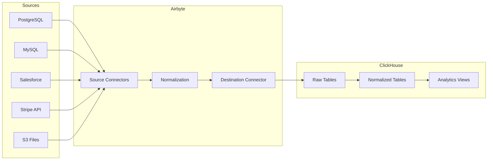

# How to Connect Airbyte to ClickHouse for Data Ingestion

Author: [nawazdhandala](https://www.github.com/nawazdhandala)

Tags: ClickHouse, Airbyte, Data Ingestion, ELT, Data Integration, ETL Pipeline

Description: A comprehensive guide to connecting Airbyte to ClickHouse for automated data ingestion from various sources including databases, APIs, and SaaS applications.

---

Airbyte is an open-source data integration platform that simplifies extracting data from various sources and loading it into ClickHouse. This guide covers setup, configuration, and best practices.

## Architecture Overview



## Setting Up Airbyte

### Docker Installation

```bash
# Clone Airbyte repository
git clone https://github.com/airbytehq/airbyte.git
cd airbyte

# Start Airbyte
docker-compose up -d

# Access UI at http://localhost:8000
```

### Kubernetes Installation

```yaml
# airbyte-values.yaml
global:
  serviceAccountName: airbyte
  deploymentMode: oss

webapp:
  replicaCount: 1

server:
  replicaCount: 1

worker:
  replicaCount: 2
  resources:
    requests:
      memory: "2Gi"
      cpu: "1"

scheduler:
  replicaCount: 1
```

```bash
helm repo add airbyte https://airbytehq.github.io/helm-charts
helm install airbyte airbyte/airbyte -f airbyte-values.yaml
```

## Configuring ClickHouse Destination

### Connection Settings

```json
{
  "host": "clickhouse.example.com",
  "port": 8443,
  "database": "analytics",
  "username": "airbyte_user",
  "password": "secure_password",
  "ssl": true,
  "tunnel_method": {
    "tunnel_type": "NO_TUNNEL"
  }
}
```

### Create Airbyte User in ClickHouse

```sql
-- Create dedicated user for Airbyte
CREATE USER airbyte_user
IDENTIFIED BY 'secure_password'
SETTINGS max_execution_time = 3600;

-- Grant necessary permissions
GRANT CREATE TABLE, DROP TABLE, INSERT, SELECT
ON analytics.*
TO airbyte_user;

-- Grant ability to create temporary tables
GRANT CREATE TEMPORARY TABLE ON *.* TO airbyte_user;
```

## Source Configuration Examples

### PostgreSQL Source

```json
{
  "host": "postgres.example.com",
  "port": 5432,
  "database": "production",
  "username": "readonly_user",
  "password": "password",
  "ssl_mode": {
    "mode": "require"
  },
  "replication_method": {
    "method": "CDC",
    "replication_slot": "airbyte_slot",
    "publication": "airbyte_publication"
  }
}
```

### MySQL Source with CDC

```json
{
  "host": "mysql.example.com",
  "port": 3306,
  "database": "app_db",
  "username": "replication_user",
  "password": "password",
  "replication_method": "CDC",
  "server_timezone": "UTC"
}
```

### REST API Source

```json
{
  "api_url": "https://api.example.com/v1",
  "authentication": {
    "type": "oauth2",
    "client_id": "xxx",
    "client_secret": "xxx",
    "token_url": "https://api.example.com/oauth/token"
  },
  "streams": [
    {
      "name": "orders",
      "path": "/orders",
      "primary_key": "id",
      "incremental_field": "updated_at"
    }
  ]
}
```

## Sync Configuration

### Full Refresh Sync

```yaml
# Good for small reference tables
sync_mode: full_refresh
destination_sync_mode: overwrite

# ClickHouse table created
# _airbyte_raw_customers with full data replaced each sync
```

### Incremental Sync with Deduplication

```yaml
# Best for large tables with updates
sync_mode: incremental
destination_sync_mode: append_dedup
cursor_field: updated_at
primary_key: [id]

# ClickHouse uses ReplacingMergeTree for deduplication
```

## ClickHouse Table Optimization

### Custom Table Engines

```sql
-- Airbyte creates raw tables, you can create optimized views
CREATE TABLE customers_optimized
ENGINE = ReplacingMergeTree(updated_at)
ORDER BY customer_id
AS SELECT
    JSONExtractInt(_airbyte_data, 'customer_id') AS customer_id,
    JSONExtractString(_airbyte_data, 'email') AS email,
    JSONExtractString(_airbyte_data, 'name') AS name,
    parseDateTimeBestEffort(JSONExtractString(_airbyte_data, 'created_at')) AS created_at,
    parseDateTimeBestEffort(JSONExtractString(_airbyte_data, 'updated_at')) AS updated_at
FROM _airbyte_raw_customers;
```

### Materialized View for Real-time Processing

```sql
-- Process incoming Airbyte data in real-time
CREATE MATERIALIZED VIEW customers_mv
TO customers_final
AS SELECT
    JSONExtractInt(_airbyte_data, 'customer_id') AS customer_id,
    JSONExtractString(_airbyte_data, 'email') AS email,
    JSONExtractString(_airbyte_data, 'name') AS name,
    _airbyte_emitted_at AS synced_at
FROM _airbyte_raw_customers
WHERE _airbyte_emitted_at > now() - INTERVAL 1 DAY;
```

## Scheduling and Orchestration

### Sync Schedule Configuration

```json
{
  "schedule_type": "cron",
  "cron_expression": "0 */6 * * *",
  "timezone": "UTC"
}
```

### Programmatic Sync via API

```python
import requests

AIRBYTE_API = "http://localhost:8000/api/v1"

def trigger_sync(connection_id):
    response = requests.post(
        f"{AIRBYTE_API}/connections/sync",
        json={"connectionId": connection_id}
    )
    return response.json()

def check_sync_status(job_id):
    response = requests.post(
        f"{AIRBYTE_API}/jobs/get",
        json={"id": job_id}
    )
    return response.json()["job"]["status"]

# Trigger sync
result = trigger_sync("your-connection-id")
job_id = result["job"]["id"]
print(f"Sync job started: {job_id}")
```

## Monitoring and Alerts

### Sync Monitoring Query

```sql
-- Track Airbyte sync history
SELECT
    table AS stream,
    max(_airbyte_emitted_at) AS last_sync,
    count() AS records_synced,
    dateDiff('minute', max(_airbyte_emitted_at), now()) AS minutes_since_sync
FROM system.tables
WHERE database = 'analytics'
  AND name LIKE '_airbyte_raw_%'
GROUP BY table
ORDER BY last_sync DESC;
```

### Data Freshness Alert

```sql
-- Alert if data is stale
SELECT
    'customers' AS stream,
    max(_airbyte_emitted_at) AS last_sync,
    CASE
        WHEN dateDiff('hour', max(_airbyte_emitted_at), now()) > 24
        THEN 'STALE'
        ELSE 'OK'
    END AS status
FROM _airbyte_raw_customers;
```

## Troubleshooting

### Common Issues

```sql
-- Check for failed records
SELECT
    _airbyte_ab_id,
    _airbyte_emitted_at,
    JSONExtractString(_airbyte_data, 'error') AS error
FROM _airbyte_raw_customers
WHERE JSONHas(_airbyte_data, 'error');

-- Verify data completeness
SELECT
    toDate(_airbyte_emitted_at) AS sync_date,
    count() AS records,
    uniqExact(JSONExtractInt(_airbyte_data, 'id')) AS unique_ids
FROM _airbyte_raw_orders
GROUP BY sync_date
ORDER BY sync_date DESC;
```

## Conclusion

Airbyte with ClickHouse provides:

1. **200+ connectors** for diverse data sources
2. **CDC support** for real-time data replication
3. **Incremental syncs** for efficient data loading
4. **Normalization** for structured data
5. **Open-source flexibility** with cloud option

Use Airbyte to build reliable data pipelines that feed your ClickHouse analytics platform.
