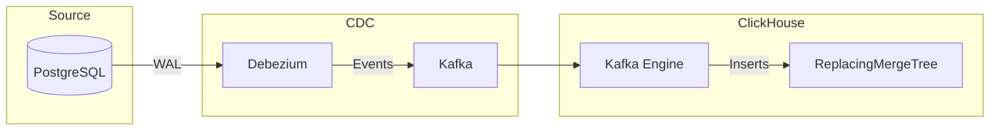

# How to Implement CDC (Change Data Capture) with ClickHouse

Author: [nawazdhandala](https://www.github.com/nawazdhandala)

Tags: ClickHouse, CDC, Change Data Capture, ReplacingMergeTree, Data Sync, ETL, Database, Real-Time

Description: A practical guide to implementing Change Data Capture (CDC) with ClickHouse using ReplacingMergeTree, versioning patterns, and integration with external CDC tools like Debezium.

---

Change Data Capture (CDC) tracks changes in source databases and replicates them to ClickHouse. This guide covers how to implement CDC patterns in ClickHouse and integrate with popular CDC tools.

## CDC Architecture Overview



## ReplacingMergeTree for CDC

### Basic CDC Table

```sql
-- Table that handles updates via deduplication
CREATE TABLE users
(
    user_id UInt64,
    email String,
    name String,
    status LowCardinality(String),
    updated_at DateTime64(3),
    _version UInt64,
    _deleted UInt8 DEFAULT 0
)
ENGINE = ReplacingMergeTree(_version)
ORDER BY user_id;

-- Insert initial record
INSERT INTO users VALUES (1, 'john@example.com', 'John', 'active', now64(), 1, 0);

-- "Update" by inserting new version
INSERT INTO users VALUES (1, 'john.doe@example.com', 'John Doe', 'active', now64(), 2, 0);

-- Query with deduplication
SELECT * FROM users FINAL WHERE user_id = 1;
```

### Handling Deletes

```sql
-- Soft delete pattern
-- "Delete" by inserting with _deleted = 1
INSERT INTO users VALUES (1, '', '', '', now64(), 3, 1);

-- Query excluding deleted
SELECT * FROM users FINAL
WHERE _deleted = 0;

-- Create view for clean queries
CREATE VIEW users_view AS
SELECT
    user_id,
    email,
    name,
    status,
    updated_at
FROM users FINAL
WHERE _deleted = 0;
```

### VersionedCollapsingMergeTree Alternative

```sql
-- Alternative: VersionedCollapsingMergeTree
CREATE TABLE users_vcmt
(
    user_id UInt64,
    email String,
    name String,
    sign Int8,
    version UInt64
)
ENGINE = VersionedCollapsingMergeTree(sign, version)
ORDER BY user_id;

-- Insert (sign = 1)
INSERT INTO users_vcmt VALUES (1, 'john@example.com', 'John', 1, 1);

-- Update = cancel old + insert new
INSERT INTO users_vcmt VALUES
    (1, 'john@example.com', 'John', -1, 1),      -- Cancel old
    (1, 'john.doe@example.com', 'John Doe', 1, 2); -- Insert new

-- Delete = cancel
INSERT INTO users_vcmt VALUES (1, 'john.doe@example.com', 'John Doe', -1, 2);
```

## Debezium Integration

### Kafka Connect Configuration

```json
{
    "name": "postgres-source",
    "config": {
        "connector.class": "io.debezium.connector.postgresql.PostgresConnector",
        "database.hostname": "postgres",
        "database.port": "5432",
        "database.user": "debezium",
        "database.password": "secret",
        "database.dbname": "app",
        "database.server.name": "app",
        "table.include.list": "public.users,public.orders",
        "plugin.name": "pgoutput",
        "transforms": "unwrap",
        "transforms.unwrap.type": "io.debezium.transforms.ExtractNewRecordState",
        "transforms.unwrap.add.fields": "op,table,source.ts_ms",
        "transforms.unwrap.delete.handling.mode": "rewrite"
    }
}
```

### ClickHouse Kafka Consumer

```sql
-- Kafka engine table
CREATE TABLE users_kafka
(
    user_id UInt64,
    email String,
    name String,
    status String,
    __op String,
    __table String,
    __source_ts_ms UInt64,
    __deleted String
)
ENGINE = Kafka()
SETTINGS
    kafka_broker_list = 'kafka:9092',
    kafka_topic_list = 'app.public.users',
    kafka_group_name = 'clickhouse_users',
    kafka_format = 'JSONEachRow';

-- Materialized view to process CDC events
CREATE MATERIALIZED VIEW users_mv TO users AS
SELECT
    user_id,
    email,
    name,
    status,
    fromUnixTimestamp64Milli(__source_ts_ms) AS updated_at,
    __source_ts_ms AS _version,
    if(__deleted = 'true' OR __op = 'd', 1, 0) AS _deleted
FROM users_kafka;
```

### Handle Different Operation Types

```sql
-- More detailed CDC handling
CREATE MATERIALIZED VIEW users_mv TO users AS
SELECT
    user_id,
    email,
    name,
    status,
    fromUnixTimestamp64Milli(__source_ts_ms) AS updated_at,
    __source_ts_ms AS _version,
    multiIf(
        __op = 'd', 1,                    -- Delete
        __deleted = 'true', 1,            -- Debezium delete marker
        0                                  -- Insert/Update
    ) AS _deleted
FROM users_kafka
WHERE __op IN ('c', 'u', 'd', 'r');  -- create, update, delete, read (snapshot)
```

## Direct PostgreSQL CDC

### Using PostgreSQL Engine

```sql
-- Connect to PostgreSQL and query current state
CREATE TABLE pg_users
ENGINE = PostgreSQL('postgres:5432', 'app', 'users', 'readonly', 'password');

-- Incremental sync with modified timestamp
CREATE TABLE users_sync
(
    user_id UInt64,
    email String,
    name String,
    status String,
    updated_at DateTime64(3),
    _version UInt64
)
ENGINE = ReplacingMergeTree(_version)
ORDER BY user_id;

-- Sync new/updated records
INSERT INTO users_sync
SELECT
    user_id,
    email,
    name,
    status,
    updated_at,
    toUnixTimestamp64Milli(updated_at) AS _version
FROM pg_users
WHERE updated_at > (SELECT max(updated_at) FROM users_sync);
```

### Scheduled Sync

```sql
-- Create dictionary for timestamp tracking
CREATE TABLE sync_state
(
    table_name String,
    last_sync DateTime64(3)
)
ENGINE = ReplacingMergeTree()
ORDER BY table_name;

-- Sync procedure (run periodically)
INSERT INTO users_sync
SELECT
    user_id,
    email,
    name,
    status,
    updated_at,
    toUnixTimestamp64Milli(updated_at) AS _version
FROM pg_users
WHERE updated_at > (
    SELECT coalesce(max(last_sync), toDateTime64('1970-01-01', 3))
    FROM sync_state
    WHERE table_name = 'users'
);

-- Update sync state
INSERT INTO sync_state VALUES ('users', now64(3));
```

## CDC Query Patterns

### Get Current State

```sql
-- Always use FINAL for accurate results
SELECT *
FROM users FINAL
WHERE _deleted = 0;

-- Or with subquery for better performance
SELECT *
FROM (
    SELECT *
    FROM users
    ORDER BY user_id, _version DESC
    LIMIT 1 BY user_id
)
WHERE _deleted = 0;
```

### Point-in-Time Queries

```sql
-- State at specific time
SELECT *
FROM (
    SELECT *
    FROM users
    WHERE updated_at <= '2024-01-15 12:00:00'
    ORDER BY user_id, _version DESC
    LIMIT 1 BY user_id
)
WHERE _deleted = 0;
```

### Change History

```sql
-- All changes for a user
SELECT
    user_id,
    email,
    name,
    status,
    updated_at,
    _version,
    _deleted,
    if(_deleted = 1, 'DELETED',
        if(_version = min(_version) OVER (PARTITION BY user_id), 'CREATED', 'UPDATED')
    ) AS change_type
FROM users
WHERE user_id = 1
ORDER BY _version;
```

## Optimizing CDC Tables

### Table Settings

```sql
CREATE TABLE users
(
    user_id UInt64,
    email String,
    name String,
    status LowCardinality(String),
    updated_at DateTime64(3),
    _version UInt64,
    _deleted UInt8 DEFAULT 0
)
ENGINE = ReplacingMergeTree(_version)
ORDER BY user_id
SETTINGS
    -- Merge more aggressively to remove old versions
    merge_with_ttl_timeout = 3600,

    -- Allow more parts before merge
    parts_to_throw_insert = 500,

    -- Index for version lookups
    index_granularity = 8192;

-- Add index for time-based queries
ALTER TABLE users ADD INDEX idx_updated updated_at TYPE minmax GRANULARITY 4;
```

### Optimize Queries

```sql
-- Force merge to clean up old versions
OPTIMIZE TABLE users FINAL;

-- Use FINAL only when necessary
-- Without FINAL (may have duplicates but faster)
SELECT count() FROM users WHERE status = 'active';

-- With FINAL (accurate but slower)
SELECT count() FROM users FINAL WHERE status = 'active' AND _deleted = 0;

-- Better: Pre-aggregate current state
CREATE MATERIALIZED VIEW users_current
ENGINE = ReplacingMergeTree(_version)
ORDER BY user_id
AS SELECT * FROM users;
```

## Monitoring CDC Pipeline

### Lag Monitoring

```sql
-- Check Kafka consumer lag
SELECT
    database,
    table,
    consumer_id,
    broker_id,
    lag
FROM system.kafka_consumers
WHERE database = 'default' AND table = 'users_kafka';

-- Check data freshness
SELECT
    max(updated_at) AS latest_update,
    dateDiff('second', max(updated_at), now()) AS lag_seconds
FROM users;
```

### Data Quality Checks

```sql
-- Duplicate check (should be 0 after merge)
SELECT
    user_id,
    count() AS versions
FROM users
GROUP BY user_id
HAVING versions > 1
LIMIT 10;

-- Compare with source (periodic reconciliation)
SELECT
    'ClickHouse' AS source,
    count() AS count,
    max(updated_at) AS latest
FROM users FINAL
WHERE _deleted = 0

UNION ALL

SELECT
    'PostgreSQL' AS source,
    count() AS count,
    max(updated_at) AS latest
FROM pg_users;
```

## Best Practices

### Schema Design

```sql
-- Include CDC metadata columns
CREATE TABLE cdc_table
(
    -- Business columns
    id UInt64,
    data String,

    -- CDC metadata
    _version UInt64,           -- Monotonic version (timestamp or sequence)
    _deleted UInt8 DEFAULT 0,  -- Soft delete flag
    _source String,            -- Source system
    _op LowCardinality(String), -- Operation type (c/u/d)

    -- Audit columns
    created_at DateTime64(3),
    updated_at DateTime64(3)
)
ENGINE = ReplacingMergeTree(_version)
ORDER BY id;
```

### Error Handling

```sql
-- Dead letter queue for failed records
CREATE TABLE cdc_errors
(
    error_time DateTime DEFAULT now(),
    source_topic String,
    error_message String,
    raw_data String
)
ENGINE = MergeTree()
ORDER BY error_time
TTL error_time + INTERVAL 7 DAY;

-- In Kafka consumer error handling
-- Route unparseable messages to cdc_errors
```

---

CDC with ClickHouse requires choosing the right table engine (ReplacingMergeTree for most cases), properly handling deletes with soft delete flags, and using FINAL or LIMIT BY for deduplication. Integrate with Debezium via Kafka for real-time CDC, or use direct PostgreSQL connections for simpler batch sync. Monitor lag and data quality to ensure consistency between source and ClickHouse.
