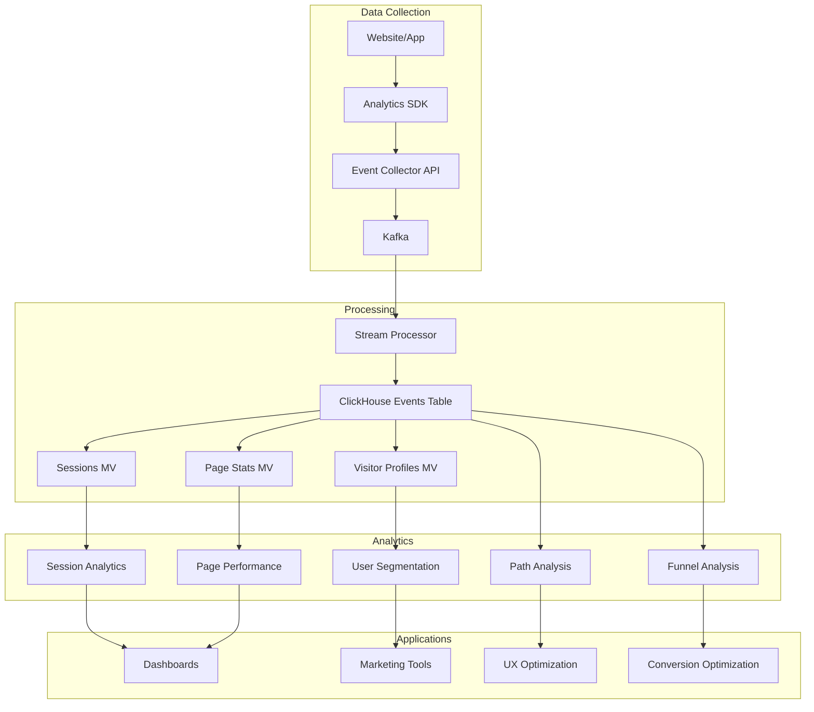

# How to Store and Analyze Clickstream Data in ClickHouse

Author: [nawazdhandala](https://www.github.com/nawazdhandala)

Tags: ClickHouse, Clickstream, Web Analytics, Session Analysis, Path Analysis, User Behavior

Description: A comprehensive guide to storing and analyzing clickstream data in ClickHouse, covering web analytics event schemas, session reconstruction, path analysis, and user journey visualization.

---

Clickstream data captures every user interaction with your website or application - page views, clicks, scrolls, form submissions, and more. ClickHouse excels at storing billions of these events and enabling real-time analysis of user behavior patterns. This guide covers how to build a complete clickstream analytics system.

## Clickstream Data Schema

### Event Collection Table

```sql
-- Main clickstream events table
CREATE TABLE clickstream_events (
    event_id UUID DEFAULT generateUUIDv4(),
    event_time DateTime64(3),
    event_date Date MATERIALIZED toDate(event_time),
    -- Event identification
    event_name LowCardinality(String),
    event_category LowCardinality(String),
    -- User identification
    visitor_id String,  -- Anonymous visitor ID (cookie)
    user_id Nullable(UInt64),  -- Authenticated user ID
    session_id String,
    -- Page context
    page_url String,
    page_path String,
    page_title String,
    referrer_url String,
    referrer_domain LowCardinality(String),
    -- UTM parameters
    utm_source LowCardinality(String),
    utm_medium LowCardinality(String),
    utm_campaign String,
    utm_content String,
    utm_term String,
    -- Device information
    device_type LowCardinality(String),
    browser LowCardinality(String),
    browser_version String,
    os LowCardinality(String),
    screen_width UInt16,
    screen_height UInt16,
    -- Location
    country LowCardinality(String),
    region String,
    city String,
    -- Interaction data
    element_id String,
    element_class String,
    element_text String,
    scroll_depth UInt8,
    time_on_page UInt32,
    -- Custom properties
    properties Map(String, String),
    -- Indexes
    INDEX visitor_idx visitor_id TYPE bloom_filter GRANULARITY 4,
    INDEX session_idx session_id TYPE bloom_filter GRANULARITY 4,
    INDEX page_path_idx page_path TYPE tokenbf_v1(32768, 3, 0) GRANULARITY 4
) ENGINE = MergeTree()
PARTITION BY toYYYYMM(event_time)
ORDER BY (visitor_id, event_time, event_id)
SETTINGS index_granularity = 8192;
```

### Session Table

```sql
-- Aggregated session data
CREATE TABLE sessions (
    session_id String,
    visitor_id String,
    user_id Nullable(UInt64),
    session_start DateTime64(3),
    session_end DateTime64(3),
    duration_seconds UInt32,
    -- Session metrics
    page_views UInt16,
    events_count UInt16,
    bounced UInt8,
    -- Entry/exit pages
    landing_page String,
    exit_page String,
    -- Traffic source
    traffic_source LowCardinality(String),
    traffic_medium LowCardinality(String),
    campaign String,
    referrer_domain LowCardinality(String),
    -- Device
    device_type LowCardinality(String),
    browser LowCardinality(String),
    country LowCardinality(String),
    -- Conversion
    converted UInt8,
    conversion_value Decimal64(2)
) ENGINE = MergeTree()
PARTITION BY toYYYYMM(session_start)
ORDER BY (visitor_id, session_start);

-- Materialized view to build sessions
CREATE MATERIALIZED VIEW sessions_mv
TO sessions
AS SELECT
    session_id,
    any(visitor_id) AS visitor_id,
    any(user_id) AS user_id,
    min(event_time) AS session_start,
    max(event_time) AS session_end,
    dateDiff('second', min(event_time), max(event_time)) AS duration_seconds,
    countIf(event_name = 'page_view') AS page_views,
    count() AS events_count,
    if(countIf(event_name = 'page_view') = 1, 1, 0) AS bounced,
    argMin(page_path, event_time) AS landing_page,
    argMax(page_path, event_time) AS exit_page,
    any(utm_source) AS traffic_source,
    any(utm_medium) AS traffic_medium,
    any(utm_campaign) AS campaign,
    any(referrer_domain) AS referrer_domain,
    any(device_type) AS device_type,
    any(browser) AS browser,
    any(country) AS country,
    max(if(event_name = 'purchase', 1, 0)) AS converted,
    sum(if(event_name = 'purchase', toDecimal64(properties['value'], 2), 0)) AS conversion_value
FROM clickstream_events
GROUP BY session_id;
```

## Session Reconstruction

### Building Sessions from Events

```sql
-- Reconstruct sessions with 30-minute timeout
WITH session_boundaries AS (
    SELECT
        visitor_id,
        event_time,
        event_name,
        page_path,
        -- Detect session breaks (30 min inactivity)
        if(
            dateDiff('second',
                lagInFrame(event_time) OVER (PARTITION BY visitor_id ORDER BY event_time),
                event_time
            ) > 1800,
            1, 0
        ) AS is_new_session
    FROM clickstream_events
    WHERE event_date = today()
)
SELECT
    visitor_id,
    -- Create session ID based on cumulative sum of session breaks
    concat(
        visitor_id, '-',
        toString(sum(is_new_session) OVER (PARTITION BY visitor_id ORDER BY event_time))
    ) AS session_id,
    event_time,
    event_name,
    page_path
FROM session_boundaries
ORDER BY visitor_id, event_time;
```

### Session Quality Metrics

```sql
-- Session engagement scoring
SELECT
    session_id,
    visitor_id,
    duration_seconds,
    page_views,
    -- Engagement score
    (
        least(duration_seconds / 300.0, 1) * 0.3 +  -- Up to 5 min = max score
        least(page_views / 5.0, 1) * 0.3 +          -- Up to 5 pages = max score
        (1 - bounced) * 0.2 +                       -- Not bounced
        converted * 0.2                             -- Converted
    ) AS engagement_score,
    -- Session quality category
    multiIf(
        bounced = 1, 'Bounce',
        duration_seconds < 30, 'Low Engagement',
        page_views >= 5 AND duration_seconds >= 180, 'High Engagement',
        'Medium Engagement'
    ) AS session_quality
FROM sessions
WHERE session_start >= now() - INTERVAL 7 DAY;
```

## Path Analysis

### Page Flow Analysis

```sql
-- Most common page paths (sequences)
SELECT
    page_sequence,
    count() AS sessions,
    avg(duration_seconds) AS avg_duration,
    countIf(converted = 1) / count() * 100 AS conversion_rate
FROM (
    SELECT
        session_id,
        groupArray(page_path) AS page_sequence,
        any(duration_seconds) AS duration_seconds,
        any(converted) AS converted
    FROM (
        SELECT
            session_id,
            page_path,
            duration_seconds,
            converted,
            row_number() OVER (PARTITION BY session_id ORDER BY event_time) AS page_num
        FROM clickstream_events
        JOIN sessions USING (session_id)
        WHERE event_name = 'page_view'
          AND event_date >= today() - 7
    )
    WHERE page_num <= 5  -- First 5 pages only
    GROUP BY session_id
)
GROUP BY page_sequence
HAVING sessions >= 100
ORDER BY sessions DESC
LIMIT 50;
```

### Funnel Analysis with Path

```sql
-- Checkout funnel with path visualization
WITH funnel_sessions AS (
    SELECT
        session_id,
        windowFunnel(86400)(
            event_time,
            page_path LIKE '/products%',
            event_name = 'add_to_cart',
            page_path = '/cart',
            page_path = '/checkout',
            event_name = 'purchase'
        ) AS funnel_step,
        groupArray(page_path) AS full_path
    FROM clickstream_events
    WHERE event_date >= today() - 7
    GROUP BY session_id
)
SELECT
    funnel_step,
    count() AS sessions,
    -- Sample paths that reached this step
    arraySlice(groupArray(full_path), 1, 5) AS sample_paths
FROM funnel_sessions
GROUP BY funnel_step
ORDER BY funnel_step;
```

### Navigation Pattern Mining

```sql
-- Find common navigation patterns from a specific page
WITH page_transitions AS (
    SELECT
        session_id,
        page_path AS from_page,
        leadInFrame(page_path, 1) OVER (
            PARTITION BY session_id ORDER BY event_time
        ) AS to_page,
        dateDiff('second', event_time,
            leadInFrame(event_time, 1) OVER (PARTITION BY session_id ORDER BY event_time)
        ) AS time_to_next
    FROM clickstream_events
    WHERE event_name = 'page_view'
      AND event_date >= today() - 7
)
SELECT
    from_page,
    to_page,
    count() AS transitions,
    avg(time_to_next) AS avg_time_seconds,
    count() / sum(count()) OVER (PARTITION BY from_page) * 100 AS transition_rate
FROM page_transitions
WHERE to_page IS NOT NULL
  AND from_page = '/products'
GROUP BY from_page, to_page
ORDER BY transitions DESC
LIMIT 20;
```

## User Journey Analysis

### First-Touch Attribution

```sql
-- First touch attribution by channel
SELECT
    first_source AS channel,
    count(DISTINCT visitor_id) AS visitors,
    countIf(any_conversion = 1) AS conversions,
    sum(total_value) AS revenue,
    round(countIf(any_conversion = 1) / count(DISTINCT visitor_id) * 100, 2) AS conversion_rate
FROM (
    SELECT
        visitor_id,
        argMin(coalesce(utm_source, referrer_domain, 'direct'), event_time) AS first_source,
        max(if(event_name = 'purchase', 1, 0)) AS any_conversion,
        sum(if(event_name = 'purchase', toFloat64(properties['value']), 0)) AS total_value
    FROM clickstream_events
    WHERE event_date >= today() - 30
    GROUP BY visitor_id
)
GROUP BY channel
ORDER BY revenue DESC;
```

### Multi-Touch Attribution

```sql
-- Linear attribution across touchpoints
WITH visitor_journeys AS (
    SELECT
        visitor_id,
        groupArray(coalesce(utm_source, referrer_domain, 'direct')) AS touchpoints,
        max(if(event_name = 'purchase', 1, 0)) AS converted,
        max(if(event_name = 'purchase', toFloat64(properties['value']), 0)) AS value
    FROM clickstream_events
    WHERE event_date >= today() - 30
    GROUP BY visitor_id
    HAVING converted = 1
),
attributed AS (
    SELECT
        visitor_id,
        arrayJoin(touchpoints) AS channel,
        value / length(touchpoints) AS attributed_value  -- Linear attribution
    FROM visitor_journeys
)
SELECT
    channel,
    count() AS touchpoints,
    count(DISTINCT visitor_id) AS conversions,
    sum(attributed_value) AS attributed_revenue
FROM attributed
GROUP BY channel
ORDER BY attributed_revenue DESC;
```

### Visitor Timeline

```sql
-- Complete visitor journey timeline
SELECT
    visitor_id,
    session_id,
    event_time,
    event_name,
    page_path,
    -- Time since first visit
    dateDiff('day',
        first_value(event_time) OVER (PARTITION BY visitor_id ORDER BY event_time),
        event_time
    ) AS days_since_first_visit,
    -- Events in this session so far
    row_number() OVER (PARTITION BY session_id ORDER BY event_time) AS session_event_num,
    -- Previous page in session
    lagInFrame(page_path, 1) OVER (PARTITION BY session_id ORDER BY event_time) AS previous_page
FROM clickstream_events
WHERE visitor_id = 'specific-visitor-id'
ORDER BY event_time;
```

## Real-Time Analytics Queries

### Live Visitor Dashboard

```sql
-- Currently active visitors (last 5 minutes)
SELECT
    count(DISTINCT visitor_id) AS active_visitors,
    count(DISTINCT session_id) AS active_sessions,
    countIf(event_name = 'page_view') AS page_views,
    uniq(page_path) AS unique_pages,
    topK(5)(page_path) AS top_pages,
    topK(3)(country) AS top_countries
FROM clickstream_events
WHERE event_time >= now() - INTERVAL 5 MINUTE;

-- Real-time page popularity
SELECT
    page_path,
    count() AS views_5min,
    uniq(visitor_id) AS unique_visitors
FROM clickstream_events
WHERE event_name = 'page_view'
  AND event_time >= now() - INTERVAL 5 MINUTE
GROUP BY page_path
ORDER BY views_5min DESC
LIMIT 10;
```

### Traffic Trends

```sql
-- Hourly traffic pattern
SELECT
    toHour(event_time) AS hour,
    toDayOfWeek(event_time) AS day_of_week,
    count() AS events,
    uniq(visitor_id) AS visitors,
    uniq(session_id) AS sessions
FROM clickstream_events
WHERE event_date >= today() - 30
GROUP BY hour, day_of_week
ORDER BY day_of_week, hour;
```

## Scroll and Engagement Tracking

### Scroll Depth Analysis

```sql
-- Content engagement by scroll depth
SELECT
    page_path,
    count() AS page_views,
    -- Scroll depth buckets
    countIf(scroll_depth >= 25) / count() * 100 AS reached_25pct,
    countIf(scroll_depth >= 50) / count() * 100 AS reached_50pct,
    countIf(scroll_depth >= 75) / count() * 100 AS reached_75pct,
    countIf(scroll_depth >= 90) / count() * 100 AS reached_90pct,
    avg(time_on_page) AS avg_time_seconds
FROM clickstream_events
WHERE event_name = 'page_view'
  AND event_date >= today() - 7
  AND page_path LIKE '/blog/%'
GROUP BY page_path
HAVING page_views >= 100
ORDER BY reached_90pct DESC;
```

### Element Interaction Heatmap Data

```sql
-- Click heatmap data for a specific page
SELECT
    element_id,
    element_class,
    element_text,
    count() AS clicks,
    uniq(visitor_id) AS unique_clickers
FROM clickstream_events
WHERE event_name = 'click'
  AND page_path = '/pricing'
  AND event_date >= today() - 7
GROUP BY element_id, element_class, element_text
ORDER BY clicks DESC
LIMIT 50;
```

## Segmentation and Cohorts

### Behavioral Segments

```sql
-- Create behavioral segments
SELECT
    visitor_id,
    multiIf(
        total_sessions >= 10 AND total_purchases >= 3, 'Power User',
        total_sessions >= 5 AND total_purchases >= 1, 'Engaged Buyer',
        total_sessions >= 5 AND total_purchases = 0, 'Window Shopper',
        total_sessions >= 2, 'Returning Visitor',
        'New Visitor'
    ) AS segment,
    total_sessions,
    total_page_views,
    total_purchases,
    first_seen,
    last_seen
FROM (
    SELECT
        visitor_id,
        uniq(session_id) AS total_sessions,
        countIf(event_name = 'page_view') AS total_page_views,
        countIf(event_name = 'purchase') AS total_purchases,
        min(event_time) AS first_seen,
        max(event_time) AS last_seen
    FROM clickstream_events
    WHERE event_date >= today() - 90
    GROUP BY visitor_id
);
```

## Clickstream Analytics Architecture



## Conclusion

Building a clickstream analytics system with ClickHouse enables:

1. **Event collection at scale** - Store billions of events efficiently
2. **Session reconstruction** - Build sessions from raw events
3. **Path analysis** - Understand user navigation patterns
4. **Funnel optimization** - Identify conversion bottlenecks
5. **User journey mapping** - Track visitors across sessions
6. **Real-time insights** - Live dashboards and metrics

With proper schema design and materialized views, ClickHouse can power enterprise-grade web analytics with sub-second query performance.
