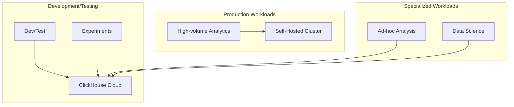

# ClickHouse Cloud vs Self-Hosted: Cost and Performance Analysis

Author: [nawazdhandala](https://www.github.com/nawazdhandala)

Tags: ClickHouse, ClickHouse Cloud, Self-Hosted, Cost Analysis, Performance, Comparison

Description: A comprehensive analysis of ClickHouse Cloud versus self-hosted deployment, covering total cost of ownership, performance characteristics, operational overhead, and decision factors for each approach.

---

Choosing between ClickHouse Cloud and self-hosted deployment involves weighing cost, performance, operational complexity, and organizational capabilities. This guide provides a detailed analysis to help you make the right decision.

## Total Cost of Ownership

### Self-Hosted Cost Components

| Component | Monthly Cost (3-node cluster) |
|-----------|-------------------------------|
| Compute (3x r5.2xlarge) | $1,500-2,000 |
| Storage (10TB EBS) | $800-1,000 |
| Data Transfer | $200-500 |
| DevOps Time (0.5 FTE) | $4,000-6,000 |
| Monitoring/Tooling | $200-500 |
| **Total** | **$6,700-10,000** |

### ClickHouse Cloud Cost Components

| Component | Monthly Cost |
|-----------|--------------|
| Compute (auto-scaled) | $2,000-4,000 |
| Storage (10TB compressed) | $200-400 |
| Data Transfer | $100-300 |
| DevOps Time (0.1 FTE) | $800-1,200 |
| **Total** | **$3,100-5,900** |

### Break-Even Analysis

```
Self-Hosted makes sense when:
- Data volume > 50TB compressed
- Stable, predictable workloads
- Strong in-house DevOps team
- Specific compliance requirements
- Multi-region with complex networking

ClickHouse Cloud makes sense when:
- Data volume < 50TB
- Variable or growing workloads
- Limited DevOps resources
- Fast time-to-value needed
- Standard compliance requirements
```

## Performance Comparison

### Query Performance

| Query Type | Self-Hosted (tuned) | ClickHouse Cloud |
|------------|---------------------|------------------|
| Simple aggregation | Baseline | ~Same |
| Complex JOIN | Baseline | ~Same |
| High concurrency | Tunable | Auto-scaled |
| Cold start | N/A | 1-5 seconds |

### Ingestion Performance

```sql
-- Both can achieve similar throughput
-- Self-hosted: Full control over tuning
-- Cloud: Managed optimization

-- Typical ingestion rates (per node):
-- Batch: 500K-2M rows/second
-- Async: 100K-500K rows/second
```

## Operational Comparison

### Self-Hosted Operations

Required tasks:
- Server provisioning and maintenance
- ClickHouse installation and upgrades
- Configuration tuning
- Backup management
- Security patching
- Monitoring setup
- Capacity planning
- Incident response

```yaml
# Example: Self-hosted maintenance tasks
Daily:
  - Monitor cluster health
  - Check replication status
  - Review slow queries

Weekly:
  - Review capacity trends
  - Backup verification
  - Security updates review

Monthly:
  - Performance tuning
  - Capacity planning
  - Version upgrade evaluation

Quarterly:
  - Major version upgrades
  - Infrastructure review
  - Cost optimization
```

### ClickHouse Cloud Operations

Required tasks:
- Schema management
- Query optimization
- User management
- Cost monitoring

```yaml
# ClickHouse Cloud operational tasks
Daily:
  - Review query performance
  - Monitor costs

Weekly:
  - Review slow queries
  - Check storage growth

Monthly:
  - Cost optimization
  - User access review
```

## Feature Comparison

| Feature | Self-Hosted | ClickHouse Cloud |
|---------|-------------|------------------|
| Full SQL | Yes | Yes |
| All table engines | Yes | Most (no Kafka engine) |
| Materialized views | Yes | Yes |
| Dictionaries | Full | Table-based only |
| Custom UDFs | Yes | Limited |
| Private networking | Manual | Built-in |
| Auto-scaling | Manual | Automatic |
| Automatic backups | Manual | Included |
| Point-in-time recovery | Manual | Included |
| Monitoring | Build yourself | Included |
| Support | Community/Enterprise | Included |

## Scaling Comparison

### Self-Hosted Scaling

```bash
# Adding a node (manual process)
1. Provision new server
2. Install ClickHouse
3. Configure as replica/shard
4. Update cluster config
5. Rebalance data (if sharding)
6. Update load balancer
7. Monitor replication

# Time: Hours to days
# Risk: Manual errors, data movement
```

### ClickHouse Cloud Scaling

```
# Auto-scaling (automatic)
1. Workload increases
2. System detects need
3. Resources scale up
4. No manual intervention

# Time: Minutes
# Risk: Minimal (managed)

# Or manual scaling via UI/API:
# Scale up/down with a click
```

## Security Comparison

### Self-Hosted Security

```xml
<!-- Manual TLS configuration -->
<clickhouse>
    <tcp_port_secure>9440</tcp_port_secure>
    <openSSL>
        <server>
            <certificateFile>/path/cert.pem</certificateFile>
            <privateKeyFile>/path/key.pem</privateKeyFile>
        </server>
    </openSSL>
</clickhouse>

<!-- Manual firewall rules -->
<!-- Manual user management -->
<!-- Manual audit logging -->
```

### ClickHouse Cloud Security

Built-in features:
- TLS encryption (always on)
- IP allowlisting
- Private endpoints (AWS/GCP/Azure)
- Role-based access control
- SOC 2 Type II compliance
- Automatic security updates

## Decision Framework

### Choose Self-Hosted When:

1. **Large scale** - 50TB+ data, predictable growth
2. **Strong DevOps** - Dedicated team with ClickHouse experience
3. **Control needed** - Specific tuning, custom configurations
4. **Compliance** - Specific requirements (data sovereignty)
5. **Cost optimization** - Already have infrastructure

```
Example: Large enterprise with
- 100TB+ data
- 24/7 DevOps team
- Existing Kubernetes platform
- Strict data residency requirements
- Predictable query patterns
```

### Choose ClickHouse Cloud When:

1. **Fast start** - Need to be productive quickly
2. **Variable workloads** - Unpredictable scaling needs
3. **Limited DevOps** - Small team or no dedicated resources
4. **Startup/Growth** - Focus on product, not infrastructure
5. **Standard compliance** - SOC 2, GDPR support included

```
Example: Growing startup with
- 1-10TB data
- Small engineering team
- Variable query patterns
- Need to move fast
- Limited DevOps experience
```

## Hybrid Approach

Some organizations use both:



## Migration Considerations

### Self-Hosted to Cloud

Reasons to migrate:
- Reduce operational burden
- Improve reliability
- Enable auto-scaling
- Access managed features

### Cloud to Self-Hosted

Reasons to migrate:
- Cost optimization at scale
- Custom requirements
- Data sovereignty
- Maximum control

## Conclusion

| Factor | Winner |
|--------|--------|
| TCO (< 20TB) | ClickHouse Cloud |
| TCO (> 50TB) | Self-Hosted |
| Time to value | ClickHouse Cloud |
| Operational simplicity | ClickHouse Cloud |
| Maximum control | Self-Hosted |
| Auto-scaling | ClickHouse Cloud |
| Custom configurations | Self-Hosted |

The best choice depends on your specific circumstances:
- **ClickHouse Cloud** for most organizations, especially those without dedicated infrastructure teams
- **Self-Hosted** for large enterprises with strong DevOps capabilities and specific requirements

Many organizations start with ClickHouse Cloud and migrate to self-hosted only when scale and requirements justify the operational investment.
