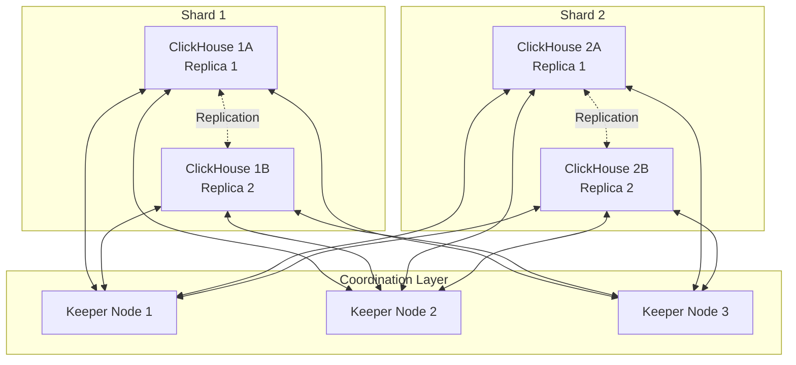

# How to Set Up ClickHouse Cluster for High Availability

Author: [nawazdhandala](https://www.github.com/nawazdhandala)

Tags: ClickHouse, High Availability, Clustering, Database, ZooKeeper, ClickHouse Keeper, Distributed Systems

Description: A comprehensive guide to configuring ClickHouse clusters with replication, ZooKeeper or ClickHouse Keeper coordination, and distributed tables for production-ready high availability.

---

Running a single ClickHouse node works fine for development, but production workloads demand fault tolerance. When that single node goes down, your analytics pipeline stops. This guide walks through setting up a ClickHouse cluster with proper replication and coordination for true high availability.

## Architecture Overview

A production ClickHouse cluster typically consists of:

- **Multiple ClickHouse nodes** organized into shards and replicas
- **Coordination service** (ZooKeeper or ClickHouse Keeper) for replica synchronization
- **Distributed tables** that route queries across shards



## Understanding Shards vs Replicas

Before diving into configuration, let's clarify the terminology:

- **Shard**: A horizontal partition of data. Each shard holds a portion of the total dataset.
- **Replica**: A copy of a shard for redundancy. All replicas in a shard contain identical data.

For high availability, you need at least 2 replicas per shard. For horizontal scaling, you add more shards.

## Step 1: Set Up the Coordination Service

ClickHouse uses a coordination service to manage replica synchronization. You have two options:

### Option A: ClickHouse Keeper (Recommended)

ClickHouse Keeper is a drop-in ZooKeeper replacement built into ClickHouse. It's simpler to operate and uses less memory.

Create the Keeper configuration file on each of your 3 Keeper nodes. Here's the config for node 1:

```xml
<!-- /etc/clickhouse-keeper/keeper_config.xml -->
<clickhouse>
    <logger>
        <level>information</level>
        <log>/var/log/clickhouse-keeper/clickhouse-keeper.log</log>
        <errorlog>/var/log/clickhouse-keeper/clickhouse-keeper.err.log</errorlog>
        <size>1000M</size>
        <count>3</count>
    </logger>

    <listen_host>0.0.0.0</listen_host>

    <keeper_server>
        <tcp_port>9181</tcp_port>
        <server_id>1</server_id>

        <log_storage_path>/var/lib/clickhouse-keeper/log</log_storage_path>
        <snapshot_storage_path>/var/lib/clickhouse-keeper/snapshots</snapshot_storage_path>

        <coordination_settings>
            <operation_timeout_ms>10000</operation_timeout_ms>
            <session_timeout_ms>30000</session_timeout_ms>
            <raft_logs_level>warning</raft_logs_level>
        </coordination_settings>

        <raft_configuration>
            <server>
                <id>1</id>
                <hostname>keeper-1.example.com</hostname>
                <port>9234</port>
            </server>
            <server>
                <id>2</id>
                <hostname>keeper-2.example.com</hostname>
                <port>9234</port>
            </server>
            <server>
                <id>3</id>
                <hostname>keeper-3.example.com</hostname>
                <port>9234</port>
            </server>
        </raft_configuration>
    </keeper_server>
</clickhouse>
```

For nodes 2 and 3, change `<server_id>` to 2 and 3 respectively.

Start the Keeper service:

```bash
sudo systemctl start clickhouse-keeper
sudo systemctl enable clickhouse-keeper
```

Verify the cluster is healthy:

```bash
echo ruok | nc keeper-1.example.com 9181
# Should return: imok

echo mntr | nc keeper-1.example.com 9181
# Shows detailed metrics including leader status
```

### Option B: Apache ZooKeeper

If you already run ZooKeeper for other services, you can use it instead. Install ZooKeeper on 3 nodes:

```bash
sudo apt install zookeeper zookeeper-bin
```

Configure `/etc/zookeeper/conf/zoo.cfg`:

```properties
tickTime=2000
dataDir=/var/lib/zookeeper
clientPort=2181
initLimit=5
syncLimit=2
server.1=zk-1.example.com:2888:3888
server.2=zk-2.example.com:2888:3888
server.3=zk-3.example.com:2888:3888
```

Create the myid file on each node:

```bash
# On zk-1
echo "1" | sudo tee /var/lib/zookeeper/myid

# On zk-2
echo "2" | sudo tee /var/lib/zookeeper/myid

# On zk-3
echo "3" | sudo tee /var/lib/zookeeper/myid
```

## Step 2: Configure ClickHouse Cluster

Now configure ClickHouse nodes to form a cluster. This configuration goes on every ClickHouse node.

Create `/etc/clickhouse-server/config.d/cluster.xml`:

```xml
<clickhouse>
    <remote_servers>
        <analytics_cluster>
            <!-- First shard with 2 replicas -->
            <shard>
                <internal_replication>true</internal_replication>
                <replica>
                    <host>clickhouse-1a.example.com</host>
                    <port>9000</port>
                </replica>
                <replica>
                    <host>clickhouse-1b.example.com</host>
                    <port>9000</port>
                </replica>
            </shard>

            <!-- Second shard with 2 replicas -->
            <shard>
                <internal_replication>true</internal_replication>
                <replica>
                    <host>clickhouse-2a.example.com</host>
                    <port>9000</port>
                </replica>
                <replica>
                    <host>clickhouse-2b.example.com</host>
                    <port>9000</port>
                </replica>
            </shard>
        </analytics_cluster>
    </remote_servers>

    <zookeeper>
        <node>
            <host>keeper-1.example.com</host>
            <port>9181</port>
        </node>
        <node>
            <host>keeper-2.example.com</host>
            <port>9181</port>
        </node>
        <node>
            <host>keeper-3.example.com</host>
            <port>9181</port>
        </node>
    </zookeeper>
</clickhouse>
```

Set macros for each node to identify itself. On `clickhouse-1a`:

```xml
<!-- /etc/clickhouse-server/config.d/macros.xml -->
<clickhouse>
    <macros>
        <cluster>analytics_cluster</cluster>
        <shard>01</shard>
        <replica>clickhouse-1a</replica>
    </macros>
</clickhouse>
```

Adjust the `shard` and `replica` values for each node accordingly.

Restart ClickHouse:

```bash
sudo systemctl restart clickhouse-server
```

Verify the cluster configuration:

```sql
SELECT * FROM system.clusters WHERE cluster = 'analytics_cluster';
```

## Step 3: Create Replicated Tables

Use `ReplicatedMergeTree` engine for tables that need high availability. The data automatically syncs between replicas.

```sql
-- Create the local replicated table on each node
CREATE TABLE events_local ON CLUSTER analytics_cluster
(
    event_id UUID,
    event_type String,
    user_id UInt64,
    event_time DateTime,
    properties Map(String, String)
)
ENGINE = ReplicatedMergeTree(
    '/clickhouse/tables/{shard}/events',
    '{replica}'
)
PARTITION BY toYYYYMM(event_time)
ORDER BY (event_type, user_id, event_time);
```

The `{shard}` and `{replica}` macros automatically resolve to the values set in `macros.xml`.

## Step 4: Create Distributed Tables

Distributed tables provide a unified view across all shards. Queries to a Distributed table automatically fan out to all shards.

```sql
-- Create the distributed table (only needs to run once)
CREATE TABLE events ON CLUSTER analytics_cluster
(
    event_id UUID,
    event_type String,
    user_id UInt64,
    event_time DateTime,
    properties Map(String, String)
)
ENGINE = Distributed(
    'analytics_cluster',
    'default',
    'events_local',
    rand()
);
```

The `rand()` function distributes inserts randomly across shards. For deterministic sharding, use a hash function:

```sql
-- Shard by user_id for co-located user data
ENGINE = Distributed(
    'analytics_cluster',
    'default',
    'events_local',
    xxHash64(user_id)
);
```

## Step 5: Insert and Query Data

Insert through the Distributed table:

```sql
INSERT INTO events VALUES
    (generateUUIDv4(), 'page_view', 12345, now(), {'page': '/home'}),
    (generateUUIDv4(), 'click', 12345, now(), {'button': 'signup'});
```

Query through the Distributed table:

```sql
SELECT
    event_type,
    count() AS event_count
FROM events
WHERE event_time >= today() - 7
GROUP BY event_type
ORDER BY event_count DESC;
```

## Testing Failover

Verify your cluster handles node failures gracefully.

### Test Replica Failover

1. Stop one replica:

```bash
# On clickhouse-1b
sudo systemctl stop clickhouse-server
```

2. Queries should still work through the Distributed table:

```sql
SELECT count() FROM events;
```

3. Insert data while one replica is down:

```sql
INSERT INTO events VALUES
    (generateUUIDv4(), 'failover_test', 99999, now(), {});
```

4. Bring the replica back:

```bash
sudo systemctl start clickhouse-server
```

5. Check replication queue:

```sql
SELECT
    database,
    table,
    is_currently_executing,
    num_tries,
    last_exception
FROM system.replication_queue
WHERE table = 'events_local';
```

The replica should catch up automatically.

## Monitoring Cluster Health

### Check Replica Status

```sql
SELECT
    database,
    table,
    replica_name,
    is_leader,
    is_readonly,
    absolute_delay,
    queue_size
FROM system.replicas
WHERE table = 'events_local';
```

Key metrics to watch:
- `absolute_delay`: Seconds behind the leader
- `queue_size`: Pending replication operations
- `is_readonly`: True if replica can't accept writes

### Check ZooKeeper Connection

```sql
SELECT * FROM system.zookeeper WHERE path = '/clickhouse';
```

### Set Up Alerts

Monitor these conditions:
- `absolute_delay > 60` seconds
- `queue_size > 1000` entries
- Any replica in `is_readonly` state
- ZooKeeper connection failures

## Best Practices

### Network Configuration

- Use private networks between ClickHouse nodes
- Ensure low latency (under 1ms) between replicas in the same shard
- Use dedicated network interfaces for replication traffic in high-throughput scenarios

### Keeper/ZooKeeper Sizing

- Run Keeper on dedicated nodes, not on ClickHouse servers
- Use SSDs for Keeper storage
- 3 Keeper nodes handle most workloads; 5 for very large clusters

### Table Design

- Use `internal_replication=true` in cluster config to let ClickHouse handle replica writes
- Partition tables by time for easier data management
- Keep partition count reasonable (under 1000 per table)

### Backup Strategy

Even with replication, maintain backups:

```bash
# Create backup
clickhouse-backup create daily_backup

# List backups
clickhouse-backup list

# Restore if needed
clickhouse-backup restore daily_backup
```

## Common Issues

### Replica Divergence

If replicas have different data:

```sql
-- Check for divergence
SELECT
    replica_name,
    total_rows,
    total_bytes
FROM system.replicas
WHERE table = 'events_local';

-- Force sync from leader
SYSTEM SYNC REPLICA events_local;
```

### ZooKeeper Session Expired

Increase session timeout if you see frequent disconnections:

```xml
<zookeeper>
    <session_timeout_ms>60000</session_timeout_ms>
    <operation_timeout_ms>30000</operation_timeout_ms>
</zookeeper>
```

### Replication Queue Stuck

Check for errors:

```sql
SELECT * FROM system.replication_queue
WHERE last_exception != '';
```

Clear problematic entries if necessary:

```sql
SYSTEM DROP REPLICA 'broken_replica' FROM TABLE events_local;
```

---

A properly configured ClickHouse cluster handles node failures automatically, scales horizontally across shards, and keeps your analytics running even during infrastructure problems. Start with 2 shards and 2 replicas per shard, then expand as your data grows.
