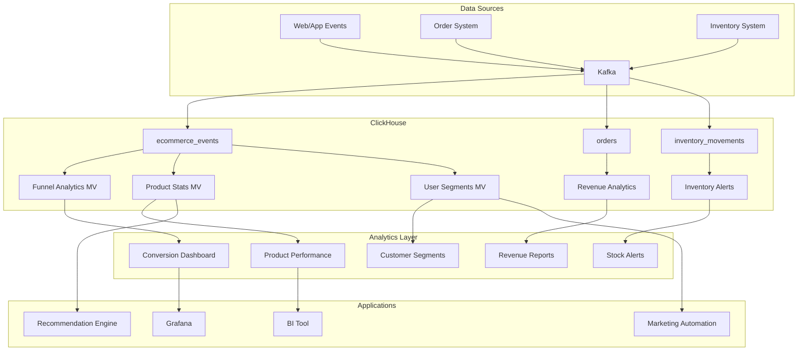

# How to Use ClickHouse for E-Commerce Analytics

Author: [nawazdhandala](https://www.github.com/nawazdhandala)

Tags: ClickHouse, E-Commerce, Analytics, Product Analytics, Conversion Tracking, Recommendations

Description: A comprehensive guide to using ClickHouse for e-commerce analytics, covering product performance tracking, conversion analysis, customer segmentation, inventory analytics, and building recommendation data pipelines.

---

E-commerce platforms generate vast amounts of data from product views, cart interactions, purchases, and customer behavior. ClickHouse provides the perfect foundation for building scalable e-commerce analytics systems that can process billions of events while delivering real-time insights.

## Schema Design for E-Commerce

### Core Events Table

```sql
-- Unified e-commerce events table
CREATE TABLE ecommerce_events (
    event_id UUID,
    event_time DateTime64(3),
    event_type Enum8(
        'page_view' = 1,
        'product_view' = 2,
        'add_to_cart' = 3,
        'remove_from_cart' = 4,
        'checkout_start' = 5,
        'checkout_step' = 6,
        'purchase' = 7,
        'refund' = 8,
        'search' = 9,
        'filter' = 10
    ),
    -- User identification
    user_id UInt64,
    session_id String,
    device_id String,
    -- Product data
    product_id UInt32,
    product_name String,
    category_path Array(String),
    brand LowCardinality(String),
    -- Transaction data
    quantity UInt16,
    unit_price Decimal64(2),
    total_price Decimal64(2),
    currency LowCardinality(String),
    order_id String,
    -- Context
    device_type LowCardinality(String),
    traffic_source LowCardinality(String),
    campaign_id String,
    country LowCardinality(String),
    -- Custom properties
    properties Map(String, String),
    INDEX event_type_idx event_type TYPE set(0) GRANULARITY 4,
    INDEX product_idx product_id TYPE bloom_filter GRANULARITY 4
) ENGINE = MergeTree()
PARTITION BY toYYYYMM(event_time)
ORDER BY (user_id, event_time, event_id)
SETTINGS index_granularity = 8192;
```

### Product Catalog

```sql
-- Product dimensions table
CREATE TABLE products (
    product_id UInt32,
    sku String,
    product_name String,
    description String,
    category_id UInt32,
    category_path Array(String),
    brand LowCardinality(String),
    price Decimal64(2),
    cost Decimal64(2),
    margin Decimal64(2) MATERIALIZED price - cost,
    weight_kg Float32,
    in_stock UInt8,
    created_at DateTime,
    updated_at DateTime
) ENGINE = ReplacingMergeTree(updated_at)
ORDER BY product_id;

-- Product dictionary for fast lookups
CREATE DICTIONARY products_dict (
    product_id UInt32,
    product_name String,
    brand String,
    category_path Array(String),
    price Decimal64(2)
)
PRIMARY KEY product_id
SOURCE(CLICKHOUSE(TABLE 'products'))
LAYOUT(FLAT())
LIFETIME(MIN 300 MAX 600);
```

### Orders Table

```sql
-- Orders fact table
CREATE TABLE orders (
    order_id String,
    order_time DateTime64(3),
    user_id UInt64,
    status Enum8(
        'pending' = 1,
        'processing' = 2,
        'shipped' = 3,
        'delivered' = 4,
        'cancelled' = 5,
        'refunded' = 6
    ),
    subtotal Decimal64(2),
    shipping_cost Decimal64(2),
    tax Decimal64(2),
    discount Decimal64(2),
    total Decimal64(2),
    currency LowCardinality(String),
    payment_method LowCardinality(String),
    shipping_method LowCardinality(String),
    shipping_country LowCardinality(String),
    items Array(Tuple(
        product_id UInt32,
        quantity UInt16,
        unit_price Decimal64(2),
        discount Decimal64(2)
    ))
) ENGINE = MergeTree()
PARTITION BY toYYYYMM(order_time)
ORDER BY (order_time, order_id);
```

## Conversion Funnel Analysis

### E-Commerce Funnel

```sql
-- Full purchase funnel analysis
WITH funnel_data AS (
    SELECT
        user_id,
        session_id,
        -- Check each funnel step
        countIf(event_type = 'product_view') > 0 AS viewed_product,
        countIf(event_type = 'add_to_cart') > 0 AS added_to_cart,
        countIf(event_type = 'checkout_start') > 0 AS started_checkout,
        countIf(event_type = 'purchase') > 0 AS completed_purchase,
        -- Time metrics
        min(if(event_type = 'product_view', event_time, null)) AS first_view_time,
        min(if(event_type = 'purchase', event_time, null)) AS purchase_time
    FROM ecommerce_events
    WHERE event_time >= now() - INTERVAL 30 DAY
    GROUP BY user_id, session_id
)
SELECT
    'Product View' AS step,
    1 AS step_number,
    countIf(viewed_product) AS users,
    100 AS conversion_rate
FROM funnel_data

UNION ALL

SELECT
    'Add to Cart' AS step,
    2 AS step_number,
    countIf(added_to_cart) AS users,
    round(countIf(added_to_cart) / countIf(viewed_product) * 100, 2) AS conversion_rate
FROM funnel_data

UNION ALL

SELECT
    'Checkout Start' AS step,
    3 AS step_number,
    countIf(started_checkout) AS users,
    round(countIf(started_checkout) / countIf(added_to_cart) * 100, 2) AS conversion_rate
FROM funnel_data

UNION ALL

SELECT
    'Purchase' AS step,
    4 AS step_number,
    countIf(completed_purchase) AS users,
    round(countIf(completed_purchase) / countIf(started_checkout) * 100, 2) AS conversion_rate
FROM funnel_data
ORDER BY step_number;
```

### windowFunnel Analysis

```sql
-- Using windowFunnel for time-constrained funnels
SELECT
    traffic_source,
    count() AS total_sessions,
    countIf(funnel_step >= 1) AS product_views,
    countIf(funnel_step >= 2) AS add_to_cart,
    countIf(funnel_step >= 3) AS checkout_start,
    countIf(funnel_step >= 4) AS purchases,
    round(countIf(funnel_step >= 4) / countIf(funnel_step >= 1) * 100, 2) AS conversion_rate
FROM (
    SELECT
        session_id,
        any(traffic_source) AS traffic_source,
        windowFunnel(86400)(  -- 24-hour window
            event_time,
            event_type = 'product_view',
            event_type = 'add_to_cart',
            event_type = 'checkout_start',
            event_type = 'purchase'
        ) AS funnel_step
    FROM ecommerce_events
    WHERE event_time >= now() - INTERVAL 7 DAY
    GROUP BY session_id
)
GROUP BY traffic_source
ORDER BY purchases DESC;
```

## Product Analytics

### Product Performance Dashboard

```sql
-- Product performance metrics
SELECT
    p.product_id,
    p.product_name,
    p.brand,
    p.category_path[1] AS main_category,
    -- Views and engagement
    countIf(e.event_type = 'product_view') AS views,
    countIf(e.event_type = 'add_to_cart') AS cart_adds,
    countIf(e.event_type = 'purchase') AS purchases,
    -- Conversion metrics
    round(countIf(e.event_type = 'add_to_cart') / countIf(e.event_type = 'product_view') * 100, 2) AS view_to_cart_rate,
    round(countIf(e.event_type = 'purchase') / countIf(e.event_type = 'add_to_cart') * 100, 2) AS cart_to_purchase_rate,
    -- Revenue
    sum(if(e.event_type = 'purchase', e.total_price, 0)) AS revenue,
    avg(if(e.event_type = 'purchase', e.total_price, null)) AS avg_order_value
FROM ecommerce_events e
LEFT JOIN products p ON e.product_id = p.product_id
WHERE e.event_time >= now() - INTERVAL 30 DAY
GROUP BY p.product_id, p.product_name, p.brand, main_category
ORDER BY revenue DESC
LIMIT 100;
```

### Category Performance

```sql
-- Category hierarchy analysis
SELECT
    category_path[1] AS l1_category,
    category_path[2] AS l2_category,
    count(DISTINCT product_id) AS products,
    countIf(event_type = 'product_view') AS views,
    countIf(event_type = 'purchase') AS purchases,
    sum(if(event_type = 'purchase', total_price, 0)) AS revenue,
    round(countIf(event_type = 'purchase') / countIf(event_type = 'product_view') * 100, 2) AS conversion_rate
FROM ecommerce_events
WHERE event_time >= now() - INTERVAL 30 DAY
  AND length(category_path) >= 2
GROUP BY l1_category, l2_category
ORDER BY revenue DESC;
```

## Customer Analytics

### Customer Segmentation (RFM Analysis)

```sql
-- RFM (Recency, Frequency, Monetary) segmentation
WITH customer_metrics AS (
    SELECT
        user_id,
        -- Recency: days since last purchase
        dateDiff('day', max(event_time), now()) AS recency_days,
        -- Frequency: number of purchases
        countIf(event_type = 'purchase') AS frequency,
        -- Monetary: total spend
        sum(if(event_type = 'purchase', toFloat64(total_price), 0)) AS monetary
    FROM ecommerce_events
    WHERE event_time >= now() - INTERVAL 365 DAY
    GROUP BY user_id
    HAVING frequency > 0
),
rfm_scores AS (
    SELECT
        user_id,
        recency_days,
        frequency,
        monetary,
        -- Score 1-5 based on quintiles
        ntile(5) OVER (ORDER BY recency_days DESC) AS r_score,
        ntile(5) OVER (ORDER BY frequency) AS f_score,
        ntile(5) OVER (ORDER BY monetary) AS m_score
    FROM customer_metrics
)
SELECT
    user_id,
    recency_days,
    frequency,
    monetary,
    r_score,
    f_score,
    m_score,
    concat(toString(r_score), toString(f_score), toString(m_score)) AS rfm_segment,
    CASE
        WHEN r_score >= 4 AND f_score >= 4 AND m_score >= 4 THEN 'Champions'
        WHEN r_score >= 3 AND f_score >= 3 AND m_score >= 3 THEN 'Loyal Customers'
        WHEN r_score >= 4 AND f_score <= 2 THEN 'New Customers'
        WHEN r_score <= 2 AND f_score >= 4 THEN 'At Risk'
        WHEN r_score <= 2 AND f_score <= 2 THEN 'Lost'
        ELSE 'Regular'
    END AS customer_segment
FROM rfm_scores
ORDER BY monetary DESC;
```

### Customer Lifetime Value

```sql
-- Calculate customer lifetime value
WITH customer_orders AS (
    SELECT
        user_id,
        min(event_time) AS first_purchase,
        max(event_time) AS last_purchase,
        count(DISTINCT order_id) AS total_orders,
        sum(toFloat64(total_price)) AS total_revenue
    FROM ecommerce_events
    WHERE event_type = 'purchase'
    GROUP BY user_id
),
cohort_avg AS (
    SELECT
        toStartOfMonth(first_purchase) AS cohort_month,
        avg(total_revenue) AS avg_ltv,
        avg(total_orders) AS avg_orders,
        count() AS customers
    FROM customer_orders
    GROUP BY cohort_month
)
SELECT
    cohort_month,
    customers,
    round(avg_ltv, 2) AS avg_customer_ltv,
    round(avg_orders, 1) AS avg_orders_per_customer,
    round(avg_ltv / avg_orders, 2) AS avg_order_value
FROM cohort_avg
ORDER BY cohort_month DESC;
```

### Cohort Retention Analysis

```sql
-- Monthly cohort retention
WITH user_cohorts AS (
    SELECT
        user_id,
        toStartOfMonth(min(event_time)) AS cohort_month
    FROM ecommerce_events
    WHERE event_type = 'purchase'
    GROUP BY user_id
),
user_activity AS (
    SELECT
        user_id,
        toStartOfMonth(event_time) AS activity_month
    FROM ecommerce_events
    WHERE event_type = 'purchase'
    GROUP BY user_id, activity_month
)
SELECT
    cohort_month,
    activity_month,
    dateDiff('month', cohort_month, activity_month) AS months_since_first,
    count(DISTINCT ua.user_id) AS active_users,
    count(DISTINCT ua.user_id) / first_value(count(DISTINCT ua.user_id)) OVER (
        PARTITION BY cohort_month ORDER BY activity_month
    ) * 100 AS retention_rate
FROM user_cohorts uc
JOIN user_activity ua ON uc.user_id = ua.user_id
WHERE cohort_month >= now() - INTERVAL 12 MONTH
GROUP BY cohort_month, activity_month
ORDER BY cohort_month, activity_month;
```

## Cart Analysis

### Cart Abandonment Analysis

```sql
-- Cart abandonment by product category
WITH cart_sessions AS (
    SELECT
        session_id,
        user_id,
        groupArrayIf(product_id, event_type = 'add_to_cart') AS cart_products,
        groupArrayIf(category_path[1], event_type = 'add_to_cart') AS cart_categories,
        countIf(event_type = 'add_to_cart') AS cart_adds,
        countIf(event_type = 'purchase') AS purchases,
        countIf(event_type = 'remove_from_cart') AS cart_removes
    FROM ecommerce_events
    WHERE event_time >= now() - INTERVAL 30 DAY
    GROUP BY session_id, user_id
    HAVING cart_adds > 0
)
SELECT
    category,
    count() AS sessions_with_category,
    countIf(purchases = 0) AS abandoned_sessions,
    round(countIf(purchases = 0) / count() * 100, 2) AS abandonment_rate
FROM cart_sessions
ARRAY JOIN cart_categories AS category
GROUP BY category
ORDER BY abandoned_sessions DESC;

-- Average cart value at abandonment
SELECT
    toStartOfHour(event_time) AS hour,
    avg(total_price) AS avg_cart_value,
    count() AS cart_adds
FROM ecommerce_events
WHERE event_type = 'add_to_cart'
  AND event_time >= now() - INTERVAL 24 HOUR
  AND session_id NOT IN (
      SELECT session_id
      FROM ecommerce_events
      WHERE event_type = 'purchase'
        AND event_time >= now() - INTERVAL 24 HOUR
  )
GROUP BY hour
ORDER BY hour;
```

## Building Recommendation Data

### Product Co-Purchase Analysis

```sql
-- Products frequently bought together
WITH order_products AS (
    SELECT
        order_id,
        groupArray(product_id) AS products
    FROM ecommerce_events
    WHERE event_type = 'purchase'
      AND event_time >= now() - INTERVAL 90 DAY
    GROUP BY order_id
    HAVING length(products) >= 2
)
SELECT
    p1 AS product_1,
    p2 AS product_2,
    count() AS co_purchase_count,
    -- Confidence: P(p2|p1)
    count() / (
        SELECT count(DISTINCT order_id)
        FROM ecommerce_events
        WHERE event_type = 'purchase'
          AND product_id = p1
    ) AS confidence
FROM order_products
ARRAY JOIN products AS p1
ARRAY JOIN products AS p2
WHERE p1 < p2
GROUP BY p1, p2
HAVING co_purchase_count >= 10
ORDER BY co_purchase_count DESC
LIMIT 1000;
```

### User-Based Recommendations

```sql
-- Find similar users for collaborative filtering
CREATE MATERIALIZED VIEW user_product_matrix_mv
ENGINE = AggregatingMergeTree()
ORDER BY user_id
AS SELECT
    user_id,
    groupArrayState(product_id) AS purchased_products,
    countState() AS purchase_count
FROM ecommerce_events
WHERE event_type = 'purchase'
GROUP BY user_id;

-- Products popular among similar users
WITH target_user_products AS (
    SELECT groupArrayMerge(purchased_products) AS products
    FROM user_product_matrix_mv
    WHERE user_id = 12345
)
SELECT
    e.product_id,
    count(DISTINCT e.user_id) AS buyer_count,
    count() AS purchase_count
FROM ecommerce_events e
WHERE e.event_type = 'purchase'
  AND e.product_id NOT IN (SELECT arrayJoin(products) FROM target_user_products)
  AND e.user_id IN (
      -- Users who bought similar products
      SELECT user_id
      FROM user_product_matrix_mv
      WHERE hasAny(
          groupArrayMerge(purchased_products),
          (SELECT products FROM target_user_products)
      )
      AND user_id != 12345
  )
GROUP BY e.product_id
ORDER BY buyer_count DESC
LIMIT 20;
```

## Real-Time Inventory Analytics

```sql
-- Inventory movement tracking
CREATE TABLE inventory_movements (
    movement_id UUID,
    timestamp DateTime64(3),
    product_id UInt32,
    warehouse_id UInt16,
    movement_type Enum8(
        'purchase' = 1,
        'sale' = 2,
        'return' = 3,
        'adjustment' = 4,
        'transfer_in' = 5,
        'transfer_out' = 6
    ),
    quantity Int32,
    reference_id String
) ENGINE = MergeTree()
PARTITION BY toYYYYMM(timestamp)
ORDER BY (product_id, warehouse_id, timestamp);

-- Current inventory levels
SELECT
    product_id,
    warehouse_id,
    sum(
        CASE
            WHEN movement_type IN ('purchase', 'return', 'transfer_in') THEN quantity
            WHEN movement_type IN ('sale', 'transfer_out') THEN -quantity
            WHEN movement_type = 'adjustment' THEN quantity  -- Can be positive or negative
        END
    ) AS current_stock
FROM inventory_movements
GROUP BY product_id, warehouse_id
HAVING current_stock > 0;

-- Products running low on stock
SELECT
    p.product_id,
    p.product_name,
    inv.current_stock,
    daily_sales.avg_daily_sales,
    round(inv.current_stock / daily_sales.avg_daily_sales, 1) AS days_of_stock
FROM (
    SELECT product_id, sum(quantity) AS current_stock
    FROM inventory_movements
    WHERE movement_type IN ('purchase', 'return', 'adjustment')
    GROUP BY product_id
) inv
JOIN products p ON inv.product_id = p.product_id
JOIN (
    SELECT
        product_id,
        count() / 30 AS avg_daily_sales
    FROM ecommerce_events
    WHERE event_type = 'purchase'
      AND event_time >= now() - INTERVAL 30 DAY
    GROUP BY product_id
) daily_sales ON inv.product_id = daily_sales.product_id
WHERE inv.current_stock / daily_sales.avg_daily_sales < 14  -- Less than 2 weeks stock
ORDER BY days_of_stock;
```

## E-Commerce Analytics Architecture



## Conclusion

Building e-commerce analytics with ClickHouse enables:

1. **Real-time funnel analysis** - Track conversions as they happen
2. **Product performance** - Identify best sellers and underperformers
3. **Customer segmentation** - RFM analysis for targeted marketing
4. **Cart optimization** - Understand abandonment patterns
5. **Recommendation data** - Build collaborative filtering pipelines

With proper schema design and materialized views, ClickHouse can power enterprise-scale e-commerce analytics while maintaining sub-second query performance.
