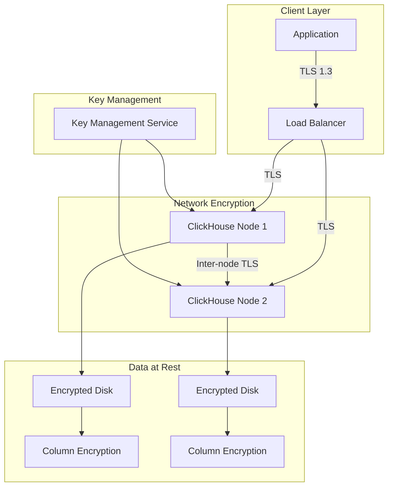

# How to Encrypt Data at Rest and in Transit in ClickHouse

Author: [nawazdhandala](https://www.github.com/nawazdhandala)

Tags: ClickHouse, Encryption, TLS, Security, Data Protection, SSL, Compliance

Description: A comprehensive guide to encrypting data at rest and in transit in ClickHouse, covering TLS configuration, disk encryption, column-level encryption functions, and security best practices for compliance.

---

Securing sensitive data in ClickHouse requires implementing encryption at multiple layers - both for data in transit over the network and data at rest on disk. This guide covers all aspects of ClickHouse encryption to help you meet security and compliance requirements.

## Encryption Overview

ClickHouse supports several encryption mechanisms:

1. **TLS/SSL** - Encrypts data in transit between clients and servers
2. **Inter-server TLS** - Encrypts communication between cluster nodes
3. **Disk encryption** - Encrypts data files at rest
4. **Column encryption** - Encrypts specific column values using functions

## Configuring TLS for Client Connections

### Generating SSL Certificates

First, create SSL certificates for your ClickHouse server:

```bash
# Create a directory for certificates
mkdir -p /etc/clickhouse-server/certs
cd /etc/clickhouse-server/certs

# Generate CA private key
openssl genrsa -out ca-key.pem 4096

# Generate CA certificate
openssl req -new -x509 -days 3650 -key ca-key.pem -out ca-cert.pem \
    -subj "/C=US/ST=State/L=City/O=Organization/CN=ClickHouse-CA"

# Generate server private key
openssl genrsa -out server-key.pem 4096

# Generate server certificate signing request
openssl req -new -key server-key.pem -out server-req.pem \
    -subj "/C=US/ST=State/L=City/O=Organization/CN=clickhouse-server"

# Sign server certificate with CA
openssl x509 -req -days 365 -in server-req.pem \
    -CA ca-cert.pem -CAkey ca-key.pem -CAcreateserial \
    -out server-cert.pem

# Set proper permissions
chmod 600 *.pem
chown clickhouse:clickhouse *.pem
```

### Server Configuration

Configure ClickHouse to use TLS in `/etc/clickhouse-server/config.d/ssl.xml`:

```xml
<?xml version="1.0"?>
<clickhouse>
    <!-- HTTPS interface for HTTP protocol -->
    <https_port>8443</https_port>

    <!-- Secure native protocol port -->
    <tcp_port_secure>9440</tcp_port_secure>

    <!-- Disable non-secure ports (recommended for production) -->
    <!-- <http_port>8123</http_port> -->
    <!-- <tcp_port>9000</tcp_port> -->

    <openSSL>
        <server>
            <!-- Path to SSL certificate -->
            <certificateFile>/etc/clickhouse-server/certs/server-cert.pem</certificateFile>

            <!-- Path to private key -->
            <privateKeyFile>/etc/clickhouse-server/certs/server-key.pem</privateKeyFile>

            <!-- Path to CA certificate for client verification -->
            <caConfig>/etc/clickhouse-server/certs/ca-cert.pem</caConfig>

            <!-- Verification mode: none, relaxed, strict -->
            <verificationMode>relaxed</verificationMode>

            <!-- Load default CA certificates -->
            <loadDefaultCAFile>true</loadDefaultCAFile>

            <!-- Cache SSL sessions -->
            <cacheSessions>true</cacheSessions>

            <!-- Disable session tickets for better security -->
            <disableProtocols>sslv2,sslv3</disableProtocols>

            <!-- Prefer server cipher order -->
            <preferServerCiphers>true</preferServerCiphers>
        </server>

        <client>
            <!-- For outgoing connections (distributed queries, dictionaries) -->
            <loadDefaultCAFile>true</loadDefaultCAFile>
            <caConfig>/etc/clickhouse-server/certs/ca-cert.pem</caConfig>
            <cacheSessions>true</cacheSessions>
            <disableProtocols>sslv2,sslv3</disableProtocols>
            <preferServerCiphers>true</preferServerCiphers>
            <verificationMode>relaxed</verificationMode>
            <invalidCertificateHandler>
                <name>RejectCertificateHandler</name>
            </invalidCertificateHandler>
        </client>
    </openSSL>
</clickhouse>
```

### Connecting with TLS

```bash
# Connect using clickhouse-client with TLS
clickhouse-client --secure --port 9440 \
    --host clickhouse-server \
    --user default \
    --password your_password

# Connect with certificate verification
clickhouse-client --secure --port 9440 \
    --host clickhouse-server \
    --config-file /path/to/client-config.xml

# Using HTTPS with curl
curl -k "https://clickhouse-server:8443/?query=SELECT%201" \
    --user "default:password"
```

Client configuration file for TLS (`client-config.xml`):

```xml
<?xml version="1.0"?>
<config>
    <openSSL>
        <client>
            <caConfig>/path/to/ca-cert.pem</caConfig>
            <verificationMode>strict</verificationMode>
        </client>
    </openSSL>
</config>
```

## Inter-Server TLS for Clusters

Configure TLS for communication between ClickHouse cluster nodes:

```xml
<?xml version="1.0"?>
<clickhouse>
    <!-- Enable secure inter-server communication -->
    <interserver_https_port>9010</interserver_https_port>

    <openSSL>
        <server>
            <certificateFile>/etc/clickhouse-server/certs/server-cert.pem</certificateFile>
            <privateKeyFile>/etc/clickhouse-server/certs/server-key.pem</privateKeyFile>
            <caConfig>/etc/clickhouse-server/certs/ca-cert.pem</caConfig>
            <verificationMode>strict</verificationMode>
        </server>
    </openSSL>

    <remote_servers>
        <my_cluster>
            <shard>
                <replica>
                    <host>node1.example.com</host>
                    <port>9440</port>
                    <secure>1</secure>
                </replica>
                <replica>
                    <host>node2.example.com</host>
                    <port>9440</port>
                    <secure>1</secure>
                </replica>
            </shard>
        </my_cluster>
    </remote_servers>
</clickhouse>
```

## Disk Encryption (Data at Rest)

ClickHouse supports encrypted disks for protecting data at rest:

### Configuring Encrypted Disks

```xml
<?xml version="1.0"?>
<clickhouse>
    <storage_configuration>
        <disks>
            <!-- Regular disk -->
            <default>
                <path>/var/lib/clickhouse/</path>
            </default>

            <!-- Encrypted disk wrapping the default disk -->
            <encrypted_disk>
                <type>encrypted</type>
                <disk>default</disk>
                <path>encrypted/</path>
                <key>your_32_byte_encryption_key_here</key>
                <!-- Or use key from file -->
                <!-- <key_hex>your_hex_encoded_key</key_hex> -->
            </encrypted_disk>

            <!-- Encrypted disk with key from environment variable -->
            <encrypted_disk_env>
                <type>encrypted</type>
                <disk>default</disk>
                <path>encrypted_env/</path>
                <key_hex from_env="CLICKHOUSE_ENCRYPTION_KEY"/>
            </encrypted_disk_env>
        </disks>

        <policies>
            <encrypted_policy>
                <volumes>
                    <main>
                        <disk>encrypted_disk</disk>
                    </main>
                </volumes>
            </encrypted_policy>
        </policies>
    </storage_configuration>
</clickhouse>
```

### Using Encrypted Disks

```sql
-- Create a table on encrypted storage
CREATE TABLE sensitive_data (
    id UInt64,
    user_id UInt64,
    ssn String,
    credit_card String,
    created_at DateTime
) ENGINE = MergeTree()
ORDER BY (user_id, id)
SETTINGS storage_policy = 'encrypted_policy';

-- Verify storage policy
SELECT
    name,
    data_paths,
    storage_policy
FROM system.tables
WHERE name = 'sensitive_data';
```

### Key Management Best Practices

```xml
<!-- Use external key management -->
<clickhouse>
    <encryption_codecs>
        <aes_128_gcm_siv>
            <key_hex from_env="ENCRYPTION_KEY_128"/>
        </aes_128_gcm_siv>
        <aes_256_gcm_siv>
            <key_hex from_env="ENCRYPTION_KEY_256"/>
        </aes_256_gcm_siv>
    </encryption_codecs>
</clickhouse>
```

## Column-Level Encryption

For encrypting specific column values, use ClickHouse's encryption functions:

### Using encrypt/decrypt Functions

```sql
-- Create a table for encrypted data
CREATE TABLE user_secrets (
    user_id UInt64,
    username String,
    encrypted_ssn String,
    encrypted_data String,
    iv String,
    created_at DateTime DEFAULT now()
) ENGINE = MergeTree()
ORDER BY user_id;

-- Insert with encryption (AES-256-GCM)
INSERT INTO user_secrets (user_id, username, encrypted_ssn, iv)
SELECT
    1 AS user_id,
    'john_doe' AS username,
    encrypt('aes-256-gcm', '123-45-6789', 'your-32-byte-encryption-key!', 'random-12byte') AS encrypted_ssn,
    'random-12byte' AS iv;

-- Decrypt when querying
SELECT
    user_id,
    username,
    decrypt('aes-256-gcm', encrypted_ssn, 'your-32-byte-encryption-key!', iv) AS ssn
FROM user_secrets
WHERE user_id = 1;
```

### Supported Encryption Modes

```sql
-- AES encryption modes available
-- aes-128-ecb, aes-192-ecb, aes-256-ecb
-- aes-128-cbc, aes-192-cbc, aes-256-cbc
-- aes-128-cfb1, aes-192-cfb1, aes-256-cfb1
-- aes-128-cfb8, aes-192-cfb8, aes-256-cfb8
-- aes-128-cfb128, aes-192-cfb128, aes-256-cfb128
-- aes-128-ofb, aes-192-ofb, aes-256-ofb
-- aes-128-gcm, aes-192-gcm, aes-256-gcm
-- aes-128-ctr, aes-192-ctr, aes-256-ctr

-- Example with different modes
SELECT
    encrypt('aes-256-cbc', 'sensitive data', unhex('0123456789ABCDEF0123456789ABCDEF0123456789ABCDEF0123456789ABCDEF'), unhex('0123456789ABCDEF0123456789ABCDEF')) AS cbc_encrypted,
    encrypt('aes-256-gcm', 'sensitive data', unhex('0123456789ABCDEF0123456789ABCDEF0123456789ABCDEF0123456789ABCDEF'), unhex('0123456789ABCDEF01234567')) AS gcm_encrypted;
```

### Creating an Encrypted Column Pattern

```sql
-- Create a function for consistent encryption
CREATE FUNCTION encryptPII AS (value, key) ->
    encrypt('aes-256-gcm', value, key, generateUUIDv4());

-- Or use a materialized column approach
CREATE TABLE customers (
    id UInt64,
    email String,
    phone_plain String,
    phone_encrypted String MATERIALIZED encrypt('aes-256-gcm', phone_plain, 'encryption-key-32-bytes-long!!!', 'iv-12-bytes!'),
    created_at DateTime DEFAULT now()
) ENGINE = MergeTree()
ORDER BY id;
```

## Encryption with Codecs

ClickHouse supports encryption codecs for column-level encryption:

```sql
-- Create table with encrypted columns using codecs
CREATE TABLE encrypted_logs (
    timestamp DateTime,
    level String,
    message String CODEC(AES_128_GCM_SIV),
    user_data String CODEC(AES_256_GCM_SIV),
    metadata String
) ENGINE = MergeTree()
ORDER BY timestamp;

-- The encryption key is configured in the server config
-- encryption_codecs section
```

Configure encryption codecs in server config:

```xml
<?xml version="1.0"?>
<clickhouse>
    <encryption_codecs>
        <aes_128_gcm_siv>
            <key_hex>your_32_char_hex_key_for_128bit</key_hex>
        </aes_128_gcm_siv>
        <aes_256_gcm_siv>
            <key_hex>your_64_char_hex_key_for_256bit_encryption_key</key_hex>
        </aes_256_gcm_siv>
    </encryption_codecs>
</clickhouse>
```

## Hashing Sensitive Data

For data that doesn't need to be decrypted, use hashing:

```sql
-- One-way hashing for sensitive data
CREATE TABLE user_auth (
    user_id UInt64,
    username String,
    password_hash FixedString(64),  -- SHA-256 produces 64 hex chars
    salt String,
    created_at DateTime DEFAULT now()
) ENGINE = MergeTree()
ORDER BY user_id;

-- Insert with salted hash
INSERT INTO user_auth (user_id, username, password_hash, salt)
SELECT
    1,
    'john_doe',
    hex(SHA256(concat('user_password', 'random_salt_value'))),
    'random_salt_value';

-- Verify password
SELECT
    user_id,
    username,
    hex(SHA256(concat('user_password', salt))) = password_hash AS password_valid
FROM user_auth
WHERE username = 'john_doe';

-- Pseudonymization with consistent hashing
SELECT
    sipHash64(user_id) AS pseudonymized_id,
    count() AS event_count
FROM user_events
GROUP BY pseudonymized_id;
```

## Security Best Practices

### 1. Secure Configuration File Permissions

```bash
# Restrict access to ClickHouse configuration
chmod 640 /etc/clickhouse-server/config.xml
chmod 640 /etc/clickhouse-server/config.d/*.xml
chown root:clickhouse /etc/clickhouse-server/config.d/*.xml

# Protect certificate files
chmod 600 /etc/clickhouse-server/certs/*.pem
chown clickhouse:clickhouse /etc/clickhouse-server/certs/*.pem
```

### 2. Use Strong Cipher Suites

```xml
<?xml version="1.0"?>
<clickhouse>
    <openSSL>
        <server>
            <!-- Use strong cipher suites only -->
            <cipherList>ECDHE-ECDSA-AES256-GCM-SHA384:ECDHE-RSA-AES256-GCM-SHA384:ECDHE-ECDSA-AES128-GCM-SHA256:ECDHE-RSA-AES128-GCM-SHA256</cipherList>
            <preferServerCiphers>true</preferServerCiphers>
            <disableProtocols>sslv2,sslv3,tlsv1,tlsv1_1</disableProtocols>
        </server>
    </openSSL>
</clickhouse>
```

### 3. Certificate Rotation

```bash
#!/bin/bash
# Script to rotate certificates

CERT_DIR="/etc/clickhouse-server/certs"
BACKUP_DIR="/etc/clickhouse-server/certs/backup"

# Backup existing certificates
mkdir -p $BACKUP_DIR
cp $CERT_DIR/*.pem $BACKUP_DIR/

# Generate new certificates
cd $CERT_DIR
openssl genrsa -out server-key-new.pem 4096
openssl req -new -key server-key-new.pem -out server-req-new.pem \
    -subj "/C=US/ST=State/L=City/O=Organization/CN=clickhouse-server"
openssl x509 -req -days 365 -in server-req-new.pem \
    -CA ca-cert.pem -CAkey ca-key.pem -CAcreateserial \
    -out server-cert-new.pem

# Replace certificates
mv server-key-new.pem server-key.pem
mv server-cert-new.pem server-cert.pem
rm server-req-new.pem

# Reload ClickHouse configuration
clickhouse-client --query "SYSTEM RELOAD CONFIG"
```

### 4. Environment Variable for Keys

```bash
# Set encryption key via environment variable
export CLICKHOUSE_ENCRYPTION_KEY="your-64-char-hex-encoded-256-bit-key"

# In systemd service file
# /etc/systemd/system/clickhouse-server.service.d/encryption.conf
[Service]
Environment="CLICKHOUSE_ENCRYPTION_KEY=your-64-char-hex-encoded-256-bit-key"
```

## Monitoring Encryption Status

```sql
-- Check TLS status for current connection
SELECT
    getSetting('tcp_port_secure') AS secure_port_configured;

-- View encryption-related settings
SELECT *
FROM system.settings
WHERE name LIKE '%encrypt%' OR name LIKE '%ssl%';

-- Check storage policies
SELECT *
FROM system.storage_policies;

-- Verify encrypted disk configuration
SELECT *
FROM system.disks
WHERE type = 'encrypted';
```

## Encryption Architecture



## Compliance Considerations

| Requirement | ClickHouse Feature |
|-------------|-------------------|
| PCI DSS | TLS, disk encryption, column encryption |
| HIPAA | Encryption at rest and in transit |
| GDPR | Pseudonymization, encryption functions |
| SOC 2 | TLS, access controls, audit logging |

## Conclusion

Implementing encryption in ClickHouse involves multiple layers of protection:

1. **TLS for data in transit** - Configure secure ports and certificates
2. **Inter-server TLS** - Encrypt cluster communication
3. **Disk encryption** - Protect data at rest using encrypted storage policies
4. **Column encryption** - Encrypt sensitive fields using functions or codecs
5. **Hashing** - Use one-way hashes for data that doesn't need decryption

By implementing these encryption strategies, you can meet security requirements while maintaining ClickHouse's high performance for analytical workloads.
