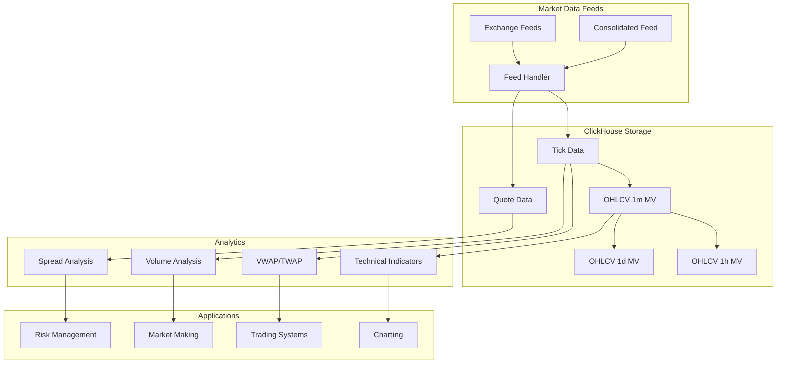

# How to Use ClickHouse for Financial Market Data

Author: [nawazdhandala](https://www.github.com/nawazdhandala)

Tags: ClickHouse, Financial Data, Market Data, Tick Data, OHLCV, Time-Weighted Calculations, Trading Analytics

Description: A comprehensive guide to using ClickHouse for financial market data, covering tick data storage, OHLCV aggregations, time-weighted calculations, VWAP analysis, and building real-time trading analytics systems.

---

Financial market data presents unique challenges - high-frequency tick data, precise time-weighted calculations, and the need for both real-time and historical analysis. ClickHouse's columnar storage and powerful time-series capabilities make it an excellent choice for building financial analytics systems.

## Market Data Schema Design

### Tick Data Table

```sql
-- High-frequency tick data (trades)
CREATE TABLE trades (
    symbol LowCardinality(String),
    exchange LowCardinality(String),
    trade_time DateTime64(6),  -- Microsecond precision
    trade_date Date MATERIALIZED toDate(trade_time),
    price Decimal64(8),
    quantity Decimal64(8),
    trade_id UInt64,
    side Enum8('buy' = 1, 'sell' = 2, 'unknown' = 0),
    trade_conditions Array(LowCardinality(String)),
    INDEX symbol_idx symbol TYPE bloom_filter GRANULARITY 4
) ENGINE = MergeTree()
PARTITION BY (toYYYYMM(trade_time), exchange)
ORDER BY (symbol, trade_time, trade_id)
SETTINGS index_granularity = 8192;

-- Quote/Level 1 data
CREATE TABLE quotes (
    symbol LowCardinality(String),
    exchange LowCardinality(String),
    quote_time DateTime64(6),
    bid_price Decimal64(8),
    bid_size Decimal64(8),
    ask_price Decimal64(8),
    ask_size Decimal64(8),
    mid_price Decimal64(8) MATERIALIZED (bid_price + ask_price) / 2,
    spread Decimal64(8) MATERIALIZED ask_price - bid_price
) ENGINE = MergeTree()
PARTITION BY toYYYYMM(quote_time)
ORDER BY (symbol, quote_time)
TTL quote_time + INTERVAL 90 DAY;
```

### Order Book Data (Level 2)

```sql
-- Order book snapshots
CREATE TABLE order_book_snapshots (
    symbol LowCardinality(String),
    exchange LowCardinality(String),
    snapshot_time DateTime64(6),
    -- Top 10 levels
    bid_prices Array(Decimal64(8)),
    bid_sizes Array(Decimal64(8)),
    ask_prices Array(Decimal64(8)),
    ask_sizes Array(Decimal64(8)),
    -- Derived metrics
    total_bid_size Decimal64(8) MATERIALIZED arraySum(bid_sizes),
    total_ask_size Decimal64(8) MATERIALIZED arraySum(ask_sizes)
) ENGINE = MergeTree()
PARTITION BY toYYYYMM(snapshot_time)
ORDER BY (symbol, snapshot_time)
TTL snapshot_time + INTERVAL 7 DAY;
```

## OHLCV Aggregations

### Pre-Computed OHLCV Bars

```sql
-- 1-minute OHLCV bars
CREATE TABLE ohlcv_1m (
    symbol LowCardinality(String),
    exchange LowCardinality(String),
    bar_time DateTime,
    open Decimal64(8),
    high Decimal64(8),
    low Decimal64(8),
    close Decimal64(8),
    volume Decimal64(8),
    vwap Decimal64(8),
    trade_count UInt32,
    buy_volume Decimal64(8),
    sell_volume Decimal64(8)
) ENGINE = SummingMergeTree()
PARTITION BY toYYYYMM(bar_time)
ORDER BY (symbol, exchange, bar_time);

-- Materialized view to generate 1-minute bars
CREATE MATERIALIZED VIEW ohlcv_1m_mv
TO ohlcv_1m
AS SELECT
    symbol,
    exchange,
    toStartOfMinute(trade_time) AS bar_time,
    argMin(price, trade_time) AS open,
    max(price) AS high,
    min(price) AS low,
    argMax(price, trade_time) AS close,
    sum(quantity) AS volume,
    sum(toFloat64(price) * toFloat64(quantity)) / sum(toFloat64(quantity)) AS vwap,
    count() AS trade_count,
    sumIf(quantity, side = 'buy') AS buy_volume,
    sumIf(quantity, side = 'sell') AS sell_volume
FROM trades
GROUP BY symbol, exchange, bar_time;

-- 1-hour OHLCV (aggregated from 1-minute)
CREATE MATERIALIZED VIEW ohlcv_1h_mv
ENGINE = SummingMergeTree()
ORDER BY (symbol, exchange, bar_time)
AS SELECT
    symbol,
    exchange,
    toStartOfHour(bar_time) AS bar_time,
    argMin(open, bar_time) AS open,
    max(high) AS high,
    min(low) AS low,
    argMax(close, bar_time) AS close,
    sum(volume) AS volume,
    sum(vwap * volume) / sum(volume) AS vwap,
    sum(trade_count) AS trade_count
FROM ohlcv_1m
GROUP BY symbol, exchange, toStartOfHour(bar_time);
```

### Custom Time Bar Generation

```sql
-- Generate OHLCV for any time interval
SELECT
    symbol,
    toStartOfInterval(trade_time, INTERVAL 5 MINUTE) AS bar_time,
    argMin(price, trade_time) AS open,
    max(price) AS high,
    min(price) AS low,
    argMax(price, trade_time) AS close,
    sum(quantity) AS volume,
    count() AS trades
FROM trades
WHERE symbol = 'AAPL'
  AND trade_date = today()
GROUP BY symbol, bar_time
ORDER BY bar_time;
```

## VWAP Calculations

### Volume-Weighted Average Price

```sql
-- VWAP for a specific time range
SELECT
    symbol,
    sum(toFloat64(price) * toFloat64(quantity)) / sum(toFloat64(quantity)) AS vwap,
    sum(quantity) AS total_volume,
    count() AS trade_count
FROM trades
WHERE symbol = 'AAPL'
  AND trade_time BETWEEN '2024-01-15 09:30:00' AND '2024-01-15 16:00:00'
GROUP BY symbol;

-- Running VWAP throughout the day
SELECT
    trade_time,
    price,
    quantity,
    sum(toFloat64(price) * toFloat64(quantity)) OVER (
        PARTITION BY symbol
        ORDER BY trade_time
        ROWS BETWEEN UNBOUNDED PRECEDING AND CURRENT ROW
    ) / sum(toFloat64(quantity)) OVER (
        PARTITION BY symbol
        ORDER BY trade_time
        ROWS BETWEEN UNBOUNDED PRECEDING AND CURRENT ROW
    ) AS running_vwap
FROM trades
WHERE symbol = 'AAPL'
  AND trade_date = today()
ORDER BY trade_time;
```

### TWAP (Time-Weighted Average Price)

```sql
-- Time-weighted average price
WITH price_intervals AS (
    SELECT
        symbol,
        trade_time,
        price,
        dateDiff('microsecond', trade_time,
            leadInFrame(trade_time, 1, trade_time + INTERVAL 1 SECOND)
            OVER (PARTITION BY symbol ORDER BY trade_time)
        ) AS duration_us
    FROM trades
    WHERE symbol = 'AAPL'
      AND trade_date = today()
)
SELECT
    symbol,
    sum(toFloat64(price) * duration_us) / sum(duration_us) AS twap
FROM price_intervals
GROUP BY symbol;
```

## Technical Indicators

### Moving Averages

```sql
-- Simple Moving Average (SMA)
SELECT
    bar_time,
    close,
    avg(close) OVER (
        ORDER BY bar_time
        ROWS BETWEEN 19 PRECEDING AND CURRENT ROW
    ) AS sma_20,
    avg(close) OVER (
        ORDER BY bar_time
        ROWS BETWEEN 49 PRECEDING AND CURRENT ROW
    ) AS sma_50
FROM ohlcv_1m
WHERE symbol = 'AAPL'
  AND bar_time >= now() - INTERVAL 1 DAY
ORDER BY bar_time;

-- Exponential Moving Average (EMA)
WITH RECURSIVE ema_calc AS (
    SELECT
        bar_time,
        close,
        toFloat64(close) AS ema_20,
        1 AS row_num
    FROM ohlcv_1m
    WHERE symbol = 'AAPL' AND bar_time = (
        SELECT min(bar_time) FROM ohlcv_1m WHERE symbol = 'AAPL'
    )

    UNION ALL

    SELECT
        o.bar_time,
        o.close,
        (toFloat64(o.close) * (2.0 / 21.0)) + (e.ema_20 * (1 - 2.0 / 21.0)) AS ema_20,
        e.row_num + 1
    FROM ohlcv_1m o
    JOIN ema_calc e ON o.bar_time = (
        SELECT min(bar_time) FROM ohlcv_1m
        WHERE symbol = 'AAPL' AND bar_time > e.bar_time
    )
    WHERE o.symbol = 'AAPL'
)
SELECT * FROM ema_calc;
```

### Bollinger Bands

```sql
-- Bollinger Bands calculation
SELECT
    bar_time,
    close,
    avg(close) OVER w AS middle_band,
    avg(close) OVER w + 2 * stddevPop(close) OVER w AS upper_band,
    avg(close) OVER w - 2 * stddevPop(close) OVER w AS lower_band,
    (close - (avg(close) OVER w - 2 * stddevPop(close) OVER w)) /
    ((avg(close) OVER w + 2 * stddevPop(close) OVER w) -
     (avg(close) OVER w - 2 * stddevPop(close) OVER w)) AS percent_b
FROM ohlcv_1m
WHERE symbol = 'AAPL'
  AND bar_time >= now() - INTERVAL 1 DAY
WINDOW w AS (ORDER BY bar_time ROWS BETWEEN 19 PRECEDING AND CURRENT ROW)
ORDER BY bar_time;
```

### RSI (Relative Strength Index)

```sql
-- RSI calculation
WITH price_changes AS (
    SELECT
        bar_time,
        close,
        close - lagInFrame(close, 1) OVER (ORDER BY bar_time) AS change
    FROM ohlcv_1m
    WHERE symbol = 'AAPL'
      AND bar_time >= now() - INTERVAL 2 DAY
),
gains_losses AS (
    SELECT
        bar_time,
        close,
        if(change > 0, change, 0) AS gain,
        if(change < 0, -change, 0) AS loss
    FROM price_changes
)
SELECT
    bar_time,
    close,
    100 - (100 / (1 + (
        avg(gain) OVER (ORDER BY bar_time ROWS BETWEEN 13 PRECEDING AND CURRENT ROW) /
        nullIf(avg(loss) OVER (ORDER BY bar_time ROWS BETWEEN 13 PRECEDING AND CURRENT ROW), 0)
    ))) AS rsi_14
FROM gains_losses
WHERE bar_time >= now() - INTERVAL 1 DAY
ORDER BY bar_time;
```

## Market Analysis Queries

### Volume Analysis

```sql
-- Volume profile by price level
SELECT
    round(toFloat64(price), 2) AS price_level,
    sum(quantity) AS total_volume,
    count() AS trade_count,
    sumIf(quantity, side = 'buy') AS buy_volume,
    sumIf(quantity, side = 'sell') AS sell_volume
FROM trades
WHERE symbol = 'AAPL'
  AND trade_date = today()
GROUP BY price_level
ORDER BY total_volume DESC
LIMIT 20;

-- Intraday volume pattern
SELECT
    toHour(trade_time) AS hour,
    toMinute(trade_time) AS minute,
    avg(toFloat64(quantity)) AS avg_trade_size,
    count() AS avg_trades
FROM trades
WHERE symbol = 'AAPL'
  AND trade_date >= today() - 30
GROUP BY hour, minute
ORDER BY hour, minute;
```

### Spread Analysis

```sql
-- Bid-ask spread over time
SELECT
    toStartOfMinute(quote_time) AS minute,
    avg(toFloat64(spread)) AS avg_spread,
    avg(toFloat64(spread) / toFloat64(mid_price) * 10000) AS avg_spread_bps,
    min(toFloat64(spread)) AS min_spread,
    max(toFloat64(spread)) AS max_spread
FROM quotes
WHERE symbol = 'AAPL'
  AND quote_time >= now() - INTERVAL 1 DAY
GROUP BY minute
ORDER BY minute;
```

### Order Flow Imbalance

```sql
-- Buy/sell imbalance indicator
SELECT
    toStartOfMinute(trade_time) AS minute,
    sum(quantity) AS total_volume,
    sumIf(quantity, side = 'buy') - sumIf(quantity, side = 'sell') AS order_imbalance,
    (sumIf(quantity, side = 'buy') - sumIf(quantity, side = 'sell')) /
        sum(quantity) AS imbalance_ratio
FROM trades
WHERE symbol = 'AAPL'
  AND trade_date = today()
GROUP BY minute
ORDER BY minute;
```

## Real-Time Analytics

### Live Price Ticker

```sql
-- Latest prices for watchlist
SELECT
    symbol,
    argMax(price, trade_time) AS last_price,
    max(trade_time) AS last_trade_time,
    argMax(price, trade_time) - argMin(price, trade_time) AS price_change,
    sum(quantity) AS volume_today
FROM trades
WHERE trade_date = today()
  AND symbol IN ('AAPL', 'GOOGL', 'MSFT', 'AMZN', 'META')
GROUP BY symbol;
```

### Alert Conditions

```sql
-- Price movement alerts
SELECT
    symbol,
    bar_time,
    close,
    (close - lagInFrame(close, 1) OVER (PARTITION BY symbol ORDER BY bar_time)) /
        lagInFrame(close, 1) OVER (PARTITION BY symbol ORDER BY bar_time) * 100 AS pct_change
FROM ohlcv_1m
WHERE bar_time >= now() - INTERVAL 5 MINUTE
HAVING abs(pct_change) > 1  -- More than 1% move
ORDER BY abs(pct_change) DESC;

-- Volume spike detection
WITH avg_volume AS (
    SELECT
        symbol,
        avg(volume) AS avg_min_volume
    FROM ohlcv_1m
    WHERE bar_time >= now() - INTERVAL 1 HOUR
    GROUP BY symbol
)
SELECT
    o.symbol,
    o.bar_time,
    o.volume,
    a.avg_min_volume,
    o.volume / a.avg_min_volume AS volume_ratio
FROM ohlcv_1m o
JOIN avg_volume a ON o.symbol = a.symbol
WHERE o.bar_time >= now() - INTERVAL 5 MINUTE
  AND o.volume > a.avg_min_volume * 3;  -- 3x average volume
```

## Portfolio Analytics

### Position P&L Calculation

```sql
-- Portfolio positions table
CREATE TABLE positions (
    portfolio_id UInt32,
    symbol LowCardinality(String),
    quantity Decimal64(8),
    avg_cost Decimal64(8),
    updated_at DateTime DEFAULT now()
) ENGINE = ReplacingMergeTree(updated_at)
ORDER BY (portfolio_id, symbol);

-- Real-time P&L calculation
SELECT
    p.portfolio_id,
    p.symbol,
    p.quantity,
    p.avg_cost,
    t.last_price,
    toFloat64(p.quantity) * toFloat64(t.last_price) AS market_value,
    toFloat64(p.quantity) * (toFloat64(t.last_price) - toFloat64(p.avg_cost)) AS unrealized_pnl,
    (toFloat64(t.last_price) - toFloat64(p.avg_cost)) / toFloat64(p.avg_cost) * 100 AS pnl_pct
FROM positions p
JOIN (
    SELECT
        symbol,
        argMax(price, trade_time) AS last_price
    FROM trades
    WHERE trade_date = today()
    GROUP BY symbol
) t ON p.symbol = t.symbol
WHERE p.portfolio_id = 1;
```

### Risk Metrics

```sql
-- Daily returns for risk calculation
WITH daily_returns AS (
    SELECT
        trade_date,
        (close - lagInFrame(close, 1) OVER (ORDER BY trade_date)) /
            lagInFrame(close, 1) OVER (ORDER BY trade_date) AS daily_return
    FROM (
        SELECT
            trade_date,
            argMax(price, trade_time) AS close
        FROM trades
        WHERE symbol = 'AAPL'
          AND trade_date >= today() - 365
        GROUP BY trade_date
    )
)
SELECT
    -- Annualized volatility
    stddevPop(daily_return) * sqrt(252) AS annualized_volatility,
    -- Sharpe ratio (assuming 0 risk-free rate)
    avg(daily_return) / stddevPop(daily_return) * sqrt(252) AS sharpe_ratio,
    -- Max drawdown
    min(daily_return) AS worst_day,
    -- VaR 95%
    quantile(0.05)(daily_return) AS var_95
FROM daily_returns;
```

## Financial Data Architecture



## Conclusion

Using ClickHouse for financial market data enables:

1. **Tick-level storage** - Store billions of trades with microsecond precision
2. **OHLCV aggregations** - Pre-compute bars at multiple timeframes
3. **VWAP/TWAP calculations** - Accurate time-weighted and volume-weighted prices
4. **Technical analysis** - Calculate indicators with window functions
5. **Real-time analytics** - Sub-second query latency for live dashboards
6. **Risk metrics** - Portfolio-level P&L and risk calculations

ClickHouse's performance characteristics make it ideal for quantitative finance applications where both historical analysis and real-time processing are required.
