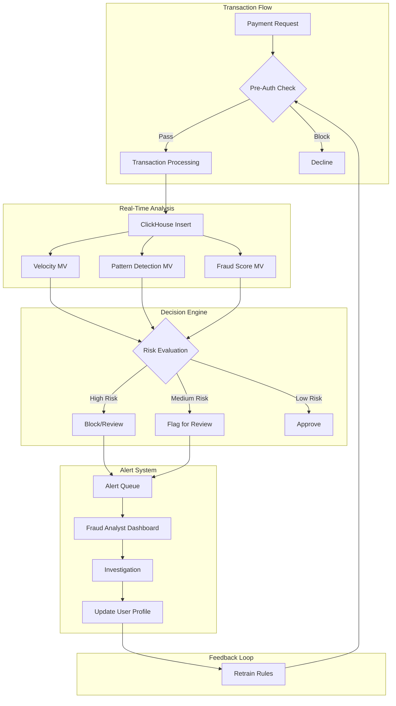

# How to Build a Real-Time Fraud Detection System with ClickHouse

Author: [nawazdhandala](https://www.github.com/nawazdhandala)

Tags: ClickHouse, Fraud Detection, Real-Time Analytics, Pattern Matching, Security, Financial Data

Description: A comprehensive guide to building a real-time fraud detection system with ClickHouse, covering transaction monitoring, pattern detection, velocity checks, anomaly scoring, and alert generation for financial and e-commerce applications.

---

Fraud detection requires analyzing large volumes of transactions in real-time to identify suspicious patterns. ClickHouse's ability to process millions of events per second while providing sub-second query latency makes it ideal for building fraud detection systems. This guide covers the architecture and implementation of a real-time fraud detection platform.

## Transaction Data Schema

### Core Transaction Table

```sql
-- Main transactions table for fraud analysis
CREATE TABLE transactions (
    transaction_id UUID,
    event_time DateTime64(3),
    event_date Date MATERIALIZED toDate(event_time),
    -- User information
    user_id UInt64,
    account_id UInt64,
    user_email_hash String,
    -- Transaction details
    transaction_type Enum8(
        'purchase' = 1,
        'transfer' = 2,
        'withdrawal' = 3,
        'deposit' = 4,
        'refund' = 5
    ),
    amount Decimal64(2),
    currency LowCardinality(String),
    merchant_id UInt32,
    merchant_category LowCardinality(String),
    -- Device and location
    device_fingerprint String,
    ip_address String,
    ip_country LowCardinality(String),
    ip_city String,
    latitude Float64,
    longitude Float64,
    -- Risk indicators
    card_present UInt8,
    cvv_provided UInt8,
    address_verified UInt8,
    -- Processing metadata
    processing_status Enum8('pending'=1, 'approved'=2, 'declined'=3, 'flagged'=4),
    fraud_score Float32 DEFAULT 0,
    is_fraud UInt8 DEFAULT 0,
    -- Indexes
    INDEX user_idx user_id TYPE bloom_filter GRANULARITY 4,
    INDEX ip_idx ip_address TYPE bloom_filter GRANULARITY 4,
    INDEX device_idx device_fingerprint TYPE bloom_filter GRANULARITY 4
) ENGINE = MergeTree()
PARTITION BY toYYYYMM(event_time)
ORDER BY (user_id, event_time, transaction_id)
SETTINGS index_granularity = 8192;
```

### User Profile for Risk Assessment

```sql
-- User risk profile
CREATE TABLE user_risk_profiles (
    user_id UInt64,
    updated_at DateTime DEFAULT now(),
    -- Account information
    account_age_days UInt32,
    email_verified UInt8,
    phone_verified UInt8,
    -- Historical metrics
    total_transactions UInt32,
    total_amount Decimal64(2),
    avg_transaction_amount Decimal64(2),
    max_transaction_amount Decimal64(2),
    -- Fraud history
    previous_fraud_count UInt16,
    previous_chargeback_count UInt16,
    -- Typical patterns
    typical_countries Array(LowCardinality(String)),
    typical_devices Array(String),
    typical_merchants Array(UInt32),
    typical_transaction_hour UInt8,
    -- Risk score
    base_risk_score Float32
) ENGINE = ReplacingMergeTree(updated_at)
ORDER BY user_id;

-- Dictionary for fast lookups
CREATE DICTIONARY user_risk_dict (
    user_id UInt64,
    avg_transaction_amount Decimal64(2),
    max_transaction_amount Decimal64(2),
    typical_countries Array(String),
    typical_devices Array(String),
    base_risk_score Float32
)
PRIMARY KEY user_id
SOURCE(CLICKHOUSE(TABLE 'user_risk_profiles'))
LAYOUT(HASHED(PREALLOCATED_SIZE 1000000))
LIFETIME(MIN 60 MAX 120);
```

## Real-Time Velocity Checks

### Transaction Velocity Rules

```sql
-- Create materialized view for velocity tracking
CREATE TABLE user_velocity_metrics (
    user_id UInt64,
    window_start DateTime,
    transaction_count UInt32,
    total_amount Decimal64(2),
    unique_merchants UInt16,
    unique_countries UInt8,
    unique_devices UInt8,
    unique_ips UInt16,
    max_amount Decimal64(2),
    min_amount Decimal64(2)
) ENGINE = SummingMergeTree()
ORDER BY (user_id, window_start)
TTL window_start + INTERVAL 7 DAY;

-- 1-hour velocity aggregation
CREATE MATERIALIZED VIEW user_velocity_1h_mv
TO user_velocity_metrics
AS SELECT
    user_id,
    toStartOfHour(event_time) AS window_start,
    count() AS transaction_count,
    sum(toFloat64(amount)) AS total_amount,
    uniq(merchant_id) AS unique_merchants,
    uniq(ip_country) AS unique_countries,
    uniq(device_fingerprint) AS unique_devices,
    uniq(ip_address) AS unique_ips,
    max(toFloat64(amount)) AS max_amount,
    min(toFloat64(amount)) AS min_amount
FROM transactions
GROUP BY user_id, window_start;

-- Real-time velocity check function
-- Returns risk indicators based on recent activity
WITH user_recent AS (
    SELECT
        count() AS txn_count_1h,
        sum(toFloat64(amount)) AS total_1h,
        uniq(ip_country) AS countries_1h,
        uniq(device_fingerprint) AS devices_1h,
        max(toFloat64(amount)) AS max_amount_1h
    FROM transactions
    WHERE user_id = 12345
      AND event_time >= now() - INTERVAL 1 HOUR
),
user_profile AS (
    SELECT
        avg_transaction_amount,
        max_transaction_amount,
        base_risk_score
    FROM user_risk_profiles
    WHERE user_id = 12345
)
SELECT
    r.txn_count_1h,
    r.total_1h,
    r.countries_1h,
    r.devices_1h,
    -- Velocity risk indicators
    if(r.txn_count_1h > 10, 1, 0) AS high_frequency_flag,
    if(r.countries_1h > 1, 1, 0) AS multi_country_flag,
    if(r.devices_1h > 2, 1, 0) AS multi_device_flag,
    if(r.max_amount_1h > p.max_transaction_amount * 2, 1, 0) AS high_amount_flag
FROM user_recent r, user_profile p;
```

### Sliding Window Analysis

```sql
-- Detect rapid transaction bursts
SELECT
    user_id,
    transaction_id,
    event_time,
    amount,
    -- Count transactions in 5-minute window
    count() OVER (
        PARTITION BY user_id
        ORDER BY event_time
        RANGE BETWEEN INTERVAL 5 MINUTE PRECEDING AND CURRENT ROW
    ) AS txn_count_5min,
    -- Sum amount in 5-minute window
    sum(toFloat64(amount)) OVER (
        PARTITION BY user_id
        ORDER BY event_time
        RANGE BETWEEN INTERVAL 5 MINUTE PRECEDING AND CURRENT ROW
    ) AS amount_5min,
    -- Time since last transaction
    dateDiff('second',
        lagInFrame(event_time, 1) OVER (PARTITION BY user_id ORDER BY event_time),
        event_time
    ) AS seconds_since_last
FROM transactions
WHERE event_time >= now() - INTERVAL 1 HOUR
HAVING txn_count_5min >= 5 OR seconds_since_last < 30;
```

## Pattern Detection

### Suspicious Pattern Rules

```sql
-- Create fraud rules table
CREATE TABLE fraud_rules (
    rule_id UInt32,
    rule_name String,
    rule_category LowCardinality(String),
    risk_weight Float32,
    is_active UInt8 DEFAULT 1
) ENGINE = MergeTree()
ORDER BY rule_id;

-- Insert common fraud rules
INSERT INTO fraud_rules VALUES
    (1, 'High Amount', 'amount', 0.3),
    (2, 'Unusual Hour', 'time', 0.1),
    (3, 'New Device', 'device', 0.2),
    (4, 'New Country', 'location', 0.3),
    (5, 'High Velocity', 'velocity', 0.4),
    (6, 'Card Testing Pattern', 'pattern', 0.5),
    (7, 'Account Takeover Signal', 'account', 0.6);

-- Pattern detection query
WITH transaction_context AS (
    SELECT
        t.transaction_id,
        t.user_id,
        t.amount,
        t.event_time,
        t.ip_country,
        t.device_fingerprint,
        t.merchant_category,
        -- Profile comparison
        p.avg_transaction_amount,
        p.typical_countries,
        p.typical_devices,
        p.base_risk_score,
        -- Recent activity
        (SELECT count() FROM transactions
         WHERE user_id = t.user_id
           AND event_time >= t.event_time - INTERVAL 1 HOUR) AS txn_count_1h,
        (SELECT count() FROM transactions
         WHERE user_id = t.user_id
           AND event_time >= t.event_time - INTERVAL 5 MINUTE) AS txn_count_5min
    FROM transactions t
    LEFT JOIN user_risk_profiles p ON t.user_id = p.user_id
    WHERE t.event_time >= now() - INTERVAL 1 HOUR
)
SELECT
    transaction_id,
    user_id,
    amount,
    -- Rule evaluations
    toFloat64(amount) > avg_transaction_amount * 5 AS rule_high_amount,
    NOT has(typical_countries, ip_country) AS rule_new_country,
    NOT has(typical_devices, device_fingerprint) AS rule_new_device,
    txn_count_1h > 20 AS rule_high_velocity,
    txn_count_5min > 5 AS rule_burst_pattern,
    toHour(event_time) BETWEEN 2 AND 5 AS rule_unusual_hour,
    -- Calculate composite score
    (
        if(toFloat64(amount) > avg_transaction_amount * 5, 0.3, 0) +
        if(NOT has(typical_countries, ip_country), 0.3, 0) +
        if(NOT has(typical_devices, device_fingerprint), 0.2, 0) +
        if(txn_count_1h > 20, 0.4, 0) +
        if(txn_count_5min > 5, 0.5, 0) +
        base_risk_score
    ) AS fraud_score
FROM transaction_context
WHERE fraud_score > 0.5  -- Flag high-risk transactions
ORDER BY fraud_score DESC;
```

### Card Testing Detection

```sql
-- Detect card testing patterns (multiple small transactions)
SELECT
    user_id,
    device_fingerprint,
    ip_address,
    count() AS txn_count,
    avg(toFloat64(amount)) AS avg_amount,
    uniq(merchant_id) AS unique_merchants,
    groupArray(amount) AS amounts
FROM transactions
WHERE event_time >= now() - INTERVAL 1 HOUR
  AND toFloat64(amount) BETWEEN 0.01 AND 5.00  -- Small test amounts
GROUP BY user_id, device_fingerprint, ip_address
HAVING txn_count >= 5 AND avg_amount < 2
ORDER BY txn_count DESC;
```

### Account Takeover Detection

```sql
-- Detect sudden changes in account behavior
WITH current_session AS (
    SELECT
        user_id,
        any(device_fingerprint) AS current_device,
        any(ip_country) AS current_country,
        any(ip_address) AS current_ip,
        sum(toFloat64(amount)) AS session_amount
    FROM transactions
    WHERE event_time >= now() - INTERVAL 30 MINUTE
    GROUP BY user_id
),
historical_behavior AS (
    SELECT
        user_id,
        groupUniqArray(device_fingerprint) AS known_devices,
        groupUniqArray(ip_country) AS known_countries,
        avg(toFloat64(amount)) AS typical_amount
    FROM transactions
    WHERE event_time BETWEEN now() - INTERVAL 90 DAY AND now() - INTERVAL 1 DAY
    GROUP BY user_id
)
SELECT
    cs.user_id,
    cs.current_device,
    cs.current_country,
    NOT has(hb.known_devices, cs.current_device) AS new_device,
    NOT has(hb.known_countries, cs.current_country) AS new_country,
    cs.session_amount > hb.typical_amount * 10 AS unusual_amount,
    -- Account takeover risk score
    (
        if(NOT has(hb.known_devices, cs.current_device), 0.4, 0) +
        if(NOT has(hb.known_countries, cs.current_country), 0.3, 0) +
        if(cs.session_amount > hb.typical_amount * 10, 0.3, 0)
    ) AS takeover_risk
FROM current_session cs
JOIN historical_behavior hb ON cs.user_id = hb.user_id
WHERE takeover_risk >= 0.5;
```

## Fraud Scoring System

### Real-Time Score Calculation

```sql
-- Comprehensive fraud scoring function
CREATE MATERIALIZED VIEW fraud_scores_mv
ENGINE = MergeTree()
ORDER BY (event_time, transaction_id)
TTL event_time + INTERVAL 30 DAY
AS
WITH
    -- Get user profile
    profile AS (
        SELECT
            user_id,
            avg_transaction_amount,
            max_transaction_amount,
            typical_countries,
            typical_devices,
            previous_fraud_count,
            base_risk_score
        FROM user_risk_profiles
    ),
    -- Calculate velocity metrics
    velocity AS (
        SELECT
            t.transaction_id,
            t.user_id,
            count() OVER (
                PARTITION BY t.user_id
                ORDER BY t.event_time
                RANGE BETWEEN INTERVAL 1 HOUR PRECEDING AND CURRENT ROW
            ) AS txn_1h,
            count() OVER (
                PARTITION BY t.user_id
                ORDER BY t.event_time
                RANGE BETWEEN INTERVAL 24 HOUR PRECEDING AND CURRENT ROW
            ) AS txn_24h
        FROM transactions t
    )
SELECT
    t.transaction_id,
    t.event_time,
    t.user_id,
    t.amount,
    -- Individual risk factors (0-1 scale)
    least(1.0, toFloat64(t.amount) / nullIf(p.max_transaction_amount * 2, 0)) AS amount_risk,
    if(has(p.typical_countries, t.ip_country), 0, 0.5) AS location_risk,
    if(has(p.typical_devices, t.device_fingerprint), 0, 0.3) AS device_risk,
    least(1.0, v.txn_1h / 20.0) AS velocity_1h_risk,
    least(1.0, v.txn_24h / 100.0) AS velocity_24h_risk,
    if(p.previous_fraud_count > 0, 0.3, 0) AS fraud_history_risk,
    -- Composite fraud score
    (
        least(1.0, toFloat64(t.amount) / nullIf(p.max_transaction_amount * 2, 0)) * 0.25 +
        if(has(p.typical_countries, t.ip_country), 0, 0.5) * 0.2 +
        if(has(p.typical_devices, t.device_fingerprint), 0, 0.3) * 0.15 +
        least(1.0, v.txn_1h / 20.0) * 0.2 +
        if(p.previous_fraud_count > 0, 0.3, 0) * 0.1 +
        p.base_risk_score * 0.1
    ) AS fraud_score,
    -- Decision
    multiIf(
        fraud_score > 0.8, 'BLOCK',
        fraud_score > 0.6, 'REVIEW',
        fraud_score > 0.4, 'FLAG',
        'APPROVE'
    ) AS decision
FROM transactions t
LEFT JOIN profile p ON t.user_id = p.user_id
LEFT JOIN velocity v ON t.transaction_id = v.transaction_id;
```

## Alert Generation

### Create Alerts Table

```sql
-- Fraud alerts table
CREATE TABLE fraud_alerts (
    alert_id UUID DEFAULT generateUUIDv4(),
    created_at DateTime DEFAULT now(),
    transaction_id UUID,
    user_id UInt64,
    alert_type Enum8(
        'high_risk_transaction' = 1,
        'velocity_breach' = 2,
        'account_takeover' = 3,
        'card_testing' = 4,
        'unusual_pattern' = 5
    ),
    fraud_score Float32,
    risk_factors Array(String),
    status Enum8('new'=1, 'investigating'=2, 'confirmed_fraud'=3, 'false_positive'=4),
    reviewed_by Nullable(String),
    reviewed_at Nullable(DateTime),
    notes String DEFAULT ''
) ENGINE = MergeTree()
PARTITION BY toYYYYMM(created_at)
ORDER BY (created_at, alert_id);

-- Trigger alerts for high-risk transactions
INSERT INTO fraud_alerts (transaction_id, user_id, alert_type, fraud_score, risk_factors)
SELECT
    transaction_id,
    user_id,
    'high_risk_transaction' AS alert_type,
    fraud_score,
    arrayFilter(x -> x != '',
        [
            if(amount_risk > 0.7, 'High Amount', ''),
            if(location_risk > 0.3, 'Unusual Location', ''),
            if(device_risk > 0.2, 'New Device', ''),
            if(velocity_1h_risk > 0.5, 'High Velocity', '')
        ]
    ) AS risk_factors
FROM fraud_scores_mv
WHERE fraud_score > 0.6
  AND event_time >= now() - INTERVAL 5 MINUTE;
```

### Alert Dashboard Query

```sql
-- Real-time alert dashboard
SELECT
    alert_type,
    status,
    count() AS alert_count,
    avg(fraud_score) AS avg_score,
    groupArray(10)(transaction_id) AS sample_transactions
FROM fraud_alerts
WHERE created_at >= now() - INTERVAL 24 HOUR
GROUP BY alert_type, status
ORDER BY alert_count DESC;

-- Alert trend over time
SELECT
    toStartOfHour(created_at) AS hour,
    alert_type,
    count() AS alerts,
    countIf(status = 'confirmed_fraud') AS confirmed,
    countIf(status = 'false_positive') AS false_positives
FROM fraud_alerts
WHERE created_at >= now() - INTERVAL 7 DAY
GROUP BY hour, alert_type
ORDER BY hour DESC;
```

## Monitoring and Metrics

### Fraud Detection KPIs

```sql
-- Fraud detection performance metrics
SELECT
    toDate(event_time) AS date,
    count() AS total_transactions,
    countIf(is_fraud = 1) AS fraud_count,
    countIf(fraud_score > 0.6) AS flagged_count,
    countIf(fraud_score > 0.6 AND is_fraud = 1) AS true_positives,
    countIf(fraud_score > 0.6 AND is_fraud = 0) AS false_positives,
    countIf(fraud_score <= 0.6 AND is_fraud = 1) AS false_negatives,
    -- Detection rate
    round(countIf(fraud_score > 0.6 AND is_fraud = 1) /
          nullIf(countIf(is_fraud = 1), 0) * 100, 2) AS detection_rate,
    -- Precision
    round(countIf(fraud_score > 0.6 AND is_fraud = 1) /
          nullIf(countIf(fraud_score > 0.6), 0) * 100, 2) AS precision,
    -- False positive rate
    round(countIf(fraud_score > 0.6 AND is_fraud = 0) /
          nullIf(countIf(is_fraud = 0), 0) * 100, 4) AS false_positive_rate
FROM transactions
WHERE event_time >= now() - INTERVAL 30 DAY
GROUP BY date
ORDER BY date DESC;
```

## Fraud Detection Architecture



## Conclusion

Building a fraud detection system with ClickHouse involves:

1. **Comprehensive transaction schema** - Capture all relevant signals
2. **Real-time velocity tracking** - Materialized views for fast lookups
3. **Pattern detection rules** - Identify known fraud patterns
4. **Composite fraud scoring** - Weight multiple risk factors
5. **Alert generation** - Notify analysts of suspicious activity
6. **Performance monitoring** - Track detection accuracy

ClickHouse's ability to handle millions of transactions per second with sub-second query latency makes it ideal for real-time fraud detection, where every millisecond counts in preventing financial losses.
