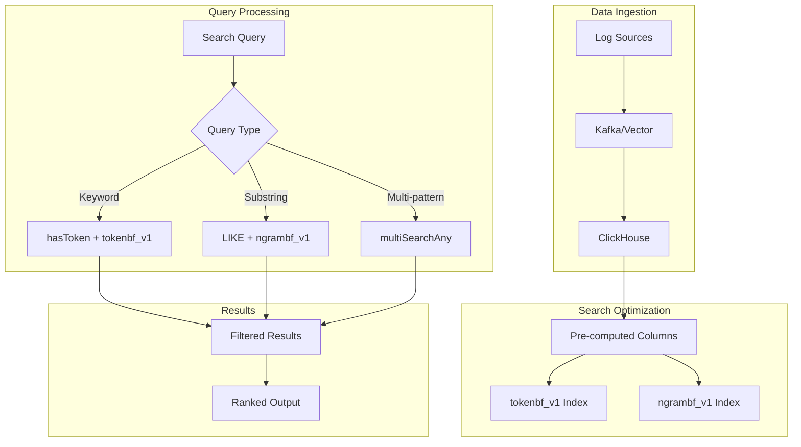

# How to Implement Full-Text Search in ClickHouse

Author: [nawazdhandala](https://www.github.com/nawazdhandala)

Tags: ClickHouse, Full-Text Search, Text Analysis, tokenbf_v1, ngrambf_v1, Bloom Filter

Description: A comprehensive guide to implementing full-text search in ClickHouse using tokenbf_v1 and ngrambf_v1 bloom filter indexes, text analysis functions, and optimization techniques for log and document search.

---

While ClickHouse is primarily designed for analytical queries, it offers powerful text search capabilities that can handle log analysis, document search, and content filtering at scale. This guide covers how to implement efficient full-text search using ClickHouse's bloom filter indexes and text functions.

## Understanding ClickHouse Text Search Options

ClickHouse provides several approaches for text search:

1. **Simple LIKE/ILIKE patterns** - Basic substring matching
2. **Regular expressions** - Pattern matching with match() and extract()
3. **Bloom filter indexes** - Skip indexes for efficient filtering
4. **hasToken() function** - Optimized token-based search
5. **Full-text search functions** - multiSearchAny, multiSearchFirstIndex

## Setting Up Text Search Indexes

### tokenbf_v1 Index

The `tokenbf_v1` index creates a bloom filter of tokens (words) for efficient keyword search:

```sql
CREATE TABLE logs (
    timestamp DateTime,
    level LowCardinality(String),
    service LowCardinality(String),
    message String,
    INDEX message_tokens message TYPE tokenbf_v1(32768, 3, 0) GRANULARITY 4
) ENGINE = MergeTree()
PARTITION BY toYYYYMM(timestamp)
ORDER BY (service, timestamp);

-- Parameters explained:
-- 32768: Size of bloom filter in bytes (larger = fewer false positives)
-- 3: Number of hash functions (3-5 is typically optimal)
-- 0: Seed for hash functions (0 for default)
-- GRANULARITY 4: Index covers 4 data granules
```

### ngrambf_v1 Index

The `ngrambf_v1` index creates bloom filters for character n-grams, enabling substring search:

```sql
CREATE TABLE documents (
    doc_id UInt64,
    created_at DateTime,
    title String,
    content String,
    INDEX title_ngram title TYPE ngrambf_v1(4, 32768, 3, 0) GRANULARITY 4,
    INDEX content_ngram content TYPE ngrambf_v1(4, 65536, 3, 0) GRANULARITY 2
) ENGINE = MergeTree()
ORDER BY (created_at, doc_id);

-- Parameters explained:
-- 4: N-gram size (4 characters)
-- 32768: Bloom filter size in bytes
-- 3: Number of hash functions
-- 0: Hash seed
```

### Choosing Between tokenbf_v1 and ngrambf_v1

```sql
-- tokenbf_v1: Best for word-based search
-- Matches: hasToken(message, 'error')
-- Query: "Find logs containing the word 'error'"

-- ngrambf_v1: Best for substring search
-- Matches: LIKE '%exception%'
-- Query: "Find documents containing 'exception' anywhere"

-- Combined approach for comprehensive search
CREATE TABLE search_data (
    id UInt64,
    timestamp DateTime,
    text String,
    -- Token index for exact word matching
    INDEX text_token text TYPE tokenbf_v1(32768, 3, 0) GRANULARITY 4,
    -- N-gram index for substring matching
    INDEX text_ngram text TYPE ngrambf_v1(3, 32768, 3, 0) GRANULARITY 4
) ENGINE = MergeTree()
ORDER BY (timestamp, id);
```

## Using hasToken for Word Search

The `hasToken()` function searches for exact word matches and leverages tokenbf_v1 indexes:

```sql
-- Basic token search
SELECT timestamp, level, message
FROM logs
WHERE hasToken(message, 'error')
ORDER BY timestamp DESC
LIMIT 100;

-- Multiple token search (AND logic)
SELECT timestamp, level, message
FROM logs
WHERE hasToken(message, 'database')
  AND hasToken(message, 'connection')
ORDER BY timestamp DESC
LIMIT 100;

-- Token search with OR logic using hasTokenAny
SELECT timestamp, level, message
FROM logs
WHERE hasAny(
    splitByChar(' ', lower(message)),
    ['error', 'exception', 'failure', 'timeout']
)
ORDER BY timestamp DESC
LIMIT 100;
```

## Multi-Search Functions

ClickHouse provides efficient multi-pattern search functions:

```sql
-- Check if message contains any of the patterns
SELECT
    timestamp,
    message,
    multiSearchAny(message, ['error', 'warning', 'critical']) AS has_issue
FROM logs
WHERE multiSearchAny(message, ['error', 'warning', 'critical'])
ORDER BY timestamp DESC
LIMIT 100;

-- Find which pattern matched first
SELECT
    timestamp,
    message,
    multiSearchFirstIndex(message, ['error', 'warning', 'info', 'debug']) AS matched_level
FROM logs
WHERE multiSearchFirstIndex(message, ['error', 'warning', 'info', 'debug']) > 0
ORDER BY timestamp DESC
LIMIT 100;

-- Count occurrences of each pattern
SELECT
    timestamp,
    message,
    multiSearchAllPositions(message, ['user', 'session', 'request']) AS positions
FROM logs
WHERE length(multiSearchAllPositions(message, ['user', 'session', 'request'])) > 0
LIMIT 10;
```

### Case-Insensitive Search

```sql
-- Case-insensitive multi-search
SELECT timestamp, message
FROM logs
WHERE multiSearchAnyCaseInsensitive(message, ['Error', 'WARNING', 'Exception'])
ORDER BY timestamp DESC
LIMIT 100;

-- Case-insensitive token search
SELECT timestamp, message
FROM logs
WHERE hasTokenCaseInsensitive(message, 'Error')
ORDER BY timestamp DESC;
```

## Building a Search Query Interface

Here's a practical implementation for a log search system:

```sql
-- Create an optimized logs table for search
CREATE TABLE searchable_logs (
    timestamp DateTime64(3),
    date Date MATERIALIZED toDate(timestamp),
    level Enum8('debug'=1, 'info'=2, 'warning'=3, 'error'=4, 'critical'=5),
    service LowCardinality(String),
    host LowCardinality(String),
    message String,
    message_lower String MATERIALIZED lower(message),
    -- Indexes for search
    INDEX msg_token message_lower TYPE tokenbf_v1(32768, 3, 0) GRANULARITY 4,
    INDEX msg_ngram message_lower TYPE ngrambf_v1(4, 32768, 3, 0) GRANULARITY 4
) ENGINE = MergeTree()
PARTITION BY date
ORDER BY (service, level, timestamp)
TTL date + INTERVAL 30 DAY;

-- Search function: keyword search
SELECT
    timestamp,
    level,
    service,
    message
FROM searchable_logs
WHERE date >= today() - 7
  AND service = 'api-gateway'
  AND hasToken(message_lower, 'timeout')
ORDER BY timestamp DESC
LIMIT 100;

-- Search function: phrase search (approximated)
SELECT
    timestamp,
    level,
    service,
    message
FROM searchable_logs
WHERE date >= today() - 1
  AND message_lower LIKE '%connection refused%'
ORDER BY timestamp DESC
LIMIT 100;

-- Search function: combined filters
SELECT
    timestamp,
    level,
    service,
    message
FROM searchable_logs
WHERE date >= today() - 7
  AND level >= 'warning'
  AND (
    hasToken(message_lower, 'timeout')
    OR hasToken(message_lower, 'error')
    OR message_lower LIKE '%failed%'
  )
ORDER BY timestamp DESC
LIMIT 100;
```

## Text Analysis and Tokenization

### Tokenization Functions

```sql
-- Split text into tokens
SELECT
    message,
    splitByChar(' ', message) AS words,
    splitByRegexp('\\W+', message) AS tokens,
    splitByWhitespace(message) AS whitespace_split
FROM logs
LIMIT 5;

-- Extract specific patterns
SELECT
    message,
    extractAll(message, '\\b[A-Z][a-z]+\\b') AS capitalized_words,
    extractAll(message, '\\d+') AS numbers,
    extractAll(message, '[a-zA-Z0-9._%+-]+@[a-zA-Z0-9.-]+\\.[a-zA-Z]{2,}') AS emails
FROM logs
LIMIT 10;
```

### Building a Token Frequency Analysis

```sql
-- Analyze most common words in error messages
SELECT
    token,
    count() AS frequency
FROM logs
ARRAY JOIN splitByRegexp('\\W+', lower(message)) AS token
WHERE level = 'error'
  AND length(token) >= 3
  AND token NOT IN ('the', 'and', 'for', 'that', 'with', 'this')
GROUP BY token
ORDER BY frequency DESC
LIMIT 50;

-- Analyze word co-occurrence
SELECT
    t1 AS word1,
    t2 AS word2,
    count() AS co_occurrence
FROM logs
ARRAY JOIN splitByRegexp('\\W+', lower(message)) AS t1
ARRAY JOIN splitByRegexp('\\W+', lower(message)) AS t2
WHERE level = 'error'
  AND t1 < t2
  AND length(t1) >= 3
  AND length(t2) >= 3
GROUP BY word1, word2
ORDER BY co_occurrence DESC
LIMIT 50;
```

## Optimizing Search Performance

### 1. Pre-compute Search Fields

```sql
-- Create a table with pre-computed search fields
CREATE TABLE optimized_search (
    id UInt64,
    timestamp DateTime,
    original_text String,
    -- Pre-computed fields
    text_lower String MATERIALIZED lower(original_text),
    word_count UInt16 MATERIALIZED length(splitByWhitespace(original_text)),
    has_error UInt8 MATERIALIZED multiSearchAny(lower(original_text), ['error', 'exception', 'fail']),
    -- Indexes
    INDEX text_bf text_lower TYPE tokenbf_v1(32768, 3, 0) GRANULARITY 4
) ENGINE = MergeTree()
ORDER BY (has_error, timestamp);

-- Query using pre-computed fields
SELECT timestamp, original_text
FROM optimized_search
WHERE has_error = 1
  AND hasToken(text_lower, 'database')
ORDER BY timestamp DESC
LIMIT 100;
```

### 2. Use Appropriate Index Granularity

```sql
-- For high-selectivity searches (few matches)
INDEX msg_token message TYPE tokenbf_v1(32768, 3, 0) GRANULARITY 1

-- For low-selectivity searches (many matches)
INDEX msg_token message TYPE tokenbf_v1(32768, 3, 0) GRANULARITY 8

-- Check index usage with EXPLAIN
EXPLAIN indexes = 1
SELECT * FROM logs
WHERE hasToken(message, 'error');
```

### 3. Combine with Primary Key Filtering

```sql
-- Always include primary key columns for best performance
SELECT timestamp, message
FROM logs
WHERE service = 'payment-service'     -- Primary key filter first
  AND timestamp >= now() - INTERVAL 1 HOUR
  AND hasToken(message, 'transaction')  -- Then text search
ORDER BY timestamp DESC
LIMIT 100;
```

## Building a Simple Search API

Here's an example of implementing search functionality:

```sql
-- Create a search results materialized view for common queries
CREATE MATERIALIZED VIEW error_search_mv
ENGINE = MergeTree()
ORDER BY (service, timestamp)
AS SELECT
    timestamp,
    service,
    host,
    message,
    extractAll(message, 'error[:\\s]+([^.]+)') AS error_context
FROM searchable_logs
WHERE level >= 'error';

-- Search with relevance scoring (simple approach)
SELECT
    timestamp,
    service,
    message,
    -- Simple relevance score based on keyword matches
    (
        multiSearchAny(lower(message), ['critical']) * 10 +
        multiSearchAny(lower(message), ['error']) * 5 +
        multiSearchAny(lower(message), ['warning']) * 2 +
        hasToken(lower(message), 'database') * 3 +
        hasToken(lower(message), 'timeout') * 3
    ) AS relevance_score
FROM searchable_logs
WHERE date >= today() - 1
  AND multiSearchAny(lower(message), ['error', 'critical', 'warning', 'database', 'timeout'])
ORDER BY relevance_score DESC, timestamp DESC
LIMIT 100;
```

## Full-Text Search Architecture



## Comparison with Dedicated Search Engines

| Feature | ClickHouse | Elasticsearch |
|---------|------------|---------------|
| Tokenization | Basic (splitBy functions) | Advanced (analyzers) |
| Relevance Scoring | Manual implementation | BM25, TF-IDF built-in |
| Phrase Search | LIKE patterns | Native phrase queries |
| Fuzzy Search | Limited (ngrambf_v1) | Native fuzzy queries |
| Aggregations | Excellent | Good |
| Storage Efficiency | Excellent | Moderate |
| Real-time Indexing | Good | Excellent |

## When to Use ClickHouse for Text Search

ClickHouse text search is ideal for:

- Log analysis with structured fields plus text search
- Combined analytical and search queries
- High-volume data with acceptable search accuracy
- Cost-sensitive deployments (no separate search cluster)

Consider dedicated search engines for:

- Complex relevance scoring requirements
- Advanced linguistic analysis
- Fuzzy matching and typo tolerance
- Real-time search suggestions

## Conclusion

ClickHouse provides practical full-text search capabilities that work well for log analysis and document filtering. Key takeaways:

1. Use `tokenbf_v1` indexes for word-based search with `hasToken()`
2. Use `ngrambf_v1` indexes for substring matching with `LIKE`
3. Pre-compute lowercase text columns for consistent matching
4. Combine text filters with primary key filters for best performance
5. Use `multiSearchAny()` for searching multiple patterns efficiently

While not a replacement for dedicated search engines, ClickHouse's text search capabilities can significantly reduce infrastructure complexity for many use cases.
