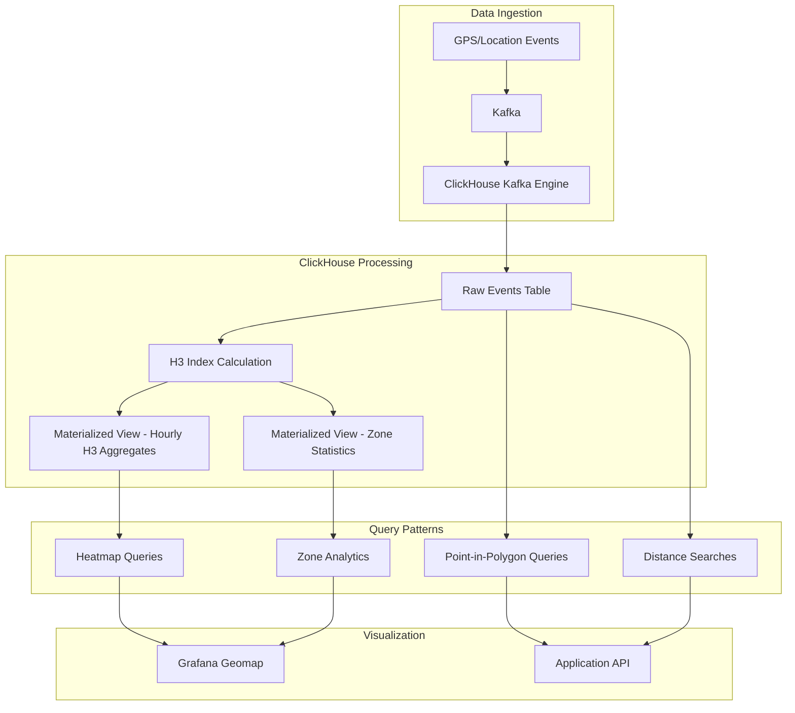

# How to Use ClickHouse for Geospatial Queries

Author: [nawazdhandala](https://www.github.com/nawazdhandala)

Tags: ClickHouse, Geospatial, H3, Location Data, Analytics

Description: A comprehensive guide to performing geospatial queries in ClickHouse, including point-in-polygon tests, distance calculations, H3 hexagonal indexes, and spatial aggregations for location-based analytics.

---

ClickHouse provides powerful geospatial capabilities that enable you to perform location-based analytics at scale. Whether you're building a delivery tracking system, analyzing user locations, or creating geographic heatmaps, ClickHouse's geospatial functions can handle billions of coordinates with exceptional performance.

## Understanding Geospatial Data Types in ClickHouse

ClickHouse supports several data types for storing geospatial data:

```sql
-- Point: A single coordinate (longitude, latitude)
CREATE TABLE locations (
    id UInt64,
    name String,
    location Point
) ENGINE = MergeTree()
ORDER BY id;

-- Ring: A closed polygon boundary
CREATE TABLE boundaries (
    id UInt64,
    region_name String,
    boundary Ring
) ENGINE = MergeTree()
ORDER BY id;

-- Polygon: A shape with optional holes
CREATE TABLE zones (
    id UInt64,
    zone_name String,
    area Polygon
) ENGINE = MergeTree()
ORDER BY id;

-- MultiPolygon: Multiple polygons as a single entity
CREATE TABLE countries (
    id UInt64,
    country_name String,
    territories MultiPolygon
) ENGINE = MergeTree()
ORDER BY id;
```

For simpler use cases, you can store coordinates as separate Float64 columns:

```sql
CREATE TABLE events (
    event_id UInt64,
    event_time DateTime,
    latitude Float64,
    longitude Float64,
    event_type String
) ENGINE = MergeTree()
PARTITION BY toYYYYMM(event_time)
ORDER BY (event_time, event_id);
```

## Distance Calculations

### Great Circle Distance

Calculate the distance between two points on Earth using the Haversine formula:

```sql
-- Calculate distance between two coordinates in meters
SELECT greatCircleDistance(
    -73.935242, 40.730610,  -- New York (longitude, latitude)
    -0.127758, 51.507351    -- London (longitude, latitude)
) AS distance_meters;

-- Result: 5570222.8 (approximately 5,570 km)
```

### Finding Nearby Points

Find all events within a certain radius:

```sql
-- Find all events within 5km of a reference point
SELECT
    event_id,
    event_type,
    latitude,
    longitude,
    greatCircleDistance(
        longitude, latitude,
        -122.4194, 37.7749  -- San Francisco
    ) AS distance_meters
FROM events
WHERE greatCircleDistance(
    longitude, latitude,
    -122.4194, 37.7749
) <= 5000  -- 5km radius
ORDER BY distance_meters;
```

### Optimizing Distance Queries with Bounding Box

For better performance, use a bounding box pre-filter:

```sql
-- Pre-filter with bounding box before calculating exact distance
WITH
    -122.4194 AS center_lon,
    37.7749 AS center_lat,
    5000 AS radius_meters,
    -- Approximate degrees for the bounding box
    radius_meters / 111000.0 AS lat_delta,
    radius_meters / (111000.0 * cos(radians(center_lat))) AS lon_delta
SELECT
    event_id,
    event_type,
    greatCircleDistance(longitude, latitude, center_lon, center_lat) AS distance_m
FROM events
WHERE
    latitude BETWEEN (center_lat - lat_delta) AND (center_lat + lat_delta)
    AND longitude BETWEEN (center_lon - lon_delta) AND (center_lon + lon_delta)
    AND greatCircleDistance(longitude, latitude, center_lon, center_lat) <= radius_meters
ORDER BY distance_m;
```

## Point-in-Polygon Queries

Determine whether points fall within defined geographic regions:

```sql
-- Create a polygon representing a delivery zone
SELECT pointInPolygon(
    (-122.4089, 37.7851),  -- Point to test (longitude, latitude)
    [(
        (-122.4200, 37.7900),
        (-122.4000, 37.7900),
        (-122.4000, 37.7700),
        (-122.4200, 37.7700),
        (-122.4200, 37.7900)  -- Close the polygon
    )]
) AS is_in_zone;

-- Check multiple points against a zone
SELECT
    event_id,
    latitude,
    longitude,
    pointInPolygon(
        (longitude, latitude),
        [(
            (-122.4200, 37.7900),
            (-122.4000, 37.7900),
            (-122.4000, 37.7700),
            (-122.4200, 37.7700),
            (-122.4200, 37.7900)
        )]
    ) AS in_delivery_zone
FROM events;
```

### Complex Polygon with Holes

Handle polygons with exclusion areas:

```sql
-- Polygon with a hole (e.g., a park excluded from delivery)
SELECT pointInPolygon(
    (longitude, latitude),
    [
        -- Outer boundary
        (
            (-122.42, 37.79),
            (-122.40, 37.79),
            (-122.40, 37.77),
            (-122.42, 37.77),
            (-122.42, 37.79)
        ),
        -- Inner hole (excluded area)
        (
            (-122.415, 37.785),
            (-122.405, 37.785),
            (-122.405, 37.775),
            (-122.415, 37.775),
            (-122.415, 37.785)
        )
    ]
) AS in_serviceable_area
FROM events;
```

## H3 Hexagonal Indexing

H3 is Uber's hierarchical hexagonal grid system, perfect for spatial aggregations:

```sql
-- Convert coordinates to H3 index at resolution 9 (approximately 100m hexagons)
SELECT
    geoToH3(longitude, latitude, 9) AS h3_index,
    count() AS event_count
FROM events
GROUP BY h3_index
ORDER BY event_count DESC
LIMIT 10;

-- Get the center coordinates of an H3 cell
SELECT
    h3_index,
    h3ToGeo(h3_index) AS (center_lat, center_lon),
    event_count
FROM (
    SELECT
        geoToH3(longitude, latitude, 9) AS h3_index,
        count() AS event_count
    FROM events
    GROUP BY h3_index
)
ORDER BY event_count DESC;
```

### H3 Resolution Guide

Different resolutions serve different use cases:

```sql
-- Resolution comparison table
-- Res 0: ~1,107 km - Continental analysis
-- Res 4: ~22 km - Regional analysis
-- Res 7: ~1.2 km - Neighborhood analysis
-- Res 9: ~174 m - Block-level analysis
-- Res 12: ~9 m - Building-level analysis
-- Res 15: ~0.5 m - High precision

-- Create hexagonal heatmap data at city level (resolution 7)
SELECT
    geoToH3(longitude, latitude, 7) AS h3_cell,
    count() AS count,
    avg(amount) AS avg_transaction
FROM transactions
WHERE event_time >= now() - INTERVAL 7 DAY
GROUP BY h3_cell;
```

### H3 Neighbor Analysis

Find neighboring hexagons for spatial smoothing:

```sql
-- Get a hexagon and its immediate neighbors (k-ring of 1)
SELECT
    h3_cell,
    h3kRing(h3_cell, 1) AS neighbors
FROM (
    SELECT DISTINCT geoToH3(longitude, latitude, 9) AS h3_cell
    FROM events
    LIMIT 1
);

-- Aggregate data including neighboring cells
WITH central_cells AS (
    SELECT geoToH3(longitude, latitude, 9) AS h3_cell
    FROM events
    WHERE event_type = 'purchase'
)
SELECT
    h3_cell,
    count() AS direct_events,
    -- Count events in neighboring cells
    (
        SELECT count()
        FROM events
        WHERE geoToH3(longitude, latitude, 9) IN h3kRing(central_cells.h3_cell, 1)
    ) AS neighborhood_events
FROM central_cells
GROUP BY h3_cell;
```

## Geospatial Aggregations

### Geographic Density Analysis

```sql
-- Calculate event density by geographic grid
SELECT
    floor(latitude * 100) / 100 AS lat_bucket,
    floor(longitude * 100) / 100 AS lon_bucket,
    count() AS event_count,
    uniqExact(user_id) AS unique_users
FROM events
WHERE event_time >= now() - INTERVAL 30 DAY
GROUP BY lat_bucket, lon_bucket
HAVING event_count >= 10
ORDER BY event_count DESC;
```

### Time-Based Geospatial Analysis

```sql
-- Analyze geographic patterns by hour of day
SELECT
    toHour(event_time) AS hour,
    geoToH3(longitude, latitude, 7) AS h3_cell,
    count() AS events,
    uniqExact(user_id) AS unique_users
FROM events
WHERE event_time >= now() - INTERVAL 7 DAY
GROUP BY hour, h3_cell
ORDER BY hour, events DESC;
```

### Movement Patterns

Track entity movement between locations:

```sql
-- Analyze user movement between zones
SELECT
    from_zone,
    to_zone,
    count() AS trip_count,
    avg(duration_minutes) AS avg_duration
FROM (
    SELECT
        user_id,
        geoToH3(longitude, latitude, 7) AS zone,
        event_time,
        lagInFrame(geoToH3(longitude, latitude, 7))
            OVER (PARTITION BY user_id ORDER BY event_time) AS prev_zone,
        dateDiff('minute',
            lagInFrame(event_time) OVER (PARTITION BY user_id ORDER BY event_time),
            event_time
        ) AS duration_minutes
    FROM events
    WHERE event_time >= now() - INTERVAL 1 DAY
)
WHERE prev_zone != zone AND prev_zone != 0
GROUP BY
    prev_zone AS from_zone,
    zone AS to_zone
ORDER BY trip_count DESC
LIMIT 20;
```

## Creating Geospatial Indexes

Optimize geospatial queries with appropriate indexing:

```sql
-- Create a table with geospatial optimization
CREATE TABLE geo_events (
    event_id UInt64,
    event_time DateTime,
    latitude Float64,
    longitude Float64,
    h3_index_7 UInt64 MATERIALIZED geoToH3(longitude, latitude, 7),
    h3_index_9 UInt64 MATERIALIZED geoToH3(longitude, latitude, 9),
    event_type LowCardinality(String),
    payload String
) ENGINE = MergeTree()
PARTITION BY toYYYYMM(event_time)
ORDER BY (h3_index_7, event_time, event_id)
SETTINGS index_granularity = 8192;

-- Add a bloom filter index for H3 lookups
ALTER TABLE geo_events
ADD INDEX h3_bf h3_index_9 TYPE bloom_filter GRANULARITY 4;

-- Add minmax index for coordinate ranges
ALTER TABLE geo_events
ADD INDEX lat_minmax latitude TYPE minmax GRANULARITY 4;

ALTER TABLE geo_events
ADD INDEX lon_minmax longitude TYPE minmax GRANULARITY 4;
```

## Real-World Example: Delivery Zone Analytics

Here's a complete example for analyzing delivery performance by zone:

```sql
-- Create delivery zones table
CREATE TABLE delivery_zones (
    zone_id UInt32,
    zone_name String,
    zone_polygon Array(Tuple(Float64, Float64)),
    zone_h3_cells Array(UInt64)
) ENGINE = MergeTree()
ORDER BY zone_id;

-- Create deliveries table
CREATE TABLE deliveries (
    delivery_id UInt64,
    order_time DateTime,
    delivery_time DateTime,
    pickup_lat Float64,
    pickup_lon Float64,
    dropoff_lat Float64,
    dropoff_lon Float64,
    status LowCardinality(String),
    driver_id UInt32
) ENGINE = MergeTree()
PARTITION BY toYYYYMM(order_time)
ORDER BY (order_time, delivery_id);

-- Analyze delivery metrics by zone
SELECT
    dz.zone_name,
    count() AS total_deliveries,
    countIf(status = 'completed') AS completed,
    countIf(status = 'cancelled') AS cancelled,
    avg(dateDiff('minute', order_time, delivery_time)) AS avg_delivery_minutes,
    quantile(0.95)(dateDiff('minute', order_time, delivery_time)) AS p95_delivery_minutes
FROM deliveries d
CROSS JOIN delivery_zones dz
WHERE pointInPolygon(
    (d.dropoff_lon, d.dropoff_lat),
    [dz.zone_polygon]
)
AND d.order_time >= now() - INTERVAL 30 DAY
GROUP BY dz.zone_name
ORDER BY total_deliveries DESC;
```

## Performance Tips for Geospatial Queries

### 1. Use H3 for Pre-Aggregation

```sql
-- Create a materialized view for hourly H3 aggregates
CREATE MATERIALIZED VIEW geo_hourly_mv
ENGINE = SummingMergeTree()
ORDER BY (h3_cell, hour)
AS SELECT
    geoToH3(longitude, latitude, 9) AS h3_cell,
    toStartOfHour(event_time) AS hour,
    count() AS event_count,
    uniqState(user_id) AS unique_users_state
FROM events
GROUP BY h3_cell, hour;

-- Query the pre-aggregated data
SELECT
    h3_cell,
    sum(event_count) AS total_events,
    uniqMerge(unique_users_state) AS unique_users
FROM geo_hourly_mv
WHERE hour >= now() - INTERVAL 24 HOUR
GROUP BY h3_cell
ORDER BY total_events DESC;
```

### 2. Optimize Point-in-Polygon with H3

```sql
-- Pre-compute H3 cells for each zone
-- Then filter by H3 before doing exact polygon check
SELECT
    event_id,
    event_time
FROM events
WHERE geoToH3(longitude, latitude, 7) IN (
    -- Pre-computed H3 cells that intersect with zone
    SELECT arrayJoin(zone_h3_cells)
    FROM delivery_zones
    WHERE zone_id = 1
)
AND pointInPolygon(
    (longitude, latitude),
    (SELECT zone_polygon FROM delivery_zones WHERE zone_id = 1)
);
```

### 3. Use Approximate Functions for Exploration

```sql
-- Use approximate distance for initial filtering
-- greatCircleDistance is already optimized, but for very large datasets:
SELECT
    event_id,
    longitude,
    latitude,
    -- Quick approximate distance in degrees (very fast)
    sqrt(
        pow(longitude - (-122.4194), 2) +
        pow(latitude - 37.7749, 2)
    ) * 111000 AS approx_distance_m
FROM events
WHERE
    abs(longitude - (-122.4194)) < 0.1
    AND abs(latitude - 37.7749) < 0.1
ORDER BY approx_distance_m
LIMIT 100;
```

## Architecture Diagram



## Conclusion

ClickHouse's geospatial capabilities provide a powerful foundation for location-based analytics. Key takeaways:

1. Use H3 indexes for efficient spatial aggregations and pre-filtering
2. Combine bounding box filters with exact distance calculations for better performance
3. Leverage materialized views to pre-aggregate geospatial data
4. Choose the appropriate H3 resolution based on your analysis granularity
5. Use point-in-polygon for precise zone detection after coarse H3 filtering

With these techniques, you can build scalable geospatial analytics systems capable of processing billions of location events with sub-second query performance.
