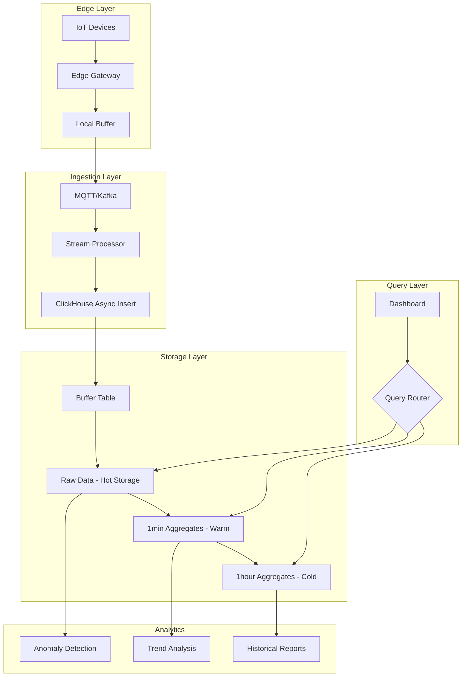

# How to Set Up ClickHouse for IoT Time-Series Data

Author: [nawazdhandala](https://www.github.com/nawazdhandala)

Tags: ClickHouse, IoT, Time-Series, Sensor Data, Downsampling, High-Frequency Data

Description: A comprehensive guide to setting up ClickHouse for IoT time-series data, covering high-frequency sensor data ingestion, efficient schema design, downsampling strategies, and query optimization for industrial and consumer IoT applications.

---

IoT applications generate massive volumes of time-series data from sensors, devices, and equipment. ClickHouse excels at storing and analyzing this data at scale, handling millions of data points per second while providing fast analytical queries. This guide covers best practices for building IoT analytics systems with ClickHouse.

## Schema Design for IoT Data

### Basic Sensor Data Table

```sql
-- High-frequency sensor readings table
CREATE TABLE sensor_readings (
    device_id UInt32,
    sensor_id UInt16,
    timestamp DateTime64(3),  -- Millisecond precision
    value Float64,
    quality UInt8,  -- 0=good, 1=uncertain, 2=bad
    INDEX ts_idx timestamp TYPE minmax GRANULARITY 4
) ENGINE = MergeTree()
PARTITION BY toYYYYMM(timestamp)
ORDER BY (device_id, sensor_id, timestamp)
SETTINGS index_granularity = 8192;

-- For very high frequency data (microsecond precision)
CREATE TABLE sensor_readings_hf (
    device_id UInt32,
    sensor_id UInt16,
    timestamp DateTime64(6),  -- Microsecond precision
    value Float64,
    quality UInt8
) ENGINE = MergeTree()
PARTITION BY (device_id, toYYYYMMDD(timestamp))  -- Daily partitions per device
ORDER BY (device_id, sensor_id, timestamp)
TTL timestamp + INTERVAL 7 DAY  -- Keep raw data for 7 days
SETTINGS index_granularity = 8192;
```

### Multi-Value Sensor Table

For sensors that report multiple values simultaneously:

```sql
-- Compact multi-value sensor readings
CREATE TABLE sensor_readings_multi (
    device_id UInt32,
    timestamp DateTime64(3),
    -- Use arrays for multiple sensor values
    sensor_ids Array(UInt16),
    values Array(Float64),
    -- Or use a Map for named sensors
    readings Map(String, Float64),
    -- Metadata
    device_type LowCardinality(String),
    location_id UInt32
) ENGINE = MergeTree()
PARTITION BY toYYYYMM(timestamp)
ORDER BY (device_id, timestamp);

-- Query specific sensor from multi-value table
SELECT
    device_id,
    timestamp,
    readings['temperature'] AS temperature,
    readings['humidity'] AS humidity
FROM sensor_readings_multi
WHERE device_id = 1001
  AND timestamp >= now() - INTERVAL 1 HOUR;
```

### Device Metadata Table

```sql
-- Device registry
CREATE TABLE devices (
    device_id UInt32,
    device_name String,
    device_type LowCardinality(String),
    manufacturer LowCardinality(String),
    model String,
    firmware_version String,
    location_id UInt32,
    latitude Float64,
    longitude Float64,
    installed_at DateTime,
    last_seen DateTime,
    status LowCardinality(String),
    config Map(String, String)
) ENGINE = ReplacingMergeTree(last_seen)
ORDER BY device_id;

-- Sensor definitions
CREATE TABLE sensors (
    sensor_id UInt32,
    device_id UInt32,
    sensor_name String,
    sensor_type LowCardinality(String),
    unit LowCardinality(String),
    min_value Float64,
    max_value Float64,
    precision UInt8,
    sampling_rate_hz Float32
) ENGINE = MergeTree()
ORDER BY (device_id, sensor_id);
```

## High-Frequency Data Ingestion

### Batch Inserts

```sql
-- Insert in batches for optimal performance
-- Aim for 10,000-100,000 rows per insert
INSERT INTO sensor_readings
SELECT
    rand() % 1000 AS device_id,
    rand() % 50 AS sensor_id,
    now64(3) - (number * 100) AS timestamp,  -- 100ms intervals
    rand() / 1000000000.0 * 100 AS value,
    0 AS quality
FROM numbers(100000);
```

### Async Inserts Configuration

```xml
<!-- Enable async inserts for high-throughput ingestion -->
<clickhouse>
    <async_insert>1</async_insert>
    <async_insert_threads>4</async_insert_threads>
    <async_insert_max_data_size>10000000</async_insert_max_data_size>
    <async_insert_busy_timeout_ms>200</async_insert_busy_timeout_ms>
    <wait_for_async_insert>0</wait_for_async_insert>
</clickhouse>
```

```sql
-- Insert with async settings
INSERT INTO sensor_readings
SETTINGS async_insert = 1, wait_for_async_insert = 0
VALUES (1001, 1, now64(3), 25.5, 0);
```

### Using Buffer Tables

```sql
-- Create buffer table for smoothing writes
CREATE TABLE sensor_readings_buffer AS sensor_readings
ENGINE = Buffer(
    default,              -- Database
    sensor_readings,      -- Destination table
    16,                   -- Number of buffers
    10,                   -- Min time (seconds)
    100,                  -- Max time (seconds)
    10000,                -- Min rows
    1000000,              -- Max rows
    10000000,             -- Min bytes
    100000000             -- Max bytes
);

-- Insert into buffer (automatically flushes to main table)
INSERT INTO sensor_readings_buffer VALUES (...);
```

## Downsampling Strategies

### Pre-Aggregated Rollups

```sql
-- 1-minute aggregates
CREATE TABLE sensor_readings_1m (
    device_id UInt32,
    sensor_id UInt16,
    timestamp DateTime,
    min_value Float64,
    max_value Float64,
    avg_value Float64,
    count UInt32,
    sum_value Float64,
    first_value Float64,
    last_value Float64
) ENGINE = SummingMergeTree()
PARTITION BY toYYYYMM(timestamp)
ORDER BY (device_id, sensor_id, timestamp)
TTL timestamp + INTERVAL 90 DAY;

-- Materialized view for automatic downsampling
CREATE MATERIALIZED VIEW sensor_readings_1m_mv
TO sensor_readings_1m
AS SELECT
    device_id,
    sensor_id,
    toStartOfMinute(timestamp) AS timestamp,
    min(value) AS min_value,
    max(value) AS max_value,
    avg(value) AS avg_value,
    count() AS count,
    sum(value) AS sum_value,
    argMin(value, timestamp) AS first_value,
    argMax(value, timestamp) AS last_value
FROM sensor_readings
GROUP BY device_id, sensor_id, timestamp;

-- 1-hour aggregates
CREATE TABLE sensor_readings_1h (
    device_id UInt32,
    sensor_id UInt16,
    timestamp DateTime,
    min_value Float64,
    max_value Float64,
    avg_value Float64,
    count UInt32,
    stddev_value Float64,
    p50_value Float64,
    p95_value Float64,
    p99_value Float64
) ENGINE = SummingMergeTree()
PARTITION BY toYYYYMM(timestamp)
ORDER BY (device_id, sensor_id, timestamp)
TTL timestamp + INTERVAL 2 YEAR;

CREATE MATERIALIZED VIEW sensor_readings_1h_mv
TO sensor_readings_1h
AS SELECT
    device_id,
    sensor_id,
    toStartOfHour(timestamp) AS timestamp,
    min(min_value) AS min_value,
    max(max_value) AS max_value,
    sum(sum_value) / sum(count) AS avg_value,
    sum(count) AS count,
    0 AS stddev_value,  -- Calculated differently
    0 AS p50_value,
    0 AS p95_value,
    0 AS p99_value
FROM sensor_readings_1m
GROUP BY device_id, sensor_id, timestamp;
```

### Automatic Table Selection

```sql
-- Query that automatically selects the right table
WITH
    toDateTime('2024-01-01 00:00:00') AS start_time,
    toDateTime('2024-01-31 23:59:59') AS end_time,
    dateDiff('hour', start_time, end_time) AS hours_diff
SELECT *
FROM (
    -- Use raw data for short ranges
    SELECT
        device_id,
        sensor_id,
        timestamp,
        value AS avg_value,
        value AS min_value,
        value AS max_value
    FROM sensor_readings
    WHERE hours_diff <= 1
      AND timestamp BETWEEN start_time AND end_time

    UNION ALL

    -- Use 1-minute aggregates for medium ranges
    SELECT
        device_id,
        sensor_id,
        timestamp,
        avg_value,
        min_value,
        max_value
    FROM sensor_readings_1m
    WHERE hours_diff > 1 AND hours_diff <= 24
      AND timestamp BETWEEN start_time AND end_time

    UNION ALL

    -- Use 1-hour aggregates for long ranges
    SELECT
        device_id,
        sensor_id,
        timestamp,
        avg_value,
        min_value,
        max_value
    FROM sensor_readings_1h
    WHERE hours_diff > 24
      AND timestamp BETWEEN start_time AND end_time
)
ORDER BY timestamp;
```

## Common IoT Query Patterns

### Real-Time Dashboard Queries

```sql
-- Latest readings per device
SELECT
    device_id,
    sensor_id,
    argMax(value, timestamp) AS latest_value,
    max(timestamp) AS latest_timestamp
FROM sensor_readings
WHERE timestamp >= now() - INTERVAL 5 MINUTE
GROUP BY device_id, sensor_id;

-- Device status overview
SELECT
    d.device_id,
    d.device_name,
    d.status,
    count(DISTINCT sr.sensor_id) AS active_sensors,
    max(sr.timestamp) AS last_reading
FROM devices d
LEFT JOIN sensor_readings sr ON d.device_id = sr.device_id
    AND sr.timestamp >= now() - INTERVAL 5 MINUTE
GROUP BY d.device_id, d.device_name, d.status;
```

### Time-Series Analysis

```sql
-- Moving average
SELECT
    timestamp,
    value,
    avg(value) OVER (
        PARTITION BY device_id, sensor_id
        ORDER BY timestamp
        ROWS BETWEEN 10 PRECEDING AND CURRENT ROW
    ) AS moving_avg_10
FROM sensor_readings
WHERE device_id = 1001
  AND sensor_id = 1
  AND timestamp >= now() - INTERVAL 1 HOUR
ORDER BY timestamp;

-- Rate of change detection
SELECT
    timestamp,
    value,
    value - lagInFrame(value, 1) OVER (
        PARTITION BY device_id, sensor_id
        ORDER BY timestamp
    ) AS delta,
    (value - lagInFrame(value, 1) OVER (
        PARTITION BY device_id, sensor_id
        ORDER BY timestamp
    )) / (toUnixTimestamp64Milli(timestamp) - toUnixTimestamp64Milli(
        lagInFrame(timestamp, 1) OVER (
            PARTITION BY device_id, sensor_id
            ORDER BY timestamp
        )
    )) * 1000 AS rate_per_second
FROM sensor_readings
WHERE device_id = 1001 AND sensor_id = 1
  AND timestamp >= now() - INTERVAL 1 HOUR;
```

### Anomaly Detection

```sql
-- Z-score based anomaly detection
WITH stats AS (
    SELECT
        device_id,
        sensor_id,
        avg(value) AS mean_value,
        stddevPop(value) AS stddev_value
    FROM sensor_readings
    WHERE timestamp >= now() - INTERVAL 24 HOUR
    GROUP BY device_id, sensor_id
)
SELECT
    sr.device_id,
    sr.sensor_id,
    sr.timestamp,
    sr.value,
    (sr.value - s.mean_value) / s.stddev_value AS z_score
FROM sensor_readings sr
JOIN stats s ON sr.device_id = s.device_id AND sr.sensor_id = s.sensor_id
WHERE sr.timestamp >= now() - INTERVAL 1 HOUR
  AND abs((sr.value - s.mean_value) / s.stddev_value) > 3  -- 3 sigma
ORDER BY abs((sr.value - s.mean_value) / s.stddev_value) DESC;

-- Threshold-based alerts
SELECT
    device_id,
    sensor_id,
    timestamp,
    value,
    CASE
        WHEN value > 100 THEN 'HIGH'
        WHEN value < 10 THEN 'LOW'
        ELSE 'NORMAL'
    END AS alert_level
FROM sensor_readings
WHERE timestamp >= now() - INTERVAL 5 MINUTE
  AND (value > 100 OR value < 10);
```

### Device Health Monitoring

```sql
-- Devices with gaps in data
WITH expected_interval AS (
    SELECT 60 AS seconds  -- Expected reading every 60 seconds
)
SELECT
    device_id,
    sensor_id,
    timestamp,
    dateDiff('second', lagInFrame(timestamp, 1) OVER (
        PARTITION BY device_id, sensor_id ORDER BY timestamp
    ), timestamp) AS gap_seconds
FROM sensor_readings
WHERE timestamp >= now() - INTERVAL 1 HOUR
HAVING gap_seconds > (SELECT seconds FROM expected_interval) * 2
ORDER BY gap_seconds DESC;

-- Device uptime calculation
SELECT
    device_id,
    min(timestamp) AS first_seen,
    max(timestamp) AS last_seen,
    count() AS reading_count,
    dateDiff('second', min(timestamp), max(timestamp)) AS total_seconds,
    count() / (dateDiff('second', min(timestamp), max(timestamp)) / 60.0) AS readings_per_minute
FROM sensor_readings
WHERE timestamp >= now() - INTERVAL 24 HOUR
GROUP BY device_id
ORDER BY readings_per_minute;
```

## Data Compression Optimization

### Codec Selection for IoT Data

```sql
-- Optimized table with appropriate codecs
CREATE TABLE sensor_readings_optimized (
    device_id UInt32 CODEC(Delta, ZSTD(1)),
    sensor_id UInt16 CODEC(Delta, ZSTD(1)),
    timestamp DateTime64(3) CODEC(Delta, ZSTD(1)),
    value Float64 CODEC(Gorilla, ZSTD(1)),  -- Gorilla for time-series floats
    quality UInt8 CODEC(ZSTD(1))
) ENGINE = MergeTree()
PARTITION BY toYYYYMM(timestamp)
ORDER BY (device_id, sensor_id, timestamp)
SETTINGS index_granularity = 8192;

-- Check compression ratios
SELECT
    column,
    formatReadableSize(sum(data_compressed_bytes)) AS compressed,
    formatReadableSize(sum(data_uncompressed_bytes)) AS uncompressed,
    round(sum(data_uncompressed_bytes) / sum(data_compressed_bytes), 2) AS ratio
FROM system.columns
WHERE table = 'sensor_readings_optimized'
GROUP BY column;
```

## TTL and Data Lifecycle

```sql
-- Tiered storage with TTL
CREATE TABLE sensor_readings_tiered (
    device_id UInt32,
    sensor_id UInt16,
    timestamp DateTime64(3),
    value Float64,
    quality UInt8
) ENGINE = MergeTree()
PARTITION BY toYYYYMM(timestamp)
ORDER BY (device_id, sensor_id, timestamp)
TTL
    timestamp + INTERVAL 7 DAY TO VOLUME 'hot',
    timestamp + INTERVAL 30 DAY TO VOLUME 'warm',
    timestamp + INTERVAL 365 DAY DELETE
SETTINGS storage_policy = 'tiered';

-- Storage policy configuration
-- (in config.xml)
```

```xml
<storage_configuration>
    <disks>
        <nvme>
            <path>/mnt/nvme/clickhouse/</path>
        </nvme>
        <ssd>
            <path>/mnt/ssd/clickhouse/</path>
        </ssd>
        <hdd>
            <path>/mnt/hdd/clickhouse/</path>
        </hdd>
    </disks>
    <policies>
        <tiered>
            <volumes>
                <hot>
                    <disk>nvme</disk>
                </hot>
                <warm>
                    <disk>ssd</disk>
                </warm>
                <cold>
                    <disk>hdd</disk>
                </cold>
            </volumes>
        </tiered>
    </policies>
</storage_configuration>
```

## IoT Data Architecture



## Conclusion

Setting up ClickHouse for IoT time-series data requires:

1. **Optimized schema design** - Use appropriate data types and codecs
2. **Efficient ingestion** - Batch inserts, async writes, buffer tables
3. **Smart downsampling** - Pre-aggregate data at multiple granularities
4. **Tiered storage** - TTL policies for hot/warm/cold data
5. **Query optimization** - Select the right aggregate table based on time range

With these patterns, ClickHouse can handle millions of data points per second while providing sub-second query response times for IoT analytics dashboards.
