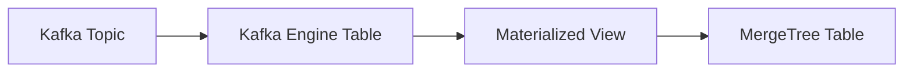

# How to Ingest Data into ClickHouse from Kafka

Author: [nawazdhandala](https://www.github.com/nawazdhandala)

Tags: ClickHouse, Kafka, Streaming, Data Ingestion, Real-Time, Database, Analytics, ETL

Description: A comprehensive guide to streaming data from Apache Kafka to ClickHouse using the Kafka table engine, materialized views, and best practices for reliable real-time data ingestion.

---

Kafka and ClickHouse are a powerful combination: Kafka handles real-time event streaming, ClickHouse provides fast analytics. This guide covers how to connect them using ClickHouse's native Kafka engine for reliable, high-throughput data ingestion.

## Architecture Overview

ClickHouse consumes Kafka messages using a three-table pattern:


```mermaid
flowchart LR
    Kafka[Kafka Topic]
    KafkaTable[Kafka Engine Table]
    MV[Materialized View]
    Target[MergeTree Table]

    Kafka --> KafkaTable
    KafkaTable --> MV
    MV --> Target
```

1. **Kafka Engine Table**: Connects to Kafka, reads messages
2. **Materialized View**: Transforms data and routes to target
3. **MergeTree Table**: Stores data persistently

## Basic Setup

### Step 1: Create the Target Table

Define where your data will be stored:

```sql
CREATE TABLE events
(
    event_time DateTime,
    event_type LowCardinality(String),
    user_id UInt64,
    properties Map(String, String),
    _kafka_topic String,
    _kafka_partition UInt64,
    _kafka_offset UInt64
)
ENGINE = MergeTree()
PARTITION BY toYYYYMM(event_time)
ORDER BY (event_type, user_id, event_time);
```

### Step 2: Create the Kafka Engine Table

Connect to Kafka:

```sql
CREATE TABLE events_kafka
(
    event_time DateTime,
    event_type String,
    user_id UInt64,
    properties Map(String, String)
)
ENGINE = Kafka
SETTINGS
    kafka_broker_list = 'kafka-1:9092,kafka-2:9092,kafka-3:9092',
    kafka_topic_list = 'events',
    kafka_group_name = 'clickhouse-events-consumer',
    kafka_format = 'JSONEachRow',
    kafka_num_consumers = 4,
    kafka_max_block_size = 65536;
```

### Step 3: Create the Materialized View

Connect Kafka table to target table:

```sql
CREATE MATERIALIZED VIEW events_mv TO events AS
SELECT
    event_time,
    event_type,
    user_id,
    properties,
    _topic AS _kafka_topic,
    _partition AS _kafka_partition,
    _offset AS _kafka_offset
FROM events_kafka;
```

## Kafka Engine Settings

### Essential Settings

```sql
ENGINE = Kafka
SETTINGS
    -- Broker connection
    kafka_broker_list = 'broker1:9092,broker2:9092',

    -- Topics (can be multiple)
    kafka_topic_list = 'topic1,topic2',

    -- Consumer group (must be unique per table)
    kafka_group_name = 'clickhouse-consumer-group',

    -- Message format
    kafka_format = 'JSONEachRow',

    -- Parallelism
    kafka_num_consumers = 4;
```

### Performance Settings

```sql
SETTINGS
    -- Batch size for inserts
    kafka_max_block_size = 65536,

    -- Poll timeout (ms)
    kafka_poll_timeout_ms = 1000,

    -- Max messages per poll
    kafka_poll_max_batch_size = 65536,

    -- Flush interval (ms)
    kafka_flush_interval_ms = 7500,

    -- Skip broken messages instead of failing
    kafka_skip_broken_messages = 10;
```

### Security Settings

```sql
SETTINGS
    -- SASL authentication
    kafka_security_protocol = 'sasl_ssl',
    kafka_sasl_mechanism = 'PLAIN',
    kafka_sasl_username = 'user',
    kafka_sasl_password = 'password';
```

Configure additional librdkafka TLS options in the ClickHouse server config:

```xml
<kafka>
  <ssl_ca_location>/path/to/ca.pem</ssl_ca_location>
  <ssl_certificate_location>/path/to/client.pem</ssl_certificate_location>
  <ssl_key_location>/path/to/client.key</ssl_key_location>
</kafka>
```

## Message Formats

### JSON Format

Most common format for structured events:

```sql
-- For messages like: {"event_time": "2024-01-15 10:30:00", "event_type": "click", "user_id": 123}
kafka_format = 'JSONEachRow'
```

### Avro with Schema Registry

For schema-managed Avro messages:

```sql
kafka_format = 'AvroConfluent'
SETTINGS
    format_avro_schema_registry_url = 'http://schema-registry:8081';
```

### Protobuf

For Protocol Buffer messages:

```sql
kafka_format = 'Protobuf'
SETTINGS
    kafka_schema = 'events.proto:Event';
```

### CSV/TSV

For simple delimited formats:

```sql
kafka_format = 'CSV'
-- or
kafka_format = 'TabSeparated'
```

### Raw String

When you need to parse in the materialized view:

```sql
CREATE TABLE raw_kafka
(
    message String
)
ENGINE = Kafka
SETTINGS
    kafka_broker_list = 'broker1:9092',
    kafka_topic_list = 'raw-events',
    kafka_group_name = 'clickhouse-raw-consumer',
    kafka_format = 'RawBLOB';

CREATE MATERIALIZED VIEW raw_mv TO events AS
SELECT
    parseDateTimeBestEffort(JSONExtractString(message, 'event_time')) AS event_time,
    JSONExtractString(message, 'event_type') AS event_type,
    JSONExtractUInt(message, 'user_id') AS user_id,
    CAST(map(), 'Map(String, String)') AS properties,
    _topic AS _kafka_topic,
    _partition AS _kafka_partition,
    _offset AS _kafka_offset
FROM raw_kafka;
```

## Multiple Topics

### Single Table, Multiple Topics

```sql
CREATE TABLE multi_topic_kafka
(
    message String
)
ENGINE = Kafka
SETTINGS
    kafka_broker_list = 'broker1:9092',
    kafka_topic_list = 'events,clicks,pageviews',
    kafka_group_name = 'clickhouse-multi-topic-consumer',
    kafka_format = 'JSONAsString';

CREATE MATERIALIZED VIEW multi_topic_mv TO events AS
SELECT
    parseDateTimeBestEffort(JSONExtractString(message, 'timestamp')) AS event_time,
    _topic AS event_type,  -- Use topic name as event type
    JSONExtractUInt(message, 'user_id') AS user_id,
    CAST(map(), 'Map(String, String)') AS properties,
    _topic AS _kafka_topic,
    _partition AS _kafka_partition,
    _offset AS _kafka_offset
FROM multi_topic_kafka;
```

### Separate Tables per Topic

```sql
-- Events topic
CREATE TABLE events_kafka
(
    event_time DateTime,
    event_type String,
    user_id UInt64,
    properties Map(String, String)
)
ENGINE = Kafka
SETTINGS
    kafka_broker_list = 'broker1:9092',
    kafka_topic_list = 'events',
    kafka_group_name = 'clickhouse-events-consumer',
    kafka_format = 'JSONEachRow';

CREATE MATERIALIZED VIEW events_mv TO events AS
SELECT
    *,
    _topic AS _kafka_topic,
    _partition AS _kafka_partition,
    _offset AS _kafka_offset
FROM events_kafka;

-- Clicks topic
CREATE TABLE clicks_kafka
(
    click_time DateTime,
    user_id UInt64,
    url String
)
ENGINE = Kafka
SETTINGS
    kafka_broker_list = 'broker1:9092',
    kafka_topic_list = 'clicks',
    kafka_group_name = 'clickhouse-clicks-consumer',
    kafka_format = 'JSONEachRow';

CREATE MATERIALIZED VIEW clicks_mv TO clicks AS
SELECT * FROM clicks_kafka;
```

## Data Transformation

### Parsing and Enrichment

Transform data in the materialized view:

```sql
CREATE MATERIALIZED VIEW events_mv TO events AS
SELECT
    -- Parse timestamp
    parseDateTimeBestEffort(raw_timestamp) AS event_time,

    -- Normalize event type
    lower(event_type) AS event_type,

    -- Extract from nested JSON
    JSONExtractUInt(user_data, 'id') AS user_id,

    -- Parse URL components
    extractURLParameter(url, 'utm_source') AS utm_source,

    -- Compute derived fields
    cityHash64(session_id) AS session_hash,

    -- Add ingestion metadata
    now() AS ingested_at,
    _topic,
    _partition,
    _offset
FROM events_kafka
WHERE event_type != 'heartbeat';  -- Filter out unwanted events
```

### Splitting to Multiple Tables

Route different events to different tables:

```sql
-- Route clicks to clicks table
CREATE MATERIALIZED VIEW clicks_mv TO clicks AS
SELECT * FROM events_kafka WHERE event_type = 'click';

-- Route purchases to purchases table
CREATE MATERIALIZED VIEW purchases_mv TO purchases AS
SELECT * FROM events_kafka WHERE event_type = 'purchase';

-- Route everything to raw events table
CREATE MATERIALIZED VIEW all_events_mv TO raw_events AS
SELECT * FROM events_kafka;
```

## Consumer Management

### Scaling Consumers

Increase parallelism with multiple consumers:

```sql
-- Match consumers to Kafka partitions
kafka_num_consumers = 8  -- For a topic with 8 partitions
```

Enable `kafka_thread_per_consumer = 1` if each consumer should flush independently in its own thread. Don't exceed the partition count or the number of physical CPU cores.

### Consumer Group Management

```sql
-- Check current consumer assignments and offsets
SELECT
    database,
    table,
    consumer_id,
    assignments.topic,
    assignments.partition_id,
    assignments.current_offset,
    last_poll_time
FROM system.kafka_consumers;

-- Reset consumer offset (drop and recreate)
DROP TABLE events_kafka;
-- Recreate with same consumer group to resume
-- Or change consumer group to start fresh
```

### Handling Consumer Failures

```sql
-- Configure automatic offset reset in ClickHouse server config
-- <kafka><consumer><auto_offset_reset>earliest</auto_offset_reset></consumer></kafka>

-- Skip broken messages
kafka_skip_broken_messages = 100  -- Skip up to 100 bad messages per block

-- Log broken messages instead of skipping
kafka_handle_error_mode = 'stream'
```

## Reliability Patterns

### Exactly-Once Semantics

ClickHouse provides at-least-once delivery. For deduplication:

```sql
-- Use ReplacingMergeTree to deduplicate
CREATE TABLE events
(
    event_id UUID,
    event_time DateTime,
    event_type String,
    user_id UInt64
)
ENGINE = ReplacingMergeTree()
ORDER BY event_id;

-- Or use FINAL in queries
SELECT * FROM events FINAL WHERE event_id = '00000000-0000-0000-0000-000000000000';
```

### Dead Letter Queue

Handle failed messages:

```sql
-- Enable the built-in dead letter queue for parse errors
CREATE TABLE events_kafka
(
    event_time DateTime,
    event_type String,
    user_id UInt64,
    properties Map(String, String)
)
ENGINE = Kafka
SETTINGS
    kafka_broker_list = 'broker1:9092',
    kafka_topic_list = 'events',
    kafka_group_name = 'clickhouse-events-consumer',
    kafka_format = 'JSONEachRow',
    kafka_handle_error_mode = 'dead_letter_queue';

-- Main processing
CREATE MATERIALIZED VIEW events_mv TO events AS
SELECT
    event_time,
    event_type,
    user_id,
    properties,
    _topic AS _kafka_topic,
    _partition AS _kafka_partition,
    _offset AS _kafka_offset
FROM events_kafka;

-- Inspect failed messages
SELECT
    raw_message,
    error,
    kafka_topic_name,
    kafka_partition,
    kafka_offset
FROM system.dead_letter_queue
WHERE table = 'events_kafka';
```

### Backpressure Handling

When ClickHouse can't keep up:

```sql
-- Increase batch size for better throughput
kafka_max_block_size = 262144

-- Reduce poll frequency if overloaded
kafka_poll_timeout_ms = 5000

-- Monitor consumer offsets and exceptions
SELECT * FROM system.kafka_consumers;
```

## Monitoring

### System Tables

```sql
-- Consumer status
SELECT * FROM system.kafka_consumers;

-- Table statistics
SELECT
    database,
    table,
    total_rows,
    total_bytes
FROM system.tables
WHERE name LIKE '%kafka%';
```

### Key Metrics to Monitor

```sql
-- Rows inserted per minute
SELECT
    toStartOfMinute(event_time) AS minute,
    table,
    sum(written_rows) AS rows
FROM system.query_log
ARRAY JOIN tables AS table
WHERE event_time > now() - INTERVAL 1 HOUR
  AND type = 'QueryFinish'
GROUP BY minute, table;

-- Current consumer offsets by assignment
SELECT
    database,
    table,
    consumer_id,
    tupleElement(assignment, 1) AS topic,
    tupleElement(assignment, 2) AS partition,
    tupleElement(assignment, 3) AS current_offset
FROM system.kafka_consumers
ARRAY JOIN arrayZip(assignments.topic, assignments.partition_id, assignments.current_offset) AS assignment;
```

### Alerting Queries

```sql
-- Alert if consumers have recent exceptions
SELECT count() > 0 AS consumer_error_alert
FROM system.kafka_consumers
WHERE notEmpty(exceptions.text);

-- Alert if no recent inserts
SELECT count() = 0 AS no_data_alert
FROM events
WHERE event_time > now() - INTERVAL 5 MINUTE;
```

## Troubleshooting

### Messages Not Being Consumed

```sql
-- Check if Kafka table is connected
SELECT * FROM system.kafka_consumers;

-- Verify table is created correctly
SHOW CREATE TABLE events_kafka;

-- Test with direct select (will consume messages!)
SELECT * FROM events_kafka LIMIT 1;
```

### Parsing Errors

```sql
-- Recreate the Kafka table with stream error handling
kafka_handle_error_mode = 'stream';

-- Check for parse errors
SELECT _error, count()
FROM events_kafka
WHERE _error != ''
GROUP BY _error;
```

### Performance Issues

```sql
-- Check consumer throughput
SELECT
    query,
    read_rows,
    elapsed
FROM system.query_log
WHERE query LIKE '%events_kafka%'
ORDER BY event_time DESC
LIMIT 10;

-- Verify partition balance
SELECT
    consumer_id,
    assignments.partition_id,
    assignments.current_offset
FROM system.kafka_consumers
WHERE has(assignments.topic, 'events');
```

### Offset Issues

```sql
-- View current offsets
SELECT * FROM system.kafka_consumers;

-- To reset offsets, drop and recreate the Kafka table
-- with a new consumer group name
```

## Best Practices

1. **Match consumers to partitions**: Set `kafka_num_consumers` equal to or less than topic partitions
2. **Batch appropriately**: Larger batches = higher throughput, but more memory usage
3. **Use dedicated consumer groups**: Each Kafka table should have its own consumer group
4. **Monitor offsets continuously**: Use `system.kafka_consumers` for assignments and current offsets, and Kafka tooling or exporters for consumer lag
5. **Handle errors gracefully**: Use dead letter queues for failed messages
6. **Deduplicate when needed**: Use ReplacingMergeTree or handle in queries
7. **Separate concerns**: Use different tables for different message types

---

The Kafka-ClickHouse combination provides real-time analytics at scale. Use the three-table pattern (Kafka engine, materialized view, MergeTree), tune your consumer settings for throughput, and monitor offsets and lag to ensure your pipeline keeps up with incoming data.
