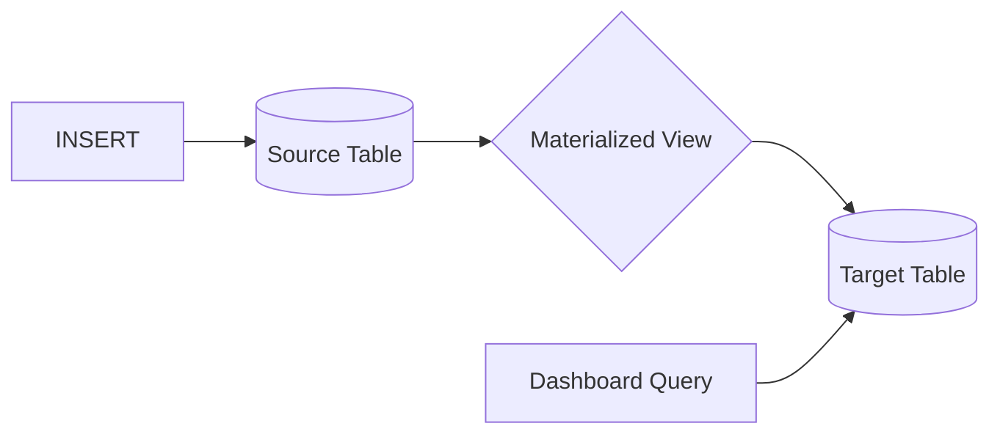

# How to Use ClickHouse Materialized Views for Real-Time Aggregations

Author: [nawazdhandala](https://www.github.com/nawazdhandala)

Tags: ClickHouse, Materialized Views, Aggregations, Real-Time Analytics, Database, Performance, Dashboards

Description: A practical guide to using ClickHouse materialized views for automatic pre-aggregation of data, enabling sub-second dashboard queries over billions of events through incremental processing.

---

Dashboard queries against raw event tables get slow as data grows. Instead of computing aggregations at query time, ClickHouse materialized views pre-compute them at insert time. Your dashboard queries hit the pre-aggregated table and return instantly.

## How Materialized Views Work

Unlike traditional database views, ClickHouse materialized views act as insert triggers. When data arrives in the source table, the materialized view transforms and inserts it into a target table.



Key characteristics:
- **Incremental**: Only processes new inserts, not historical data
- **Automatic**: Triggers on every insert to source table
- **Flexible**: Can aggregate, filter, transform, or join data
- **Durable**: Target table persists independently

## Creating Your First Materialized View

### Basic Pattern

Start with a raw events table:

```sql
CREATE TABLE events
(
    event_time DateTime,
    user_id UInt64,
    event_type LowCardinality(String),
    page String,
    duration_ms UInt32
)
ENGINE = MergeTree()
PARTITION BY toYYYYMM(event_time)
ORDER BY (event_type, user_id, event_time);
```

Create an aggregated target table:

```sql
CREATE TABLE events_hourly
(
    hour DateTime,
    event_type LowCardinality(String),
    event_count UInt64,
    unique_users UInt64,
    total_duration UInt64
)
ENGINE = SummingMergeTree()
PARTITION BY toYYYYMM(hour)
ORDER BY (event_type, hour);
```

Create the materialized view that connects them:

```sql
CREATE MATERIALIZED VIEW events_hourly_mv TO events_hourly AS
SELECT
    toStartOfHour(event_time) AS hour,
    event_type,
    count() AS event_count,
    uniq(user_id) AS unique_users,
    sum(duration_ms) AS total_duration
FROM events
GROUP BY hour, event_type;
```

### How It Works

When you insert into `events`:

```sql
INSERT INTO events VALUES
    (now(), 1, 'page_view', '/home', 1500),
    (now(), 2, 'page_view', '/home', 2000),
    (now(), 1, 'click', '/home', 100);
```

The materialized view automatically aggregates and inserts into `events_hourly`:

```sql
SELECT * FROM events_hourly;
-- hour                | event_type | event_count | unique_users | total_duration
-- 2024-01-15 14:00:00 | page_view  | 2           | 2            | 3500
-- 2024-01-15 14:00:00 | click      | 1           | 1            | 100
```

## Choosing the Right Target Engine

The target table engine determines how aggregations merge.

### SummingMergeTree for Counters

Automatically sums numeric columns during background merges:

```sql
CREATE TABLE daily_metrics
(
    date Date,
    metric_name LowCardinality(String),
    count UInt64,
    sum_value Float64
)
ENGINE = SummingMergeTree()
ORDER BY (date, metric_name);
```

### AggregatingMergeTree for Complex Aggregations

Use for averages, percentiles, and unique counts:

```sql
CREATE TABLE hourly_stats
(
    hour DateTime,
    service LowCardinality(String),

    -- Aggregate state columns
    request_count AggregateFunction(count, UInt64),
    avg_latency AggregateFunction(avg, Float64),
    p95_latency AggregateFunction(quantile(0.95), Float64),
    unique_users AggregateFunction(uniq, UInt64)
)
ENGINE = AggregatingMergeTree()
ORDER BY (service, hour);
```

Materialized view using `-State` functions:

```sql
CREATE MATERIALIZED VIEW hourly_stats_mv TO hourly_stats AS
SELECT
    toStartOfHour(timestamp) AS hour,
    service,
    countState() AS request_count,
    avgState(latency_ms) AS avg_latency,
    quantileState(0.95)(latency_ms) AS p95_latency,
    uniqState(user_id) AS unique_users
FROM requests
GROUP BY hour, service;
```

Query using `-Merge` functions:

```sql
SELECT
    hour,
    service,
    countMerge(request_count) AS requests,
    avgMerge(avg_latency) AS avg_latency,
    quantileMerge(0.95)(p95_latency) AS p95,
    uniqMerge(unique_users) AS users
FROM hourly_stats
WHERE hour >= today()
GROUP BY hour, service
ORDER BY hour;
```

### ReplacingMergeTree for Latest State

Keep only the latest record per key:

```sql
CREATE TABLE user_latest_event
(
    user_id UInt64,
    last_event_time DateTime,
    last_event_type String,
    last_page String
)
ENGINE = ReplacingMergeTree(last_event_time)
ORDER BY user_id;

CREATE MATERIALIZED VIEW user_latest_mv TO user_latest_event AS
SELECT
    user_id,
    event_time AS last_event_time,
    event_type AS last_event_type,
    page AS last_page
FROM events;
```

## Multi-Level Aggregation

Build aggregation hierarchies for flexible time granularity:

```sql
-- Raw events
CREATE TABLE events (...)
ENGINE = MergeTree() ...;

-- Minute aggregates
CREATE TABLE events_minute (...)
ENGINE = SummingMergeTree() ...;

CREATE MATERIALIZED VIEW events_minute_mv TO events_minute AS
SELECT
    toStartOfMinute(event_time) AS minute,
    event_type,
    count() AS event_count
FROM events
GROUP BY minute, event_type;

-- Hour aggregates (from minute table)
CREATE TABLE events_hour (...)
ENGINE = SummingMergeTree() ...;

CREATE MATERIALIZED VIEW events_hour_mv TO events_hour AS
SELECT
    toStartOfHour(minute) AS hour,
    event_type,
    sum(event_count) AS event_count
FROM events_minute
GROUP BY hour, event_type;

-- Day aggregates (from hour table)
CREATE TABLE events_day (...)
ENGINE = SummingMergeTree() ...;

CREATE MATERIALIZED VIEW events_day_mv TO events_day AS
SELECT
    toDate(hour) AS day,
    event_type,
    sum(event_count) AS event_count
FROM events_hour
GROUP BY day, event_type;
```

Query the appropriate granularity:
```sql
-- Last hour: use minute table
SELECT * FROM events_minute WHERE minute >= now() - INTERVAL 1 HOUR;

-- Last week: use hour table
SELECT * FROM events_hour WHERE hour >= today() - 7;

-- Last year: use day table
SELECT * FROM events_day WHERE day >= today() - 365;
```

## Practical Patterns

### Pattern 1: Dashboard Metrics

Pre-aggregate metrics for a monitoring dashboard:

```sql
-- Source: raw request logs
CREATE TABLE requests
(
    timestamp DateTime,
    service LowCardinality(String),
    endpoint String,
    status_code UInt16,
    latency_ms UInt32,
    user_id UInt64
)
ENGINE = MergeTree()
ORDER BY (service, timestamp);

-- Target: aggregated metrics
CREATE TABLE request_metrics
(
    minute DateTime,
    service LowCardinality(String),

    total_requests AggregateFunction(count, UInt64),
    error_count AggregateFunction(countIf, UInt16),
    avg_latency AggregateFunction(avg, Float64),
    p50_latency AggregateFunction(quantile(0.5), Float64),
    p99_latency AggregateFunction(quantile(0.99), Float64),
    unique_users AggregateFunction(uniq, UInt64)
)
ENGINE = AggregatingMergeTree()
ORDER BY (service, minute);

CREATE MATERIALIZED VIEW request_metrics_mv TO request_metrics AS
SELECT
    toStartOfMinute(timestamp) AS minute,
    service,
    countState() AS total_requests,
    countIfState(status_code >= 500) AS error_count,
    avgState(latency_ms) AS avg_latency,
    quantileState(0.5)(latency_ms) AS p50_latency,
    quantileState(0.99)(latency_ms) AS p99_latency,
    uniqState(user_id) AS unique_users
FROM requests
GROUP BY minute, service;
```

Dashboard query:
```sql
SELECT
    minute,
    service,
    countMerge(total_requests) AS requests,
    countMerge(error_count) AS errors,
    round(avgMerge(avg_latency), 2) AS avg_ms,
    round(quantileMerge(0.99)(p99_latency), 2) AS p99_ms,
    uniqMerge(unique_users) AS users
FROM request_metrics
WHERE minute >= now() - INTERVAL 24 HOUR
GROUP BY minute, service
ORDER BY minute;
```

### Pattern 2: Funnel Analysis

Pre-compute user funnels:

```sql
CREATE TABLE funnel_progress
(
    date Date,
    user_id UInt64,
    reached_step1 UInt8,
    reached_step2 UInt8,
    reached_step3 UInt8,
    reached_step4 UInt8
)
ENGINE = ReplacingMergeTree()
ORDER BY (date, user_id);

CREATE MATERIALIZED VIEW funnel_mv TO funnel_progress AS
SELECT
    toDate(event_time) AS date,
    user_id,
    max(event_type = 'visit') AS reached_step1,
    max(event_type = 'signup') AS reached_step2,
    max(event_type = 'activation') AS reached_step3,
    max(event_type = 'purchase') AS reached_step4
FROM events
GROUP BY date, user_id;
```

Query funnel:
```sql
SELECT
    date,
    sum(reached_step1) AS step1,
    sum(reached_step2) AS step2,
    sum(reached_step3) AS step3,
    sum(reached_step4) AS step4
FROM funnel_progress FINAL
WHERE date >= today() - 30
GROUP BY date
ORDER BY date;
```

### Pattern 3: Retention Cohorts

Track user retention by signup date:

```sql
CREATE TABLE user_activity_daily
(
    user_id UInt64,
    signup_date Date,
    activity_date Date,
    was_active UInt8
)
ENGINE = ReplacingMergeTree()
ORDER BY (signup_date, user_id, activity_date);

CREATE MATERIALIZED VIEW activity_mv TO user_activity_daily AS
SELECT
    user_id,
    toDate(first_seen) AS signup_date,
    toDate(event_time) AS activity_date,
    1 AS was_active
FROM events
WHERE event_type IN ('page_view', 'click', 'purchase');
```

Query retention:
```sql
SELECT
    signup_date,
    activity_date - signup_date AS days_since_signup,
    uniq(user_id) AS active_users
FROM user_activity_daily
WHERE signup_date >= today() - 30
GROUP BY signup_date, days_since_signup
ORDER BY signup_date, days_since_signup;
```

## Populating Historical Data

Materialized views only process new inserts. To backfill historical data:

### Method 1: INSERT SELECT

```sql
-- Manually populate target table with historical data
INSERT INTO events_hourly
SELECT
    toStartOfHour(event_time) AS hour,
    event_type,
    count() AS event_count,
    uniq(user_id) AS unique_users,
    sum(duration_ms) AS total_duration
FROM events
WHERE event_time < '2024-01-01'  -- Before MV was created
GROUP BY hour, event_type;
```

### Method 2: POPULATE Clause

```sql
-- Create MV with POPULATE to process existing data
CREATE MATERIALIZED VIEW events_hourly_mv TO events_hourly
POPULATE AS
SELECT
    toStartOfHour(event_time) AS hour,
    event_type,
    count() AS event_count,
    uniq(user_id) AS unique_users,
    sum(duration_ms) AS total_duration
FROM events
GROUP BY hour, event_type;
```

Warning: POPULATE can be slow for large tables and may miss concurrent inserts.

## Managing Materialized Views

### List Views

```sql
SELECT
    name,
    as_select,
    engine
FROM system.tables
WHERE engine = 'MaterializedView'
  AND database = 'default';
```

### Check Status

```sql
-- See MV dependencies
SELECT
    table,
    dependencies_table
FROM system.tables
WHERE database = 'default';
```

### Drop and Recreate

```sql
-- Drop the view (preserves target table data)
DROP VIEW events_hourly_mv;

-- Recreate with changes
CREATE MATERIALIZED VIEW events_hourly_mv TO events_hourly AS
SELECT ...;
```

### Pause and Resume

```sql
-- Detach to pause processing
DETACH VIEW events_hourly_mv;

-- Reattach to resume
ATTACH VIEW events_hourly_mv;
```

## Performance Considerations

### Avoid Heavy Transformations

Keep MV logic simple for fast inserts:

```sql
-- SLOW: Complex transformations in MV
CREATE MATERIALIZED VIEW slow_mv TO target AS
SELECT
    extractAll(message, '\\d+') AS numbers,  -- Regex extraction
    JSONExtractString(payload, 'field') AS field  -- JSON parsing
FROM source
WHERE complexCondition(column);

-- FAST: Simple aggregations
CREATE MATERIALIZED VIEW fast_mv TO target AS
SELECT
    toStartOfHour(timestamp) AS hour,
    count() AS cnt
FROM source
GROUP BY hour;
```

### Monitor MV Performance

```sql
-- Check insert latency
SELECT
    table,
    avg(duration_ms) AS avg_duration,
    max(duration_ms) AS max_duration
FROM system.query_log
WHERE type = 'QueryFinish'
  AND query LIKE '%INSERT INTO events%'
  AND event_time > now() - INTERVAL 1 HOUR
GROUP BY table;
```

### Handle Insert Failures

If MV processing fails, the source insert fails too. Design MVs to be resilient:

```sql
-- Use SETTINGS to control behavior
CREATE MATERIALIZED VIEW resilient_mv TO target
SETTINGS
    max_insert_block_size = 1048576,
    max_threads = 1
AS SELECT ...;
```

---

Materialized views transform ClickHouse from a fast analytical database into a real-time analytics platform. Pre-aggregate at insert time, query pre-computed results instantly. Start with simple SummingMergeTree views, graduate to AggregatingMergeTree for complex metrics, and build multi-level hierarchies for flexible time granularity.
