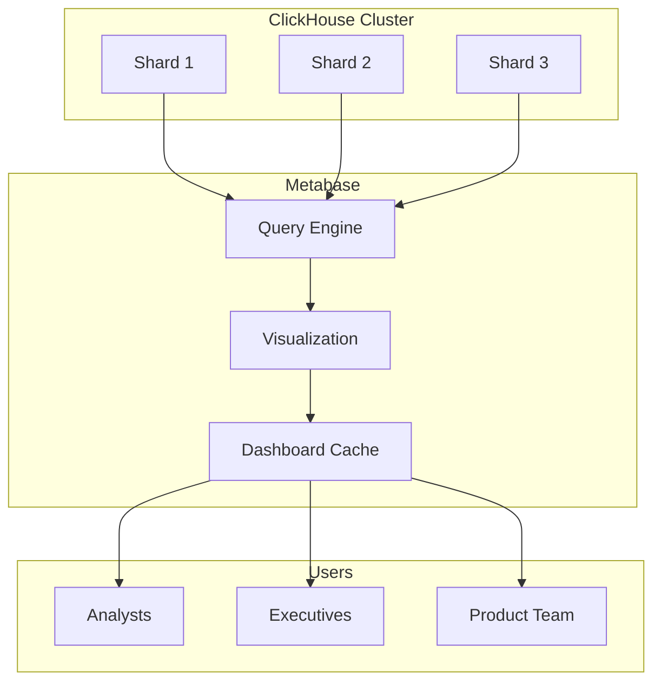

# How to Connect Metabase to ClickHouse for Business Intelligence

Author: [nawazdhandala](https://www.github.com/nawazdhandala)

Tags: ClickHouse, Metabase, Business Intelligence, Data Visualization, SQL Analytics, Dashboards

Description: A comprehensive guide to connecting Metabase to ClickHouse for self-service business intelligence, including setup, optimization, and dashboard best practices.

---

Metabase is an open-source business intelligence tool that enables non-technical users to explore data and build dashboards. This guide covers integrating Metabase with ClickHouse for powerful analytics.

## Architecture Overview



## Setting Up Metabase

### Docker Installation

```bash
# Run Metabase with ClickHouse driver
docker run -d \
  --name metabase \
  -p 3000:3000 \
  -e MB_DB_TYPE=postgres \
  -e MB_DB_DBNAME=metabase \
  -e MB_DB_PORT=5432 \
  -e MB_DB_USER=metabase \
  -e MB_DB_PASS=password \
  -e MB_DB_HOST=postgres \
  metabase/metabase
```

### Docker Compose Setup

```yaml
version: '3.8'

services:
  metabase:
    image: metabase/metabase:latest
    ports:
      - "3000:3000"
    environment:
      MB_DB_TYPE: postgres
      MB_DB_DBNAME: metabase
      MB_DB_PORT: 5432
      MB_DB_USER: metabase
      MB_DB_PASS: password
      MB_DB_HOST: postgres
    depends_on:
      - postgres

  postgres:
    image: postgres:14
    environment:
      POSTGRES_DB: metabase
      POSTGRES_USER: metabase
      POSTGRES_PASSWORD: password
    volumes:
      - metabase_data:/var/lib/postgresql/data

volumes:
  metabase_data:
```

## Configuring ClickHouse Connection

### Connection Settings

Navigate to Admin > Databases > Add Database and configure:

```
Database type: ClickHouse
Display name: ClickHouse Analytics
Host: clickhouse.example.com
Port: 8443
Database name: analytics
Username: metabase_user
Password: ********
Use secure connection: Yes
```

### Create Metabase User in ClickHouse

```sql
-- Create read-only user for Metabase
CREATE USER metabase_user
IDENTIFIED BY 'secure_password'
SETTINGS
    max_execution_time = 300,
    max_memory_usage = 10000000000,
    readonly = 1;

-- Grant read access to analytics database
GRANT SELECT ON analytics.* TO metabase_user;

-- Grant access to system tables for metadata
GRANT SELECT ON system.tables TO metabase_user;
GRANT SELECT ON system.columns TO metabase_user;
GRANT SELECT ON system.databases TO metabase_user;
```

## Optimizing for Metabase Queries

### Create Summary Tables

```sql
-- Pre-aggregated table for dashboard performance
CREATE TABLE daily_metrics_summary
ENGINE = SummingMergeTree()
ORDER BY (date, product_category)
AS SELECT
    toDate(timestamp) AS date,
    product_category,
    count() AS order_count,
    sum(amount) AS total_revenue,
    uniq(user_id) AS unique_customers
FROM orders
GROUP BY date, product_category;

-- Refresh daily
CREATE MATERIALIZED VIEW daily_metrics_mv
TO daily_metrics_summary
AS SELECT
    toDate(timestamp) AS date,
    product_category,
    count() AS order_count,
    sum(amount) AS total_revenue,
    uniq(user_id) AS unique_customers
FROM orders
WHERE timestamp > now() - INTERVAL 1 DAY
GROUP BY date, product_category;
```

### Denormalized Views for Metabase

```sql
-- Create denormalized view for easier exploration
CREATE VIEW orders_enriched AS
SELECT
    o.order_id,
    o.timestamp,
    o.amount,
    o.status,
    c.customer_name,
    c.customer_segment,
    c.country,
    p.product_name,
    p.category AS product_category,
    p.brand
FROM orders o
LEFT JOIN customers c ON o.customer_id = c.customer_id
LEFT JOIN products p ON o.product_id = p.product_id;
```

## Building Dashboards

### Sales Dashboard Queries

```sql
-- Total Revenue by Day
SELECT
    toDate(timestamp) AS date,
    sum(amount) AS revenue
FROM orders
WHERE timestamp >= today() - 30
GROUP BY date
ORDER BY date;

-- Revenue by Product Category
SELECT
    product_category,
    sum(amount) AS revenue,
    count() AS orders
FROM orders_enriched
WHERE timestamp >= today() - 30
GROUP BY product_category
ORDER BY revenue DESC;

-- Customer Cohort Analysis
SELECT
    toStartOfMonth(first_order_date) AS cohort,
    dateDiff('month', first_order_date, order_date) AS month_number,
    uniq(customer_id) AS customers,
    sum(amount) AS revenue
FROM (
    SELECT
        customer_id,
        min(timestamp) OVER (PARTITION BY customer_id) AS first_order_date,
        toDate(timestamp) AS order_date,
        amount
    FROM orders
)
GROUP BY cohort, month_number
ORDER BY cohort, month_number;
```

### Performance Dashboard Queries

```sql
-- Query Performance Metrics
SELECT
    toStartOfHour(event_time) AS hour,
    count() AS queries,
    avg(query_duration_ms) AS avg_duration_ms,
    quantile(0.95)(query_duration_ms) AS p95_duration_ms,
    sum(read_rows) AS total_rows_read
FROM system.query_log
WHERE event_time >= now() - INTERVAL 24 HOUR
  AND type = 'QueryFinish'
GROUP BY hour
ORDER BY hour;

-- Slow Queries
SELECT
    query,
    query_duration_ms,
    read_rows,
    formatReadableSize(memory_usage) AS memory
FROM system.query_log
WHERE event_time >= now() - INTERVAL 24 HOUR
  AND type = 'QueryFinish'
ORDER BY query_duration_ms DESC
LIMIT 20;
```

## Caching Strategy

### Metabase Cache Settings

```json
{
  "cache-ttl": 3600,
  "cache-max-kb": 1000000,
  "query-caching-min-ttl": 60,
  "query-caching-ttl-ratio": 10
}
```

### ClickHouse Query Cache

```sql
-- Enable query cache for Metabase queries
SET use_query_cache = 1;
SET query_cache_ttl = 3600;
SET query_cache_min_query_runs = 2;

-- Check cache effectiveness
SELECT
    query_cache_hits,
    query_cache_misses,
    round(query_cache_hits / (query_cache_hits + query_cache_misses) * 100, 2) AS hit_rate
FROM system.metrics
WHERE metric IN ('QueryCacheHits', 'QueryCacheMisses');
```

## Access Control

### Department-Based Access

```sql
-- Create role for marketing team
CREATE ROLE marketing_analyst;
GRANT SELECT ON analytics.campaigns TO marketing_analyst;
GRANT SELECT ON analytics.marketing_metrics TO marketing_analyst;

-- Create role for finance team
CREATE ROLE finance_analyst;
GRANT SELECT ON analytics.revenue TO finance_analyst;
GRANT SELECT ON analytics.costs TO finance_analyst;

-- Assign roles
GRANT marketing_analyst TO metabase_marketing;
GRANT finance_analyst TO metabase_finance;
```

### Row-Level Security

```sql
-- Create filtered view for regional managers
CREATE VIEW orders_regional AS
SELECT *
FROM orders
WHERE region = currentUser();
```

## Embedding Dashboards

### Signed Embedding

```python
import jwt
import time

METABASE_SECRET_KEY = "your-secret-key"

def get_embed_url(dashboard_id, params=None):
    payload = {
        "resource": {"dashboard": dashboard_id},
        "params": params or {},
        "exp": int(time.time()) + 600  # 10 minute expiration
    }

    token = jwt.encode(payload, METABASE_SECRET_KEY, algorithm="HS256")
    return f"https://metabase.example.com/embed/dashboard/{token}"

# Generate embed URL with filters
embed_url = get_embed_url(
    dashboard_id=1,
    params={"region": "EMEA", "date_range": "last30days"}
)
```

## Troubleshooting

### Common Issues

```sql
-- Check for long-running Metabase queries
SELECT
    query_id,
    user,
    query,
    elapsed,
    read_rows,
    formatReadableSize(memory_usage) AS memory
FROM system.processes
WHERE user = 'metabase_user'
  AND elapsed > 30;

-- Kill stuck queries
KILL QUERY WHERE user = 'metabase_user' AND elapsed > 300;
```

### Query Optimization Tips

```sql
-- Add LIMIT to prevent full table scans
SELECT * FROM large_table LIMIT 10000;

-- Use date filters with partition pruning
SELECT * FROM events
WHERE timestamp >= toDate('2024-01-01')
  AND timestamp < toDate('2024-02-01');

-- Avoid SELECT * in production queries
SELECT order_id, customer_id, amount, timestamp
FROM orders
WHERE timestamp >= today() - 7;
```

## Conclusion

Metabase with ClickHouse provides:

1. **Self-service analytics** for business users
2. **Fast query performance** on large datasets
3. **Beautiful visualizations** with minimal setup
4. **Embedded analytics** for applications
5. **Open-source flexibility** with enterprise features

Deploy Metabase to democratize access to your ClickHouse data across your organization.
