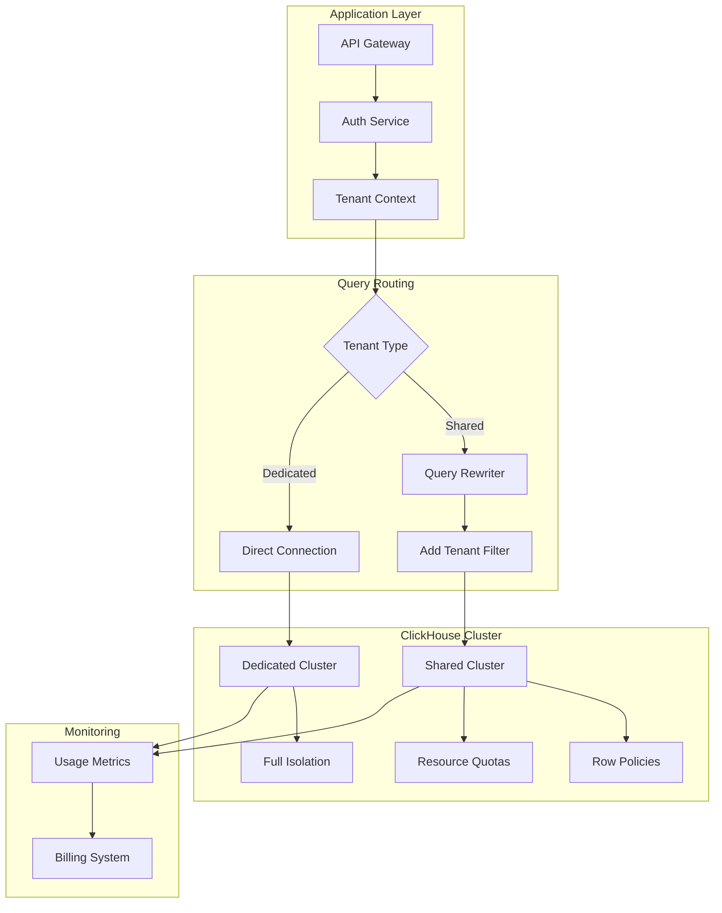

# How to Build a Multi-Tenant Analytics Platform with ClickHouse

Author: [nawazdhandala](https://www.github.com/nawazdhandala)

Tags: ClickHouse, Multi-Tenant, Analytics Platform, SaaS, Tenant Isolation, Resource Quotas

Description: A comprehensive guide to building a multi-tenant analytics platform with ClickHouse, covering tenant isolation strategies, resource quotas, query routing, and scalable architecture patterns for SaaS applications.

---

Building a multi-tenant analytics platform requires careful consideration of data isolation, resource management, and performance at scale. ClickHouse provides several features that make it well-suited for multi-tenant architectures. This guide covers strategies and best practices for building a robust multi-tenant analytics system.

## Multi-Tenancy Patterns

There are three main approaches to multi-tenancy in ClickHouse:

1. **Shared Tables with Tenant Column** - All tenants share tables with a tenant identifier
2. **Database per Tenant** - Each tenant has a separate database
3. **Cluster per Tenant** - Complete isolation with dedicated clusters

### Pattern 1: Shared Tables with Tenant Column

The most common and efficient approach:

```sql
-- Create a shared events table with tenant isolation
CREATE TABLE events (
    tenant_id UInt32,
    event_id UInt64,
    event_time DateTime64(3),
    event_type LowCardinality(String),
    user_id UInt64,
    properties Map(String, String),
    INDEX tenant_idx tenant_id TYPE set(0) GRANULARITY 4
) ENGINE = MergeTree()
PARTITION BY (tenant_id, toYYYYMM(event_time))
ORDER BY (tenant_id, event_time, event_id)
SETTINGS index_granularity = 8192;

-- Query with tenant filter (always include tenant_id first)
SELECT
    event_type,
    count() AS event_count
FROM events
WHERE tenant_id = 123
  AND event_time >= now() - INTERVAL 7 DAY
GROUP BY event_type
ORDER BY event_count DESC;
```

### Pattern 2: Database per Tenant

Better isolation at the cost of management complexity:

```sql
-- Create tenant-specific database
CREATE DATABASE tenant_123;

-- Create tables within tenant database
CREATE TABLE tenant_123.events (
    event_id UInt64,
    event_time DateTime64(3),
    event_type LowCardinality(String),
    user_id UInt64,
    properties Map(String, String)
) ENGINE = MergeTree()
PARTITION BY toYYYYMM(event_time)
ORDER BY (event_time, event_id);

-- Query routing based on tenant
-- Application routes to: tenant_{tenant_id}.events
```

### Pattern 3: Cluster per Tenant (Enterprise)

For maximum isolation and compliance requirements:

```xml
<!-- Define tenant-specific clusters -->
<remote_servers>
    <tenant_enterprise_1>
        <shard>
            <replica>
                <host>tenant1-node1.example.com</host>
                <port>9440</port>
            </replica>
        </shard>
    </tenant_enterprise_1>
    <tenant_enterprise_2>
        <shard>
            <replica>
                <host>tenant2-node1.example.com</host>
                <port>9440</port>
            </replica>
        </shard>
    </tenant_enterprise_2>
</remote_servers>
```

## Implementing Tenant Isolation

### Row-Level Security with Row Policies

```sql
-- Create a tenants table for metadata
CREATE TABLE tenants (
    tenant_id UInt32,
    tenant_name String,
    plan LowCardinality(String),
    created_at DateTime DEFAULT now(),
    settings Map(String, String)
) ENGINE = MergeTree()
ORDER BY tenant_id;

-- Create row policies for tenant isolation
CREATE ROW POLICY tenant_policy ON events
FOR SELECT
USING tenant_id = currentUser()::UInt32;

-- Or use a user setting for tenant_id
CREATE ROW POLICY tenant_policy ON events
FOR SELECT
USING tenant_id = getSetting('tenant_id')::UInt32;

-- Alternative: Create tenant-specific users
CREATE USER tenant_123 IDENTIFIED BY 'secure_password'
SETTINGS tenant_id = 123;

GRANT SELECT ON events TO tenant_123;
```

### Using Views for Tenant Isolation

```sql
-- Create a base table (internal)
CREATE TABLE events_base (
    tenant_id UInt32,
    event_id UInt64,
    event_time DateTime64(3),
    event_type LowCardinality(String),
    user_id UInt64,
    properties Map(String, String)
) ENGINE = MergeTree()
PARTITION BY (tenant_id, toYYYYMM(event_time))
ORDER BY (tenant_id, event_time, event_id);

-- Create tenant-specific views
CREATE VIEW tenant_123_events AS
SELECT * FROM events_base
WHERE tenant_id = 123;

-- Grant access only to the view
GRANT SELECT ON tenant_123_events TO tenant_123_user;
```

## Resource Quotas and Limits

### Setting User Quotas

```sql
-- Create quota definitions
CREATE QUOTA tenant_basic_quota
FOR INTERVAL 1 hour MAX queries = 1000,
FOR INTERVAL 1 hour MAX query_selects = 800,
FOR INTERVAL 1 hour MAX result_rows = 10000000
TO tenant_basic_role;

CREATE QUOTA tenant_premium_quota
FOR INTERVAL 1 hour MAX queries = 10000,
FOR INTERVAL 1 hour MAX query_selects = 8000,
FOR INTERVAL 1 hour MAX result_rows = 100000000
TO tenant_premium_role;

-- Apply quota to users
CREATE USER tenant_123 IDENTIFIED BY 'password'
DEFAULT ROLE tenant_basic_role;
```

### Query Complexity Limits

```sql
-- Create settings profile for tenants
CREATE SETTINGS PROFILE tenant_standard_profile SETTINGS
    max_memory_usage = 10000000000,          -- 10GB max memory
    max_execution_time = 60,                  -- 60 second timeout
    max_rows_to_read = 100000000,            -- 100M rows max
    max_bytes_to_read = 10000000000,         -- 10GB max read
    max_result_rows = 1000000,               -- 1M result rows
    max_result_bytes = 100000000,            -- 100MB result size
    read_overflow_mode = 'throw';

-- Assign profile to user
ALTER USER tenant_123 SETTINGS PROFILE 'tenant_standard_profile';
```

### Per-Tenant Resource Isolation

```xml
<!-- Configure resource pools in users.xml -->
<users>
    <tenant_basic>
        <profile>tenant_basic_profile</profile>
        <quota>tenant_basic_quota</quota>
        <networks>
            <ip>::/0</ip>
        </networks>
    </tenant_basic>
</users>

<profiles>
    <tenant_basic_profile>
        <max_memory_usage>5000000000</max_memory_usage>
        <max_threads>4</max_threads>
        <max_execution_time>30</max_execution_time>
        <priority>10</priority>
    </tenant_basic_profile>

    <tenant_premium_profile>
        <max_memory_usage>20000000000</max_memory_usage>
        <max_threads>16</max_threads>
        <max_execution_time>300</max_execution_time>
        <priority>5</priority>
    </tenant_premium_profile>
</profiles>
```

## Query Routing Architecture

### Application-Level Routing

```python
# Python example of query routing
import clickhouse_driver

class TenantQueryRouter:
    def __init__(self, config):
        self.config = config
        self.connections = {}

    def get_connection(self, tenant_id):
        tenant = self.get_tenant_config(tenant_id)

        if tenant['isolation_level'] == 'dedicated':
            # Dedicated cluster connection
            return self.get_dedicated_connection(tenant)
        else:
            # Shared cluster with tenant context
            return self.get_shared_connection(tenant_id)

    def get_shared_connection(self, tenant_id):
        conn = clickhouse_driver.connect(
            host=self.config['shared_host'],
            port=9440,
            secure=True,
            settings={'tenant_id': tenant_id}
        )
        return conn

    def execute_query(self, tenant_id, query, params=None):
        conn = self.get_connection(tenant_id)

        # Inject tenant filter for shared tables
        if self.is_shared_table(query):
            query = self.inject_tenant_filter(query, tenant_id)

        return conn.execute(query, params)

    def inject_tenant_filter(self, query, tenant_id):
        # Add tenant_id filter to WHERE clause
        if 'WHERE' in query.upper():
            return query.replace('WHERE', f'WHERE tenant_id = {tenant_id} AND')
        else:
            # Handle queries without WHERE
            return f"{query} WHERE tenant_id = {tenant_id}"
```

### Proxy-Based Routing

```yaml
# Example: Using ClickHouse Proxy for routing
# docker-compose.yml
services:
  clickhouse-proxy:
    image: clickhouse-proxy:latest
    ports:
      - "8123:8123"
    environment:
      - ROUTING_CONFIG=/etc/proxy/routing.yaml
    volumes:
      - ./routing.yaml:/etc/proxy/routing.yaml

# routing.yaml
routes:
  - match:
      header:
        X-Tenant-ID: "enterprise-*"
    backend:
      cluster: enterprise_cluster
  - match:
      header:
        X-Tenant-ID: "*"
    backend:
      cluster: shared_cluster
      settings:
        add_tenant_filter: true
```

## Data Partitioning Strategies

### Optimal Partitioning for Multi-Tenant

```sql
-- Partition by tenant and time for efficient queries
CREATE TABLE tenant_events (
    tenant_id UInt32,
    event_time DateTime64(3),
    event_type LowCardinality(String),
    event_data String
) ENGINE = MergeTree()
PARTITION BY (tenant_id % 100, toYYYYMM(event_time))  -- Bucket tenants
ORDER BY (tenant_id, event_time);

-- For fewer large tenants, partition directly
CREATE TABLE enterprise_events (
    tenant_id UInt32,
    event_time DateTime64(3),
    event_type LowCardinality(String),
    event_data String
) ENGINE = MergeTree()
PARTITION BY (tenant_id, toYYYYMM(event_time))
ORDER BY (tenant_id, event_time);
```

### TTL per Tenant

```sql
-- Different retention per tenant plan
CREATE TABLE events_with_ttl (
    tenant_id UInt32,
    tenant_plan LowCardinality(String),
    event_time DateTime64(3),
    event_type LowCardinality(String),
    event_data String
) ENGINE = MergeTree()
PARTITION BY (tenant_id, toYYYYMM(event_time))
ORDER BY (tenant_id, event_time)
TTL event_time + INTERVAL
    CASE
        WHEN tenant_plan = 'basic' THEN 30
        WHEN tenant_plan = 'standard' THEN 90
        WHEN tenant_plan = 'premium' THEN 365
        ELSE 30
    END DAY;
```

## Monitoring Multi-Tenant Usage

### Per-Tenant Query Metrics

```sql
-- Create a view for tenant query analytics
CREATE MATERIALIZED VIEW tenant_query_stats_mv
ENGINE = SummingMergeTree()
ORDER BY (tenant_id, query_date, query_hour)
AS SELECT
    toUInt32(getSetting('tenant_id')) AS tenant_id,
    toDate(event_time) AS query_date,
    toHour(event_time) AS query_hour,
    count() AS query_count,
    sum(read_rows) AS total_rows_read,
    sum(read_bytes) AS total_bytes_read,
    sum(result_rows) AS total_result_rows,
    max(query_duration_ms) AS max_query_duration,
    avg(query_duration_ms) AS avg_query_duration
FROM system.query_log
WHERE type = 'QueryFinish'
GROUP BY tenant_id, query_date, query_hour;

-- Query tenant usage
SELECT
    tenant_id,
    sum(query_count) AS total_queries,
    sum(total_bytes_read) AS total_bytes,
    max(max_query_duration) AS slowest_query_ms
FROM tenant_query_stats_mv
WHERE query_date >= today() - 7
GROUP BY tenant_id
ORDER BY total_queries DESC;
```

### Resource Consumption Dashboard

```sql
-- Current running queries per tenant
SELECT
    getSetting('tenant_id') AS tenant_id,
    count() AS running_queries,
    sum(memory_usage) AS total_memory,
    max(elapsed) AS max_elapsed
FROM system.processes
GROUP BY tenant_id;

-- Tenant storage usage
SELECT
    tenant_id,
    sum(bytes_on_disk) AS storage_bytes,
    sum(rows) AS total_rows,
    count() AS part_count
FROM system.parts
WHERE active AND table = 'events'
GROUP BY tenant_id
ORDER BY storage_bytes DESC;
```

## Tenant Onboarding Automation

```sql
-- Stored procedure for tenant setup (using parameterized queries)
-- Create tenant metadata
INSERT INTO tenants (tenant_id, tenant_name, plan)
VALUES ({tenant_id:UInt32}, {tenant_name:String}, {plan:String});

-- Create tenant user
CREATE USER {tenant_user:Identifier} IDENTIFIED BY {password:String}
SETTINGS PROFILE '{profile:Identifier}';

-- Grant permissions
GRANT SELECT ON events TO {tenant_user:Identifier};

-- Create row policy
CREATE ROW POLICY {policy_name:Identifier} ON events
FOR SELECT
USING tenant_id = {tenant_id:UInt32}
TO {tenant_user:Identifier};
```

### Python Onboarding Script

```python
def onboard_tenant(client, tenant_id, tenant_name, plan):
    """Automate tenant onboarding in ClickHouse"""

    # Create tenant record
    client.execute('''
        INSERT INTO tenants (tenant_id, tenant_name, plan)
        VALUES (%(tenant_id)s, %(tenant_name)s, %(plan)s)
    ''', {'tenant_id': tenant_id, 'tenant_name': tenant_name, 'plan': plan})

    # Create user with appropriate profile
    profile = 'tenant_premium_profile' if plan == 'premium' else 'tenant_basic_profile'
    password = generate_secure_password()

    client.execute(f'''
        CREATE USER tenant_{tenant_id}
        IDENTIFIED BY '{password}'
        SETTINGS PROFILE '{profile}'
    ''')

    # Create row policy for isolation
    client.execute(f'''
        CREATE ROW POLICY tenant_{tenant_id}_policy ON events
        FOR SELECT USING tenant_id = {tenant_id}
        TO tenant_{tenant_id}
    ''')

    # Grant necessary permissions
    client.execute(f'''
        GRANT SELECT ON default.* TO tenant_{tenant_id}
    ''')

    return {
        'tenant_id': tenant_id,
        'username': f'tenant_{tenant_id}',
        'password': password
    }
```

## Multi-Tenant Architecture Diagram



## Best Practices Summary

| Aspect | Recommendation |
|--------|----------------|
| Data Isolation | Use row policies + tenant_id in ORDER BY |
| Resource Limits | Configure quotas and profiles per plan |
| Query Performance | Partition by tenant_id for hot data |
| Monitoring | Track per-tenant usage for billing |
| Onboarding | Automate user/policy creation |
| Security | Separate credentials per tenant |

## Conclusion

Building a multi-tenant analytics platform with ClickHouse requires:

1. **Choose the right isolation pattern** - Shared tables for most cases, dedicated for enterprise
2. **Implement row-level security** - Use row policies for data isolation
3. **Configure resource quotas** - Prevent noisy neighbors with limits
4. **Optimize partitioning** - Include tenant_id in partition key and ORDER BY
5. **Monitor per-tenant usage** - Track queries, storage, and resources
6. **Automate tenant management** - Script onboarding and offboarding

With these patterns, you can build a scalable multi-tenant platform that serves thousands of tenants while maintaining isolation and performance.
