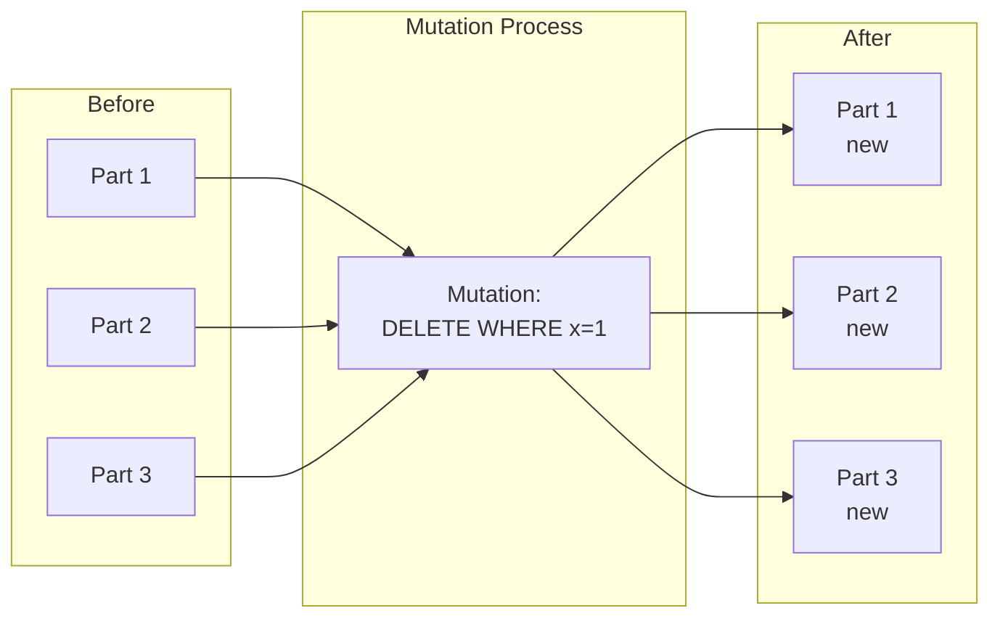

# How to Handle Large Mutations in ClickHouse

Author: [nawazdhandala](https://www.github.com/nawazdhandala)

Tags: ClickHouse, Mutations, ALTER TABLE, TTL, Data Lifecycle, Database, Operations, Performance

Description: A comprehensive guide to handling mutations in ClickHouse, covering ALTER TABLE operations, UPDATE and DELETE queries, TTL-based data management, and strategies for efficient data lifecycle management at scale.

---

ClickHouse is optimized for immutable data, but real-world applications need updates and deletes. Mutations (ALTER TABLE UPDATE/DELETE) and TTL provide ways to modify data, but they work differently than in traditional databases. This guide covers how to use mutations effectively without killing performance.

## Understanding Mutations

### How Mutations Work

Unlike traditional databases, ClickHouse mutations don't modify data in place:



Mutations:
1. Create new versions of affected parts
2. Run asynchronously in background
3. Rewrite entire parts, not individual rows
4. Are expensive for large tables

## DELETE Operations

### Lightweight Deletes (ClickHouse 22.8+)

```sql
-- Fast delete that marks rows as deleted
DELETE FROM events
WHERE user_id = 12345;

-- Check status
SELECT * FROM system.mutations
WHERE table = 'events' AND NOT is_done;
```

### Traditional ALTER DELETE

```sql
-- Rewrites all parts containing matching rows
ALTER TABLE events
DELETE WHERE user_id = 12345;

-- With settings
ALTER TABLE events
DELETE WHERE event_time < '2024-01-01'
SETTINGS mutations_sync = 2;  -- Wait for completion
```

### Delete by Partition

```sql
-- Much faster: drops entire partitions
ALTER TABLE events
DROP PARTITION '202401';

-- Drop multiple partitions
ALTER TABLE events
DROP PARTITION '202401',
DROP PARTITION '202402',
DROP PARTITION '202403';
```

## UPDATE Operations

### Basic UPDATE

```sql
-- Update rows matching condition
ALTER TABLE events
UPDATE event_type = 'click_v2'
WHERE event_type = 'click' AND event_time < '2024-01-01';

-- Multiple column updates
ALTER TABLE events
UPDATE
    event_type = 'migrated',
    properties['migrated'] = 'true'
WHERE migration_status = 'pending';
```

### Conditional Updates

```sql
-- Update with complex conditions
ALTER TABLE events
UPDATE
    status = multiIf(
        score > 100, 'high',
        score > 50, 'medium',
        'low'
    )
WHERE status = 'unclassified';
```

### Update Limitations

```sql
-- Cannot update primary key columns
ALTER TABLE events
UPDATE user_id = 0 WHERE user_id = 12345;
-- Error: Cannot UPDATE key columns

-- Cannot update partition key
ALTER TABLE events
UPDATE event_time = now() WHERE event_id = 1;
-- Error: Cannot UPDATE partition key
```

## Monitoring Mutations

### Check Mutation Status

```sql
-- Active mutations
SELECT
    database,
    table,
    mutation_id,
    command,
    create_time,
    is_done,
    parts_to_do,
    parts_done
FROM system.mutations
WHERE NOT is_done
ORDER BY create_time;

-- Mutation progress
SELECT
    table,
    mutation_id,
    parts_to_do,
    parts_done,
    round(parts_done / (parts_to_do + parts_done) * 100, 2) AS progress_pct
FROM system.mutations
WHERE NOT is_done;
```

### Mutation History

```sql
-- Recent mutations
SELECT
    database,
    table,
    mutation_id,
    command,
    create_time,
    is_done,
    latest_fail_reason
FROM system.mutations
WHERE create_time >= now() - INTERVAL 7 DAY
ORDER BY create_time DESC;

-- Failed mutations
SELECT *
FROM system.mutations
WHERE latest_fail_reason != '';
```

### Kill Stuck Mutations

```sql
-- Kill a specific mutation
KILL MUTATION WHERE mutation_id = 'mutation_123.txt';

-- Kill all mutations on a table
KILL MUTATION WHERE table = 'events';

-- System table shows killed mutations
SELECT * FROM system.mutations WHERE is_killed = 1;
```

## TTL (Time-To-Live)

### Column TTL

```sql
-- Delete column value after time
CREATE TABLE events
(
    event_id UInt64,
    user_id UInt64,
    email String TTL event_time + INTERVAL 30 DAY,  -- Email deleted after 30 days
    event_time DateTime
)
ENGINE = MergeTree()
ORDER BY (user_id, event_time);

-- Add TTL to existing column
ALTER TABLE events
MODIFY COLUMN email String TTL event_time + INTERVAL 30 DAY;
```

### Row TTL

```sql
-- Delete entire row after time
CREATE TABLE events
(
    event_id UInt64,
    user_id UInt64,
    event_time DateTime
)
ENGINE = MergeTree()
ORDER BY (user_id, event_time)
TTL event_time + INTERVAL 90 DAY;  -- Rows deleted after 90 days

-- Add TTL to existing table
ALTER TABLE events
MODIFY TTL event_time + INTERVAL 90 DAY;
```

### TTL with Data Movement

```sql
-- Move to cold storage before deletion
CREATE TABLE events
(
    event_id UInt64,
    user_id UInt64,
    event_time DateTime
)
ENGINE = MergeTree()
ORDER BY (user_id, event_time)
TTL
    event_time + INTERVAL 30 DAY TO VOLUME 'cold',    -- Move to cold after 30 days
    event_time + INTERVAL 365 DAY TO VOLUME 'archive', -- Move to archive after 1 year
    event_time + INTERVAL 730 DAY DELETE;              -- Delete after 2 years
```

### TTL Aggregation

```sql
-- Aggregate data instead of deleting
CREATE TABLE metrics
(
    metric_name String,
    value Float64,
    timestamp DateTime
)
ENGINE = MergeTree()
ORDER BY (metric_name, timestamp)
TTL timestamp + INTERVAL 30 DAY
    GROUP BY metric_name
    SET value = avg(value);  -- Aggregate to daily averages
```

### Force TTL Application

```sql
-- TTL runs during merges, force it manually
OPTIMIZE TABLE events FINAL;

-- Or materialize TTL
ALTER TABLE events MATERIALIZE TTL;
```

## Efficient Mutation Strategies

### Strategy 1: Partition-Based Operations

```sql
-- Design partitions for easy deletion
CREATE TABLE events
(
    event_id UInt64,
    user_id UInt64,
    event_time DateTime
)
ENGINE = MergeTree()
PARTITION BY toYYYYMM(event_time)  -- Monthly partitions
ORDER BY (user_id, event_time);

-- Fast deletion of old data
ALTER TABLE events DROP PARTITION '202301';
-- Instant vs mutation that might take hours
```

### Strategy 2: Batch Small Updates

```sql
-- Instead of many small mutations
-- Bad: Creates many mutations
ALTER TABLE events UPDATE status = 'processed' WHERE event_id = 1;
ALTER TABLE events UPDATE status = 'processed' WHERE event_id = 2;
ALTER TABLE events UPDATE status = 'processed' WHERE event_id = 3;

-- Good: Single mutation
ALTER TABLE events UPDATE status = 'processed'
WHERE event_id IN (1, 2, 3);
```

### Strategy 3: ReplacingMergeTree for Updates

```sql
-- Use ReplacingMergeTree instead of UPDATE
CREATE TABLE users
(
    user_id UInt64,
    name String,
    email String,
    updated_at DateTime
)
ENGINE = ReplacingMergeTree(updated_at)
ORDER BY user_id;

-- "Update" by inserting new version
INSERT INTO users VALUES (1, 'John', 'new@email.com', now());

-- Query with deduplication
SELECT * FROM users FINAL WHERE user_id = 1;
```

### Strategy 4: CollapsingMergeTree for Deletes

```sql
-- Use CollapsingMergeTree for logical deletes
CREATE TABLE events
(
    event_id UInt64,
    user_id UInt64,
    event_type String,
    sign Int8  -- 1 = insert, -1 = delete
)
ENGINE = CollapsingMergeTree(sign)
ORDER BY (user_id, event_id);

-- Insert
INSERT INTO events VALUES (1, 100, 'click', 1);

-- "Delete" by inserting negative row
INSERT INTO events VALUES (1, 100, 'click', -1);

-- Query collapses to net result
SELECT * FROM events FINAL;
```

## Mutation Performance Tuning

### Increase Mutation Threads

```xml
<!-- /etc/clickhouse-server/config.d/mutations.xml -->
<clickhouse>
    <!-- More threads for mutations -->
    <background_pool_size>32</background_pool_size>
    <background_merges_mutations_concurrency_ratio>2</background_merges_mutations_concurrency_ratio>
</clickhouse>
```

### Mutation Settings

```sql
-- Wait for mutation to complete
ALTER TABLE events
DELETE WHERE event_id = 1
SETTINGS mutations_sync = 2;  -- 0=async, 1=wait current node, 2=wait all replicas

-- Limit parts processed per mutation
SET mutations_execute_subqueries_on_initiator = 1;
SET mutations_execute_nondeterministic_on_initiator = 1;
```

### Monitor Mutation Load

```sql
-- Check mutation queue
SELECT
    table,
    count() AS pending_mutations,
    sum(parts_to_do) AS total_parts_to_process
FROM system.mutations
WHERE NOT is_done
GROUP BY table;

-- Mutation processing rate
SELECT
    table,
    parts_done,
    elapsed,
    round(parts_done / elapsed, 2) AS parts_per_second
FROM (
    SELECT
        table,
        parts_done,
        dateDiff('second', create_time, now()) AS elapsed
    FROM system.mutations
    WHERE is_done AND create_time >= today()
);
```

## Data Lifecycle Management

### Complete Lifecycle Example

```sql
-- Table with full lifecycle management
CREATE TABLE analytics_events
(
    event_id UInt64,
    user_id UInt64,
    event_type LowCardinality(String),
    event_time DateTime,
    pii_data String TTL event_time + INTERVAL 30 DAY,  -- PII deleted after 30 days
    INDEX idx_user user_id TYPE set(1000) GRANULARITY 4
)
ENGINE = ReplicatedMergeTree('/clickhouse/tables/{shard}/analytics_events', '{replica}')
PARTITION BY toYYYYMM(event_time)
ORDER BY (event_type, event_time, user_id)
TTL
    event_time + INTERVAL 90 DAY TO DISK 'cold',
    event_time + INTERVAL 365 DAY DELETE
SETTINGS
    merge_with_ttl_timeout = 86400,  -- Check TTL daily
    ttl_only_drop_parts = 1;          -- Only drop whole parts
```

### Automated Cleanup Script

```bash
#!/bin/bash
# cleanup.sh - Run monthly

CUTOFF_DATE=$(date -d "6 months ago" +%Y%m)

# Drop old partitions
clickhouse-client --query "
    SELECT DISTINCT partition
    FROM system.parts
    WHERE table = 'events'
      AND partition < '$CUTOFF_DATE'
" | while read partition; do
    clickhouse-client --query "
        ALTER TABLE events DROP PARTITION '$partition'
    "
    echo "Dropped partition $partition"
done
```

## Best Practices

### Do's

```markdown
1. Use TTL for automatic data cleanup
2. Design partitions for efficient drops
3. Batch mutations together
4. Use ReplacingMergeTree for frequent updates
5. Monitor mutation queue depth
6. Schedule large mutations during low-traffic periods
```

### Don'ts

```markdown
1. Don't use mutations for frequent updates
2. Don't run many small mutations
3. Don't UPDATE primary key columns
4. Don't rely on mutations for OLTP workloads
5. Don't ignore stuck mutations
6. Don't run mutations without monitoring
```

### Mutation Checklist

```markdown
Before running large mutation:
- [ ] Check current mutation queue
- [ ] Estimate affected rows and parts
- [ ] Schedule during maintenance window
- [ ] Monitor disk space (mutations temporarily double space)
- [ ] Set appropriate timeout
- [ ] Have rollback plan
```

---

Mutations in ClickHouse are powerful but expensive operations. Use TTL for automatic data lifecycle management, design partitions for easy deletion, and prefer insert-based patterns (ReplacingMergeTree, CollapsingMergeTree) over mutations when possible. When mutations are necessary, batch them together and monitor their progress carefully.
