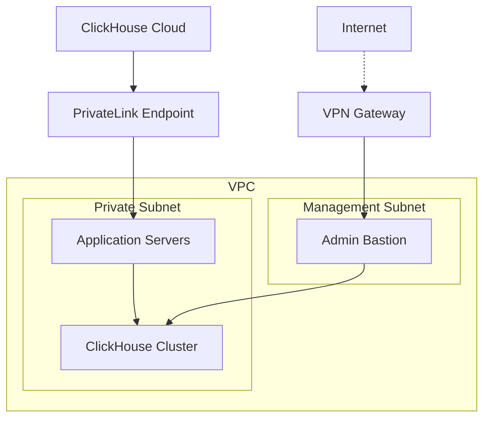

# How to Secure ClickHouse Network Access

Author: [nawazdhandala](https://www.github.com/nawazdhandala)

Tags: ClickHouse, Network Security, Firewall, VPN, Private Endpoints, Security

Description: A comprehensive guide to securing ClickHouse network access with firewall rules, VPNs, private endpoints, and network isolation for production deployments.

---

Securing network access to ClickHouse is critical for protecting your data. This guide covers firewall configuration, private networking, and access controls.

## Network Configuration

### Listen Address Configuration

```xml
<!-- config.d/network.xml -->
<clickhouse>
    <!-- Listen only on specific interfaces -->
    <listen_host>10.0.0.5</listen_host>  <!-- Internal IP only -->

    <!-- Or for localhost only -->
    <listen_host>127.0.0.1</listen_host>
    <listen_host>::1</listen_host>

    <!-- Disable external access ports -->
    <!-- <http_port>8123</http_port> -->
    <https_port>8443</https_port>

    <!-- <tcp_port>9000</tcp_port> -->
    <tcp_port_secure>9440</tcp_port_secure>
</clickhouse>
```

### IP Allow Lists

```xml
<!-- users.d/network_restrictions.xml -->
<clickhouse>
    <users>
        <default>
            <networks>
                <!-- Internal network only -->
                <ip>10.0.0.0/8</ip>
                <ip>172.16.0.0/12</ip>
                <ip>192.168.0.0/16</ip>
            </networks>
        </default>

        <admin>
            <networks>
                <!-- Specific admin IPs -->
                <ip>10.0.1.50</ip>
                <ip>10.0.1.51</ip>
            </networks>
        </admin>

        <application>
            <networks>
                <!-- Application servers -->
                <ip>10.0.2.0/24</ip>
            </networks>
        </application>
    </users>
</clickhouse>
```

## Firewall Rules

### iptables Configuration

```bash
# Allow from internal network only
iptables -A INPUT -p tcp -s 10.0.0.0/8 --dport 9440 -j ACCEPT
iptables -A INPUT -p tcp -s 10.0.0.0/8 --dport 8443 -j ACCEPT
iptables -A INPUT -p tcp --dport 9440 -j DROP
iptables -A INPUT -p tcp --dport 8443 -j DROP

# Allow cluster communication
iptables -A INPUT -p tcp -s 10.0.1.0/24 --dport 9009 -j ACCEPT
```

### Cloud Security Groups (AWS)

```json
{
  "SecurityGroupRules": [
    {
      "Description": "ClickHouse Native TLS from App Servers",
      "IpProtocol": "tcp",
      "FromPort": 9440,
      "ToPort": 9440,
      "SourceSecurityGroupId": "sg-app-servers"
    },
    {
      "Description": "ClickHouse HTTPS from App Servers",
      "IpProtocol": "tcp",
      "FromPort": 8443,
      "ToPort": 8443,
      "SourceSecurityGroupId": "sg-app-servers"
    },
    {
      "Description": "Inter-server communication",
      "IpProtocol": "tcp",
      "FromPort": 9009,
      "ToPort": 9009,
      "SourceSecurityGroupId": "sg-clickhouse-cluster"
    }
  ]
}
```

## Private Endpoints

### AWS PrivateLink

```bash
# Create VPC endpoint for ClickHouse Cloud
aws ec2 create-vpc-endpoint \
    --vpc-id vpc-xxx \
    --service-name com.amazonaws.vpce.us-east-1.vpce-svc-xxx \
    --subnet-ids subnet-xxx \
    --security-group-ids sg-xxx
```

### Network Architecture



## VPN Access

### WireGuard Configuration

```ini
# /etc/wireguard/wg0.conf (Admin access)
[Interface]
PrivateKey = xxx
Address = 10.200.200.1/24

[Peer]
PublicKey = xxx
AllowedIPs = 10.0.0.0/8
Endpoint = vpn.company.com:51820
```

## Monitoring Network Security

```sql
-- Check connection sources
SELECT
    client_hostname,
    client_name,
    interface,
    count() AS connections
FROM system.session_log
WHERE event_time >= now() - INTERVAL 24 HOUR
GROUP BY client_hostname, client_name, interface
ORDER BY connections DESC;

-- Unusual access patterns
SELECT
    user,
    client_hostname,
    count() AS queries,
    uniq(query_kind) AS query_types
FROM system.query_log
WHERE event_time >= now() - INTERVAL 1 HOUR
GROUP BY user, client_hostname
HAVING count() > 1000;
```

## Conclusion

Securing ClickHouse network access involves:

1. **Restrict listen addresses** to internal interfaces
2. **Configure IP allow lists** per user
3. **Use firewall rules** at OS and cloud level
4. **Implement private endpoints** for cloud deployments
5. **Require VPN** for administrative access
6. **Monitor connections** for anomalies

Multiple layers of network security protect your ClickHouse deployment from unauthorized access.
