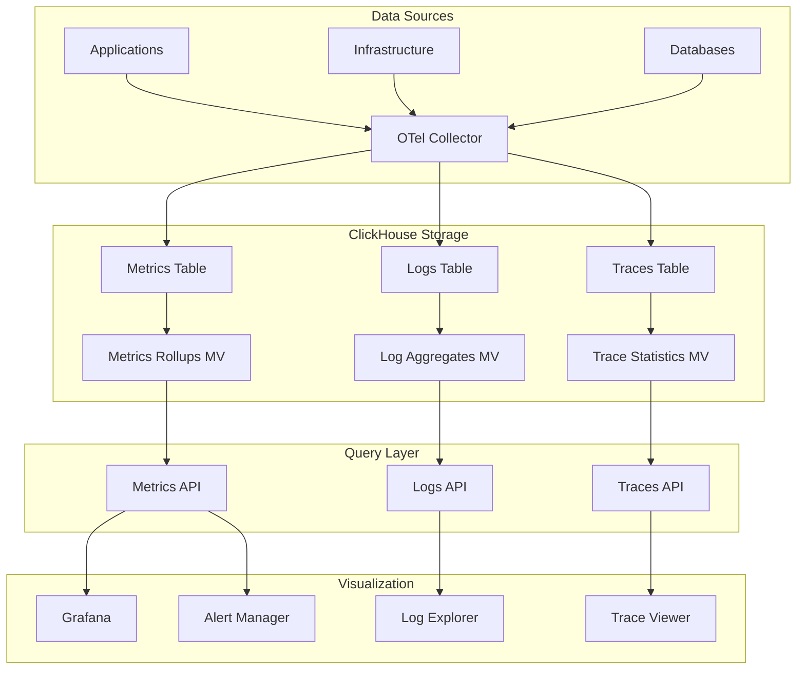

# How to Build an Observability Platform with ClickHouse

Author: [nawazdhandala](https://www.github.com/nawazdhandala)

Tags: ClickHouse, Observability, Metrics, Logs, Traces, Monitoring, APM

Description: A comprehensive guide to building an observability platform with ClickHouse for storing and analyzing metrics, logs, and traces at scale, including schema design, data pipelines, and query patterns.

---

Building an observability platform requires handling three types of telemetry data - metrics, logs, and traces - at massive scale. ClickHouse's ability to ingest millions of events per second while maintaining fast query performance makes it an excellent foundation for unified observability systems.

## Unified Observability Schema

### Metrics Table

```sql
-- Time-series metrics storage
CREATE TABLE metrics (
    metric_name LowCardinality(String),
    metric_type Enum8('gauge' = 1, 'counter' = 2, 'histogram' = 3, 'summary' = 4),
    timestamp DateTime64(3),
    value Float64,
    -- Labels as a map for flexibility
    labels Map(String, String),
    -- Common labels extracted for efficient filtering
    service LowCardinality(String) MATERIALIZED labels['service'],
    host LowCardinality(String) MATERIALIZED labels['host'],
    environment LowCardinality(String) MATERIALIZED labels['environment'],
    -- Indexes
    INDEX metric_idx metric_name TYPE bloom_filter GRANULARITY 4,
    INDEX service_idx service TYPE bloom_filter GRANULARITY 4
) ENGINE = MergeTree()
PARTITION BY toYYYYMMDD(timestamp)
ORDER BY (metric_name, service, timestamp)
TTL timestamp + INTERVAL 30 DAY
SETTINGS index_granularity = 8192;

-- Histogram buckets table for histogram metrics
CREATE TABLE histogram_buckets (
    metric_name LowCardinality(String),
    timestamp DateTime64(3),
    labels Map(String, String),
    le Float64,  -- Upper bound
    count UInt64,
    service LowCardinality(String) MATERIALIZED labels['service']
) ENGINE = MergeTree()
PARTITION BY toYYYYMMDD(timestamp)
ORDER BY (metric_name, service, timestamp, le)
TTL timestamp + INTERVAL 30 DAY;
```

### Logs Table

```sql
-- Structured logs storage
CREATE TABLE logs (
    timestamp DateTime64(3),
    trace_id String,
    span_id String,
    -- Log attributes
    severity_number UInt8,
    severity_text LowCardinality(String),
    body String,
    -- Resource attributes
    service LowCardinality(String),
    host LowCardinality(String),
    environment LowCardinality(String),
    -- Additional attributes
    attributes Map(String, String),
    resource_attributes Map(String, String),
    -- Indexes for search
    INDEX body_idx body TYPE tokenbf_v1(32768, 3, 0) GRANULARITY 4,
    INDEX trace_idx trace_id TYPE bloom_filter GRANULARITY 4,
    INDEX severity_idx severity_number TYPE minmax GRANULARITY 4
) ENGINE = MergeTree()
PARTITION BY toYYYYMMDD(timestamp)
ORDER BY (service, severity_number, timestamp)
TTL timestamp + INTERVAL 14 DAY
SETTINGS index_granularity = 8192;
```

### Traces Table

```sql
-- Distributed traces storage
CREATE TABLE traces (
    trace_id String,
    span_id String,
    parent_span_id String,
    -- Timing
    start_time DateTime64(6),
    end_time DateTime64(6),
    duration_ns UInt64 MATERIALIZED toUInt64((end_time - start_time) * 1000000000),
    -- Span info
    service LowCardinality(String),
    operation_name String,
    span_kind Enum8('unspecified' = 0, 'internal' = 1, 'server' = 2, 'client' = 3, 'producer' = 4, 'consumer' = 5),
    status_code Enum8('unset' = 0, 'ok' = 1, 'error' = 2),
    status_message String,
    -- Attributes
    attributes Map(String, String),
    resource_attributes Map(String, String),
    -- Events within the span
    events Array(Tuple(
        timestamp DateTime64(6),
        name String,
        attributes Map(String, String)
    )),
    -- Indexes
    INDEX trace_idx trace_id TYPE bloom_filter GRANULARITY 4,
    INDEX service_idx service TYPE bloom_filter GRANULARITY 4,
    INDEX operation_idx operation_name TYPE tokenbf_v1(32768, 3, 0) GRANULARITY 4
) ENGINE = MergeTree()
PARTITION BY toYYYYMMDD(start_time)
ORDER BY (service, start_time, trace_id)
TTL start_time + INTERVAL 7 DAY
SETTINGS index_granularity = 8192;
```

## Metrics Analytics

### Prometheus-Style Queries

```sql
-- Rate calculation (requests per second)
SELECT
    toStartOfMinute(timestamp) AS minute,
    service,
    (max(value) - min(value)) / 60 AS rate_per_second
FROM metrics
WHERE metric_name = 'http_requests_total'
  AND timestamp >= now() - INTERVAL 1 HOUR
GROUP BY minute, service
ORDER BY minute;

-- Increase over time window
SELECT
    service,
    max(value) - min(value) AS increase_1h
FROM metrics
WHERE metric_name = 'http_requests_total'
  AND timestamp >= now() - INTERVAL 1 HOUR
GROUP BY service;
```

### Histogram Percentile Calculation

```sql
-- Calculate p50, p90, p99 from histogram buckets
WITH bucket_data AS (
    SELECT
        toStartOfMinute(timestamp) AS minute,
        service,
        le,
        max(count) AS count
    FROM histogram_buckets
    WHERE metric_name = 'http_request_duration_seconds'
      AND timestamp >= now() - INTERVAL 1 HOUR
    GROUP BY minute, service, le
    ORDER BY minute, service, le
),
interpolated AS (
    SELECT
        minute,
        service,
        le,
        count,
        lagInFrame(le, 1, 0) OVER (PARTITION BY minute, service ORDER BY le) AS prev_le,
        lagInFrame(count, 1, 0) OVER (PARTITION BY minute, service ORDER BY le) AS prev_count,
        max(count) OVER (PARTITION BY minute, service) AS total_count
    FROM bucket_data
)
SELECT
    minute,
    service,
    -- P50
    anyIf(prev_le + (le - prev_le) * (0.5 * total_count - prev_count) / (count - prev_count),
        prev_count <= 0.5 * total_count AND count > 0.5 * total_count) AS p50,
    -- P90
    anyIf(prev_le + (le - prev_le) * (0.9 * total_count - prev_count) / (count - prev_count),
        prev_count <= 0.9 * total_count AND count > 0.9 * total_count) AS p90,
    -- P99
    anyIf(prev_le + (le - prev_le) * (0.99 * total_count - prev_count) / (count - prev_count),
        prev_count <= 0.99 * total_count AND count > 0.99 * total_count) AS p99
FROM interpolated
GROUP BY minute, service
ORDER BY minute, service;
```

### Service Health Dashboard

```sql
-- Service health metrics
SELECT
    service,
    -- Request rate
    countIf(metric_name = 'http_requests_total') AS request_samples,
    -- Error rate
    sumIf(value, metric_name = 'http_errors_total') /
        nullIf(sumIf(value, metric_name = 'http_requests_total'), 0) * 100 AS error_rate,
    -- Latency
    avgIf(value, metric_name = 'http_request_duration_seconds' AND labels['quantile'] = '0.99') AS p99_latency,
    -- Saturation (CPU)
    avgIf(value, metric_name = 'process_cpu_usage') AS avg_cpu
FROM metrics
WHERE timestamp >= now() - INTERVAL 5 MINUTE
GROUP BY service
ORDER BY error_rate DESC;
```

## Log Analytics

### Log Search and Filtering

```sql
-- Full-text search in logs
SELECT
    timestamp,
    service,
    severity_text,
    body
FROM logs
WHERE timestamp >= now() - INTERVAL 1 HOUR
  AND service = 'api-gateway'
  AND hasToken(body, 'error')
ORDER BY timestamp DESC
LIMIT 100;

-- Structured log querying
SELECT
    timestamp,
    service,
    body,
    attributes['user_id'] AS user_id,
    attributes['request_id'] AS request_id
FROM logs
WHERE timestamp >= now() - INTERVAL 1 HOUR
  AND severity_number >= 17  -- ERROR and above
  AND attributes['user_id'] = '12345'
ORDER BY timestamp DESC;
```

### Log Aggregations

```sql
-- Error distribution by service
SELECT
    service,
    severity_text,
    count() AS log_count,
    uniq(trace_id) AS unique_traces
FROM logs
WHERE timestamp >= now() - INTERVAL 1 HOUR
  AND severity_number >= 17
GROUP BY service, severity_text
ORDER BY log_count DESC;

-- Top error messages
SELECT
    service,
    replaceRegexpAll(body, '\\d+', 'N') AS normalized_message,
    count() AS occurrences,
    min(timestamp) AS first_seen,
    max(timestamp) AS last_seen
FROM logs
WHERE timestamp >= now() - INTERVAL 1 HOUR
  AND severity_number >= 17
GROUP BY service, normalized_message
ORDER BY occurrences DESC
LIMIT 20;
```

### Log Pattern Analysis

```sql
-- Extract common patterns
SELECT
    service,
    extractAll(body, '\\b(error|exception|failed|timeout|refused)\\b') AS keywords,
    count() AS occurrences
FROM logs
WHERE timestamp >= now() - INTERVAL 1 HOUR
  AND severity_number >= 13  -- WARN and above
GROUP BY service, keywords
HAVING length(keywords) > 0
ORDER BY occurrences DESC
LIMIT 50;
```

## Trace Analytics

### Trace Search

```sql
-- Find traces by attributes
SELECT
    trace_id,
    service,
    operation_name,
    duration_ns / 1000000 AS duration_ms,
    status_code,
    start_time
FROM traces
WHERE start_time >= now() - INTERVAL 1 HOUR
  AND service = 'checkout-service'
  AND status_code = 'error'
ORDER BY duration_ns DESC
LIMIT 100;
```

### Trace Reconstruction

```sql
-- Reconstruct a full trace
SELECT
    trace_id,
    span_id,
    parent_span_id,
    service,
    operation_name,
    duration_ns / 1000000 AS duration_ms,
    status_code,
    start_time,
    end_time,
    -- Calculate depth in trace
    length(splitByString(',',
        arrayStringConcat(
            arrayMap(x -> x.1,
                arrayFilter(x -> x.2 <= start_time,
                    arrayZip(
                        groupArray(span_id) OVER (),
                        groupArray(start_time) OVER ()
                    )
                )
            ), ','
        )
    )) AS depth
FROM traces
WHERE trace_id = 'abc123'
ORDER BY start_time;

-- Simpler trace view
SELECT
    span_id,
    parent_span_id,
    service,
    operation_name,
    duration_ns / 1000000 AS duration_ms,
    status_code,
    attributes
FROM traces
WHERE trace_id = 'abc123'
ORDER BY start_time;
```

### Service Dependency Map

```sql
-- Build service dependency graph from traces
SELECT
    parent_service,
    child_service,
    count() AS call_count,
    avg(child_duration_ms) AS avg_latency_ms,
    countIf(child_status = 'error') / count() * 100 AS error_rate
FROM (
    SELECT
        p.service AS parent_service,
        c.service AS child_service,
        c.duration_ns / 1000000 AS child_duration_ms,
        c.status_code AS child_status
    FROM traces c
    JOIN traces p ON c.parent_span_id = p.span_id
        AND c.trace_id = p.trace_id
    WHERE c.start_time >= now() - INTERVAL 1 HOUR
      AND c.parent_span_id != ''
)
GROUP BY parent_service, child_service
ORDER BY call_count DESC;
```

### Latency Analysis

```sql
-- P50, P90, P99 latency by service and operation
SELECT
    service,
    operation_name,
    count() AS span_count,
    quantile(0.5)(duration_ns) / 1000000 AS p50_ms,
    quantile(0.9)(duration_ns) / 1000000 AS p90_ms,
    quantile(0.99)(duration_ns) / 1000000 AS p99_ms,
    max(duration_ns) / 1000000 AS max_ms
FROM traces
WHERE start_time >= now() - INTERVAL 1 HOUR
GROUP BY service, operation_name
ORDER BY p99_ms DESC;

-- Slow trace analysis
SELECT
    trace_id,
    service,
    operation_name,
    duration_ns / 1000000 AS duration_ms,
    attributes
FROM traces
WHERE start_time >= now() - INTERVAL 1 HOUR
  AND duration_ns > (
      SELECT quantile(0.99)(duration_ns)
      FROM traces
      WHERE start_time >= now() - INTERVAL 1 HOUR
  )
ORDER BY duration_ns DESC
LIMIT 50;
```

## Correlation Queries

### Logs to Traces

```sql
-- Find logs for a specific trace
SELECT
    timestamp,
    severity_text,
    body,
    span_id,
    attributes
FROM logs
WHERE trace_id = 'abc123'
ORDER BY timestamp;

-- Find traces for error logs
SELECT DISTINCT
    l.trace_id,
    l.timestamp AS log_time,
    l.body AS error_message,
    t.service,
    t.operation_name,
    t.duration_ns / 1000000 AS trace_duration_ms
FROM logs l
JOIN traces t ON l.trace_id = t.trace_id
WHERE l.timestamp >= now() - INTERVAL 1 HOUR
  AND l.severity_number >= 17
  AND l.trace_id != ''
ORDER BY l.timestamp DESC
LIMIT 100;
```

### Metrics to Traces

```sql
-- Find traces during a metric spike
WITH spike_windows AS (
    SELECT
        toStartOfMinute(timestamp) AS minute,
        service
    FROM metrics
    WHERE metric_name = 'http_request_duration_seconds'
      AND labels['quantile'] = '0.99'
      AND value > 1.0  -- Latency spike threshold
      AND timestamp >= now() - INTERVAL 1 HOUR
    GROUP BY minute, service
)
SELECT
    t.trace_id,
    t.service,
    t.operation_name,
    t.duration_ns / 1000000 AS duration_ms,
    t.start_time
FROM traces t
JOIN spike_windows s ON t.service = s.service
    AND toStartOfMinute(t.start_time) = s.minute
WHERE t.start_time >= now() - INTERVAL 1 HOUR
ORDER BY t.duration_ns DESC
LIMIT 100;
```

## Alerting Queries

### SLO Monitoring

```sql
-- Error budget consumption
WITH
    0.999 AS slo_target,  -- 99.9% availability
    30 AS window_days
SELECT
    service,
    count() AS total_requests,
    countIf(status_code != 'error') AS successful_requests,
    countIf(status_code != 'error') / count() AS actual_success_rate,
    (1 - slo_target) * count() AS error_budget_total,
    countIf(status_code = 'error') AS errors_consumed,
    1 - (countIf(status_code = 'error') / ((1 - slo_target) * count())) AS error_budget_remaining
FROM traces
WHERE start_time >= now() - INTERVAL 30 DAY
  AND span_kind = 'server'
GROUP BY service;

-- Real-time SLI tracking
SELECT
    toStartOfMinute(start_time) AS minute,
    service,
    countIf(status_code != 'error') / count() * 100 AS availability,
    quantile(0.99)(duration_ns) / 1000000 AS p99_latency_ms
FROM traces
WHERE start_time >= now() - INTERVAL 1 HOUR
  AND span_kind = 'server'
GROUP BY minute, service
ORDER BY minute DESC;
```

## Observability Platform Architecture



## Conclusion

Building an observability platform with ClickHouse provides:

1. **Unified storage** - Metrics, logs, and traces in one system
2. **Correlation** - Connect signals using trace_id and timestamps
3. **Scale** - Handle billions of events per day
4. **Fast queries** - Sub-second response for dashboards and alerts
5. **Cost efficiency** - Excellent compression for telemetry data
6. **Flexibility** - SQL for complex analysis and custom queries

ClickHouse's columnar storage and powerful query engine make it an excellent foundation for building observability platforms that can scale with your infrastructure.
