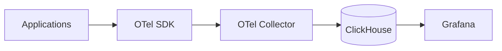

# How to Stream OpenTelemetry Data to ClickHouse

Author: [nawazdhandala](https://www.github.com/nawazdhandala)

Tags: ClickHouse, OpenTelemetry, Observability, Traces, Metrics, Logs, Database, Monitoring

Description: A comprehensive guide to using ClickHouse as an observability backend for OpenTelemetry data, covering schema design for traces, metrics, and logs, plus configuration of the OpenTelemetry Collector.

---

ClickHouse makes an excellent backend for OpenTelemetry data. It handles the high-volume writes from telemetry pipelines while providing fast queries for dashboards and troubleshooting. This guide covers how to configure the OpenTelemetry Collector to send data to ClickHouse and design efficient schemas.

## Why ClickHouse for Observability?

- **Cost-effective**: Store months of telemetry data affordably
- **Fast queries**: Sub-second aggregations over billions of spans
- **Flexible**: Custom schemas optimized for your query patterns
- **Scalable**: Handles millions of events per second
- **Open**: No vendor lock-in, full data ownership

## Architecture Overview



## Schema Design: Traces

### Spans Table

Store individual spans with their attributes:

```sql
CREATE TABLE otel_traces
(
    -- Identifiers
    Timestamp DateTime64(9) CODEC(Delta, ZSTD(1)),
    TraceId String CODEC(ZSTD(1)),
    SpanId String CODEC(ZSTD(1)),
    ParentSpanId String CODEC(ZSTD(1)),
    TraceState String CODEC(ZSTD(1)),

    -- Span info
    SpanName LowCardinality(String) CODEC(ZSTD(1)),
    SpanKind LowCardinality(String) CODEC(ZSTD(1)),
    ServiceName LowCardinality(String) CODEC(ZSTD(1)),

    -- Timing
    Duration Int64 CODEC(ZSTD(1)),

    -- Status
    StatusCode LowCardinality(String) CODEC(ZSTD(1)),
    StatusMessage String CODEC(ZSTD(1)),

    -- Attributes as maps for flexibility
    SpanAttributes Map(LowCardinality(String), String) CODEC(ZSTD(1)),
    ResourceAttributes Map(LowCardinality(String), String) CODEC(ZSTD(1)),

    -- Events and links stored as nested
    Events Nested
    (
        Timestamp DateTime64(9),
        Name LowCardinality(String),
        Attributes Map(LowCardinality(String), String)
    ) CODEC(ZSTD(1)),

    Links Nested
    (
        TraceId String,
        SpanId String,
        TraceState String,
        Attributes Map(LowCardinality(String), String)
    ) CODEC(ZSTD(1)),

    INDEX idx_trace_id TraceId TYPE bloom_filter GRANULARITY 4,
    INDEX idx_service ServiceName TYPE set(100) GRANULARITY 4,
    INDEX idx_span_name SpanName TYPE set(1000) GRANULARITY 4
)
ENGINE = MergeTree()
PARTITION BY toDate(Timestamp)
ORDER BY (ServiceName, SpanName, toUnixTimestamp(Timestamp), TraceId)
TTL toDateTime(Timestamp) + INTERVAL 30 DAY
SETTINGS index_granularity = 8192;
```

### Trace Search Materialized View

Pre-aggregate for trace list queries:

```sql
CREATE TABLE otel_traces_trace_id_ts
(
    TraceId String,
    Start DateTime64(9),
    End DateTime64(9),
    ServiceName LowCardinality(String),
    RootSpanName String,
    Duration Int64,
    SpanCount UInt32,
    HasError UInt8
)
ENGINE = ReplacingMergeTree()
ORDER BY (TraceId)
TTL toDateTime(Start) + INTERVAL 30 DAY;

CREATE MATERIALIZED VIEW otel_traces_trace_id_mv TO otel_traces_trace_id_ts AS
SELECT
    TraceId,
    min(Timestamp) AS Start,
    max(Timestamp) AS End,
    any(ServiceName) AS ServiceName,
    anyIf(SpanName, ParentSpanId = '') AS RootSpanName,
    toInt64(dateDiff('microsecond', min(Timestamp), max(Timestamp))) AS Duration,
    count() AS SpanCount,
    max(StatusCode = 'Error') AS HasError
FROM otel_traces
GROUP BY TraceId;
```

## Schema Design: Metrics

### Metrics Table

Store all metric types in one table:

```sql
CREATE TABLE otel_metrics
(
    -- Time and identity
    Timestamp DateTime64(9) CODEC(Delta, ZSTD(1)),
    MetricName LowCardinality(String) CODEC(ZSTD(1)),
    MetricType LowCardinality(String) CODEC(ZSTD(1)),  -- gauge, sum, histogram

    -- Dimensions
    ServiceName LowCardinality(String) CODEC(ZSTD(1)),
    Attributes Map(LowCardinality(String), String) CODEC(ZSTD(1)),
    ResourceAttributes Map(LowCardinality(String), String) CODEC(ZSTD(1)),

    -- Values (use appropriate column based on type)
    Value Float64 CODEC(Gorilla, ZSTD(1)),
    Count UInt64 CODEC(T64, ZSTD(1)),
    Sum Float64 CODEC(Gorilla, ZSTD(1)),
    Min Float64 CODEC(Gorilla, ZSTD(1)),
    Max Float64 CODEC(Gorilla, ZSTD(1)),

    -- Histogram buckets
    BucketCounts Array(UInt64) CODEC(ZSTD(1)),
    ExplicitBounds Array(Float64) CODEC(ZSTD(1)),

    INDEX idx_metric_name MetricName TYPE set(1000) GRANULARITY 4,
    INDEX idx_service ServiceName TYPE set(100) GRANULARITY 4
)
ENGINE = MergeTree()
PARTITION BY toDate(Timestamp)
ORDER BY (MetricName, ServiceName, toUnixTimestamp(Timestamp))
TTL toDateTime(Timestamp) + INTERVAL 90 DAY
SETTINGS index_granularity = 8192;
```

### Pre-Aggregated Metrics

Create rollups for dashboard queries:

```sql
CREATE TABLE otel_metrics_hourly
(
    Hour DateTime,
    MetricName LowCardinality(String),
    ServiceName LowCardinality(String),
    Attributes Map(LowCardinality(String), String),

    ValueSum AggregateFunction(sum, Float64),
    ValueCount AggregateFunction(count, UInt64),
    ValueMin AggregateFunction(min, Float64),
    ValueMax AggregateFunction(max, Float64),
    ValueAvg AggregateFunction(avg, Float64)
)
ENGINE = AggregatingMergeTree()
PARTITION BY toYYYYMM(Hour)
ORDER BY (MetricName, ServiceName, Hour)
TTL Hour + INTERVAL 1 YEAR;

CREATE MATERIALIZED VIEW otel_metrics_hourly_mv TO otel_metrics_hourly AS
SELECT
    toStartOfHour(Timestamp) AS Hour,
    MetricName,
    ServiceName,
    Attributes,
    sumState(Value) AS ValueSum,
    countState() AS ValueCount,
    minState(Value) AS ValueMin,
    maxState(Value) AS ValueMax,
    avgState(Value) AS ValueAvg
FROM otel_metrics
WHERE MetricType = 'gauge'
GROUP BY Hour, MetricName, ServiceName, Attributes;
```

## Schema Design: Logs

### Logs Table

```sql
CREATE TABLE otel_logs
(
    -- Time and identity
    Timestamp DateTime64(9) CODEC(Delta, ZSTD(1)),
    ObservedTimestamp DateTime64(9) CODEC(Delta, ZSTD(1)),
    TraceId String CODEC(ZSTD(1)),
    SpanId String CODEC(ZSTD(1)),

    -- Log info
    SeverityText LowCardinality(String) CODEC(ZSTD(1)),
    SeverityNumber UInt8 CODEC(ZSTD(1)),
    Body String CODEC(ZSTD(3)),

    -- Context
    ServiceName LowCardinality(String) CODEC(ZSTD(1)),
    Attributes Map(LowCardinality(String), String) CODEC(ZSTD(1)),
    ResourceAttributes Map(LowCardinality(String), String) CODEC(ZSTD(1)),

    INDEX idx_trace_id TraceId TYPE bloom_filter GRANULARITY 4,
    INDEX idx_service ServiceName TYPE set(100) GRANULARITY 4,
    INDEX idx_severity SeverityText TYPE set(10) GRANULARITY 4,
    INDEX idx_body Body TYPE tokenbf_v1(32768, 3, 0) GRANULARITY 4
)
ENGINE = MergeTree()
PARTITION BY toDate(Timestamp)
ORDER BY (ServiceName, SeverityText, toUnixTimestamp(Timestamp))
TTL toDateTime(Timestamp) + INTERVAL 14 DAY
SETTINGS index_granularity = 8192;
```

## OpenTelemetry Collector Configuration

### Basic Configuration

```yaml
receivers:
  otlp:
    protocols:
      grpc:
        endpoint: 0.0.0.0:4317
      http:
        endpoint: 0.0.0.0:4318

processors:
  batch:
    timeout: 5s
    send_batch_size: 100000

exporters:
  clickhouse:
    endpoint: tcp://clickhouse:9000?dial_timeout=10s&compress=lz4
    database: otel
    ttl_days: 30
    logs_table_name: otel_logs
    traces_table_name: otel_traces
    metrics_table_name: otel_metrics
    timeout: 30s
    retry_on_failure:
      enabled: true
      initial_interval: 5s
      max_interval: 30s
      max_elapsed_time: 300s

service:
  pipelines:
    traces:
      receivers: [otlp]
      processors: [batch]
      exporters: [clickhouse]
    metrics:
      receivers: [otlp]
      processors: [batch]
      exporters: [clickhouse]
    logs:
      receivers: [otlp]
      processors: [batch]
      exporters: [clickhouse]
```

### High-Volume Configuration

For production deployments handling high volume:

```yaml
receivers:
  otlp:
    protocols:
      grpc:
        endpoint: 0.0.0.0:4317
        max_recv_msg_size_mib: 16

processors:
  batch:
    timeout: 10s
    send_batch_size: 500000
    send_batch_max_size: 1000000

  memory_limiter:
    check_interval: 1s
    limit_mib: 4000
    spike_limit_mib: 800

  resource:
    attributes:
      - key: environment
        value: production
        action: upsert

exporters:
  clickhouse:
    endpoint: tcp://clickhouse:9000?dial_timeout=10s&compress=lz4&max_execution_time=60
    database: otel
    ttl_days: 30
    timeout: 60s
    sending_queue:
      enabled: true
      num_consumers: 10
      queue_size: 10000
    retry_on_failure:
      enabled: true
      initial_interval: 5s
      max_interval: 30s
      max_elapsed_time: 300s

service:
  telemetry:
    metrics:
      address: 0.0.0.0:8888

  pipelines:
    traces:
      receivers: [otlp]
      processors: [memory_limiter, resource, batch]
      exporters: [clickhouse]
    metrics:
      receivers: [otlp]
      processors: [memory_limiter, resource, batch]
      exporters: [clickhouse]
    logs:
      receivers: [otlp]
      processors: [memory_limiter, resource, batch]
      exporters: [clickhouse]
```

## Querying Telemetry Data

### Find Slow Traces

```sql
SELECT
    TraceId,
    ServiceName,
    SpanName,
    Duration / 1000000 AS duration_ms
FROM otel_traces
WHERE Timestamp >= now() - INTERVAL 1 HOUR
  AND Duration > 1000000000  -- > 1 second
ORDER BY Duration DESC
LIMIT 100;
```

### Service Error Rates

```sql
SELECT
    ServiceName,
    countIf(StatusCode = 'Error') AS errors,
    count() AS total,
    round(errors / total * 100, 2) AS error_rate
FROM otel_traces
WHERE Timestamp >= now() - INTERVAL 1 HOUR
GROUP BY ServiceName
ORDER BY error_rate DESC;
```

### Trace Timeline

```sql
SELECT
    SpanName,
    ServiceName,
    dateDiff('microsecond', min(Timestamp) OVER (), Timestamp) / 1000 AS start_ms,
    Duration / 1000000 AS duration_ms
FROM otel_traces
WHERE TraceId = 'abc123...'
ORDER BY Timestamp;
```

### Metric Dashboards

```sql
-- Request rate by service
SELECT
    toStartOfMinute(Timestamp) AS minute,
    ServiceName,
    sum(Value) AS requests
FROM otel_metrics
WHERE MetricName = 'http_requests_total'
  AND Timestamp >= now() - INTERVAL 1 HOUR
GROUP BY minute, ServiceName
ORDER BY minute;

-- P99 latency from histogram
SELECT
    toStartOfMinute(Timestamp) AS minute,
    ServiceName,
    histogramQuantile(0.99, BucketCounts, ExplicitBounds) AS p99_ms
FROM otel_metrics
WHERE MetricName = 'http_request_duration_seconds'
  AND Timestamp >= now() - INTERVAL 1 HOUR
GROUP BY minute, ServiceName;
```

### Log Search

```sql
-- Full-text search in logs
SELECT
    Timestamp,
    ServiceName,
    SeverityText,
    Body
FROM otel_logs
WHERE Timestamp >= now() - INTERVAL 1 HOUR
  AND hasToken(Body, 'error')
ORDER BY Timestamp DESC
LIMIT 100;

-- Correlate logs with trace
SELECT
    Timestamp,
    Body,
    Attributes
FROM otel_logs
WHERE TraceId = 'abc123...'
ORDER BY Timestamp;
```

## Grafana Integration

### Data Source Configuration

```yaml
datasources:
  - name: ClickHouse
    type: grafana-clickhouse-datasource
    url: http://clickhouse:8123
    jsonData:
      defaultDatabase: otel
      username: default
```

### Example Dashboard Queries

```sql
-- Time series panel: Request rate
SELECT
    $__timeInterval(Timestamp) AS time,
    ServiceName,
    count() AS requests
FROM otel_traces
WHERE $__timeFilter(Timestamp)
  AND SpanKind = 'Server'
GROUP BY time, ServiceName
ORDER BY time

-- Table panel: Slow endpoints
SELECT
    SpanName,
    ServiceName,
    count() AS calls,
    avg(Duration) / 1000000 AS avg_ms,
    quantile(0.99)(Duration) / 1000000 AS p99_ms
FROM otel_traces
WHERE $__timeFilter(Timestamp)
  AND SpanKind = 'Server'
GROUP BY SpanName, ServiceName
ORDER BY p99_ms DESC
LIMIT 20
```

## Performance Tuning

### Collector Tuning

```yaml
# Increase batch size for throughput
processors:
  batch:
    send_batch_size: 500000
    timeout: 10s

# Add sending queue for backpressure
exporters:
  clickhouse:
    sending_queue:
      enabled: true
      num_consumers: 10
```

### ClickHouse Tuning

```sql
-- Async inserts for high volume
ALTER TABLE otel_traces MODIFY SETTING
    async_insert = 1,
    async_insert_max_data_size = 100000000;

-- Monitor parts
SELECT table, count() AS parts
FROM system.parts
WHERE active AND database = 'otel'
GROUP BY table;
```

### Retention Management

```sql
-- Verify TTL is working
SELECT
    table,
    partition,
    rows,
    min_time,
    max_time
FROM system.parts
WHERE database = 'otel'
ORDER BY max_time;

-- Force TTL cleanup
ALTER TABLE otel_traces MATERIALIZE TTL;
```

---

ClickHouse provides a cost-effective, high-performance backend for OpenTelemetry data. Design your schemas around your query patterns, use materialized views for common aggregations, and tune the collector batch sizes for throughput. With the right configuration, you can store and query millions of spans per second.
