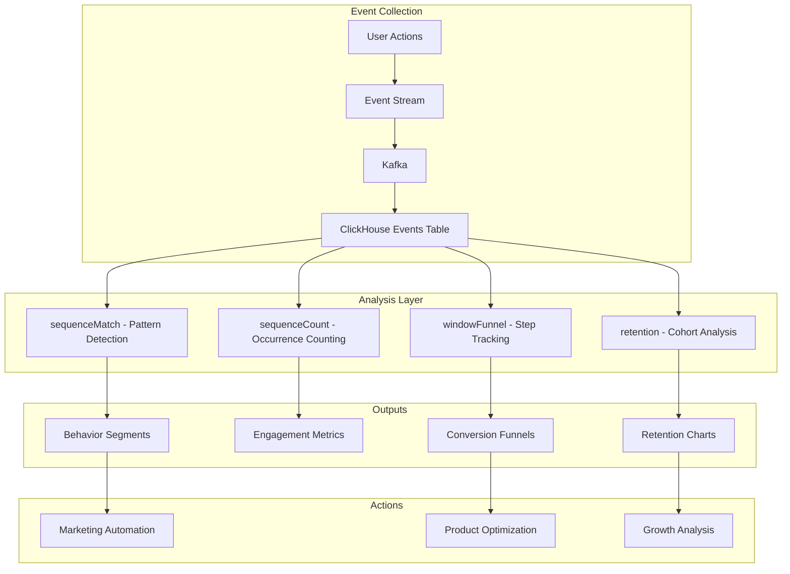

# How to Use ClickHouse Parametric Functions

Author: [nawazdhandala](https://www.github.com/nawazdhandala)

Tags: ClickHouse, Parametric Functions, sequenceMatch, sequenceCount, User Behavior, Funnel Analysis

Description: A comprehensive guide to using ClickHouse parametric functions like sequenceMatch and sequenceCount for user behavior analysis, funnel tracking, and pattern detection in event streams.

---

ClickHouse's parametric functions provide powerful capabilities for analyzing user behavior patterns, detecting event sequences, and building conversion funnels. These functions are essential for product analytics, understanding user journeys, and measuring conversion rates.

## Understanding Parametric Functions

Parametric functions in ClickHouse operate on ordered sequences of events, allowing you to:

- Detect specific patterns in user behavior
- Count sequence occurrences
- Build multi-step funnels
- Analyze retention and engagement patterns

## Setting Up Event Data

First, let's create a table structure optimized for sequence analysis:

```sql
CREATE TABLE user_events (
    user_id UInt64,
    event_time DateTime64(3),
    event_name LowCardinality(String),
    event_properties Map(String, String),
    session_id String,
    device_type LowCardinality(String),
    page_url String
) ENGINE = MergeTree()
PARTITION BY toYYYYMM(event_time)
ORDER BY (user_id, event_time);

-- Insert sample data
INSERT INTO user_events VALUES
    (1, '2024-01-15 10:00:00', 'page_view', {'page': 'home'}, 'sess1', 'mobile', '/'),
    (1, '2024-01-15 10:01:00', 'page_view', {'page': 'products'}, 'sess1', 'mobile', '/products'),
    (1, '2024-01-15 10:02:00', 'add_to_cart', {'product_id': '123'}, 'sess1', 'mobile', '/products/123'),
    (1, '2024-01-15 10:05:00', 'checkout_start', {}, 'sess1', 'mobile', '/checkout'),
    (1, '2024-01-15 10:10:00', 'purchase', {'order_id': 'ORD001'}, 'sess1', 'mobile', '/confirmation'),
    (2, '2024-01-15 11:00:00', 'page_view', {'page': 'home'}, 'sess2', 'desktop', '/'),
    (2, '2024-01-15 11:02:00', 'page_view', {'page': 'products'}, 'sess2', 'desktop', '/products'),
    (2, '2024-01-15 11:03:00', 'add_to_cart', {'product_id': '456'}, 'sess2', 'desktop', '/products/456'),
    (2, '2024-01-15 11:30:00', 'cart_abandon', {}, 'sess2', 'desktop', '/cart');
```

## sequenceMatch Function

The `sequenceMatch` function checks if a sequence of events matches a specified pattern:

```sql
-- Basic syntax:
-- sequenceMatch(pattern)(timestamp, condition1, condition2, ...)

-- Check if users completed the purchase funnel
SELECT
    user_id,
    sequenceMatch('(?1)(?2)(?3)(?4)')(
        event_time,
        event_name = 'page_view',
        event_name = 'add_to_cart',
        event_name = 'checkout_start',
        event_name = 'purchase'
    ) AS completed_funnel
FROM user_events
GROUP BY user_id;

-- Result:
-- user_id | completed_funnel
-- 1       | 1
-- 2       | 0
```

### Pattern Syntax

The pattern uses a regex-like syntax:

```sql
-- (?N) - matches condition N
-- (?1)(?2) - condition 1 followed by condition 2
-- (?1).*(?2) - condition 1, any events, then condition 2
-- (?1)(?!2)(?3) - condition 1, NOT condition 2, then condition 3
-- (?t<=3600) - time constraint (within 3600 seconds)

-- Example: Check if add_to_cart happened within 5 minutes of page_view
SELECT
    user_id,
    sequenceMatch('(?1)(?t<=300)(?2)')(
        event_time,
        event_name = 'page_view',
        event_name = 'add_to_cart'
    ) AS quick_add_to_cart
FROM user_events
GROUP BY user_id;

-- Example: Purchase without cart abandonment
SELECT
    user_id,
    sequenceMatch('(?1)(?2)(?!3)(?4)')(
        event_time,
        event_name = 'add_to_cart',
        event_name = 'checkout_start',
        event_name = 'cart_abandon',
        event_name = 'purchase'
    ) AS completed_without_abandon
FROM user_events
GROUP BY user_id;
```

### Time Constraints in Patterns

```sql
-- Purchase within 1 hour of adding to cart
SELECT
    user_id,
    sequenceMatch('(?1)(?t<=3600)(?2)')(
        event_time,
        event_name = 'add_to_cart',
        event_name = 'purchase'
    ) AS quick_purchase
FROM user_events
GROUP BY user_id;

-- Multiple time constraints
SELECT
    user_id,
    sequenceMatch('(?1)(?t<=300)(?2)(?t<=1800)(?3)')(
        event_time,
        event_name = 'page_view',
        event_name = 'add_to_cart',
        event_name = 'purchase'
    ) AS fast_conversion
FROM user_events
GROUP BY user_id;
```

## sequenceCount Function

The `sequenceCount` function counts how many times a pattern occurs:

```sql
-- Count how many times users viewed products then added to cart
SELECT
    user_id,
    sequenceCount('(?1)(?2)')(
        event_time,
        event_name = 'page_view',
        event_name = 'add_to_cart'
    ) AS view_to_cart_count
FROM user_events
GROUP BY user_id;

-- Count repeated behaviors (e.g., multiple add-to-cart actions)
SELECT
    user_id,
    sequenceCount('(?1)')(
        event_time,
        event_name = 'add_to_cart'
    ) AS total_add_to_cart
FROM user_events
GROUP BY user_id;
```

## Building Conversion Funnels

### Basic Funnel Analysis

```sql
-- E-commerce conversion funnel
SELECT
    countIf(sequenceMatch('(?1)')(event_time, event_name = 'page_view')) AS step1_visitors,
    countIf(sequenceMatch('(?1)(?2)')(event_time,
        event_name = 'page_view',
        event_name = 'product_view'
    )) AS step2_product_views,
    countIf(sequenceMatch('(?1)(?2)(?3)')(event_time,
        event_name = 'page_view',
        event_name = 'product_view',
        event_name = 'add_to_cart'
    )) AS step3_add_to_cart,
    countIf(sequenceMatch('(?1)(?2)(?3)(?4)')(event_time,
        event_name = 'page_view',
        event_name = 'product_view',
        event_name = 'add_to_cart',
        event_name = 'checkout_start'
    )) AS step4_checkout,
    countIf(sequenceMatch('(?1)(?2)(?3)(?4)(?5)')(event_time,
        event_name = 'page_view',
        event_name = 'product_view',
        event_name = 'add_to_cart',
        event_name = 'checkout_start',
        event_name = 'purchase'
    )) AS step5_purchase
FROM user_events
GROUP BY user_id
HAVING step1_visitors > 0;
```

### Funnel with Conversion Rates

```sql
WITH funnel AS (
    SELECT
        user_id,
        sequenceMatch('(?1)')(event_time, event_name = 'page_view') AS reached_step1,
        sequenceMatch('(?1)(?2)')(event_time,
            event_name = 'page_view',
            event_name = 'add_to_cart'
        ) AS reached_step2,
        sequenceMatch('(?1)(?2)(?3)')(event_time,
            event_name = 'page_view',
            event_name = 'add_to_cart',
            event_name = 'checkout_start'
        ) AS reached_step3,
        sequenceMatch('(?1)(?2)(?3)(?4)')(event_time,
            event_name = 'page_view',
            event_name = 'add_to_cart',
            event_name = 'checkout_start',
            event_name = 'purchase'
        ) AS reached_step4
    FROM user_events
    WHERE event_time >= now() - INTERVAL 30 DAY
    GROUP BY user_id
)
SELECT
    sum(reached_step1) AS step1_users,
    sum(reached_step2) AS step2_users,
    sum(reached_step3) AS step3_users,
    sum(reached_step4) AS step4_users,
    round(sum(reached_step2) / sum(reached_step1) * 100, 2) AS step1_to_2_rate,
    round(sum(reached_step3) / sum(reached_step2) * 100, 2) AS step2_to_3_rate,
    round(sum(reached_step4) / sum(reached_step3) * 100, 2) AS step3_to_4_rate,
    round(sum(reached_step4) / sum(reached_step1) * 100, 2) AS overall_conversion
FROM funnel;
```

### Segmented Funnel Analysis

```sql
-- Funnel by device type
SELECT
    device_type,
    count(DISTINCT user_id) AS total_users,
    countIf(sequenceMatch('(?1)(?2)')(event_time,
        event_name = 'page_view',
        event_name = 'add_to_cart'
    )) AS added_to_cart,
    countIf(sequenceMatch('(?1)(?2)(?3)')(event_time,
        event_name = 'page_view',
        event_name = 'add_to_cart',
        event_name = 'purchase'
    )) AS purchased,
    round(countIf(sequenceMatch('(?1)(?2)(?3)')(event_time,
        event_name = 'page_view',
        event_name = 'add_to_cart',
        event_name = 'purchase'
    )) / count(DISTINCT user_id) * 100, 2) AS conversion_rate
FROM user_events
WHERE event_time >= now() - INTERVAL 7 DAY
GROUP BY device_type
ORDER BY conversion_rate DESC;
```

## User Behavior Pattern Detection

### Detecting Specific Behaviors

```sql
-- Identify users who browse but don't buy
SELECT user_id
FROM user_events
WHERE event_time >= now() - INTERVAL 30 DAY
GROUP BY user_id
HAVING sequenceMatch('(?1)(?2)')(event_time,
    event_name = 'product_view',
    event_name = 'page_view'  -- Left without adding to cart
) = 1
AND sequenceMatch('(?1)(?2)(?3)')(event_time,
    event_name = 'product_view',
    event_name = 'add_to_cart',
    event_name = 'purchase'
) = 0;

-- Find users with repeated cart abandonment
SELECT
    user_id,
    sequenceCount('(?1)(?2)')(event_time,
        event_name = 'add_to_cart',
        event_name = 'cart_abandon'
    ) AS abandon_count
FROM user_events
WHERE event_time >= now() - INTERVAL 30 DAY
GROUP BY user_id
HAVING abandon_count >= 2
ORDER BY abandon_count DESC;
```

### Session-Based Analysis

```sql
-- Analyze conversion within sessions
SELECT
    session_id,
    user_id,
    min(event_time) AS session_start,
    max(event_time) AS session_end,
    dateDiff('minute', min(event_time), max(event_time)) AS session_duration_minutes,
    count() AS event_count,
    sequenceMatch('(?1)(?2)(?3)')(event_time,
        event_name = 'page_view',
        event_name = 'add_to_cart',
        event_name = 'purchase'
    ) AS converted
FROM user_events
WHERE event_time >= now() - INTERVAL 7 DAY
GROUP BY session_id, user_id
ORDER BY session_start DESC;

-- Average session metrics by conversion status
SELECT
    converted,
    count() AS sessions,
    avg(session_duration_minutes) AS avg_duration,
    avg(event_count) AS avg_events
FROM (
    SELECT
        session_id,
        dateDiff('minute', min(event_time), max(event_time)) AS session_duration_minutes,
        count() AS event_count,
        sequenceMatch('(?1)(?2)')(event_time,
            event_name = 'add_to_cart',
            event_name = 'purchase'
        ) AS converted
    FROM user_events
    WHERE event_time >= now() - INTERVAL 7 DAY
    GROUP BY session_id
)
GROUP BY converted;
```

## Advanced Pattern Detection

### windowFunnel Function

The `windowFunnel` function finds the maximum step reached in a funnel within a time window:

```sql
-- Find maximum funnel step reached within 1 hour
SELECT
    user_id,
    windowFunnel(3600)(
        event_time,
        event_name = 'page_view',
        event_name = 'add_to_cart',
        event_name = 'checkout_start',
        event_name = 'purchase'
    ) AS max_step
FROM user_events
WHERE event_time >= now() - INTERVAL 7 DAY
GROUP BY user_id;

-- Distribution of funnel steps
SELECT
    max_step,
    count() AS user_count,
    round(count() / sum(count()) OVER () * 100, 2) AS percentage
FROM (
    SELECT
        user_id,
        windowFunnel(3600)(
            event_time,
            event_name = 'page_view',
            event_name = 'add_to_cart',
            event_name = 'checkout_start',
            event_name = 'purchase'
        ) AS max_step
    FROM user_events
    WHERE event_time >= now() - INTERVAL 30 DAY
    GROUP BY user_id
)
GROUP BY max_step
ORDER BY max_step;
```

### retention Function

```sql
-- Analyze user retention over time
SELECT
    retention(
        event_name = 'signup' AND toDate(event_time) = '2024-01-01',
        event_name = 'login' AND toDate(event_time) = '2024-01-02',
        event_name = 'login' AND toDate(event_time) = '2024-01-03',
        event_name = 'login' AND toDate(event_time) = '2024-01-04',
        event_name = 'login' AND toDate(event_time) = '2024-01-05',
        event_name = 'login' AND toDate(event_time) = '2024-01-06',
        event_name = 'login' AND toDate(event_time) = '2024-01-07'
    ) AS retention_array
FROM user_events
GROUP BY user_id;
```

## Performance Optimization

### 1. Pre-aggregate Event Data

```sql
-- Create a summary table for faster funnel queries
CREATE MATERIALIZED VIEW user_funnel_summary_mv
ENGINE = AggregatingMergeTree()
ORDER BY (event_date, user_id)
AS SELECT
    toDate(event_time) AS event_date,
    user_id,
    maxState(event_time) AS last_event_time,
    groupArrayState(event_name) AS events,
    sumState(toUInt8(event_name = 'purchase')) AS purchase_count
FROM user_events
GROUP BY event_date, user_id;
```

### 2. Use Appropriate Time Windows

```sql
-- Limit the time window for sequence analysis
SELECT
    user_id,
    sequenceMatch('(?1)(?t<=86400)(?2)')(  -- 24 hour window
        event_time,
        event_name = 'page_view',
        event_name = 'purchase'
    ) AS same_day_purchase
FROM user_events
WHERE event_time >= now() - INTERVAL 7 DAY
GROUP BY user_id;
```

### 3. Filter Before Aggregation

```sql
-- Pre-filter relevant events
SELECT
    user_id,
    sequenceMatch('(?1)(?2)(?3)')(
        event_time,
        event_name = 'add_to_cart',
        event_name = 'checkout_start',
        event_name = 'purchase'
    ) AS completed
FROM user_events
WHERE event_time >= now() - INTERVAL 7 DAY
  AND event_name IN ('add_to_cart', 'checkout_start', 'purchase')
GROUP BY user_id;
```

## Real-World Example: Product Analytics Dashboard

```sql
-- Comprehensive funnel analysis query
WITH daily_funnels AS (
    SELECT
        toDate(min(event_time)) AS cohort_date,
        user_id,
        windowFunnel(86400)(
            event_time,
            event_name = 'app_open',
            event_name = 'search',
            event_name = 'product_view',
            event_name = 'add_to_cart',
            event_name = 'purchase'
        ) AS funnel_step
    FROM user_events
    WHERE event_time >= now() - INTERVAL 30 DAY
    GROUP BY user_id
)
SELECT
    cohort_date,
    count() AS total_users,
    countIf(funnel_step >= 1) AS step1_app_open,
    countIf(funnel_step >= 2) AS step2_search,
    countIf(funnel_step >= 3) AS step3_product_view,
    countIf(funnel_step >= 4) AS step4_add_to_cart,
    countIf(funnel_step >= 5) AS step5_purchase,
    round(countIf(funnel_step >= 5) / countIf(funnel_step >= 1) * 100, 2) AS conversion_rate
FROM daily_funnels
GROUP BY cohort_date
ORDER BY cohort_date;
```

## Funnel Analysis Architecture



## Conclusion

ClickHouse parametric functions provide powerful tools for user behavior analysis. Key takeaways:

1. Use `sequenceMatch` to detect if a pattern occurred
2. Use `sequenceCount` to count pattern occurrences
3. Use `windowFunnel` to find maximum funnel progression
4. Apply time constraints with `(?t<=seconds)` syntax
5. Pre-filter events for better performance
6. Combine with GROUP BY for segmented analysis

These functions enable sophisticated product analytics without requiring specialized analytics databases, making ClickHouse an excellent choice for event-driven applications.
