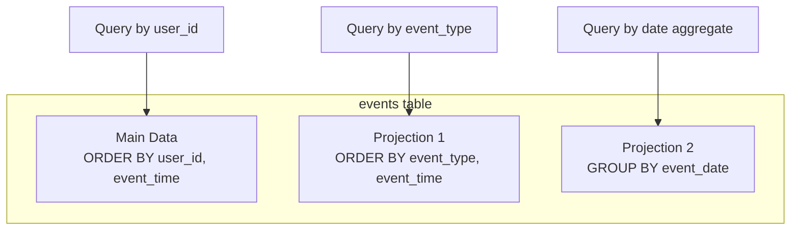

# How to Use ClickHouse Projections for Query Acceleration

Author: [nawazdhandala](https://www.github.com/nawazdhandala)

Tags: ClickHouse, Projections, Query Optimization, Performance, MergeTree, Indexing, Database, Analytics

Description: A practical guide to using ClickHouse projections to accelerate queries by storing pre-sorted and pre-aggregated data within the same table, covering projection design, use cases, and performance tuning.

---

Projections in ClickHouse allow you to store the same data in multiple sort orders within a single table. This enables fast queries on different access patterns without maintaining separate materialized views.

## Understanding Projections

### What Are Projections?



Projections are:
- Stored within the same table
- Automatically maintained on INSERT
- Automatically selected by the query optimizer

### Basic Projection Syntax

```sql
-- Create table with projection
CREATE TABLE events
(
    event_id UInt64,
    event_type LowCardinality(String),
    user_id UInt64,
    event_time DateTime,
    properties Map(String, String),

    -- Projection for queries by event_type
    PROJECTION events_by_type
    (
        SELECT *
        ORDER BY event_type, event_time
    )
)
ENGINE = MergeTree()
ORDER BY (user_id, event_time);
```

## Projection Types

### Normal Projection (Different Sort Order)

```sql
-- Main table sorted by user_id
CREATE TABLE events
(
    event_id UInt64,
    event_type String,
    user_id UInt64,
    event_time DateTime
)
ENGINE = MergeTree()
ORDER BY (user_id, event_time);

-- Add projection sorted by event_type
ALTER TABLE events ADD PROJECTION by_event_type
(
    SELECT * ORDER BY event_type, event_time
);

-- Materialize for existing data
ALTER TABLE events MATERIALIZE PROJECTION by_event_type;
```

### Aggregate Projection (Pre-Aggregated Data)

```sql
-- Add aggregating projection
ALTER TABLE events ADD PROJECTION hourly_stats
(
    SELECT
        toStartOfHour(event_time) AS hour,
        event_type,
        count() AS count,
        uniq(user_id) AS users
    GROUP BY hour, event_type
);

ALTER TABLE events MATERIALIZE PROJECTION hourly_stats;
```

## Creating Effective Projections

### Analyze Query Patterns

```sql
-- Find common query patterns
SELECT
    normalizeQuery(query) AS normalized,
    count() AS frequency,
    avg(query_duration_ms) AS avg_duration
FROM system.query_log
WHERE type = 'QueryFinish'
  AND event_date >= today() - 7
  AND query LIKE '%events%'
GROUP BY normalized
ORDER BY frequency DESC
LIMIT 20;
```

### Design Projections for Common Queries

```sql
-- If queries often filter by event_type
ALTER TABLE events ADD PROJECTION by_type
(
    SELECT * ORDER BY event_type, user_id, event_time
);

-- If queries aggregate by date
ALTER TABLE events ADD PROJECTION daily_summary
(
    SELECT
        toDate(event_time) AS date,
        event_type,
        count() AS events,
        uniq(user_id) AS users,
        uniq(session_id) AS sessions
    GROUP BY date, event_type
);
```

### Multiple Projections

```sql
CREATE TABLE events
(
    event_id UInt64,
    event_type LowCardinality(String),
    user_id UInt64,
    session_id String,
    country LowCardinality(String),
    event_time DateTime,

    -- For queries filtering by event_type
    PROJECTION by_type (
        SELECT * ORDER BY event_type, event_time
    ),

    -- For queries filtering by country
    PROJECTION by_country (
        SELECT * ORDER BY country, event_time
    ),

    -- For hourly aggregations
    PROJECTION hourly_agg (
        SELECT
            toStartOfHour(event_time) AS hour,
            event_type,
            country,
            count() AS cnt,
            uniq(user_id) AS users
        GROUP BY hour, event_type, country
    )
)
ENGINE = MergeTree()
ORDER BY (user_id, event_time);
```

## Verifying Projection Usage

### Check If Projection Is Used

```sql
-- EXPLAIN shows which projection is selected
EXPLAIN indexes = 1
SELECT count()
FROM events
WHERE event_type = 'click'
  AND event_time >= today() - 7;

-- Look for "Projection: by_type" in output
```

### Force Projection Selection

```sql
-- Disable projections for testing
SELECT count()
FROM events
WHERE event_type = 'click'
SETTINGS allow_experimental_projection_optimization = 0;

-- Compare with projection enabled
SELECT count()
FROM events
WHERE event_type = 'click'
SETTINGS allow_experimental_projection_optimization = 1;
```

### Monitor Projection Performance

```sql
-- Compare query times with/without projections
SELECT
    query,
    query_duration_ms,
    read_rows,
    read_bytes,
    Settings['allow_experimental_projection_optimization'] AS projections_enabled
FROM system.query_log
WHERE query LIKE '%events%'
  AND type = 'QueryFinish'
ORDER BY event_time DESC
LIMIT 20;
```

## Aggregate Projections

### Pre-Aggregation for Dashboards

```sql
-- Create table with aggregate projection
CREATE TABLE events
(
    event_id UInt64,
    event_type LowCardinality(String),
    user_id UInt64,
    revenue Decimal(18, 2),
    event_time DateTime,

    PROJECTION dashboard_agg
    (
        SELECT
            toStartOfHour(event_time) AS hour,
            event_type,
            count() AS events,
            uniq(user_id) AS users,
            sum(revenue) AS total_revenue
        GROUP BY hour, event_type
    )
)
ENGINE = MergeTree()
ORDER BY (user_id, event_time);

-- Queries automatically use the projection
SELECT
    toStartOfHour(event_time) AS hour,
    event_type,
    count() AS events,
    uniq(user_id) AS users
FROM events
WHERE event_time >= today() - 7
GROUP BY hour, event_type;
```

### State Functions in Projections

```sql
-- Use state functions for complex aggregations
ALTER TABLE events ADD PROJECTION complex_agg
(
    SELECT
        toStartOfDay(event_time) AS day,
        event_type,
        count() AS cnt,
        uniqState(user_id) AS users_state,
        quantileState(0.95)(response_time) AS p95_state
    GROUP BY day, event_type
);

-- Query merges states automatically
SELECT
    day,
    event_type,
    sum(cnt) AS events,
    uniqMerge(users_state) AS users,
    quantileMerge(0.95)(p95_state) AS p95_response
FROM events
WHERE event_time >= today() - 30
GROUP BY day, event_type;
```

## Managing Projections

### Add Projection to Existing Table

```sql
-- Add projection
ALTER TABLE events ADD PROJECTION new_projection
(
    SELECT * ORDER BY event_type, event_time
);

-- Materialize for existing data (runs in background)
ALTER TABLE events MATERIALIZE PROJECTION new_projection;

-- Check progress
SELECT
    table,
    mutation_id,
    command,
    parts_to_do,
    is_done
FROM system.mutations
WHERE table = 'events'
  AND command LIKE '%MATERIALIZE PROJECTION%';
```

### Remove Projection

```sql
-- Drop projection
ALTER TABLE events DROP PROJECTION old_projection;

-- Clear projection data
ALTER TABLE events CLEAR PROJECTION old_projection;
```

### Check Projection Status

```sql
-- List projections
SELECT
    name,
    type,
    expr
FROM system.projection_parts
WHERE table = 'events'
GROUP BY name, type, expr;

-- Projection storage size
SELECT
    name,
    sum(bytes_on_disk) AS bytes,
    formatReadableSize(sum(bytes_on_disk)) AS size
FROM system.projection_parts
WHERE table = 'events'
GROUP BY name;
```

## Performance Considerations

### Storage Overhead

```sql
-- Compare table size with projection overhead
SELECT
    'Main Data' AS type,
    formatReadableSize(sum(bytes_on_disk)) AS size
FROM system.parts
WHERE table = 'events' AND active

UNION ALL

SELECT
    concat('Projection: ', name) AS type,
    formatReadableSize(sum(bytes_on_disk)) AS size
FROM system.projection_parts
WHERE table = 'events'
GROUP BY name;
```

### Insert Performance

Projections add overhead to INSERTs:

```sql
-- Monitor insert performance
SELECT
    table,
    avg(query_duration_ms) AS avg_insert_ms,
    count() AS inserts
FROM system.query_log
WHERE type = 'QueryFinish'
  AND query_kind = 'Insert'
  AND table = 'events'
  AND event_date = today()
GROUP BY table;
```

### When to Use Projections vs Materialized Views

```markdown
Use Projections when:
- Different sort orders needed for same data
- Simple aggregations (count, sum, uniq)
- Automatic maintenance is important
- Storage overhead is acceptable

Use Materialized Views when:
- Complex transformations needed
- Different table engines required
- Need to store aggregations separately
- Independent TTL policies needed
```

## Best Practices

### Projection Design Guidelines

```sql
-- 1. Match projection to query patterns
-- Bad: Generic projection
PROJECTION generic (SELECT * ORDER BY event_time)

-- Good: Specific to query pattern
PROJECTION by_type_time (
    SELECT * ORDER BY event_type, event_time
)

-- 2. Include only needed columns
-- Instead of SELECT *
PROJECTION efficient (
    SELECT event_type, user_id, event_time
    ORDER BY event_type, event_time
)

-- 3. Use appropriate aggregation granularity
PROJECTION hourly (
    SELECT
        toStartOfHour(event_time) AS hour,
        event_type,
        count() AS cnt
    GROUP BY hour, event_type
)
```

### Monitoring

```sql
-- Create monitoring query
SELECT
    database,
    table,
    name AS projection,
    sum(rows) AS rows,
    formatReadableSize(sum(bytes_on_disk)) AS size,
    count() AS parts
FROM system.projection_parts
WHERE active
GROUP BY database, table, name
ORDER BY sum(bytes_on_disk) DESC;
```

---

Projections provide a powerful way to accelerate queries without maintaining separate tables. Design projections based on actual query patterns, monitor their storage overhead, and verify they're being used with EXPLAIN. For complex scenarios requiring different engines or TTL policies, materialized views remain the better choice.
