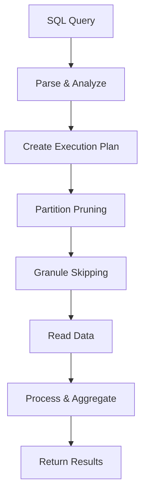

# How to Optimize ClickHouse Queries for Better Performance

Author: [nawazdhandala](https://www.github.com/nawazdhandala)

Tags: ClickHouse, Query Optimization, Performance, Database, EXPLAIN, Profiling, Analytics, Tuning

Description: A comprehensive guide to optimizing ClickHouse query performance, covering EXPLAIN analysis, query profiling, common anti-patterns, and practical optimization techniques that can speed up queries by 10-100x.

---

ClickHouse is fast by default, but poorly written queries can still be slow. The difference between a query that scans 10GB and one that scans 100MB is often just knowing which columns to filter first. This guide covers how to identify slow queries and make them fast.

## Understanding Query Execution

Before optimizing, understand how ClickHouse processes queries:



Key concepts:
- **Partitions**: Large chunks of data (usually by time)
- **Parts**: Physical files within partitions
- **Granules**: Smallest units of data read (default 8192 rows)
- **Primary Key (ORDER BY)**: Determines data ordering and granule skipping

## Using EXPLAIN for Query Analysis

### EXPLAIN Types

ClickHouse offers several EXPLAIN variants:

```sql
-- Show query execution plan
EXPLAIN SELECT * FROM events WHERE user_id = 123;

-- Show detailed plan with settings
EXPLAIN PLAN SELECT * FROM events WHERE user_id = 123;

-- Show query pipeline (execution steps)
EXPLAIN PIPELINE SELECT * FROM events WHERE user_id = 123;

-- Show estimated rows and costs
EXPLAIN ESTIMATE SELECT * FROM events WHERE user_id = 123;

-- Show Abstract Syntax Tree
EXPLAIN AST SELECT * FROM events WHERE user_id = 123;
```

### Reading EXPLAIN Output

```sql
EXPLAIN
SELECT user_id, count()
FROM events
WHERE event_type = 'click' AND created_at > '2024-01-01'
GROUP BY user_id;
```

Output interpretation:
```
Expression ((Projection + Before ORDER BY))
  Aggregating
    Expression (Before GROUP BY)
      Filter (WHERE)
        ReadFromMergeTree (default.events)
        Indexes:
          PrimaryKey
            Keys: event_type, created_at
            Condition: (event_type = 'click') AND (created_at > '2024-01-01')
            Parts: 5/100
            Granules: 150/10000
```

Key metrics:
- **Parts: 5/100** means only 5 of 100 parts need scanning
- **Granules: 150/10000** means only 150 of 10000 granules are read
- Lower ratios mean better partition/granule pruning

### EXPLAIN ESTIMATE for Cost Analysis

```sql
EXPLAIN ESTIMATE
SELECT user_id, count()
FROM events
WHERE event_type = 'click'
GROUP BY user_id;
```

Shows estimated bytes, rows, and parts to read.

## Query Profiling

### Enable Query Logging

Check query performance in system tables:

```sql
-- Find slow queries
SELECT
    query,
    query_duration_ms,
    read_rows,
    read_bytes,
    result_rows,
    memory_usage
FROM system.query_log
WHERE type = 'QueryFinish'
  AND query_duration_ms > 1000  -- Queries over 1 second
ORDER BY query_duration_ms DESC
LIMIT 20;
```

### Real-Time Query Analysis

```sql
-- See currently running queries
SELECT
    query_id,
    user,
    query,
    elapsed,
    read_rows,
    memory_usage
FROM system.processes;

-- Profile a specific query
SET log_queries = 1;
SET send_logs_level = 'trace';

SELECT count() FROM events WHERE user_id = 123;
```

### Per-Query Profiling

```sql
-- Get detailed stats for a query
SELECT
    ProfileEvents['SelectedParts'] AS parts_selected,
    ProfileEvents['SelectedRanges'] AS ranges_selected,
    ProfileEvents['SelectedMarks'] AS marks_selected,
    ProfileEvents['SelectedRows'] AS rows_selected,
    ProfileEvents['SelectedBytes'] AS bytes_selected
FROM system.query_log
WHERE query_id = 'your-query-id';
```

## Common Optimization Techniques

### 1. Filter on ORDER BY Columns First

The ORDER BY clause determines physical data layout. Filter on those columns:

```sql
-- Table ordered by (event_type, user_id, created_at)

-- SLOW: Filters on column not in ORDER BY prefix
SELECT * FROM events WHERE user_id = 123;

-- FAST: Filters on first ORDER BY column
SELECT * FROM events WHERE event_type = 'click' AND user_id = 123;
```

### 2. Use Proper Partition Pruning

```sql
-- Table partitioned by toYYYYMM(created_at)

-- SLOW: No partition pruning (scans all partitions)
SELECT * FROM events WHERE toDate(created_at) = '2024-01-15';

-- FAST: Explicit partition filter
SELECT * FROM events
WHERE created_at >= '2024-01-01' AND created_at < '2024-02-01';
```

### 3. Avoid SELECT *

Read only columns you need:

```sql
-- SLOW: Reads all columns
SELECT * FROM events WHERE event_type = 'click' LIMIT 100;

-- FAST: Reads only needed columns
SELECT user_id, created_at FROM events WHERE event_type = 'click' LIMIT 100;
```

### 4. Use PREWHERE for Heavy Filters

PREWHERE filters before reading other columns:

```sql
-- Automatically optimized by ClickHouse usually
SELECT * FROM events WHERE user_id = 123;

-- Explicit PREWHERE for control
SELECT * FROM events PREWHERE user_id = 123 WHERE properties['page'] = 'home';
```

PREWHERE works best when:
- Filter is very selective (filters out most rows)
- Filter column is small relative to total row size

### 5. Optimize GROUP BY Order

Put low-cardinality columns first:

```sql
-- SLOWER: High cardinality first
SELECT country, city, count()
FROM events
GROUP BY city, country;

-- FASTER: Low cardinality first
SELECT country, city, count()
FROM events
GROUP BY country, city;
```

### 6. Use LowCardinality Effectively

```sql
-- Check if column benefits from LowCardinality
SELECT uniq(event_type) FROM events;  -- If < 10000, use LowCardinality

-- LowCardinality columns are faster to filter and group
SELECT event_type, count() FROM events GROUP BY event_type;
```

### 7. Limit JOIN Complexity

JOINs can be expensive. Optimize them:

```sql
-- SLOW: Large table on right side of JOIN
SELECT *
FROM small_table s
JOIN large_table l ON s.id = l.id;

-- FASTER: Small table on right side
SELECT *
FROM large_table l
JOIN small_table s ON l.id = s.id;

-- EVEN FASTER: Use dictionary for lookups
SELECT
    event_id,
    dictGet('users_dict', 'name', user_id) AS user_name
FROM events;
```

### 8. Use Sampling for Approximate Results

```sql
-- Full table scan for exact count
SELECT count() FROM events WHERE event_type = 'click';

-- Sampled query (much faster for estimates)
SELECT count() * 10 FROM events SAMPLE 0.1 WHERE event_type = 'click';

-- With minimum rows guarantee
SELECT count() * 10 FROM events SAMPLE 10000 WHERE event_type = 'click';
```

### 9. Parallelize with FINAL Alternatives

```sql
-- SLOW: FINAL forces single-threaded execution
SELECT * FROM users FINAL WHERE user_id = 123;

-- FASTER: Use aggregation instead
SELECT
    user_id,
    argMax(name, updated_at) AS name,
    argMax(email, updated_at) AS email
FROM users
WHERE user_id = 123
GROUP BY user_id;
```

### 10. Materialize Computed Columns

```sql
-- SLOW: Computing hash every query
SELECT cityHash64(user_id) % 100 AS bucket, count()
FROM events
GROUP BY bucket;

-- FAST: Materialized column computed at insert time
ALTER TABLE events ADD COLUMN user_bucket UInt8
MATERIALIZED cityHash64(user_id) % 100;

SELECT user_bucket, count()
FROM events
GROUP BY user_bucket;
```

## Analyzing and Fixing Slow Queries

### Step 1: Identify the Bottleneck

```sql
-- Run query with profiling
SELECT
    query,
    read_rows,
    read_bytes,
    result_rows,
    query_duration_ms,
    memory_usage
FROM system.query_log
WHERE query_id = 'your-query-id'
FORMAT Vertical;
```

Check ratios:
- High `read_rows` vs low `result_rows`: Need better filtering
- High `read_bytes`: Reading too many columns
- High `memory_usage`: Complex aggregations or JOINs

### Step 2: Check Index Usage

```sql
EXPLAIN indexes = 1
SELECT * FROM events WHERE user_id = 123;
```

Look for:
- Parts/Granules ratio (lower is better)
- Whether primary key is being used
- Which skip indexes are applied

### Step 3: Compare Query Plans

```sql
-- Original query
EXPLAIN ESTIMATE SELECT * FROM events WHERE user_id = 123;

-- Optimized query
EXPLAIN ESTIMATE SELECT * FROM events WHERE event_type = 'click' AND user_id = 123;
```

## Settings for Query Optimization

### Memory Settings

```sql
-- Increase memory limit for complex queries
SET max_memory_usage = 20000000000;  -- 20GB

-- Allow spilling to disk for large aggregations
SET max_bytes_before_external_group_by = 10000000000;
SET max_bytes_before_external_sort = 10000000000;
```

### Parallelism Settings

```sql
-- More threads for faster queries
SET max_threads = 16;

-- More streams for reading
SET max_streams_for_merge_tree_reading = 16;
```

### Query Optimization Settings

```sql
-- Force index usage analysis
SET force_index_by_date = 1;
SET force_primary_key = 1;

-- Optimize JOINs
SET join_algorithm = 'hash';  -- or 'partial_merge', 'direct'

-- Allow query optimization
SET optimize_move_to_prewhere = 1;
SET optimize_substitute_columns = 1;
```

## Real-World Optimization Examples

### Example 1: Dashboard Query

Before:
```sql
-- 15 seconds
SELECT
    toStartOfDay(created_at) AS day,
    event_type,
    count() AS events
FROM events
WHERE created_at >= today() - 30
GROUP BY day, event_type
ORDER BY day;
```

After:
```sql
-- 0.5 seconds
SELECT
    toStartOfDay(created_at) AS day,
    event_type,
    count() AS events
FROM events
WHERE created_at >= today() - 30
GROUP BY event_type, day  -- Reordered for low cardinality first
ORDER BY day
SETTINGS optimize_aggregation_in_order = 1;
```

### Example 2: User Lookup

Before:
```sql
-- 8 seconds (full table scan)
SELECT * FROM events WHERE user_id = 12345 LIMIT 100;
```

After: Restructure ORDER BY or add skip index:
```sql
-- Add bloom filter index
ALTER TABLE events ADD INDEX idx_user_id user_id TYPE bloom_filter GRANULARITY 4;

-- Or if user lookups are common, change ORDER BY
-- ORDER BY (user_id, created_at)

-- 0.1 seconds
SELECT * FROM events WHERE user_id = 12345 LIMIT 100;
```

### Example 3: Aggregation with Filtering

Before:
```sql
-- 30 seconds
SELECT
    user_id,
    countIf(event_type = 'purchase') AS purchases,
    sumIf(amount, event_type = 'purchase') AS revenue
FROM events
WHERE created_at >= '2024-01-01'
GROUP BY user_id
HAVING purchases > 0;
```

After:
```sql
-- 3 seconds
SELECT
    user_id,
    count() AS purchases,
    sum(amount) AS revenue
FROM events
WHERE event_type = 'purchase'  -- Filter before aggregation
  AND created_at >= '2024-01-01'
GROUP BY user_id;
```

## Monitoring Query Performance

### Set Up Alerts

```sql
-- Find queries that need optimization
SELECT
    normalizeQuery(query) AS normalized_query,
    count() AS execution_count,
    avg(query_duration_ms) AS avg_duration,
    max(query_duration_ms) AS max_duration,
    avg(read_bytes) AS avg_bytes_read
FROM system.query_log
WHERE type = 'QueryFinish'
  AND event_time > now() - INTERVAL 1 DAY
GROUP BY normalized_query
HAVING avg_duration > 1000
ORDER BY execution_count * avg_duration DESC
LIMIT 20;
```

### Track Query Patterns

```sql
-- Identify most expensive query patterns
SELECT
    normalizeQuery(query) AS pattern,
    sum(read_bytes) AS total_bytes,
    sum(query_duration_ms) AS total_time,
    count() AS executions
FROM system.query_log
WHERE type = 'QueryFinish'
  AND event_time > now() - INTERVAL 1 DAY
GROUP BY pattern
ORDER BY total_bytes DESC
LIMIT 10;
```

---

Query optimization in ClickHouse comes down to reading less data: fewer partitions, fewer granules, fewer columns. Use EXPLAIN to understand what ClickHouse is doing, filter on ORDER BY columns, and monitor the query log for patterns. A well-optimized query can be 100x faster than a naive one.
