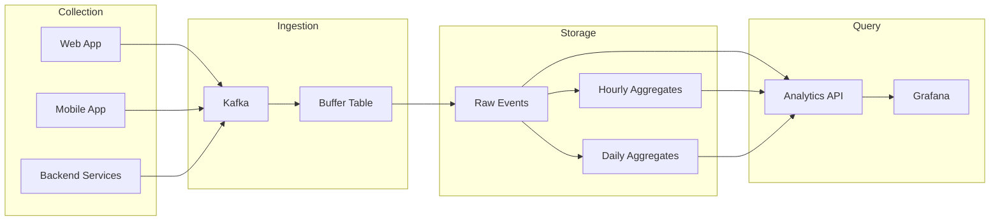

# How to Build a Real-Time Analytics Dashboard with ClickHouse

Author: [nawazdhandala](https://www.github.com/nawazdhandala)

Tags: ClickHouse, Analytics, Real-Time, Dashboard, Architecture, Data Pipeline, Visualization, Performance

Description: An end-to-end guide to building a real-time analytics dashboard with ClickHouse, covering data pipeline architecture, ingestion patterns, query optimization, and frontend integration for sub-second analytics.

---

Building a real-time analytics dashboard requires fast data ingestion, efficient storage, and sub-second query performance. ClickHouse excels at all three. This guide walks through building a complete analytics system from data collection to visualization.

## Architecture Overview



## Data Model Design

### Event Schema

```sql
-- Raw events table
CREATE TABLE events
(
    -- Event identification
    event_id UUID DEFAULT generateUUIDv4(),
    event_type LowCardinality(String),
    event_name String,

    -- User context
    user_id UInt64,
    session_id String,
    anonymous_id String,

    -- Device/client info
    device_type LowCardinality(String),
    os LowCardinality(String),
    browser LowCardinality(String),
    country LowCardinality(String),

    -- Event data
    properties Map(String, String),

    -- Timestamps
    event_time DateTime64(3),
    server_time DateTime64(3) DEFAULT now64(3),

    -- Partitioning and ordering
    event_date Date DEFAULT toDate(event_time)
)
ENGINE = MergeTree()
PARTITION BY toYYYYMM(event_date)
ORDER BY (event_type, user_id, event_time)
TTL event_date + INTERVAL 90 DAY;
```

### Materialized Views for Aggregations

```sql
-- Hourly aggregates for dashboards
CREATE MATERIALIZED VIEW events_hourly_mv
ENGINE = SummingMergeTree()
PARTITION BY toYYYYMM(hour)
ORDER BY (hour, event_type, country, device_type)
AS SELECT
    toStartOfHour(event_time) AS hour,
    event_type,
    country,
    device_type,
    count() AS event_count,
    uniqState(user_id) AS users_state,
    uniqState(session_id) AS sessions_state
FROM events
GROUP BY hour, event_type, country, device_type;

-- Daily aggregates for trends
CREATE MATERIALIZED VIEW events_daily_mv
ENGINE = SummingMergeTree()
PARTITION BY toYYYYMM(day)
ORDER BY (day, event_type)
AS SELECT
    toDate(event_time) AS day,
    event_type,
    count() AS event_count,
    uniqState(user_id) AS users_state,
    uniqState(session_id) AS sessions_state
FROM events
GROUP BY day, event_type;
```

### User Sessions Table

```sql
-- Session tracking
CREATE TABLE sessions
(
    session_id String,
    user_id UInt64,
    started_at DateTime64(3),
    ended_at DateTime64(3),
    duration_seconds UInt32,
    page_views UInt16,
    events UInt16,
    country LowCardinality(String),
    device_type LowCardinality(String),
    entry_page String,
    exit_page String
)
ENGINE = ReplacingMergeTree(ended_at)
PARTITION BY toYYYYMM(started_at)
ORDER BY (user_id, session_id);
```

## Data Ingestion Pipeline

### Kafka Integration

```sql
-- Kafka consumer table
CREATE TABLE events_kafka
(
    event_id UUID,
    event_type String,
    event_name String,
    user_id UInt64,
    session_id String,
    anonymous_id String,
    device_type String,
    os String,
    browser String,
    country String,
    properties String,
    event_time DateTime64(3)
)
ENGINE = Kafka()
SETTINGS
    kafka_broker_list = 'kafka:9092',
    kafka_topic_list = 'events',
    kafka_group_name = 'clickhouse_events',
    kafka_format = 'JSONEachRow',
    kafka_num_consumers = 4;

-- Materialized view to move data from Kafka to events table
CREATE MATERIALIZED VIEW events_kafka_mv TO events AS
SELECT
    event_id,
    event_type,
    event_name,
    user_id,
    session_id,
    anonymous_id,
    device_type,
    os,
    browser,
    country,
    JSONExtract(properties, 'Map(String, String)') AS properties,
    event_time
FROM events_kafka;
```

### Async Insert Buffer

```sql
-- Enable async inserts for high-throughput
-- In users.xml or via SQL
ALTER USER analytics_writer SETTINGS
    async_insert = 1,
    async_insert_max_data_size = 10000000,
    async_insert_busy_timeout_ms = 1000;
```

### Direct HTTP Insert

```python
# Python ingestion example
import clickhouse_connect
from datetime import datetime
import json

client = clickhouse_connect.get_client(
    host='clickhouse',
    port=8123,
    username='analytics_writer',
    password='secret'
)

def track_event(event_type, user_id, properties=None):
    client.insert('events', [[
        None,  # event_id (auto-generated)
        event_type,
        properties.get('name', '') if properties else '',
        user_id,
        properties.get('session_id', '') if properties else '',
        '',  # anonymous_id
        properties.get('device_type', 'web') if properties else 'web',
        properties.get('os', '') if properties else '',
        properties.get('browser', '') if properties else '',
        properties.get('country', '') if properties else '',
        properties or {},
        datetime.utcnow()
    ]], column_names=[
        'event_id', 'event_type', 'event_name', 'user_id',
        'session_id', 'anonymous_id', 'device_type', 'os',
        'browser', 'country', 'properties', 'event_time'
    ])
```

## Analytics API

### FastAPI Backend

```python
from fastapi import FastAPI, Query
from datetime import datetime, timedelta
import clickhouse_connect

app = FastAPI()
client = clickhouse_connect.get_client(host='clickhouse')

@app.get("/api/metrics/overview")
async def get_overview(
    start: datetime = Query(default=None),
    end: datetime = Query(default=None)
):
    if not start:
        start = datetime.utcnow() - timedelta(days=7)
    if not end:
        end = datetime.utcnow()

    result = client.query("""
        SELECT
            count() AS total_events,
            uniqExact(user_id) AS unique_users,
            uniqExact(session_id) AS sessions
        FROM events
        WHERE event_time BETWEEN %(start)s AND %(end)s
    """, parameters={'start': start, 'end': end})

    row = result.first_row
    return {
        'total_events': row[0],
        'unique_users': row[1],
        'sessions': row[2]
    }

@app.get("/api/metrics/timeseries")
async def get_timeseries(
    start: datetime = Query(default=None),
    end: datetime = Query(default=None),
    interval: str = Query(default='hour')
):
    if not start:
        start = datetime.utcnow() - timedelta(days=7)
    if not end:
        end = datetime.utcnow()

    interval_func = {
        'minute': 'toStartOfMinute',
        'hour': 'toStartOfHour',
        'day': 'toStartOfDay'
    }.get(interval, 'toStartOfHour')

    result = client.query(f"""
        SELECT
            {interval_func}(event_time) AS time,
            count() AS events,
            uniqExact(user_id) AS users
        FROM events
        WHERE event_time BETWEEN %(start)s AND %(end)s
        GROUP BY time
        ORDER BY time
    """, parameters={'start': start, 'end': end})

    return [
        {'time': row[0].isoformat(), 'events': row[1], 'users': row[2]}
        for row in result.result_rows
    ]

@app.get("/api/metrics/top-events")
async def get_top_events(
    start: datetime = Query(default=None),
    end: datetime = Query(default=None),
    limit: int = Query(default=10)
):
    if not start:
        start = datetime.utcnow() - timedelta(days=7)
    if not end:
        end = datetime.utcnow()

    result = client.query("""
        SELECT
            event_type,
            count() AS count,
            uniqExact(user_id) AS users
        FROM events
        WHERE event_time BETWEEN %(start)s AND %(end)s
        GROUP BY event_type
        ORDER BY count DESC
        LIMIT %(limit)s
    """, parameters={'start': start, 'end': end, 'limit': limit})

    return [
        {'event_type': row[0], 'count': row[1], 'users': row[2]}
        for row in result.result_rows
    ]
```

## Real-Time Query Patterns

### Live Event Feed

```sql
-- Recent events with low latency
SELECT
    event_time,
    event_type,
    user_id,
    properties
FROM events
WHERE event_time >= now() - INTERVAL 5 MINUTE
ORDER BY event_time DESC
LIMIT 100
SETTINGS max_threads = 2;
```

### Rolling Metrics

```sql
-- Last 5 minutes vs previous 5 minutes
SELECT
    sumIf(1, event_time >= now() - INTERVAL 5 MINUTE) AS current,
    sumIf(1, event_time >= now() - INTERVAL 10 MINUTE
           AND event_time < now() - INTERVAL 5 MINUTE) AS previous,
    round((current - previous) / previous * 100, 2) AS change_pct
FROM events
WHERE event_time >= now() - INTERVAL 10 MINUTE;
```

### Active Users

```sql
-- Real-time active users
SELECT uniqExact(user_id) AS active_users
FROM events
WHERE event_time >= now() - INTERVAL 5 MINUTE;

-- Active users by minute for last hour
SELECT
    toStartOfMinute(event_time) AS minute,
    uniqExact(user_id) AS active_users
FROM events
WHERE event_time >= now() - INTERVAL 1 HOUR
GROUP BY minute
ORDER BY minute;
```

## Frontend Dashboard

### React Dashboard Component

```typescript
// Dashboard.tsx
import React, { useEffect, useState } from 'react';
import { LineChart, Line, XAxis, YAxis, Tooltip } from 'recharts';

interface TimeSeriesData {
  time: string;
  events: number;
  users: number;
}

interface Overview {
  total_events: number;
  unique_users: number;
  sessions: number;
}

export function Dashboard() {
  const [overview, setOverview] = useState<Overview | null>(null);
  const [timeseries, setTimeseries] = useState<TimeSeriesData[]>([]);

  useEffect(() => {
    // Fetch data on mount and every 30 seconds
    const fetchData = async () => {
      const [overviewRes, timeseriesRes] = await Promise.all([
        fetch('/api/metrics/overview'),
        fetch('/api/metrics/timeseries?interval=hour')
      ]);

      setOverview(await overviewRes.json());
      setTimeseries(await timeseriesRes.json());
    };

    fetchData();
    const interval = setInterval(fetchData, 30000);
    return () => clearInterval(interval);
  }, []);

  return (
    <div className="dashboard">
      <div className="metrics-row">
        <MetricCard title="Total Events" value={overview?.total_events} />
        <MetricCard title="Unique Users" value={overview?.unique_users} />
        <MetricCard title="Sessions" value={overview?.sessions} />
      </div>

      <div className="chart">
        <h3>Events Over Time</h3>
        <LineChart width={800} height={300} data={timeseries}>
          <XAxis dataKey="time" />
          <YAxis />
          <Tooltip />
          <Line type="monotone" dataKey="events" stroke="#8884d8" />
          <Line type="monotone" dataKey="users" stroke="#82ca9d" />
        </LineChart>
      </div>
    </div>
  );
}

function MetricCard({ title, value }: { title: string; value?: number }) {
  return (
    <div className="metric-card">
      <h4>{title}</h4>
      <p className="value">{value?.toLocaleString() ?? '-'}</p>
    </div>
  );
}
```

### WebSocket for Real-Time Updates

```python
# WebSocket endpoint for live updates
from fastapi import WebSocket
import asyncio

@app.websocket("/ws/live-metrics")
async def websocket_endpoint(websocket: WebSocket):
    await websocket.accept()

    while True:
        # Query current metrics
        result = client.query("""
            SELECT
                count() AS events_last_minute,
                uniqExact(user_id) AS users_last_minute
            FROM events
            WHERE event_time >= now() - INTERVAL 1 MINUTE
        """)

        row = result.first_row
        await websocket.send_json({
            'events': row[0],
            'users': row[1],
            'timestamp': datetime.utcnow().isoformat()
        })

        await asyncio.sleep(5)  # Update every 5 seconds
```

## Performance Optimization

### Query Caching

```sql
-- Enable query cache for dashboard queries
SELECT
    toStartOfHour(event_time) AS time,
    count() AS events
FROM events
WHERE event_time >= now() - INTERVAL 24 HOUR
GROUP BY time
ORDER BY time
SETTINGS use_query_cache = 1, query_cache_ttl = 60;
```

### Sampling for Overview

```sql
-- Use sampling for approximate counts on large tables
SELECT
    count() * 100 AS estimated_events,
    uniq(user_id) * 100 AS estimated_users
FROM events SAMPLE 0.01
WHERE event_time >= now() - INTERVAL 7 DAY;
```

### Projection for Common Queries

```sql
-- Add projection for dashboard queries
ALTER TABLE events ADD PROJECTION dashboard_projection (
    SELECT
        toStartOfHour(event_time) AS hour,
        event_type,
        country,
        count() AS cnt,
        uniqState(user_id) AS users
    GROUP BY hour, event_type, country
);

ALTER TABLE events MATERIALIZE PROJECTION dashboard_projection;
```

## Monitoring the Dashboard

### Query Performance

```sql
-- Monitor dashboard query performance
SELECT
    query,
    query_duration_ms,
    read_rows,
    read_bytes,
    memory_usage
FROM system.query_log
WHERE type = 'QueryFinish'
  AND query LIKE '%events%'
  AND event_date = today()
ORDER BY query_duration_ms DESC
LIMIT 20;
```

### Resource Usage

```sql
-- Monitor concurrent queries
SELECT
    toStartOfMinute(event_time) AS minute,
    max(concurrent_queries) AS peak_concurrent
FROM (
    SELECT
        event_time,
        count() OVER (
            ORDER BY event_time
            RANGE BETWEEN INTERVAL 1 MINUTE PRECEDING AND CURRENT ROW
        ) AS concurrent_queries
    FROM system.query_log
    WHERE type = 'QueryStart'
      AND event_date = today()
)
GROUP BY minute
ORDER BY minute;
```

---

Building a real-time analytics dashboard with ClickHouse involves designing an efficient schema, setting up reliable data ingestion, creating materialized views for pre-aggregation, and optimizing queries for sub-second response times. Start with the raw events table, add materialized views as query patterns emerge, and monitor performance to maintain fast dashboard loading times.
