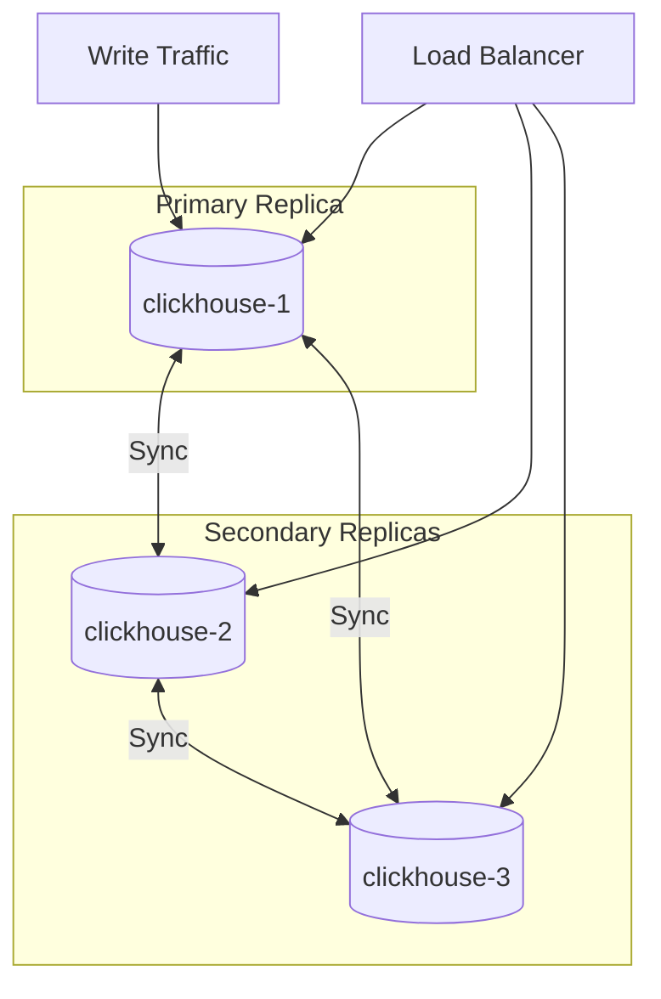
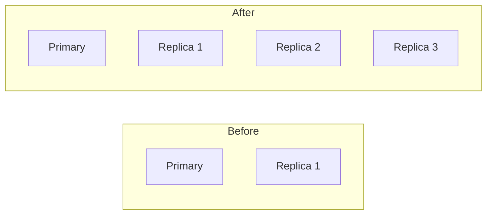

# How to Scale ClickHouse Reads with Replicas

Author: [nawazdhandala](https://www.github.com/nawazdhandala)

Tags: ClickHouse, Replication, Scaling, High Availability, Database, Performance, Read Scaling, Load Balancing

Description: A practical guide to scaling ClickHouse read performance using replicas, covering replica configuration, load balancing strategies, read-write splitting, and query routing for high-throughput analytics workloads.

---

As your analytics workload grows, a single ClickHouse node may not handle all the read traffic. Replicas provide both high availability and read scaling. This guide covers how to configure and use replicas to scale your read throughput.

## Replica Architecture



## Setting Up Replicas

### Prerequisites: ZooKeeper/Keeper

```xml
<!-- /etc/clickhouse-server/config.d/zookeeper.xml -->
<clickhouse>
    <zookeeper>
        <node>
            <host>zookeeper-1</host>
            <port>2181</port>
        </node>
        <node>
            <host>zookeeper-2</host>
            <port>2181</port>
        </node>
        <node>
            <host>zookeeper-3</host>
            <port>2181</port>
        </node>
    </zookeeper>
</clickhouse>
```

### Create Replicated Tables

```sql
-- On replica 1
CREATE TABLE events
(
    event_id UInt64,
    event_type String,
    user_id UInt64,
    event_time DateTime
)
ENGINE = ReplicatedMergeTree(
    '/clickhouse/tables/01/events',  -- ZK path
    'replica_1'                       -- Replica name
)
PARTITION BY toYYYYMM(event_time)
ORDER BY (user_id, event_time);

-- On replica 2
CREATE TABLE events
(
    event_id UInt64,
    event_type String,
    user_id UInt64,
    event_time DateTime
)
ENGINE = ReplicatedMergeTree(
    '/clickhouse/tables/01/events',  -- Same ZK path
    'replica_2'                       -- Different replica name
)
PARTITION BY toYYYYMM(event_time)
ORDER BY (user_id, event_time);

-- On replica 3
CREATE TABLE events
(
    event_id UInt64,
    event_type String,
    user_id UInt64,
    event_time DateTime
)
ENGINE = ReplicatedMergeTree(
    '/clickhouse/tables/01/events',
    'replica_3'
)
PARTITION BY toYYYYMM(event_time)
ORDER BY (user_id, event_time);
```

### Using Macros for Easier Configuration

```xml
<!-- /etc/clickhouse-server/config.d/macros.xml -->
<!-- On clickhouse-1 -->
<clickhouse>
    <macros>
        <shard>01</shard>
        <replica>replica_1</replica>
    </macros>
</clickhouse>

<!-- On clickhouse-2 -->
<clickhouse>
    <macros>
        <shard>01</shard>
        <replica>replica_2</replica>
    </macros>
</clickhouse>
```

```sql
-- Same CREATE TABLE on all nodes
CREATE TABLE events
(
    event_id UInt64,
    event_type String,
    user_id UInt64,
    event_time DateTime
)
ENGINE = ReplicatedMergeTree(
    '/clickhouse/tables/{shard}/events',
    '{replica}'
)
PARTITION BY toYYYYMM(event_time)
ORDER BY (user_id, event_time);
```

## Load Balancing Strategies

### Application-Level Load Balancing

```python
# Python example with round-robin
import clickhouse_connect
from itertools import cycle

hosts = ['clickhouse-1', 'clickhouse-2', 'clickhouse-3']
host_cycle = cycle(hosts)

def get_client():
    host = next(host_cycle)
    return clickhouse_connect.get_client(host=host)

# Each query goes to different replica
for query in queries:
    client = get_client()
    result = client.query(query)
```

### HAProxy Load Balancing

```haproxy
# /etc/haproxy/haproxy.cfg
frontend clickhouse_http
    bind *:8123
    default_backend clickhouse_replicas

frontend clickhouse_native
    bind *:9000
    default_backend clickhouse_replicas_native

backend clickhouse_replicas
    balance roundrobin
    option httpchk GET /ping
    http-check expect status 200

    server ch1 clickhouse-1:8123 check inter 3s fall 3 rise 2
    server ch2 clickhouse-2:8123 check inter 3s fall 3 rise 2
    server ch3 clickhouse-3:8123 check inter 3s fall 3 rise 2

backend clickhouse_replicas_native
    balance roundrobin
    option tcp-check

    server ch1 clickhouse-1:9000 check inter 3s fall 3 rise 2
    server ch2 clickhouse-2:9000 check inter 3s fall 3 rise 2
    server ch3 clickhouse-3:9000 check inter 3s fall 3 rise 2
```

### Nginx Load Balancing

```nginx
# /etc/nginx/nginx.conf
upstream clickhouse {
    least_conn;  # Send to least busy server

    server clickhouse-1:8123 weight=1;
    server clickhouse-2:8123 weight=1;
    server clickhouse-3:8123 weight=1;
}

server {
    listen 8123;

    location / {
        proxy_pass http://clickhouse;
        proxy_connect_timeout 10s;
        proxy_read_timeout 300s;
    }
}
```

### Kubernetes Service

```yaml
apiVersion: v1
kind: Service
metadata:
  name: clickhouse-read
spec:
  type: ClusterIP
  selector:
    app: clickhouse
  ports:
    - name: http
      port: 8123
      targetPort: 8123
    - name: native
      port: 9000
      targetPort: 9000
  sessionAffinity: None  # Round-robin across pods
```

## Read-Write Splitting

### Write to Primary, Read from Any

```python
# Python implementation
class ClickHouseCluster:
    def __init__(self):
        self.write_host = 'clickhouse-1'
        self.read_hosts = ['clickhouse-1', 'clickhouse-2', 'clickhouse-3']
        self.read_index = 0

    def get_write_client(self):
        return clickhouse_connect.get_client(host=self.write_host)

    def get_read_client(self):
        host = self.read_hosts[self.read_index]
        self.read_index = (self.read_index + 1) % len(self.read_hosts)
        return clickhouse_connect.get_client(host=host)

    def insert(self, table, data):
        client = self.get_write_client()
        client.insert(table, data)

    def query(self, sql):
        client = self.get_read_client()
        return client.query(sql)
```

### Weighted Read Distribution

```python
# More reads to powerful replicas
import random

read_weights = {
    'clickhouse-1': 1,  # Primary, also handles writes
    'clickhouse-2': 2,  # Dedicated read replica
    'clickhouse-3': 2,  # Dedicated read replica
}

def get_read_host():
    hosts = []
    for host, weight in read_weights.items():
        hosts.extend([host] * weight)
    return random.choice(hosts)
```

## Query Routing Settings

### Prefer Localhost

```sql
-- Route to local replica when possible
SET prefer_localhost_replica = 1;

-- Useful in distributed queries to reduce network
SELECT * FROM distributed_table
SETTINGS prefer_localhost_replica = 1;
```

### Load Balancing for Distributed Queries

```sql
-- Random selection (default)
SET load_balancing = 'random';

-- Round-robin
SET load_balancing = 'round_robin';

-- Nearest hostname (good for geo-distributed)
SET load_balancing = 'nearest_hostname';

-- First available (for failover)
SET load_balancing = 'first_or_random';

-- Prefer in-order (respects config order)
SET load_balancing = 'in_order';
```

### Parallel Replicas

```sql
-- Use multiple replicas for single query
SET max_parallel_replicas = 3;
SET parallel_replicas_mode = 'read_tasks';

-- Query parts across all replicas simultaneously
SELECT user_id, count()
FROM events
GROUP BY user_id
SETTINGS
    max_parallel_replicas = 3,
    parallel_replicas_mode = 'read_tasks';
```

## Handling Replica Lag

### Check Replication Status

```sql
-- Check replica lag
SELECT
    database,
    table,
    replica_name,
    is_leader,
    absolute_delay,
    queue_size,
    inserts_in_queue,
    merges_in_queue
FROM system.replicas;

-- Alert on lag > 60 seconds
SELECT *
FROM system.replicas
WHERE absolute_delay > 60;
```

### Read from Synced Replicas Only

```sql
-- Wait for replica to sync before reading
SET select_sequential_consistency = 1;

-- Or specify maximum lag tolerance
SET max_replica_delay_for_distributed_queries = 10;  -- seconds
```

### Handling Stale Reads

```sql
-- Skip lagging replicas
SET fallback_to_stale_replicas_for_distributed_queries = 0;

-- Accept slightly stale data (default)
SET fallback_to_stale_replicas_for_distributed_queries = 1;
SET max_replica_delay_for_distributed_queries = 300;
```

## Monitoring Replica Performance

### Per-Replica Query Metrics

```sql
-- Queries per replica
SELECT
    hostName() AS replica,
    count() AS queries,
    avg(query_duration_ms) AS avg_duration_ms,
    quantile(0.95)(query_duration_ms) AS p95_duration_ms,
    sum(read_rows) AS total_rows_read
FROM clusterAllReplicas('my_cluster', system.query_log)
WHERE type = 'QueryFinish'
  AND event_date = today()
GROUP BY replica
ORDER BY queries DESC;
```

### Replication Queue Depth

```sql
-- Monitor queue depth over time
SELECT
    toStartOfMinute(event_time) AS minute,
    avg(queue_size) AS avg_queue,
    max(queue_size) AS max_queue
FROM system.replication_queue
WHERE event_time >= now() - INTERVAL 1 HOUR
GROUP BY minute
ORDER BY minute;
```

### Resource Usage per Replica

```sql
-- CPU and memory per replica
SELECT
    hostName() AS replica,
    value AS current_queries
FROM clusterAllReplicas('my_cluster', system.metrics)
WHERE metric = 'Query';
```

## Scaling Patterns

### Pattern 1: Add Read Replicas



Add replicas without changing sharding:

```sql
-- On new replica node
CREATE TABLE events
ENGINE = ReplicatedMergeTree(
    '/clickhouse/tables/01/events',
    'replica_4'  -- New replica name
)
...;

-- Data syncs automatically from existing replicas
```

### Pattern 2: Geographic Distribution

```xml
<!-- US Region -->
<shard>
    <replica>
        <host>us-east-1-ch1</host>
        <priority>1</priority>
    </replica>
    <replica>
        <host>us-west-1-ch1</host>
        <priority>2</priority>
    </replica>
</shard>

<!-- EU Region -->
<shard>
    <replica>
        <host>eu-west-1-ch1</host>
        <priority>1</priority>
    </replica>
    <replica>
        <host>eu-central-1-ch1</host>
        <priority>2</priority>
    </replica>
</shard>
```

```sql
-- Route to nearest replica
SET load_balancing = 'nearest_hostname';
```

### Pattern 3: Tiered Replicas

```
Primary Replica:
  - Handles all writes
  - Handles real-time queries
  - Fast NVMe storage

Read Replicas:
  - Handle batch queries
  - Handle dashboard queries
  - Standard SSD storage

Archive Replica:
  - Handle historical queries
  - Cold storage
```

## Best Practices

### Replica Count Guidelines

```markdown
| Workload          | Recommended Replicas |
|-------------------|----------------------|
| Development       | 1 (no replication)   |
| Production small  | 2 (HA only)          |
| Production medium | 3 (HA + read scale)  |
| Production large  | 3-5 (high read scale)|
| Geo-distributed   | 2 per region         |
```

### Load Balancer Health Checks

```sql
-- Custom health check endpoint
-- Returns 200 if healthy, 503 if not

SELECT
    CASE
        WHEN (
            SELECT max(absolute_delay) FROM system.replicas
        ) > 300 THEN 'Service Unavailable'
        WHEN (
            SELECT count() FROM system.processes
        ) > 100 THEN 'Service Unavailable'
        ELSE 'OK'
    END AS status;
```

### Connection Pooling

```python
# Use connection pooling for efficiency
from clickhouse_pool import ChPool

pool = ChPool(
    host='clickhouse-lb',  # Load balancer
    connections_min=5,
    connections_max=20
)

with pool.pull() as conn:
    result = conn.execute('SELECT 1')
```

---

Scaling reads with replicas is the first step in scaling ClickHouse. Add replicas for high availability, then scale out as query load increases. Use load balancers for transparent failover, monitor replica lag, and consider parallel replicas for heavy analytical queries. Start with 3 replicas for production and add more as needed.
