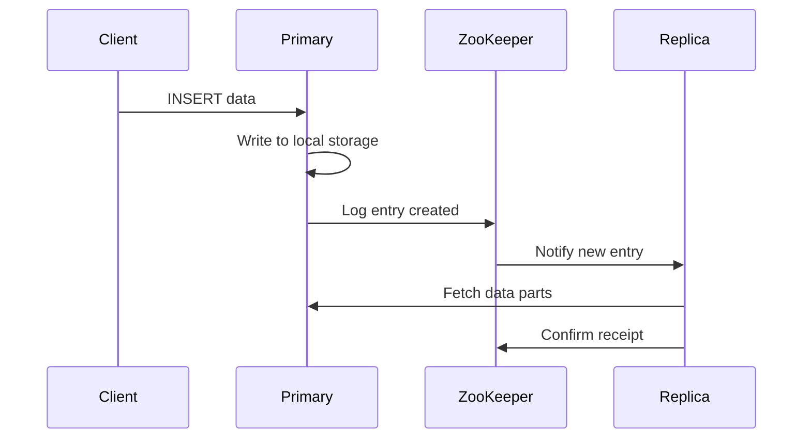

# How to Troubleshoot ClickHouse Replication Lag

Author: [nawazdhandala](https://www.github.com/nawazdhandala)

Tags: ClickHouse, Replication, Troubleshooting, High Availability, ZooKeeper, Performance, Operations, Monitoring

Description: A comprehensive guide to diagnosing and fixing replication lag in ClickHouse clusters, covering ZooKeeper issues, network problems, merge bottlenecks, and recovery procedures.

---

Replication lag in ClickHouse can cause read inconsistencies and eventually lead to cluster instability. This guide covers how to identify replication problems, diagnose root causes, and implement fixes.

## Understanding Replication

### How ClickHouse Replication Works



### Key Components

- **ZooKeeper/Keeper**: Coordination service storing replication log
- **Replication Queue**: Pending operations on each replica
- **Data Parts**: Physical data segments being replicated

## Detecting Replication Lag

### Check Replica Status

```sql
-- Overview of all replicas
SELECT
    database,
    table,
    replica_name,
    is_leader,
    absolute_delay,
    queue_size,
    inserts_in_queue,
    merges_in_queue,
    log_pointer,
    last_queue_update
FROM system.replicas
ORDER BY absolute_delay DESC;

-- Replicas with significant lag
SELECT *
FROM system.replicas
WHERE absolute_delay > 60  -- More than 60 seconds behind
   OR queue_size > 100;    -- Large queue
```

### Detailed Lag Metrics

```sql
-- Lag in seconds for each table
SELECT
    database,
    table,
    replica_name,
    absolute_delay AS lag_seconds,
    formatReadableTimeDelta(absolute_delay) AS lag_readable
FROM system.replicas
WHERE is_readonly = 0
ORDER BY absolute_delay DESC;

-- Check specific table's replication health
SELECT *
FROM system.replicas
WHERE database = 'production'
  AND table = 'events';
```

### Replication Queue Analysis

```sql
-- What's pending in the queue
SELECT
    database,
    table,
    type,
    count() AS count,
    min(create_time) AS oldest
FROM system.replication_queue
GROUP BY database, table, type
ORDER BY count DESC;

-- Detailed queue entries
SELECT
    database,
    table,
    type,
    create_time,
    source_replica,
    num_tries,
    last_exception,
    postpone_reason
FROM system.replication_queue
WHERE num_tries > 0  -- Has been retried
ORDER BY create_time
LIMIT 50;
```

## Common Causes and Fixes

### 1. ZooKeeper Issues

**Symptoms:**
```sql
-- Check ZooKeeper session state
SELECT *
FROM system.zookeeper
WHERE path = '/clickhouse/tables/01/events';

-- Errors related to ZK
SELECT
    type,
    exception
FROM system.replication_queue
WHERE exception LIKE '%ZooKeeper%'
  OR exception LIKE '%Coordination%';
```

**Fixes:**
```bash
# Check ZooKeeper cluster health
echo ruok | nc zookeeper-1 2181

# Check ZK latency
echo srvr | nc zookeeper-1 2181 | grep Latency

# Monitor ZK connections
echo cons | nc zookeeper-1 2181 | wc -l
```

```xml
<!-- Increase ZK session timeout in config -->
<clickhouse>
    <zookeeper>
        <session_timeout_ms>30000</session_timeout_ms>
        <operation_timeout_ms>10000</operation_timeout_ms>
    </zookeeper>
</clickhouse>
```

### 2. Network Problems

**Diagnosis:**
```sql
-- Check inter-replica communication
SELECT
    database,
    table,
    source_replica,
    num_tries,
    last_exception
FROM system.replication_queue
WHERE last_exception LIKE '%Connection%'
   OR last_exception LIKE '%Network%'
   OR last_exception LIKE '%timeout%';
```

**Fixes:**
```bash
# Test connectivity between replicas
ping clickhouse-2
nc -zv clickhouse-2 9009  # Inter-server HTTP port

# Check network bandwidth
iperf3 -c clickhouse-2
```

```xml
<!-- Increase timeouts for slow networks -->
<clickhouse>
    <interserver_http_port>9009</interserver_http_port>
    <interserver_http_credentials>
        <user>interserver</user>
        <password>secret</password>
    </interserver_http_credentials>
</clickhouse>
```

### 3. Merge Bottlenecks

**Symptoms:**
```sql
-- Many merges pending
SELECT *
FROM system.replicas
WHERE merges_in_queue > 50;

-- Check current merges
SELECT
    database,
    table,
    elapsed,
    progress,
    is_mutation,
    memory_usage
FROM system.merges
ORDER BY elapsed DESC;

-- Parts waiting for merge
SELECT
    database,
    table,
    count() AS parts
FROM system.parts
WHERE active
GROUP BY database, table
HAVING parts > 300
ORDER BY parts DESC;
```

**Fixes:**
```xml
<!-- Increase merge resources -->
<clickhouse>
    <background_pool_size>32</background_pool_size>
    <background_merges_mutations_concurrency_ratio>2</background_merges_mutations_concurrency_ratio>
</clickhouse>
```

```sql
-- Force merge for tables with too many parts
OPTIMIZE TABLE events FINAL;

-- Or specific partitions
OPTIMIZE TABLE events PARTITION '202401' FINAL;
```

### 4. Large Inserts

**Symptoms:**
```sql
-- Large data transfers pending
SELECT
    database,
    table,
    type,
    new_part_name,
    formatReadableSize(bytes_to_merge) AS size
FROM system.replication_queue
WHERE type IN ('GET_PART', 'MERGE_PARTS')
ORDER BY bytes_to_merge DESC;
```

**Fixes:**
```sql
-- Check part sizes
SELECT
    database,
    table,
    name,
    formatReadableSize(bytes_on_disk) AS size
FROM system.parts
WHERE active
ORDER BY bytes_on_disk DESC
LIMIT 20;
```

```xml
<!-- Limit part size -->
<clickhouse>
    <merge_tree>
        <max_bytes_to_merge_at_max_space_in_pool>10737418240</max_bytes_to_merge_at_max_space_in_pool>
    </merge_tree>
</clickhouse>
```

### 5. Disk Space Issues

**Check disk space:**
```sql
-- Disk usage
SELECT
    name,
    path,
    formatReadableSize(free_space) AS free,
    formatReadableSize(total_space) AS total,
    round(free_space / total_space * 100, 2) AS free_pct
FROM system.disks;

-- Space by table
SELECT
    database,
    table,
    formatReadableSize(sum(bytes_on_disk)) AS size
FROM system.parts
WHERE active
GROUP BY database, table
ORDER BY sum(bytes_on_disk) DESC
LIMIT 20;
```

## Recovery Procedures

### Clear Stuck Queue Entries

```sql
-- Remove stuck entries (use with caution)
SYSTEM RESTART REPLICA events;

-- Or detach and reattach
DETACH TABLE events;
ATTACH TABLE events;
```

### Re-sync Replica

```sql
-- Force re-sync from another replica
-- WARNING: This clears local data
ALTER TABLE events FETCH PARTITION '202401'
FROM '/clickhouse/tables/01/events';

-- Or for all data
SYSTEM RESTORE REPLICA events;
```

### Recover from Corrupt Replica

```bash
# 1. Stop ClickHouse on corrupt replica
sudo systemctl stop clickhouse-server

# 2. Remove local data (ZK metadata preserved)
rm -rf /var/lib/clickhouse/data/default/events/*

# 3. Start ClickHouse - will re-sync from healthy replica
sudo systemctl start clickhouse-server
```

```sql
-- Verify recovery
SELECT
    replica_name,
    is_readonly,
    queue_size,
    absolute_delay
FROM system.replicas
WHERE table = 'events';
```

## Monitoring and Alerting

### Replication Metrics

```sql
-- Create monitoring view
CREATE VIEW replication_health AS
SELECT
    now() AS check_time,
    database,
    table,
    replica_name,
    absolute_delay,
    queue_size,
    inserts_in_queue,
    merges_in_queue,
    is_readonly,
    is_session_expired
FROM system.replicas;

-- Alert query
SELECT *
FROM replication_health
WHERE absolute_delay > 300  -- 5 minutes lag
   OR queue_size > 500
   OR is_readonly = 1
   OR is_session_expired = 1;
```

### Prometheus Metrics

```yaml
# Prometheus alert rules
groups:
  - name: clickhouse_replication
    rules:
      - alert: ClickHouseReplicationLag
        expr: clickhouse_replicas_absolute_delay > 300
        for: 5m
        labels:
          severity: warning
        annotations:
          summary: "ClickHouse replication lag > 5 minutes"

      - alert: ClickHouseReplicaReadOnly
        expr: clickhouse_replicas_is_readonly == 1
        for: 1m
        labels:
          severity: critical
        annotations:
          summary: "ClickHouse replica is read-only"
```

### Grafana Dashboard Query

```sql
-- Time-series of replication lag
SELECT
    toStartOfMinute(event_time) AS time,
    database,
    table,
    max(absolute_delay) AS max_lag
FROM (
    SELECT
        now() AS event_time,
        database,
        table,
        absolute_delay
    FROM system.replicas
)
GROUP BY time, database, table
ORDER BY time;
```

## Prevention Best Practices

### Configuration Recommendations

```xml
<clickhouse>
    <!-- ZooKeeper settings -->
    <zookeeper>
        <session_timeout_ms>30000</session_timeout_ms>
        <operation_timeout_ms>10000</operation_timeout_ms>
    </zookeeper>

    <!-- Merge settings -->
    <background_pool_size>16</background_pool_size>
    <background_schedule_pool_size>32</background_schedule_pool_size>

    <!-- Replication settings -->
    <max_replicated_fetches_network_bandwidth>100000000</max_replicated_fetches_network_bandwidth>
    <max_replicated_sends_network_bandwidth>100000000</max_replicated_sends_network_bandwidth>
</clickhouse>
```

### Insert Best Practices

```sql
-- Use async inserts to reduce replication overhead
SET async_insert = 1;
SET async_insert_busy_timeout_ms = 1000;

-- Batch inserts instead of many small ones
-- Bad: Many small inserts
INSERT INTO events VALUES (1, 'click', now());
INSERT INTO events VALUES (2, 'view', now());

-- Good: Batch insert
INSERT INTO events VALUES
    (1, 'click', now()),
    (2, 'view', now()),
    ...
```

### Regular Maintenance

```sql
-- Check and fix parts regularly
SYSTEM SYNC REPLICA events;

-- Monitor replication weekly
SELECT
    database,
    table,
    max(absolute_delay) AS max_lag_seen
FROM system.replicas
GROUP BY database, table
HAVING max_lag_seen > 60;
```

---

Replication lag in ClickHouse typically stems from ZooKeeper issues, network problems, or resource bottlenecks. Monitor the system.replicas table regularly, set up alerts for lag thresholds, and ensure adequate resources for background merges. When lag occurs, check the replication queue for stuck entries and address the root cause before forcing recovery procedures.
