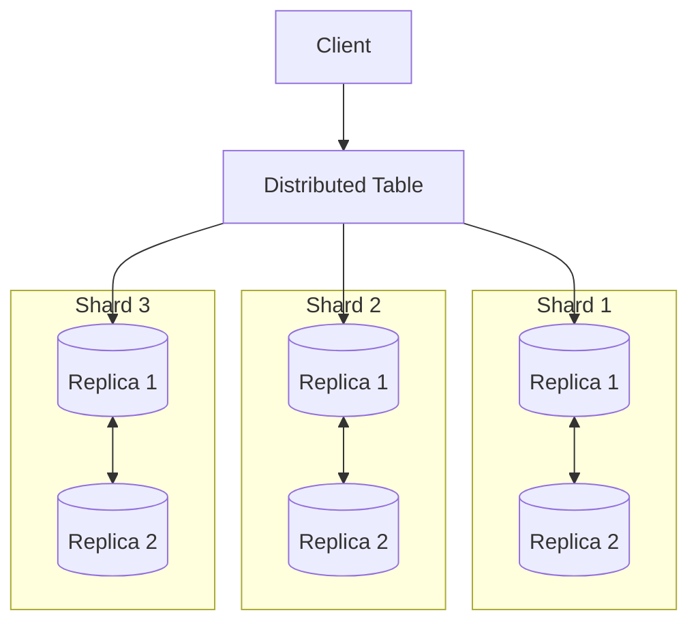

# How to Shard Data Across ClickHouse Nodes

Author: [nawazdhandala](https://www.github.com/nawazdhandala)

Tags: ClickHouse, Sharding, Distributed Tables, Scaling, Database, Architecture, Performance, Clustering

Description: A comprehensive guide to sharding data across ClickHouse nodes using distributed tables, covering sharding key selection, data distribution strategies, resharding, and query routing for horizontal scaling.

---

As your data grows beyond what a single ClickHouse node can handle, you need to shard it across multiple nodes. Sharding distributes data horizontally, allowing you to scale storage and query performance. This guide covers how to design and implement sharding in ClickHouse.

## Sharding Architecture



## Cluster Configuration

### Define Cluster in Config

```xml
<!-- /etc/clickhouse-server/config.d/cluster.xml -->
<clickhouse>
    <remote_servers>
        <analytics_cluster>
            <!-- Shard 1 -->
            <shard>
                <weight>1</weight>
                <internal_replication>true</internal_replication>
                <replica>
                    <host>clickhouse-1a</host>
                    <port>9000</port>
                </replica>
                <replica>
                    <host>clickhouse-1b</host>
                    <port>9000</port>
                </replica>
            </shard>

            <!-- Shard 2 -->
            <shard>
                <weight>1</weight>
                <internal_replication>true</internal_replication>
                <replica>
                    <host>clickhouse-2a</host>
                    <port>9000</port>
                </replica>
                <replica>
                    <host>clickhouse-2b</host>
                    <port>9000</port>
                </replica>
            </shard>

            <!-- Shard 3 -->
            <shard>
                <weight>1</weight>
                <internal_replication>true</internal_replication>
                <replica>
                    <host>clickhouse-3a</host>
                    <port>9000</port>
                </replica>
                <replica>
                    <host>clickhouse-3b</host>
                    <port>9000</port>
                </replica>
            </shard>
        </analytics_cluster>
    </remote_servers>
</clickhouse>
```

### Verify Cluster

```sql
-- Check cluster configuration
SELECT * FROM system.clusters WHERE cluster = 'analytics_cluster';

-- Verify all nodes are reachable
SELECT
    cluster,
    shard_num,
    replica_num,
    host_name,
    is_local
FROM system.clusters
WHERE cluster = 'analytics_cluster';
```

## Creating Sharded Tables

### Step 1: Create Local Tables on Each Shard

```sql
-- Run on ALL nodes (each shard and replica)
CREATE TABLE events_local ON CLUSTER analytics_cluster
(
    event_id UInt64,
    event_type String,
    user_id UInt64,
    event_time DateTime,
    properties Map(String, String)
)
ENGINE = ReplicatedMergeTree('/clickhouse/tables/{shard}/events', '{replica}')
PARTITION BY toYYYYMM(event_time)
ORDER BY (user_id, event_time)
TTL event_time + INTERVAL 90 DAY;
```

### Step 2: Create Distributed Table

```sql
-- The distributed table routes queries to shards
CREATE TABLE events ON CLUSTER analytics_cluster
(
    event_id UInt64,
    event_type String,
    user_id UInt64,
    event_time DateTime,
    properties Map(String, String)
)
ENGINE = Distributed(
    'analytics_cluster',     -- Cluster name
    'default',               -- Database
    'events_local',          -- Local table
    user_id                  -- Sharding key
);
```

## Choosing a Sharding Key

### Good Sharding Keys

```sql
-- 1. User ID - Good for user-centric analytics
ENGINE = Distributed('cluster', 'db', 'table', user_id)

-- 2. Tenant ID - Good for multi-tenant systems
ENGINE = Distributed('cluster', 'db', 'table', tenant_id)

-- 3. Hash of multiple columns - Balances distribution
ENGINE = Distributed('cluster', 'db', 'table',
    cityHash64(user_id, event_type))

-- 4. Time-based with hash - For time-series with user locality
ENGINE = Distributed('cluster', 'db', 'table',
    cityHash64(toYYYYMM(event_time), user_id))
```

### Bad Sharding Keys

```sql
-- Timestamp alone - Creates hot shards
ENGINE = Distributed('cluster', 'db', 'table', event_time)  -- BAD

-- Low cardinality column - Uneven distribution
ENGINE = Distributed('cluster', 'db', 'table', country)  -- BAD

-- Sequential ID - All inserts go to one shard
ENGINE = Distributed('cluster', 'db', 'table', event_id)  -- BAD
```

### Checking Data Distribution

```sql
-- Check how data is distributed across shards
SELECT
    hostName() AS host,
    count() AS rows,
    formatReadableSize(sum(bytes_on_disk)) AS size
FROM clusterAllReplicas('analytics_cluster', system.parts)
WHERE table = 'events_local' AND active
GROUP BY host
ORDER BY rows DESC;
```

## Inserting Data

### Insert via Distributed Table

```sql
-- Distributed table routes data to correct shard
INSERT INTO events (event_id, event_type, user_id, event_time)
VALUES (1, 'click', 12345, now());

-- The sharding key (user_id) determines which shard receives the row
```

### Direct Insert to Shards (Higher Performance)

```sql
-- For bulk inserts, insert directly to shards
-- This avoids the coordinator overhead

-- Insert to shard 1
INSERT INTO events_local SELECT * FROM source_table
WHERE cityHash64(user_id) % 3 = 0;

-- Insert to shard 2
INSERT INTO events_local SELECT * FROM source_table
WHERE cityHash64(user_id) % 3 = 1;

-- Insert to shard 3
INSERT INTO events_local SELECT * FROM source_table
WHERE cityHash64(user_id) % 3 = 2;
```

### Async Distributed Inserts

```xml
<!-- Enable async distributed inserts -->
<clickhouse>
    <distributed_directory_monitor_batch_inserts>1</distributed_directory_monitor_batch_inserts>
    <distributed_directory_monitor_split_batch_on_failure>1</distributed_directory_monitor_split_batch_on_failure>
</clickhouse>
```

## Query Routing

### How Distributed Queries Work

```sql
-- Query to distributed table
SELECT user_id, count() AS events
FROM events
WHERE event_time >= today() - 7
GROUP BY user_id;

-- ClickHouse:
-- 1. Sends query to all shards
-- 2. Each shard executes locally
-- 3. Coordinator merges results
```

### Optimized Queries with Sharding Key

```sql
-- Query with sharding key in WHERE - routes to single shard
SELECT *
FROM events
WHERE user_id = 12345;  -- Only queries one shard!

-- Range on sharding key - may query multiple shards
SELECT *
FROM events
WHERE user_id IN (12345, 67890);
```

### Global vs Local IN/JOIN

```sql
-- Global IN - subquery runs once, result broadcast to all shards
SELECT *
FROM events
WHERE user_id GLOBAL IN (
    SELECT user_id FROM active_users
);

-- Local IN - subquery runs on each shard separately
SELECT *
FROM events
WHERE user_id IN (
    SELECT user_id FROM active_users
);
```

## Shard Weights

### Uneven Shard Weights

```xml
<!-- Weight controls data distribution -->
<shard>
    <weight>2</weight>  <!-- Gets 2x more data -->
    <replica>
        <host>big-server</host>
    </replica>
</shard>
<shard>
    <weight>1</weight>  <!-- Gets 1x data -->
    <replica>
        <host>small-server</host>
    </replica>
</shard>
```

### Use Cases for Weights

```xml
<!-- Drain a shard before removal -->
<shard>
    <weight>0</weight>  <!-- No new data -->
    <replica>
        <host>old-server</host>
    </replica>
</shard>

<!-- New powerful server -->
<shard>
    <weight>3</weight>  <!-- Gets more data -->
    <replica>
        <host>new-powerful-server</host>
    </replica>
</shard>
```

## Adding a New Shard

### Step 1: Add to Cluster Config

```xml
<!-- Add new shard to configuration -->
<shard>
    <weight>1</weight>
    <internal_replication>true</internal_replication>
    <replica>
        <host>clickhouse-4a</host>
    </replica>
    <replica>
        <host>clickhouse-4b</host>
    </replica>
</shard>
```

### Step 2: Create Local Tables

```sql
-- On new shard nodes
CREATE TABLE events_local
(
    event_id UInt64,
    event_type String,
    user_id UInt64,
    event_time DateTime,
    properties Map(String, String)
)
ENGINE = ReplicatedMergeTree('/clickhouse/tables/{shard}/events', '{replica}')
PARTITION BY toYYYYMM(event_time)
ORDER BY (user_id, event_time);
```

### Step 3: Rebalance Data (Optional)

```sql
-- Move some data to new shard
-- New data automatically routes to new shard
-- Existing data requires manual movement

-- Option 1: Let it naturally balance (new data goes to new shard)

-- Option 2: Manually move partitions
ALTER TABLE events_local ON CLUSTER analytics_cluster
    MOVE PARTITION '202401' TO SHARD '/clickhouse/tables/4/events';
```

## Resharding Existing Data

### Full Reshard Process

```sql
-- 1. Create new table with different sharding
CREATE TABLE events_new ON CLUSTER analytics_cluster
ENGINE = Distributed('analytics_cluster', 'default', 'events_local_new',
    cityHash64(tenant_id, user_id));  -- New sharding key

-- 2. Create local tables
CREATE TABLE events_local_new ON CLUSTER analytics_cluster
ENGINE = ReplicatedMergeTree(...)
...;

-- 3. Copy data (may take hours for large tables)
INSERT INTO events_new
SELECT * FROM events;

-- 4. Rename tables
RENAME TABLE events TO events_old,
             events_new TO events
ON CLUSTER analytics_cluster;

-- 5. Drop old table after verification
DROP TABLE events_old ON CLUSTER analytics_cluster;
```

## Monitoring Sharded Clusters

### Shard Health

```sql
-- Check all shards
SELECT
    cluster,
    shard_num,
    replica_num,
    host_name,
    errors_count,
    slowdowns_count
FROM system.clusters
WHERE cluster = 'analytics_cluster';
```

### Data Distribution

```sql
-- Rows per shard
SELECT
    shard_num,
    sum(rows) AS total_rows,
    formatReadableSize(sum(bytes_on_disk)) AS total_size
FROM clusterAllReplicas('analytics_cluster', system.parts)
WHERE table = 'events_local' AND active
GROUP BY shard_num
ORDER BY shard_num;
```

### Query Distribution

```sql
-- Queries per shard
SELECT
    hostName() AS shard,
    count() AS queries,
    avg(query_duration_ms) AS avg_duration_ms
FROM clusterAllReplicas('analytics_cluster', system.query_log)
WHERE type = 'QueryFinish'
  AND event_date = today()
GROUP BY shard;
```

## Best Practices

### Sharding Key Selection

```markdown
1. Choose columns frequently in WHERE clauses
2. Ensure high cardinality for even distribution
3. Consider query patterns - locality improves performance
4. Use hash functions for composite keys
5. Avoid time-only keys (creates hot shards)
```

### Cluster Design

```markdown
1. Start with 3 shards (odd number for consensus)
2. Always use replication (2+ replicas per shard)
3. Use internal_replication for replicated tables
4. Plan for 30% headroom before adding shards
5. Keep all nodes on same ClickHouse version
```

### Query Optimization

```sql
-- Use sharding key in WHERE when possible
SELECT * FROM events WHERE user_id = 123;

-- Use GLOBAL for small dimension tables
SELECT e.*, u.name
FROM events e
GLOBAL JOIN users u ON e.user_id = u.id;

-- Limit distributed queries
SET max_distributed_connections = 100;
SET distributed_connections_pool_size = 1024;
```

---

Sharding enables ClickHouse to scale horizontally for both storage and query performance. Choose your sharding key carefully based on query patterns, use distributed tables for transparent routing, and monitor data distribution to prevent hot spots. Start with replication first, then add sharding when you outgrow a single node.
