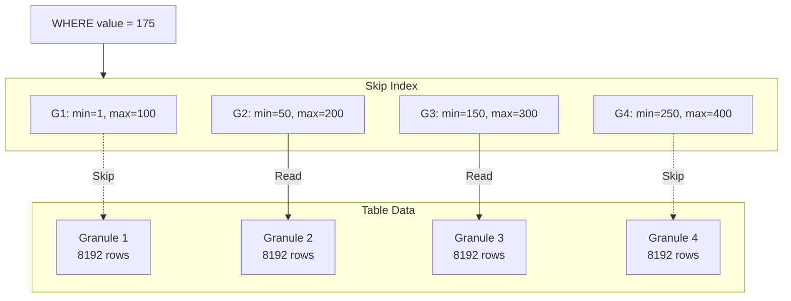

# How to Index Data in ClickHouse with Skip Indexes

Author: [nawazdhandala](https://www.github.com/nawazdhandala)

Tags: ClickHouse, Skip Indexes, Performance, Database, Indexing, bloom_filter, minmax, set, Analytics

Description: A comprehensive guide to ClickHouse skip indexes including minmax, set, bloom_filter, and ngram indexes, with practical examples showing when and how to use each type for query acceleration.

---

ClickHouse's primary index (the ORDER BY clause) is powerful, but it only helps queries that filter on the leftmost columns. Skip indexes let you accelerate queries on other columns by recording metadata about granules, allowing ClickHouse to skip irrelevant data blocks.

## How Skip Indexes Work

Skip indexes don't point to specific rows like traditional B-tree indexes. Instead, they store summary information about each granule (a group of rows, default 8192). When you query, ClickHouse checks the index to determine which granules might contain matching rows and skips the rest.



Key concepts:
- **Granule**: Smallest unit of data ClickHouse reads (default 8192 rows)
- **GRANULARITY**: How many granules the index covers at once
- **Skip Rate**: Percentage of granules the index allows skipping

## Index Types Overview

| Index Type | Best For | False Positives | Storage Cost |
|------------|----------|-----------------|--------------|
| minmax | Ranges, inequalities | Low | Very Low |
| set(N) | Low-cardinality equality | None (up to N) | Medium |
| bloom_filter | High-cardinality equality | Possible | Low |
| tokenbf_v1 | Text search (words) | Possible | Medium |
| ngrambf_v1 | Substring search | Possible | High |

## minmax Index

The simplest skip index stores minimum and maximum values per granule group.

### When to Use

- Range queries: `WHERE timestamp > '2024-01-01'`
- Inequality filters: `WHERE amount >= 1000`
- Columns with monotonically increasing values

### Creating minmax Indexes

```sql
CREATE TABLE orders
(
    order_id UInt64,
    customer_id UInt64,
    order_date Date,
    amount Decimal64(2),

    -- minmax index on amount column
    INDEX idx_amount amount TYPE minmax GRANULARITY 4
)
ENGINE = MergeTree()
ORDER BY (customer_id, order_date);
```

### How It Works

```sql
-- Index stores min/max for every 4 granules (4 * 8192 = 32768 rows)
-- Granules 1-4: min=10.00, max=500.00
-- Granules 5-8: min=15.00, max=1200.00
-- Granules 9-12: min=800.00, max=5000.00

-- Query: WHERE amount > 1000
-- Can skip granules 1-4 (max=500 < 1000)
-- Must check granules 5-12
```

### Query Example

```sql
-- Without index: scans all granules
-- With minmax index: skips granules where max(amount) < 1000
SELECT count()
FROM orders
WHERE amount > 1000;

-- Check index effectiveness
EXPLAIN indexes = 1
SELECT count() FROM orders WHERE amount > 1000;
```

## set Index

Stores unique values up to N per granule group. Perfect for low-cardinality columns.

### When to Use

- Equality checks: `WHERE status = 'active'`
- IN clauses: `WHERE country IN ('US', 'UK', 'CA')`
- Columns with limited distinct values

### Creating set Indexes

```sql
CREATE TABLE events
(
    event_id UUID,
    event_time DateTime,
    event_type String,
    country String,
    user_id UInt64,

    -- Set index for low-cardinality columns
    INDEX idx_event_type event_type TYPE set(100) GRANULARITY 4,
    INDEX idx_country country TYPE set(200) GRANULARITY 4
)
ENGINE = MergeTree()
ORDER BY (event_time);
```

### How It Works

```sql
-- Index stores unique values (up to N) per 4 granules
-- Granules 1-4: event_type = {'click', 'view', 'purchase'}
-- Granules 5-8: event_type = {'click', 'view', 'signup'}
-- Granules 9-12: event_type = {'view', 'logout'}

-- Query: WHERE event_type = 'purchase'
-- Checks sets: only granules 1-4 might contain 'purchase'
-- Skips granules 5-12
```

### Choosing N Value

- Too small: Index becomes useless (can't track all values)
- Too large: Index uses more memory
- Rule: Set N to 2-3x expected distinct values in GRANULARITY granules

```sql
-- Check cardinality to choose N
SELECT uniqExact(event_type) FROM events;  -- Returns 15
-- Use set(50) or set(100) for safety margin
```

## bloom_filter Index

Probabilistic data structure that can tell if a value definitely doesn't exist or might exist.

### When to Use

- High-cardinality equality checks: `WHERE user_id = 12345`
- String columns with many unique values
- When false positives are acceptable for significant skip rates

### Creating bloom_filter Indexes

```sql
CREATE TABLE logs
(
    timestamp DateTime,
    service String,
    trace_id String,
    message String,

    -- Bloom filter for high-cardinality trace_id
    INDEX idx_trace_id trace_id TYPE bloom_filter(0.01) GRANULARITY 4
)
ENGINE = MergeTree()
ORDER BY (service, timestamp);
```

### Parameters

- **bloom_filter()**: Default false positive rate (~0.01)
- **bloom_filter(fp_rate)**: Custom false positive rate (0.001 to 0.1)

Lower fp_rate = larger index but fewer false positives.

### How It Works

```sql
-- Index builds bloom filter per 4 granules
-- For each trace_id value, computes hash and sets bits

-- Query: WHERE trace_id = 'abc-123-xyz'
-- Bloom filter says:
--   Granules 1-4: "definitely NOT here" -> skip
--   Granules 5-8: "might be here" -> check
--   Granules 9-12: "definitely NOT here" -> skip
```

### Query Example

```sql
-- Find specific trace across logs
SELECT *
FROM logs
WHERE trace_id = 'abc-123-def-456'
ORDER BY timestamp;

-- Index allows skipping most granules that don't contain this trace_id
```

## tokenbf_v1 Index

Token-based bloom filter for full-text search on word boundaries.

### When to Use

- Text search with complete words
- Log message searching
- Searching by keywords

### Creating tokenbf_v1 Indexes

```sql
CREATE TABLE articles
(
    id UInt64,
    title String,
    content String,
    created_at DateTime,

    -- Token bloom filter for text search
    INDEX idx_title title TYPE tokenbf_v1(32768, 3, 0) GRANULARITY 4,
    INDEX idx_content content TYPE tokenbf_v1(65536, 3, 0) GRANULARITY 4
)
ENGINE = MergeTree()
ORDER BY created_at;
```

### Parameters

- **size_of_bloom_filter**: Number of bits in filter
- **number_of_hash_functions**: Hash functions (usually 2-5)
- **random_seed**: Seed for hash (usually 0)

### How It Works

```sql
-- Text: "ClickHouse is a fast analytical database"
-- Tokenizes to: ['clickhouse', 'is', 'a', 'fast', 'analytical', 'database']
-- Each token added to bloom filter

-- Query: WHERE content LIKE '%database%'
-- Checks if 'database' token might exist in each granule group
```

### Query Patterns

```sql
-- Single word search
SELECT * FROM articles WHERE hasToken(content, 'database');

-- Multiple words (AND)
SELECT * FROM articles
WHERE hasToken(content, 'clickhouse') AND hasToken(content, 'performance');

-- Works with LIKE for word boundaries
SELECT * FROM articles WHERE content LIKE '%database%';
```

## ngrambf_v1 Index

N-gram bloom filter for substring search anywhere in text.

### When to Use

- Substring search: `WHERE email LIKE '%@gmail%'`
- Partial matching
- When exact word boundaries don't apply

### Creating ngrambf_v1 Indexes

```sql
CREATE TABLE users
(
    user_id UInt64,
    email String,
    full_name String,
    created_at DateTime,

    -- N-gram bloom filter for substring search
    INDEX idx_email email TYPE ngrambf_v1(4, 32768, 3, 0) GRANULARITY 4,
    INDEX idx_name full_name TYPE ngrambf_v1(3, 32768, 3, 0) GRANULARITY 4
)
ENGINE = MergeTree()
ORDER BY created_at;
```

### Parameters

- **n**: N-gram size (3-4 recommended)
- **size_of_bloom_filter**: Bits in filter
- **number_of_hash_functions**: Usually 2-5
- **random_seed**: Usually 0

### How It Works

```sql
-- Text: "john@gmail.com"
-- With n=4, generates 4-grams: ['john', 'ohn@', 'hn@g', 'n@gm', '@gma', 'gmai', 'mail', ...]
-- Each n-gram added to bloom filter

-- Query: WHERE email LIKE '%gmail%'
-- Generates 4-grams from 'gmail': ['gmai', 'mail']
-- Checks if ALL n-grams might exist in granule group
```

### Query Example

```sql
-- Substring search on email
SELECT * FROM users WHERE email LIKE '%@company.com%';

-- Name substring search
SELECT * FROM users WHERE full_name LIKE '%smith%';
```

## Combining Multiple Indexes

Use different index types for different query patterns:

```sql
CREATE TABLE comprehensive_logs
(
    timestamp DateTime,
    level LowCardinality(String),
    service LowCardinality(String),
    trace_id String,
    user_id UInt64,
    message String,
    error_code Nullable(UInt32),

    -- Different index types for different columns
    INDEX idx_level level TYPE set(10) GRANULARITY 4,
    INDEX idx_service service TYPE set(100) GRANULARITY 4,
    INDEX idx_trace_id trace_id TYPE bloom_filter(0.01) GRANULARITY 4,
    INDEX idx_user_id user_id TYPE bloom_filter(0.01) GRANULARITY 4,
    INDEX idx_message message TYPE tokenbf_v1(32768, 3, 0) GRANULARITY 4,
    INDEX idx_error_code error_code TYPE minmax GRANULARITY 4
)
ENGINE = MergeTree()
PARTITION BY toYYYYMM(timestamp)
ORDER BY (service, timestamp);
```

## Measuring Index Effectiveness

### Check Index Usage

```sql
EXPLAIN indexes = 1
SELECT * FROM comprehensive_logs
WHERE service = 'api'
  AND trace_id = 'abc-123'
  AND hasToken(message, 'error');
```

Look for:
- Which indexes are used
- Granules selected vs total granules
- Parts selected vs total parts

### Query System Tables

```sql
-- See index definitions
SELECT
    table,
    name,
    type,
    expr,
    granularity
FROM system.data_skipping_indices
WHERE table = 'comprehensive_logs';

-- Check index size
SELECT
    table,
    name,
    formatReadableSize(data_compressed_bytes) AS compressed,
    formatReadableSize(data_uncompressed_bytes) AS uncompressed
FROM system.data_skipping_indices
WHERE table = 'comprehensive_logs';
```

### Benchmark Queries

```sql
-- Without index (force skip)
SELECT count()
FROM comprehensive_logs
WHERE trace_id = 'abc-123'
SETTINGS use_skip_indexes = 0;

-- With index
SELECT count()
FROM comprehensive_logs
WHERE trace_id = 'abc-123'
SETTINGS use_skip_indexes = 1;
```

## Best Practices

### 1. Choose GRANULARITY Wisely

- Lower GRANULARITY = more precise but larger index
- Higher GRANULARITY = smaller index but less precise
- Start with 4, adjust based on query selectivity

```sql
-- More precise (larger index)
INDEX idx_trace_id trace_id TYPE bloom_filter GRANULARITY 1

-- Less precise (smaller index)
INDEX idx_trace_id trace_id TYPE bloom_filter GRANULARITY 8
```

### 2. Don't Over-Index

Skip indexes have overhead:
- Storage cost for index data
- CPU cost during inserts
- Memory during queries

Only create indexes for:
- Columns frequently used in WHERE clauses
- Columns not covered by ORDER BY
- Queries that are actually slow

### 3. Match Index Type to Data

```sql
-- Low cardinality (< 1000 unique values): set()
INDEX idx_status status TYPE set(100)

-- High cardinality (IDs, UUIDs): bloom_filter()
INDEX idx_user_id user_id TYPE bloom_filter

-- Numeric ranges: minmax
INDEX idx_amount amount TYPE minmax

-- Text search (words): tokenbf_v1()
INDEX idx_message message TYPE tokenbf_v1(32768, 3, 0)

-- Substring search: ngrambf_v1()
INDEX idx_email email TYPE ngrambf_v1(4, 32768, 3, 0)
```

### 4. Add Indexes After Testing

Test query performance first, then add indexes:

```sql
-- 1. Run query without index, note performance
SELECT * FROM logs WHERE trace_id = '...' FORMAT Null;

-- 2. Add index
ALTER TABLE logs ADD INDEX idx_trace_id trace_id TYPE bloom_filter GRANULARITY 4;

-- 3. Wait for index to build
SELECT * FROM system.mutations WHERE table = 'logs' AND is_done = 0;

-- 4. Test again
SELECT * FROM logs WHERE trace_id = '...' FORMAT Null;
```

## Adding Indexes to Existing Tables

```sql
-- Add index (only applies to new data)
ALTER TABLE logs ADD INDEX idx_trace_id trace_id TYPE bloom_filter GRANULARITY 4;

-- Materialize index for existing data
ALTER TABLE logs MATERIALIZE INDEX idx_trace_id;

-- Check progress
SELECT * FROM system.mutations WHERE table = 'logs' AND is_done = 0;

-- Drop index if not helpful
ALTER TABLE logs DROP INDEX idx_trace_id;
```

---

Skip indexes complement ClickHouse's primary index by enabling fast lookups on non-primary key columns. Use minmax for ranges, set for low cardinality, bloom_filter for high-cardinality equality, and token/ngram filters for text search. Measure effectiveness with EXPLAIN and only keep indexes that provide meaningful skip rates.
